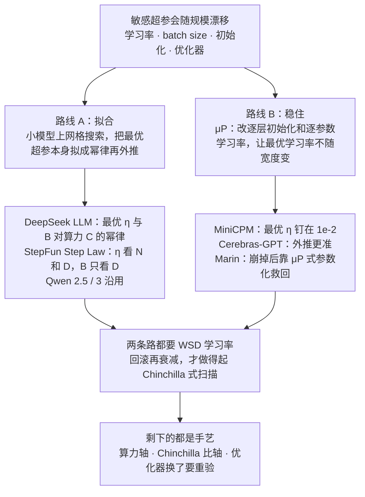
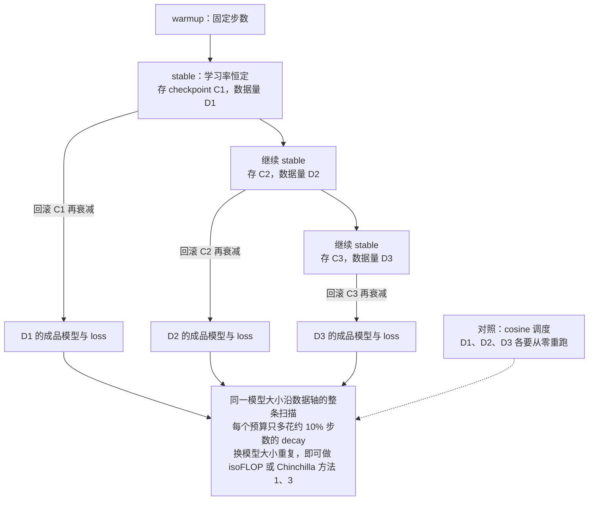
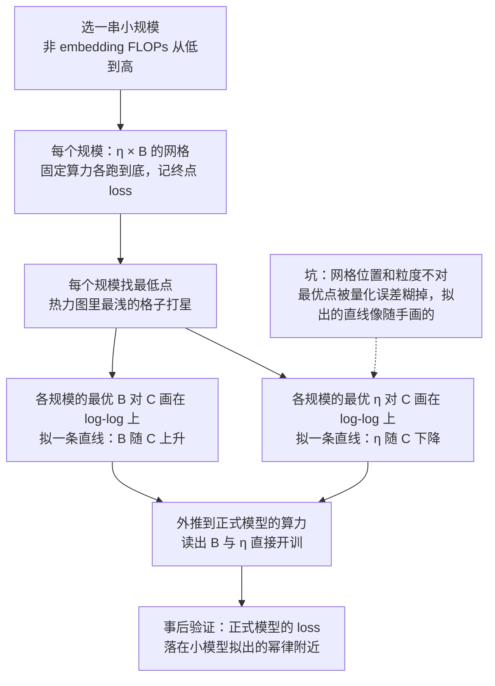
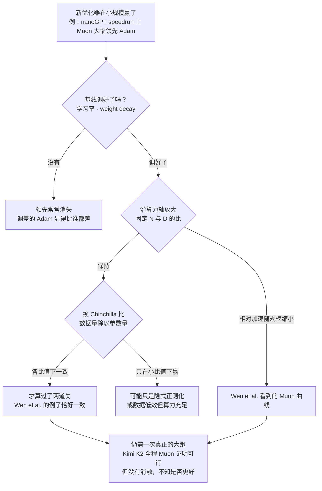
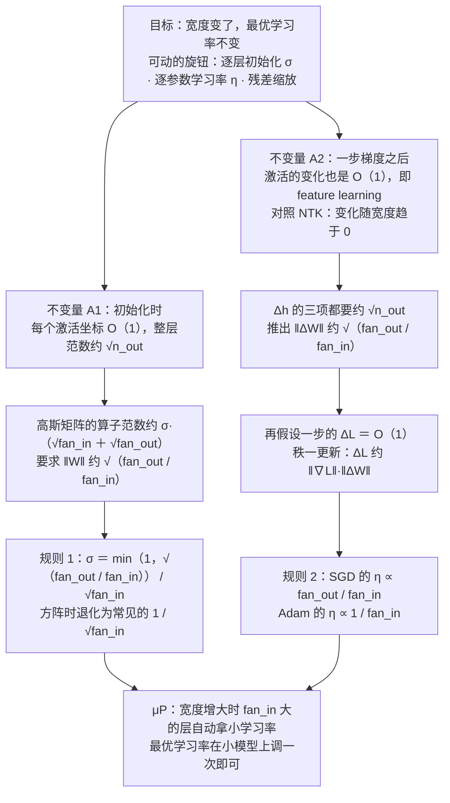

# CS336 第 11 讲｜Scaling laws（下）（Scaling Laws II）

> Stanford CS336: Language Modeling from Scratch（2026 春）· 第 11 讲（课程表：2026 年 5 月 4 日），Tatsunori Hashimoto 的第二堂 scaling laws 课，上接第 9 讲，中间隔着 Percy Liang 的第 10 讲推理
> 视频：<https://www.youtube.com/watch?v=vTfEyOyzV9E>（1:17:03；英文字幕为自动生成，模型名、人名和 μP / Muon 这类词错得多，见文末勘误）
> 讲者：Tatsunori Hashimoto（全程；讲 μP 推导时自称 Tatsu，多次说"两讲之前我讲过 batch size"）
> 课程主页：<https://stanford-cs336.github.io/> · 本讲围绕的论文：[MiniCPM](https://arxiv.org/abs/2404.06395)、[DeepSeek LLM](https://arxiv.org/abs/2401.02954)、[Step Law](https://arxiv.org/abs/2503.04715)、Wen et al. 的优化器大对比、[A Spectral Condition for Feature Learning](https://arxiv.org/abs/2310.17813)、[Lingle 的 μP 压力测试](https://arxiv.org/abs/2404.05728)

**一句话**：第 9 讲的 Kaplan / Chinchilla 是 2022 年以前的"正典"，这一讲看真正训大模型的人（MiniCPM、DeepSeek、Qwen、Kimi K2、Hunyuan、Llama 3、MiniMax-01、StepFun）怎么把 scaling law 用到实处——核心矛盾是学习率、batch size、初始化这些敏感超参会随规模漂移，而对付它只有两条路：要么像 DeepSeek / StepFun 那样在小模型上网格搜索、把最优超参本身拟成算力或数据量的幂律再外推；要么像 MiniCPM / Cerebras 那样用 μP 改逐层初始化和逐参数学习率，让最优学习率干脆不随宽度变。配套的 WSD 学习率让 Chinchilla 式实验从"每个数据量从零重跑"变成"回滚再衰减一次"；优化器（Muon）的故事说明小规模的胜利到大规模会缩水甚至崩掉，而 Chinchilla 比是最常被忽略的混杂变量。讲者的结论：scaling 至今是一门手艺，没有银弹。

## 时间轴

| 时间 | 内容 |
|---|---|
| [0:05](https://www.youtube.com/watch?v=vTfEyOyzV9E&t=5s) | 开场：三个问题——经典 scaling law 在真实开源规模上灵不灵、学习率等优化细节怎么定、哪些超参随规模变敏感 |
| [1:36](https://www.youtube.com/watch?v=vTfEyOyzV9E&t=96s) | 2022 之后的 scaling 论文多出自中国开源社区；精讲两篇路线相反的：MiniCPM 与 DeepSeek LLM |
| [3:39](https://www.youtube.com/watch?v=vTfEyOyzV9E&t=219s) | MiniCPM：μP 的做法清单；小模型阶梯往上外推约 5 倍 |
| [7:13](https://www.youtube.com/watch?v=vTfEyOyzV9E&t=433s) | μP 之下最优学习率钉在 1e-2；最优 batch size 仍随数据量按幂律变 |
| [9:45](https://www.youtube.com/watch?v=vTfEyOyzV9E&t=585s) | Chinchilla 复现的痛点：cosine 要先知道终点；WSD 学习率与"回滚再衰减" |
| [12:48](https://www.youtube.com/watch?v=vTfEyOyzV9E&t=768s) | WSD 对 cosine 的曲线；用 WSD 做 Chinchilla 方法 1、3，拟出的指数与原文不同 |
| [15:53](https://www.youtube.com/watch?v=vTfEyOyzV9E&t=953s) | DeepSeek LLM：网格搜索 → 学习率和 batch size 对算力的 scaling law |
| [20:01](https://www.youtube.com/watch?v=vTfEyOyzV9E&t=1201s) | DeepSeek 的 Chinchilla 复现（isoFLOP、两段 decay）；小模型外推到两个正式模型 |
| [22:33](https://www.youtube.com/watch?v=vTfEyOyzV9E&t=1353s) | Qwen 2.5 / 3、Kimi K2（稀疏度 48）、Hunyuan（96 token 每激活参数）、Llama 3（sigmoid）、MiniMax-01（架构对比）；问答：post-training 怎么进 scaling |
| [30:42](https://www.youtube.com/watch?v=vTfEyOyzV9E&t=1842s) | StepFun 的超参 scaling law：各家公式连输入变量都不同；1B / 100B 切片的等高线 |
| [35:19](https://www.youtube.com/watch?v=vTfEyOyzV9E&t=2119s) | 关键发现：batch size 只看数据量；学习率随模型减、随数据增；迁到 MoE 还行，换数据会漂 |
| [39:54](https://www.youtube.com/watch?v=vTfEyOyzV9E&t=2394s) | 问答：直接用别人的 law 还是自己 grid；"scaling law 有一大半是 vibes" |
| [41:26](https://www.youtube.com/watch?v=vTfEyOyzV9E&t=2486s) | 优化器：nanoGPT speedrun 上 Muon 的领先到大规模缩水；Wen et al.：调好 Adam 与 weight decay，盯住算力和 Chinchilla 比两个轴 |
| [47:33](https://www.youtube.com/watch?v=vTfEyOyzV9E&t=2853s) | Marin 的失败曲线：漂亮的直线在 1e20 量级之后崩掉 |
| [49:36](https://www.youtube.com/watch?v=vTfEyOyzV9E&t=2976s) | Muon：矩阵参数、Newton–Schulz 正交化、Kimi K2 全程使用；问答：SVD、超参、交互 |
| [57:14](https://www.youtube.com/watch?v=vTfEyOyzV9E&t=3434s) | μP：目标、三个旋钮、Cerebras-GPT 的验证；两个不变量（激活 O(1)、一步之后的变化 O(1)） |
| [1:02:54](https://www.youtube.com/watch?v=vTfEyOyzV9E&t=3774s) | A1、A2 的推导：σ 与 η 的缩放规则（SGD 用 fan_out / fan_in，Adam 用 1 / fan_in） |
| [1:12:41](https://www.youtube.com/watch?v=vTfEyOyzV9E&t=4361s) | μP 压力测试：SwiGLU、RMSNorm 大多没事；学 gain、Lion、大 weight decay 会破；收尾：scaling 是手艺，没有银弹 |

## 核心内容

### 1. 这一讲的位置：正典之后，前沿怎么做



*图 11-1｜本讲的骨架：对付"超参随规模漂移"只有拟合与稳住两条路，两条路都靠 WSD 省算力（自绘示意）· [▶ 看原幻灯片 0:35](https://www.youtube.com/watch?v=vTfEyOyzV9E&t=35s)*

- **上接第 9 讲**：Kaplan、Hestness、Chinchilla 三篇是 2022 年以前的"经典正典"。今天问三个问题：（1）这些东西在真实的开源模型规模上灵不灵；（2）学习率之类的优化细节怎么定——这是"造模型的人该懂"的常识；（3）优化器的行为随规模变，所以初始化、学习率、batch size 都得作为规模的函数来想。
- **讲者的观察**：2022 年之后，由真正训大模型的团队写的 scaling 论文数量在减少，而且多数来自中国的开源社区。今天挑出一串，目标是"从 Chinchilla 速通到 Kimi K2"——后者是最近还给出 scaling 细节的发布。
- **重点两篇**：MiniCPM（2024）与 DeepSeek LLM。都是认真做过 scaling 研究、模型也够强的团队，而且对同一个问题走了相反的路：一个想把超参稳住，一个想把超参拟出来。图 11-1 是全讲的骨架。
- **一个趋势**：像"怎么做 Chinchilla、怎么定学习率"这些已被当成常识，新报告（Qwen 3 之类）不再展开，所以反而是这几篇老一点的论文最有教学价值。μP 第 9 讲只提了一嘴，这里是第一次真正展开。

### 2. MiniCPM：用 μP 稳住学习率、拟合 batch size、用 WSD 省算力

- **背景**：中国开源社区产学合作的小模型，2024 年时是 1–2B 档的最强（现在 Gemma 的 2B / 3B 更强）。
- **研究设计**：目标不是暴力训几百个 1.5B 模型，而是训一串小得多的模型（scaling ladder），一次把超参定对；阶梯上最大的模型和最终发布的模型差约 5 倍。要钉住的是公认最敏感的几个量：最优 batch size、最优学习率，以及 token 与参数量的配比（顺带复现 Chinchilla）。
- **μP 的做法清单**（MiniCPM 论文列的五条）：缩放 embedding 的输出；残差连接按层数的平方根缩放；矩阵形状的张量按 fan-in / fan-out 比调初始化；逐张量设学习率（讲者提醒：没见过 per-parameter 学习率的人会觉得这条很"异类"）；缩放 LM head。原理留到第 8 节推导，这里只需知道：它改的是初始化和学习率，图的是最优学习率不随规模变。
- **结果 1：最优学习率不动了**。按模型大小逐条扫学习率，每条曲线的最低点几乎都在 10^-2（最小的模型略偏，也很接近）。这是 μP 的成功案例——做到这一步，学习率就不用再调了。
- **结果 2：batch size 稳不住，但能拟**。它随数据量和模型大小变。做法：每个固定的 batch size 跑一条训练曲线（图上一列点），沿等 loss 的等高线拟二次曲线、取最低点，得到"达到这个 loss 最省的 batch size"；结论是最优 batch size 对目标 loss 呈幂律——正是第 9 讲 Kaplan 的 critical batch size：loss 越低，batch 该越大。用法：先由 scaling law 反推目标 loss，再由这条幂律定 batch size。

$$
B_{\text{crit}}(L) \approx \frac{B^{*}}{L^{1/\alpha_B}}
$$

B_crit 是"再增大 batch 就开始浪费样本"的临界 batch size（以 token 计），L 是训练要达到的 loss，B* 和 α_B 是拟合常数；loss 越低，允许的 batch 越大。MiniCPM 这条曲线和第 5 节 StepFun 汇总表第一行的 OpenAI 公式都是这个形状。

> 小注：Kaplan et al., 2020 的拟合值是 B* ≈ 2×10^8 token、α_B ≈ 0.21；字幕把幻灯片上的常数听成了"2e18"。

- **结果 3：WSD 学习率**。痛点在 Chinchilla 式实验：固定 FLOPs 下要换 token 数和模型大小，而 cosine 调度必须在开训前知道总步数，所以 8M 序列的跑法不能从 4M 序列那一跑的末尾续上，只能从头再来——代价近似是平方级的。MiniCPM 的解法是现在人人叫的 warmup–stable–decay，一个梯形：
    - warmup：固定步数（不是总步数的比例），与训练总长无关；
    - stable：学习率恒定，占绝大部分；
    - decay：末尾快速衰减，通常占总步数的 10–20%，讲者说一般衰到最大学习率的约 10%。
- **为什么好**：stable 阶段的任何一个 checkpoint 都能当起点——回滚到它，继续 stable 往前跑，再 decay 一次；每次多花的只是 decay 那约 10%。于是"数据轴上的扫描"不必反复重跑预训练（图 11-2）。
- **曲线长什么样**：和调好的 cosine（橙线）比，WSD 在 stable 阶段看着一直落后，进入 decay 后突然把差距追回，持平甚至反超。讲者的圈内印象：很多场合 cosine 略好，WSD 基本一样好，是一个很通用的默认；另一个看点是"衰减学习率"这件事本身对最后的 annealing 有多大作用——没玩过的人会吃一惊。
  > 小注：讲者说的"Martin Jaggi 那边做过大型的 WSD 研究"应为 Hägele et al., 2024——出自 EPFL，不是 ETH。



*图 11-2｜WSD 的"回滚再衰减"：一条 stable 主线加若干次短衰减，换来数据轴上的整条扫描（自绘示意）· [▶ 看原幻灯片 11:16](https://www.youtube.com/watch?v=vTfEyOyzV9E&t=676s) · 出处：[Hu et al., 2024](https://arxiv.org/abs/2404.06395)*

```python
# WSD 之下做"数据轴扫描"：一条 stable 主线，多次短衰减
snaps = []
for step in range(total_steps):
    lr = warmup(step) if step < warm else lr_max        # stable 段恒定
    train_step(model, lr)
    if step in budgets:                                  # 4M、8M、16M 序列……
        snaps.append((step, model.snapshot()))
for step, snap in snaps:                                 # 每个预算只多花 decay 那 10%
    m, n_decay = snap.copy(), int(0.1 * step)
    for k in range(n_decay):
        train_step(m, lr_max * (1 - k / n_decay))        # 线性衰到 0 附近
    record(step, evaluate(m))
```

这段说明 WSD 为什么把 Chinchilla 式实验从"每个预算重跑"变成"每个预算多衰减一次"：stable 主线只跑一遍。

- **Chinchilla 复现**：有了 WSD，一条长跑加多次回滚衰减就得到数据维度的扫描，再换模型大小就能做 isoFLOP 或别的分析。MiniCPM 选了复现 Chinchilla 的方法 1（lower envelope）和方法 3（参数化拟合）——讲者认为是第 9 讲讲过的三种方法里最不可靠的两种——曲线倒还好看：方法 1 的下包络基本是直线，方法 3 在算力对非 embedding 参数的关系上也平滑。但联合拟合的指数与 Chinchilla 差别很大，论文据此声称每个参数应配远多于 Chinchilla 的 token；讲者说不清是真的还是拟合本身有问题。
  > 小注：MiniCPM 论文给的算力最优配比约 192 token / 参数，是 Chinchilla 的 20 的近 10 倍。
- **带走两点**：μP 是稳住学习率的有用技巧；WSD 是人人该知道的基本功。

### 3. DeepSeek LLM：不稳住，直接把最优超参拟成 scaling law



*图 11-3｜DeepSeek 式的超参 scaling 研究：网格 → 各规模最优点 → 拟幂律 → 外推 → 事后验证（自绘示意）· [▶ 看原幻灯片 16:54](https://www.youtube.com/watch?v=vTfEyOyzV9E&t=1014s) · 出处：[Bi et al., 2024](https://arxiv.org/abs/2401.02954)*

- 讲者对这篇（MoE 之前的第一篇 DeepSeek 论文）评价很高：开源世界里执行得最漂亮的 scaling 分析之一，实验品味好，"R1 之前就看得出这群人会走得远"。
- **策略**：不做 μP，承认学习率和 batch size 随规模变，但只要变化可预测就够——直接给它们拟 scaling law。做法见图 11-3：各规模上扫学习率与 batch size 的网格，固定算力看终点 loss，取最低点；把各规模的最优值对非 embedding 训练 FLOPs 画出来拟直线。正式模型（图上的星）在更高算力处取了大得多的 batch 和小得多的学习率。
- **讲者的挑剔**：batch size 那条确实像直线；学习率那条"不是我这辈子见过最好的线性拟合"，但模型训得出来、结果合理，能用。这条路的弱点：网格不在对的位置就有量化误差，拟出来像一条随手画的线。学生问同一算力下为什么最优学习率散得那么开——讲者：因为同一算力下模型大小等还在变。

$$
\eta_{\text{opt}} = a\,C^{-\alpha},\qquad B_{\text{opt}} = b\,C^{\beta}
$$

C 是非 embedding 的训练 FLOPs，η_opt 与 B_opt 是网格里找到的最优学习率与最优 batch size，a、b 是 log-log 直线的截距、α、β 是斜率；算力越大，学习率越小、batch 越大。

> 小注：DeepSeek LLM 论文的拟合值是 η_opt = 0.3118·C^(−0.1250)、B_opt = 0.2920·C^(0.3271)；图上两颗星是 7B 和 67B，各训 2T token。

- **Chinchilla 复现**：2024 年是"每个开源团队都把整套 scaling law 重做一遍"的年代。DeepSeek 也用 WSD 式调度，只是有个怪变体——两段 decay 而不是一段（讲者不知道为什么，之后也没流行）。因为选了 isoFLOP，曲线比 MiniCPM 干净得多：固定算力下的扫描和模型–数据的权衡都很整齐，得到与 Chinchilla 相似的配比。要点：Chinchilla 在别人的、够大的算力范围上被复现了，那套分析是站得住的。
  > 小注：DeepSeek LLM 的"多步"调度：warmup 2000 步到峰值，跑完 80% token 时降到峰值的 31.6%，90% 时降到 10%。
- **收官图**：小模型拟出的幂律（灰点）外推到两个正式模型（星），预测相当接近——"可以更好，但一点也不差"。讲者遗憾现在的发布报告里这种图越来越少。
- **一句话总结**：对付敏感超参有两条路，稳住（μP）或拟合（scaling law），DeepSeek 代表后者。

### 4. 之后的开源报告各用 scaling law 定什么

| 报告 | 用 scaling law 回答什么 | 课上给的数字或结论 |
|---|---|---|
| Qwen 2.5 → Qwen 3 | 最优 batch size 与学习率，含 MoE | 与 DeepSeek 分析同一套；Qwen 3 直接说"沿用 2.5 的做法"，已是标准配方 |
| Kimi K2 | MoE 稀疏度对 loss 的关系 | 同一算力下越稀疏 loss 越低；取稀疏度 48，因为再往上收益递减 |
| Hunyuan（腾讯的 MoE） | 每个激活参数配多少数据 | 固定稀疏度，得到 96 token / 激活参数 |
| Llama 3 | isoFLOP 配比；loss 到下游准确率的映射 | 配比与 Chinchilla 略有不同；准确率对 loss 呈 sigmoid |
| MiniMax-01 | 架构选择：lightning attention / softmax / 混合 | 三者 scaling 基本相当、所需参数量相近，据此选混合架构 |

- **MoE 的必修课**：换成 MoE 的公司都得重做一遍"激活参数多少、稀疏多少"的 scaling law——固定算力、换稀疏度看 loss，量化了稀疏度与 loss 的关系才能理性地决定放多少稀疏。这是 scaling law 在架构决策上的用法。
- **MiniMax-01** 是第 9 讲说的"scaling law 的用处之一：比较架构变体"的现成例子——复现 Kaplan 那种"算力增大时学习曲线怎么变、各架构需要多少参数"的图，结论是混合、线性（lightning attention）、softmax 三者相当，于是放心用混合架构上线。
- **Llama 3 那张图**：左边是算力增大时 benchmark 答案上的 log prob（负对数似然）稳定下降；右边是 log loss 越好、下游准确率越高，作者在紫点上拟了一条 sigmoid。讲者不信它是"唯一真理"（有系统性偏离），但承认 loss 与下游准确率之间常有紧耦合——我们一直只谈 log loss，这一步把它接到了准确率上（第 12 讲评测再展开）。

$$
\text{Acc}(\text{NLL}) \approx \frac{1}{1 + \exp\!\big(-k\,(\text{NLL}_0 - \text{NLL})\big)}
$$

NLL 是模型在 benchmark 正确答案上的负对数似然，Acc 是下游准确率，k 和 NLL_0 是拟合参数；两步走：先由算力预测 NLL，再由 NLL 预测准确率。

> 小注：Llama 3 报告用 ARC Challenge 演示这两步，其 isoFLOP 拟合给出 3.8×10^25 FLOPs 下最优 402B 参数、16.55T token。Kimi K2 的"稀疏度 48"是 384 个 expert 里每个 token 选 8 个（384 / 8）。

- **为什么新报告越来越简略**：核心机器（Chinchilla、学习率 scaling）人人会了，再放进论文没有增量价值——这是讲者的猜测。
- **问答：post-training 标准化之后，scaling 里什么变了**？讲者：仍是大开放问题。没有把 post-training 一起算进去的"整体 scaling"，因为 post-training 有时会改变"该做什么样的 pre-training"；最接近的是研究预训练的覆盖度或多样性能否预测 post-training 的表现，还很初步（第 15–16 讲）。

### 5. StepFun 的超参 scaling law：batch 只看数据量，学习率随模型减、随数据增

- **为什么选它**：超参、尤其学习率至今没有真正可靠的研究，StepFun 的这篇预印本最接近——他们训的是可信的大模型，又烧了大量算力做网格。
  > 小注：论文摘要：从零训了 3,700 多个模型、合计 100T token、近 100 万 H800 GPU 小时；拟出的最优点与穷举最优在测试集上的 loss 只差 0.094%。
- **各家公式连输入都不一样**：论文有张汇总表。第一行 OpenAI（Kaplan）：batch size 是终点 loss 的函数（critical batch size）；DeepSeek：学习率和 batch 都是算力的函数；MiniCPM 也有一套；StepFun 自己：batch 是数据量的函数。大家对"哪些变量该进公式"都没共识。讲者的提醒：最后一行也别当圣经，这些公式脆，但实验现象值得学。
- **实验设计**：和 DeepSeek 一样，训一大堆模型把学习率 × batch size 的空间铺满，跨模型大小和数据量；只是粒度高得多，能画出等高线。
- **超参地形是凸的、几乎光滑的**：1B 参数、100B token 的切片上，固定 batch 看学习率、或固定学习率看 batch，每一条都像个碗。意义：网格搜索这条路可行，最低点不会离得太远；要是锯齿状，整个方案都要打问号。顺带给了"超参空间大体光滑"的直觉。
- **最稳的规律：最优 batch size 只依赖数据量 D**。右图 x 轴是 D，不同颜色是不同模型大小，全落在同一条趋势线上；log-log 下是 D 的幂律。讲者说在相关论文里没见过反例。
- **学习率更微妙**：模型越大最优学习率越小；数据越多最优学习率越大——后一条反直觉，可能脆弱，也有论文认为 D 的方向相反；但在这组实验里趋势清楚。
- **学习率其实很皮实**：明天让你训一个语言模型，1e-3 还是 1e-4？大家心里都有这个范围，它通常就是好起点。
- **迁移**：这套 law 一定程度能迁到 MoE（黄星是预测，红叉是直接在 MoE 上搜到的最优），只要按激活参数控制；但换训练数据时最优学习率和 batch 会漂——说明这些常数依赖数据，比别的都更"看情况"。

$$
\eta_{\text{opt}}(N,D)=c_1\,N^{-\alpha}\,D^{\beta},\qquad B_{\text{opt}}(D)=c_2\,D^{\gamma},\quad \gamma\approx\tfrac12
$$

N 是参数量，D 是训练 token 数，c_1、c_2、α、β、γ 是拟合常数；学习率随 N 减、随 D 增，batch size 与 N 无关、大约随 D 的平方根增长（课上的说法是"根号 D 乘常数"）。

> 小注：论文的拟合值是 η = 1.79·N^(−0.713)·D^(0.307)、B = 0.58·D^(0.571)。

- **和 DeepSeek 对上号**：按 Chinchilla 配比时 N 和 D 都由算力驱动，N 压学习率、D 抬学习率，两下部分抵消后总体上算力越大学习率越小、batch 越大——就是 DeepSeek 那种形状，只是指数不同。
- **问答：拿别人的 law 用，还是自己 grid**？看算力预算和"必须多准"。若你的算力范围接近人家网格覆盖的范围，Step Law 是很好的默认值，讲者宁愿信它也不信拍脑袋；但真做自己的大跑，总有小差异（比如你坚持用大 weight decay），不知道会不会一样地 scale，所以各家报告都在重做 Chinchilla——为的是确认"一阶正确"。讲者的金句：scaling law 看着像科学，其实一大半是 vibes——你永远无法确定人家的实验设置和你的足够像。

### 6. 优化器：小规模的胜利，到大规模还剩多少



*图 11-4｜评价一个随规模而变的算法：先调基线，再沿算力轴、再沿 Chinchilla 比轴，最后仍要一次大跑（自绘示意）· [▶ 看原幻灯片 45:02](https://www.youtube.com/watch?v=vTfEyOyzV9E&t=2702s)*

- **为什么放在这讲**：第 3 讲架构课太满没讲优化器，而优化器是随规模变的东西，正好放在 scaling 里讲。
- **动机图**：nanoGPT speedrun（作业 1 的灵感来源）——很小的模型、很短的时间，比谁先到 3.x 的 loss，很多人在上面爬山。榜上最显眼的事件是 Muon（紫线）相对 Adam（蓝线）的大幅领先，而且并不比 Adam 慢多少。问题：放大之后还好吗？有 scaling 研究说没那么好。这是研究里最棘手的一环：优化器肯定随规模变，小规模赢了，大规模怎么办。
  > 小注：speedrun 的目标是 FineWeb 上验证 loss 3.28，模型是 124M 的 GPT-2 small 量级。
- **Wen et al. 的大规模优化器对比**（Kaiyue Wen、David Hall、Tengyu Ma、Percy Liang）给了几条基本功和两条 scaling 教训：
    - 每个模型的最优超参不同、甚至 scaling 指数不同，所以 Adam 必须调好：调差的 Adam（深棕线）看着比一众新算法都差，学习率稍一调，"提升"就没了；
    - 学习率调好了还有 weight decay：沿用同一个小 weight decay，绿线明显更差——严格说不是 scaling 问题，是一般的实验卫生；
    - **算力轴**：固定模型大小与数据量的比，x 轴就是算力；以 Adam 为 1.0 看相对加速，Muon 在小规模很好，随规模增大提升递减——不是你想看到的图；
    - **Chinchilla 比轴**（数据量 / 参数量）：有的算法在过参数化（比值小）时好——可能是隐式正则化，或数据低效但算力多；有的在比值大时好——知识往参数里装得更高效。这是大混杂变量，连做 scaling 很讲究的论文也常忽略或没算力做；这篇里各比值下优化器之间的比例一致，但不总是这样。
  > 小注：应为 Wen et al., 2025《Fantastic Pretraining Optimizers and Where to Find Them》；摘要的数字约为：模型 0.1B–1.2B、Chinchilla 比 1–8 倍，最快的优化器相对调好的 AdamW 的加速从 0.1B 的约 1.4 倍缩到 1.2B 的约 1.1 倍（凭记忆，未核对原文）。
- **建立 scaling 本身就不容易——Marin 的失败曲线**：Will Held 在 Marin（Percy 的开源训练项目）里验证一套超参：Cautious AdamC（一个 Adam 变体）、batch size 按平方根缩放等标准配置，做的就是别人那种 Chinchilla 分析。因为不是论文，失败的跑也公开：到 10^20 量级（图上的竖虚线）之前是教科书般漂亮的直线，再往上先是差一点、差很多、然后整条跑崩掉。修法是更小心的 μP 式参数化和换一个优化器，之后跨更多数量级都顺了。教训：跨多个数量级都漂亮的趋势也可能突然咬你；相当比例的时间你会得到这种图、还不知道错在哪。

### 7. Muon：把矩阵参数的更新正交化

- **讲它的门槛**：课程只讲进过大规模训练的东西，Muon 现在够格（Kimi K2）。
- **出发点**：带动量的梯度下降对所有参数一视同仁，但语言模型的参数有两类——向量参数（RMSNorm 的 gain）和矩阵参数（attention、MLP 的权重）。矩阵有奇异值，可以对奇异值做文章——讲者觉得这是个有点"跳出框框"的想法。
- **算法**：算梯度 → 动量步 B_t = μB_{t−1} + G_t → 不直接用 B_t 更新，而是先做 Newton–Schulz（具体是 5 步迭代）把 B_t 正交化：写成 U S V^T，把所有奇异值都变成 1，用 U V^T 当更新——大的奇异值压回单位，小的抬到单位。
- **直觉**：Adagrad / Adam 逐坐标除以梯度的大小，让每个坐标的步长差不多；Muon 是在谱范数意义下让每个"方向"的步长都是单位——这只对矩阵有定义，所以 Muon 是矩阵优化器，向量参数照旧用 AdamW。
- **系统面**：Newton–Schulz 只用矩阵乘法，是正交化的有限步近似而非精确值，GPU 上高效。学生问 SVD 在 GPU 上快不快——不快，但他们不做 SVD。讲者拆成三个巧思：把矩阵当矩阵看、正交化的想法、用 Newton–Schulz 落地。

$$
B_t=\mu B_{t-1}+G_t,\qquad B_t=U S V^{\top}\;\Rightarrow\;W_{t+1}=W_t-\eta\,U V^{\top}
$$

G_t 是第 t 步的梯度矩阵，B_t 是动量缓存，μ 是动量系数，U、S、V 是 B_t 的奇异值分解，U V^T 是把所有奇异值置 1 后的正交化更新；实现里 U V^T 由 5 步 Newton–Schulz 迭代近似。

```python
def muon_step(params, grads, state, lr, mu=0.95):
    for p, g in zip(params, grads):
        b = state[p] = mu * state[p] + g            # 动量
        if p.ndim == 2:                              # 矩阵参数：正交化后再走
            o = newton_schulz5(b)                    # 只用 matmul，近似 U V^T
            p -= lr * o
        else:                                        # 向量参数：交给 AdamW
            adamw_update(p, g, state, lr)
```

这段只想说明 Muon 的"分流"：矩阵参数走正交化更新，向量参数照旧。

- **故事的收尾**：先是 speedrun 上惊艳；然后 Wen et al. 等人放大后说提升缩水，讲者以为故事到此为止、没人会花大算力把它训到完整预训练规模；结果 Kimi K2 出来，整个模型全程用 Muon（加了一堆防爆的补丁，他们遇到不少不稳定）。K2 很强、训练曲线正常，所以 Muon 在大规模"能用"；比 Adam 好不好？K2 没做消融，那个规模上无人知道。
  > 小注：Kimi K2 报告：1T 总参数、32B 激活；优化器叫 MuonClip——Muon 加 QK-Clip，用来压住 attention logit 爆炸。
- **讲者的态度**：知道一个东西在大规模上灵不灵极难；但"小规模实验再往上迁"依然是我们做科学的方式，speedrun 这类榜值得尊重，好点子最终会进大模型。会不会有人在大规模做消融、回答"Muon 是否优于 AdamW"，还是开放问题。
- **问答**
    - Muon 和 AdamW 的超参共用吗？不，各是各的。讲者顺带提 Jeremy Bernstein 的主张：每一层该有自己的学习率、甚至自己的优化器——推到极限就是 Transformer 里每个参数都不同、各配一个优化器，超参也得各调各的（讲者说自己不想干，但也许是优化的未来）。
    - 只调学习率和 batch，它们和别的超参交互怎么办？确实担心，但组合是指数级的，铺不满；实践是先狠狠地网格最敏感的（学习率永远最重要），再对 weight decay 之类做单变量扫描，求局部最优。

### 8. μP 的推导：两个不变量，逼出初始化和学习率的缩放



*图 11-5｜μP 的推导链：两个不变量加一个"一步 loss 变化 O(1)"的假设，逼出逐层的 σ 和 η（自绘示意）· [▶ 看原幻灯片 1:00:51](https://www.youtube.com/watch?v=vTfEyOyzV9E&t=3651s) · 出处：[Yang, Simon & Bernstein, 2023](https://arxiv.org/abs/2310.17813)*

- **μP 是什么**：一个有点神秘的对象——论文和实现都很多，彼此对底层数学和实现细节并不一致，但共享一组核心想法，而且大体有效。讲者讲的是他自己对这套"纲领"的理解。
- **目标图**：模型变宽，最优学习率通常会移动；我们想让它不动。允许动的旋钮有三个：逐层初始化、逐参数学习率、有时还按模型大小缩放残差连接。
- **验证**：Cerebras（本是芯片公司，但有训练团队，负责人是 Hestness——第 9 讲 scaling law 那篇的作者）的 Cerebras-GPT 用 Chinchilla 配方训了 0.1B 到 13B，另训一组 μP 变体来调超参；μP 那组的 scaling law 拟合更稳，外推预测几乎正中，非 μP 那组的 loss 预测波动大得多。加上 MiniCPM 等，μP 在规模上得到过验证。
  > 小注：Cerebras-GPT 一共 111M 到 13B 七档，μP 变体做到 2.7B。
- **读什么**：Greg Yang 开创了这条线（Tensor Programs 系列，讲者觉得难读）；Jeremy Bernstein 参与的一篇换了个框架的综述最易读（应为图 11-5 出处那篇"谱条件"）；还有物理学家和 Cerebras 的几篇。
- **两个不变量**（只改宽度，取极限）：
    - A1：初始化时喂随机数据，激活的大小不随宽度变——每个坐标 O(1)，整层范数约 √n_l（n_l 是该层的隐藏单元数）；随宽度爆炸或归零都说明参数化选错了。
    - A2：一步梯度之后，激活的变化也是 O(1)，这就是 feature learning——网络确实在学特征。对照 NTK（neural tangent kernel）那种极限，激活的变化随宽度消失，大网络不再学特征，那不是我们要的。
- **A1 的推导**（深层线性网络，权重是方差 σ² 的高斯）：随机高斯矩阵的算子范数有标准的集中不等式；当 fan-out 不比 fan-in 大很多时，输出的范数近似等于输入范数乘算子范数（严格说是上界，高维下近似取等）。归纳：假设第 l−1 层范数是 √n_{l−1}，选一个 σ_l 让 ‖W_l‖_op ≈ √(n_l / n_{l−1})，则第 l 层范数 ≈ √n_l，归纳成立。σ 从哪来？讲者承认是"从帽子里掏出来的 ansatz"，代回去能验证。

$$
\|W_l\|_{\text{op}}\approx\sigma_l\big(\sqrt{n_{l-1}}+\sqrt{n_l}\big)\;\Rightarrow\;\sigma_l=\frac{\min\!\big(1,\sqrt{n_l/n_{l-1}}\big)}{\sqrt{n_{l-1}}},\qquad \|h_l\|\approx\|W_l\|_{\text{op}}\,\|h_{l-1}\|\approx\sqrt{n_l}
$$

W_l 是第 l 层的权重（n_l 行、n_{l−1} 列，即 fan-out × fan-in），σ_l 是它每个元素的初始化标准差，h_l 是第 l 层的激活；这样选 σ_l，算子范数约为 √(n_l / n_{l−1})，激活范数逐层保持 √n_l。方阵时 σ_l = 1/√n_{l−1}，就是标准参数化。

- **A2 的推导**（单样本、SGD、线性网络）：
    - 一步之后权重的变化 ΔW_l 是秩一的：loss 对该层输出的梯度与输入激活 h_{l−1} 的外积（前向是秩一乘法，反向就是秩一外积）。
    - 激活的变化：把 h_l = W_l h_{l−1} 展开，得到三项——上一层激活变化传过来的直接项、权重变化引起的交叉项、两者同时变的项。要求三项都是 √n_l 的量级（假设不相消）；第一项由归纳假设免费得到；另两项是 ‖ΔW_l‖_op · √n_{l−1}，于是解出 ‖ΔW_l‖_op ≈ √(n_l / n_{l−1})。
    - 最后一个、也是讲者最不放心的假设：一步之后 loss 的变化是 O(1)——模型在任何规模下都取得"差不多的可观进展"。Taylor 展开 ΔL ≈ ⟨∇L, ΔW⟩，秩一时 Frobenius 内积化成两个算子范数之积，解出梯度的算子范数 ≈ √(n_{l−1} / n_l)，再由 ΔW = −η∇L 得 η_l = n_l / n_{l−1}。Adam 的推导不同，得到 1 / n_{l−1}。

$$
\Delta h_l = W_l\,\Delta h_{l-1} + \Delta W_l\,h_{l-1} + \Delta W_l\,\Delta h_{l-1},\qquad \text{每项}\sim\sqrt{n_l}\;\Rightarrow\;\|\Delta W_l\|_{\text{op}}\approx\sqrt{\frac{n_l}{n_{l-1}}}
$$

Δh_l 是一步之后第 l 层激活的变化，三项分别来自上一层的变化、本层权重的变化、以及两者的交叉；让每一项都保持 √n_l 的量级，就把本层允许的更新大小定了下来。

$$
\Delta L\approx\langle\nabla_{W_l}L,\Delta W_l\rangle\approx\|\nabla_{W_l}L\|_{\text{op}}\,\|\Delta W_l\|_{\text{op}}=O(1)\;\Rightarrow\;\eta^{\text{SGD}}_l\propto\frac{n_l}{n_{l-1}},\qquad \eta^{\text{Adam}}_l\propto\frac{1}{n_{l-1}}
$$

ΔL 是一步之后 loss 的变化，∇L 是 loss 对本层权重的梯度；由 ΔL = O(1) 和上一式定下的 ‖ΔW_l‖，SGD 的学习率要按 fan-out / fan-in 缩放，Adam 则按 1 / fan-in 缩放——fan-in 大的层学习率小。

- **结果一览**：初始化 σ_l = min(1, √(n_l / n_{l−1})) / √n_{l−1}——比值为 1 时等于标准参数化；学习率：SGD 从"常数"改成 n_l / n_{l−1}，Adam 改成 1 / n_{l−1}，于是 fan-in 大的层自动拿小学习率，得到逐层自适应的学习率。

```python
def mup_layer(fan_in, fan_out, base_lr, optimizer="adam"):
    ratio = (fan_out / fan_in) ** 0.5
    sigma = min(1.0, ratio) / fan_in ** 0.5           # 规则 1：方阵时就是 1/sqrt(fan_in)
    if optimizer == "sgd":
        lr = base_lr * fan_out / fan_in                # 规则 2：SGD 按 fan_out/fan_in
    else:
        lr = base_lr / fan_in                          # Adam 按 1/fan_in
    return torch.randn(fan_out, fan_in) * sigma, lr    # 每层各自的 σ 与学习率
```

这段说明 μP 落到代码上只是"每个线性层按自己的 fan-in / fan-out 算一个 σ 和一个学习率"，base_lr 在小模型上调一次即可。

- **高一层的意思**：μP 有趣不只在结果，还在推导方式——取网络的 scaling 极限，断言几个不变量，再加假设，反推超参必须满足的约束，约束本身就是超参的缩放规律。这是"物理学家的数学"（讲者说无意冒犯，这套东西本来就是物理学家发展的）：只追踪各项的数量级、假设不相消，而不是严格证明；它是一种和 CS / ML 里常见套路很不一样的算法设计原则。

### 9. μP 的压力测试与"到底有没有用"

- 一位独立研究者的论文（应为 Lingle, 2024）把 μP 当成一套调超参的程序做大规模压力测试：embedding、attention、MLP 输入输出、softmax 线性层，各自在 μP 和非 μP 下有不同的缩放规则。
  > 小注：论文摘要：十几组消融最大到 1.2B 参数 / 33B token，一组大实验到 10B 参数 / 190B token；结论是多数设置下 μ-Transfer 给出近似最优的学习率。
- **复现了 MiniCPM 的头条结果**：μP 做对、只在控制下改宽度，最优学习率的不变性就出现；基础 μP 和一个给 attention 投影加 bias 的变体都迁移得很好。
- **理论不覆盖但实际没事的**：SwiGLU、各种初始化变体、RMSNorm——严格说都不在 μP 的理论里，但大多能一起用。
- **会破的三样**：
    - RMSNorm 里学习 gain 参数——破，不过很多情况下去掉 gain 也不掉点，所以不算大问题；
    - Lion 这类靠梯度符号的优化器——破（sign-gradient 在精神上和 Muon 同类，暗示还会有别的东西破）；
    - 大的 decoupled weight decay——最严重的失败，是唯一没过的压力测试。
- **结论**：想稳住学习率，μP 确实有用——不用 μP 时宽度增大最优学习率"可预测但幅度很大"地移动，用了就不动。它是控制超参漂移的工具之一，不是定论；μP 式的初始化程序和"直接拟合 scaling law"都还有很大空间。

### 10. 收尾：scaling 是科学还是手艺

- 初见 scaling law 像科学：画直线、走流程，就能知道大规模会怎样。现实要脏得多、未知得多。
- 人们确实拿它选架构、选优化器、选超参——但这是门手艺：你不知道它会不会一直外推下去，只能做合理的事把成功概率拉高；μP、搜索最优学习率，都是控制漂移的手段，没有银弹（"也许明年就有个模块说我们解决了，现在还没有"）。
- 把本讲的工具按"它管哪一种漂移"放在一起：

| 工具 | 管什么 | 代价或前提 |
|---|---|---|
| WSD 学习率 | 让数据轴扫描不必重跑 | 每个预算多一次 decay；stable 段的 loss 不能直接比 |
| 最优超参的 scaling law（DeepSeek、StepFun） | 学习率、batch 随算力或数据的漂移 | 网格要铺对位置；换数据常数会漂 |
| μP | 学习率随宽度的漂移 | 要改初始化和逐层学习率；大 weight decay、Lion、学 gain 会破 |
| 算力轴 + Chinchilla 比轴 | 判断优化器 / 架构的小规模优势是否保得住 | 两个轴都要扫，算力开销大 |
| 一次真正的大跑 | 最终验证 | 没有消融就只知道"能用"，不知道"更好" |

## 关键图表速查（点时间戳跳到原幻灯片）

| 图 | 看什么 | 跳转 | 出处 |
|---|---|---|---|
| μP 下的学习率扫描 | 每条线一个模型大小，最低点都在 1e-2 附近；最小模型略偏 | [7:43](https://www.youtube.com/watch?v=vTfEyOyzV9E&t=463s) | [Hu et al., 2024](https://arxiv.org/abs/2404.06395) |
| 最优 batch size 对 loss | 每列点是一个固定 batch 的跑法；等 loss 线上拟二次曲线取最低点；log-log 下呈幂律 | [8:43](https://www.youtube.com/watch?v=vTfEyOyzV9E&t=523s) | 同上 |
| WSD 梯形与对比曲线 | 橙线是调好的 cosine；WSD 在 stable 段落后、decay 时追回 | [12:48](https://www.youtube.com/watch?v=vTfEyOyzV9E&t=768s) | 同上 |
| DeepSeek 的 η × B 热力图与拟合线 | 固定算力，最浅的格子打星；灰点是各规模最优，星是正式模型；batch 那条像直线，学习率那条散 | [16:54](https://www.youtube.com/watch?v=vTfEyOyzV9E&t=1014s) | [Bi et al., 2024](https://arxiv.org/abs/2401.02954) |
| DeepSeek 的外推验证 | 灰点是小模型拟合，两颗星是正式模型，预测接近 | [21:32](https://www.youtube.com/watch?v=vTfEyOyzV9E&t=1292s) | 同上 |
| Kimi K2 稀疏度扫描 | 同一 FLOPs 下越稀疏 loss 越低；48 之后收益递减 | [24:04](https://www.youtube.com/watch?v=vTfEyOyzV9E&t=1444s) | [Kimi K2](https://arxiv.org/abs/2507.20534) |
| Llama 3 两步图 | 左：算力 → 答案的 NLL；右：NLL → 准确率，紫点上的 sigmoid 有系统偏离 | [25:35](https://www.youtube.com/watch?v=vTfEyOyzV9E&t=1535s) | [Llama 3](https://arxiv.org/abs/2407.21783) |
| 各家超参公式汇总表 | 输入变量各不相同：终点 loss、算力、数据量 | [31:42](https://www.youtube.com/watch?v=vTfEyOyzV9E&t=1902s) | [Li et al., 2025](https://arxiv.org/abs/2503.04715) |
| StepFun 的等高线与趋势图 | 1B / 100B 切片是碗形；右图各颜色的模型落在同一条 batch 对 D 的线上 | [34:16](https://www.youtube.com/watch?v=vTfEyOyzV9E&t=2056s) | 同上 |
| 优化器相对加速对算力 | Adam 为 1.0；Muon 在小规模领先、随规模递减；另一组按 Chinchilla 比分面 | [45:02](https://www.youtube.com/watch?v=vTfEyOyzV9E&t=2702s) | Wen et al., 2025 |
| Marin 的失败 scaling 图 | 竖虚线（1e20 量级）之前直线，之后逐步偏离直到崩掉 | [48:04](https://www.youtube.com/watch?v=vTfEyOyzV9E&t=2884s) | [Marin](https://marin.community/) |
| Muon 伪代码 | 第 5 行的 Newton–Schulz 把动量矩阵正交化，第 6 行才更新 | [50:06](https://www.youtube.com/watch?v=vTfEyOyzV9E&t=3006s) | [Muon](https://kellerjordan.github.io/posts/muon/) |
| μP 规则汇总表 | 蓝框：σ 多了 min(1, √(fan_out / fan_in))；SGD 学习率 fan_out / fan_in，Adam 1 / fan_in | [1:10:39](https://www.youtube.com/watch?v=vTfEyOyzV9E&t=4239s) | [Yang, Simon & Bernstein, 2023](https://arxiv.org/abs/2310.17813) |
| μP 压力测试表 | 哪些变体仍迁移（SwiGLU、RMSNorm）、哪些破（学 gain、Lion、大 weight decay） | [1:13:41](https://www.youtube.com/watch?v=vTfEyOyzV9E&t=4421s) | [Lingle, 2024](https://arxiv.org/abs/2404.05728) |

## 提到的工作

| 名称 | 在本讲里的作用 |
|---|---|
| [Kaplan et al., 2020](https://arxiv.org/abs/2001.08361) · [Hestness et al., 2017](https://arxiv.org/abs/1712.00409) · [Chinchilla](https://arxiv.org/abs/2203.15556)（Hoffmann et al., 2022） | 第 9 讲的"正典"；Kaplan 的 critical batch size 是 StepFun 汇总表的第一行 |
| [MiniCPM](https://arxiv.org/abs/2404.06395)（Hu et al., 2024） | μP 稳住学习率、batch size 幂律、WSD、Chinchilla 方法 1 / 3 |
| [DeepSeek LLM](https://arxiv.org/abs/2401.02954)（Bi et al., 2024） | 最优学习率 / batch 对算力的 scaling law；isoFLOP 复现 Chinchilla；两段 decay；外推验证 |
| [Hägele et al., 2024](https://arxiv.org/abs/2405.18392)（EPFL） | WSD 与 cosine 的系统比较（讲者记成了 ETH） |
| [Qwen 2.5](https://arxiv.org/abs/2412.15115) · Qwen 3 | 超参 scaling law 成为标准配方，含 MoE |
| [Kimi K2](https://arxiv.org/abs/2507.20534)（Moonshot, 2025） | 稀疏度 scaling law（取 48）；全程用 Muon 的大模型 |
| Hunyuan（腾讯 MoE，2024） | MoE scaling law：96 token / 激活参数 |
| [Llama 3](https://arxiv.org/abs/2407.21783)（2024） | isoFLOP 配比；loss → 准确率的 sigmoid 两步预测 |
| [MiniMax-01](https://arxiv.org/abs/2501.08313)（2025） | lightning / softmax / hybrid 架构的 scaling 对比 |
| [Step Law](https://arxiv.org/abs/2503.04715)（Li et al., 2025，StepFun） | 超参 scaling law 的最大规模研究；batch 只看 D |
| Gemma | 如今 2–3B 档更强的对照 |
| [nanoGPT speedrun](https://github.com/KellerJordan/modded-nanogpt)（Keller Jordan） | 作业 1 的灵感；Muon 的出生地 |
| [Muon](https://kellerjordan.github.io/posts/muon/) | 矩阵参数的正交化更新；Newton–Schulz 5 步 |
| Fantastic Pretraining Optimizers（Wen et al., 2025） | 调好基线；算力轴与 Chinchilla 比轴 |
| [Marin](https://marin.community/)（Will Held 的实验） | 失败的 scaling 曲线，以及 μP 式参数化的救场 |
| Cautious AdamC | Marin 那组实验试的 Adam 变体 |
| [Cerebras-GPT](https://arxiv.org/abs/2304.03208)（Dey et al., 2023） | μP 让 scaling law 外推更稳 |
| Tensor Programs（Greg Yang）· [μTransfer](https://arxiv.org/abs/2203.03466) | μP 的源头；讲者觉得难读 |
| [A Spectral Condition for Feature Learning](https://arxiv.org/abs/2310.17813)（Yang, Simon & Bernstein, 2023） | 推荐读物；本讲推导的框架（应为这篇） |
| [NTK](https://arxiv.org/abs/1806.07572)（Jacot et al., 2018） | A2 的反面：变化随宽度消失、不学特征 |
| [Lingle, 2024](https://arxiv.org/abs/2404.05728) | μP 的大规模压力测试 |
| [Lion](https://arxiv.org/abs/2302.06675)（Chen et al., 2023） | 符号梯度优化器；会破 μP |
| Adam / AdamW / Adagrad | 对照与向量参数的默认优化器 |

## 术语对照

| English | 中文 |
|---|---|
| scaling ladder | 规模阶梯：一串由小到大的模型，用来外推到目标规模 |
| hyperparameter drift | 超参漂移：最优学习率、batch size 随规模移动 |
| μP (maximal update parametrization) | 最大更新参数化：改初始化和逐层学习率，让最优学习率不随宽度变 |
| μTransfer | 用 μP 在小模型上调好超参再迁到大模型 |
| standard parametrization (SP) | 标准参数化：初始化方差 1 / fan_in，学习率各层相同 |
| fan-in / fan-out | 一层权重的输入维 / 输出维 |
| per-parameter (per-tensor) learning rate | 逐参数（逐张量）学习率 |
| critical batch size | 临界 batch size：再增大就开始浪费样本 |
| optimal batch size / learning rate | 最优 batch size / 学习率：网格里 loss 最低的那个 |
| isoFLOP | 等算力曲线：固定 FLOPs 换模型大小与 token 数 |
| Chinchilla ratio | Chinchilla 比：训练 token 数除以参数量 |
| non-embedding FLOPs / parameters | 不含 embedding 的算力 / 参数量 |
| cosine schedule | 余弦学习率调度：要事先知道总步数 |
| WSD (warmup–stable–decay) | 预热–恒定–衰减：梯形学习率 |
| rewind and re-decay | 回滚再衰减：从 stable 段的 checkpoint 重新衰减 |
| annealing | 退火：末尾降学习率把模型收敛到位 |
| terminal loss | 终点 loss：训练结束时的 loss |
| contour plot | 等高线图 |
| quantization error（网格） | 网格太粗造成的最优点偏差 |
| grid search / univariate sweep | 网格搜索 / 单变量扫描 |
| decoupled weight decay | 解耦的权重衰减（AdamW 那种） |
| sparsity（MoE） | 稀疏度：总 expert 数除以每 token 激活数 |
| active parameters | 激活参数：每个 token 实际用到的参数 |
| lightning attention | MiniMax 的线性注意力变体 |
| sigmoid fit | 用 S 形曲线拟 loss 到准确率的映射 |
| speedrun | 速通榜：固定目标 loss 比谁最快 |
| Muon | 矩阵参数的正交化动量优化器 |
| Newton–Schulz iteration | 只用矩阵乘法的正交化近似迭代 |
| orthogonalize | 正交化：把奇异值全变成 1 |
| spectral norm / operator norm | 谱范数 / 算子范数：矩阵最大的奇异值 |
| Frobenius norm | 矩阵各元素平方和开根 |
| rank-one update | 秩一更新：两个向量的外积 |
| feature learning | 特征学习：一步之后激活变化 O(1) |
| NTK (neural tangent kernel) | 神经正切核：无限宽极限下不学特征的那种行为 |
| concentration（matrix） | 随机矩阵的集中不等式 |
| ansatz | 先猜一个形式再验证的假设 |
| implicit regularization | 隐式正则化：优化器本身带来的偏好 |
| ablation | 消融实验 |
| vibes | 讲者的说法：凭感觉的判断 |

## 字幕勘误

"Hessness" → Hestness；"Chinchilla 2"（23:33 处，会误导）→ Kimi K2；"Kimmy K2 / Kimmy" → Kimi K2；"Gwen 2.5 / Gwen 3 / Quen" → Qwen；"MOE / MOEs" → MoE；"deep sea recipe / deep seek" → DeepSeek；"many CPM / mini CPM" → MiniCPM；"Moraine" → Marin；"Kaya / Kai Yu" → Kaiyue（Wen）；"μon / MuON / mu on" → Muon；"new P / MUP / mu P" → μP；"Step One / step on" → StepFun；"Newton-Schultz" → Newton–Schulz；"scaling loss" → scaling laws；"WS learning rate" → WSD；"tech pieces of text" → tokens of text；"Swiglu" → SwiGLU；"nano GPT" → nanoGPT；"2 e 18"（Kaplan 的 batch size 常数）→ 2e8；"soft max" → softmax；"iso-flop / isoflops" → isoFLOP；"equal loss contour" 正确；"lightning attention" 正确。

## 带走的问题

1. MiniCPM 和 DeepSeek 对"最优学习率随规模漂移"给出的两种解法，各自的前提是什么？如果你的架构里有 SwiGLU、RMSNorm 学 gain 和大 weight decay（第 9 节），哪条路更稳？把两条路合起来——先 μP、再对剩余的漂移拟 scaling law——有什么好处和风险？
2. 用 WSD 做一次 isoFLOP：stable 主线跑 D 个 token、要 5 个数据预算点、decay 占 10%，总算力是纯 cosine 方案（5 次从零重跑）的几分之几？WSD 在 stable 阶段的 loss 比 cosine 差，那 stable 段中途的 checkpoint 能不能直接拿来比较模型？
3. StepFun 说最优 batch size 只随 D 变、与 N 无关，Kaplan 说 critical batch size 随目标 loss 变——在 Chinchilla 配比下这两种说法能否互相换算？换了训练数据之后哪一个更可能失效？
4. 图 11-4 的两个轴里，为什么 Chinchilla 比是"最常被忽略的混杂变量"？对一个据说自带隐式正则化的优化器，你会怎么设计实验让它在 1×、4×、8× 的比值上各自暴露？Kimi K2 没有消融，"Muon 在 1T 规模能训"和"Muon 比 AdamW 好"之间还差什么证据？
5. μP 推导里最不可靠的假设是"一步的 ΔL = O(1)"；如果它不成立（比如大模型每步进展更小），推出的 η ∝ n_l / n_{l−1} 会往哪个方向错？Adam 为什么变成 1 / n_{l−1} 而不是 n_l / n_{l−1}——从"Adam 的更新每个坐标都是 O(1)"出发自己推一遍。
