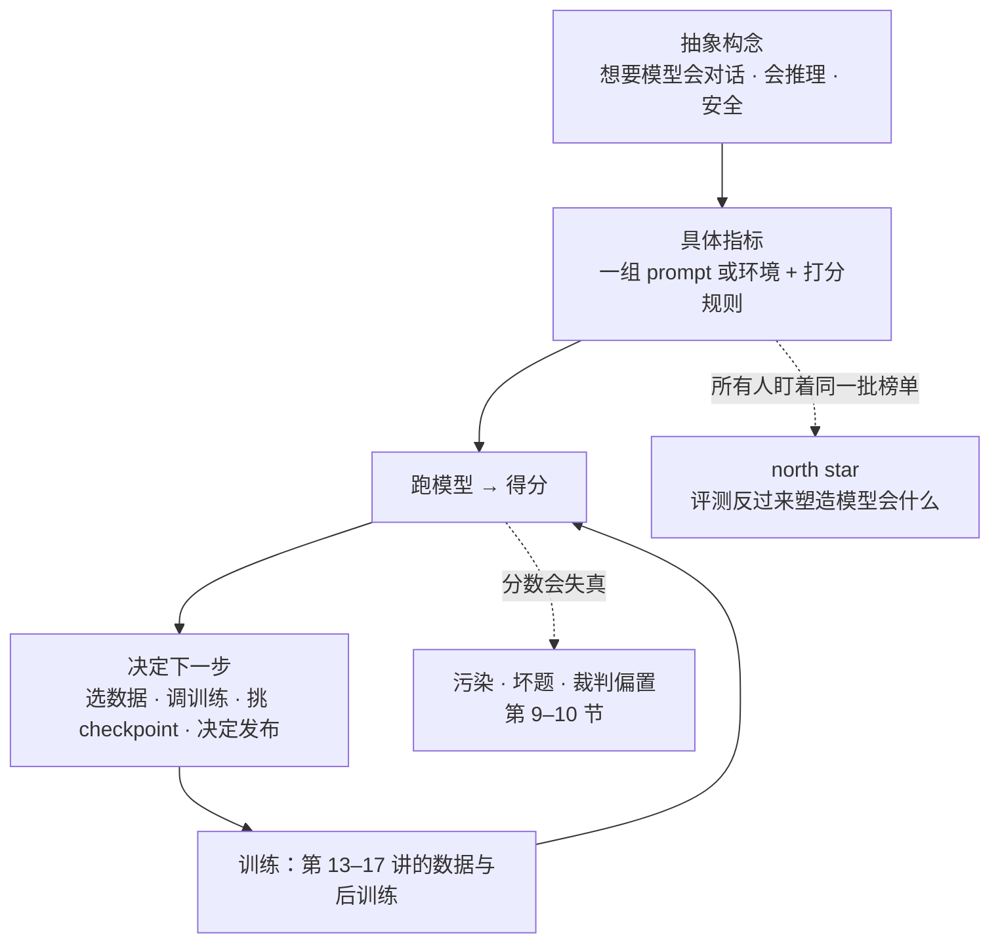
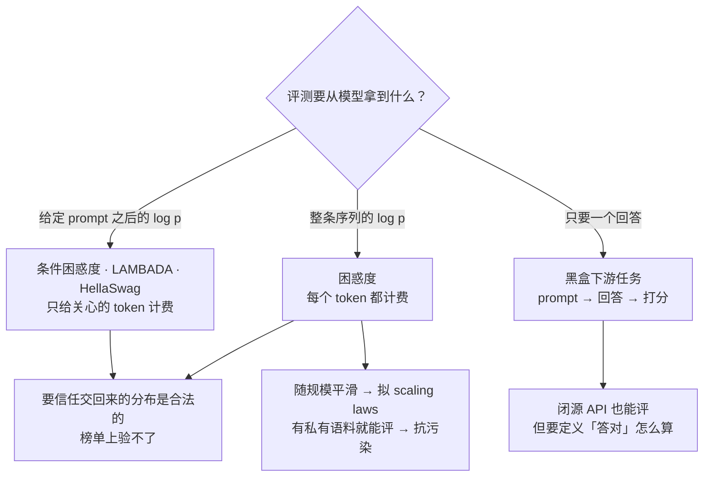
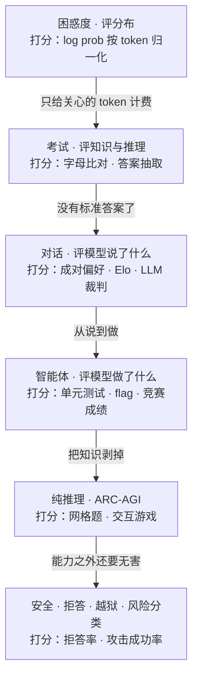
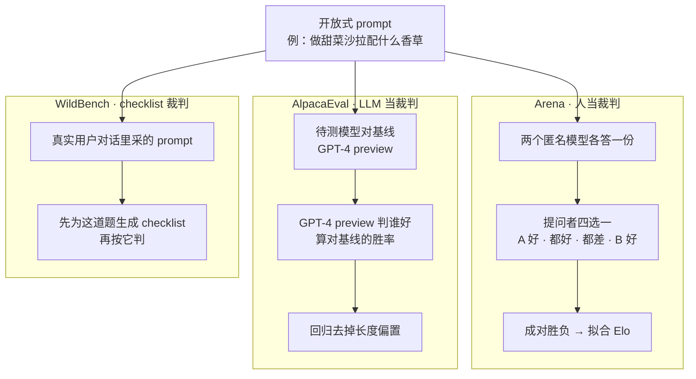
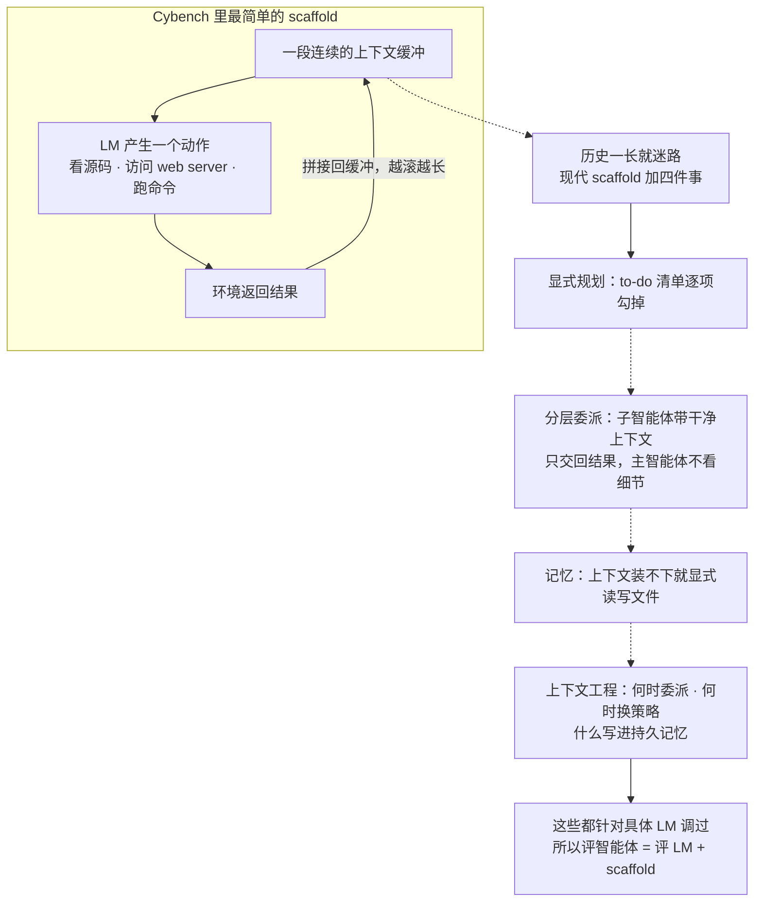
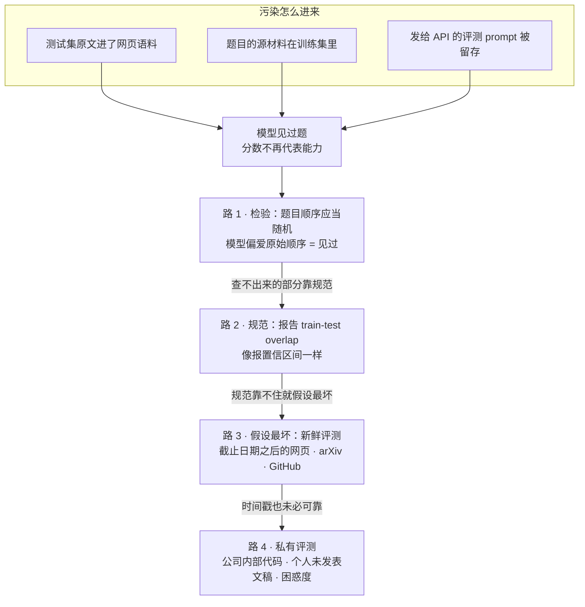

# CS336 第 12 讲｜评测（Evaluation）

> Stanford CS336: Language Modeling from Scratch（2026 春）· 第 12 讲（课程日程表标注 2026 年 5 月 6 日；视频里没有出现日期）
> 视频：<https://www.youtube.com/watch?v=JpAxdTWQJxM>（1:18:34；英文字幕为自动生成，benchmark 名、模型名错得不少，见文末勘误）
> 讲者：Percy Liang（全程；讲污染检测时以第三人称提到"Tatsu 组的一个想法"，讲私有评测时说自己读博时有一堆没上网的被拒论文可以拿来评困惑度）
> 课程主页：<https://stanford-cs336.github.io/> · 本讲不围绕某一篇论文，而是串起一批 benchmark：[MMLU](https://arxiv.org/abs/2009.03300) · [GPQA](https://arxiv.org/abs/2311.12022) · [Humanity's Last Exam](https://arxiv.org/abs/2501.14249) · [Chatbot Arena](https://arxiv.org/abs/2403.04132) · [AlpacaEval](https://arxiv.org/abs/2404.04475) · [SWE-bench](https://arxiv.org/abs/2310.06770) · [ARC-AGI](https://arxiv.org/abs/1911.01547)；讲者自己组的工作有 [Cybench](https://arxiv.org/abs/2408.08926)、[AIR-Bench](https://arxiv.org/abs/2407.17436) 和[报告 train-test overlap 的立场文](https://arxiv.org/abs/2410.08385)

**一句话**：评测回答的是"训出来的模型好不好"，可"好"没有唯一定义——榜单分数、分数对成本、人的偏好、真金白银的用量各是一种答案——所以这一讲给的是一张地图：困惑度是造模型的人自己的仪表盘（随规模平滑变化、能拟 scaling law、有私有语料就能评，但要看到分布，榜单上验不了真）；考试类靠越出越难续命（MMLU 57 科已到 90 多分，MMLU-Pro 改 10 选项后从 33 回到近 90，GPQA 从 GPT-4 的 39% 到 94，HLE 还只有 64.7）；对话类没有标准答案，只能靠成对比较加 Elo 或 LLM 裁判（AlpacaEval 与 Arena 相关 0.98，但裁判偏爱长回答）；智能体类评的是模型加 scaffold（SWE-bench Verified 从 16% 到 93）；ARC-AGI 想把推理从知识里剥出来，推理模型一出就从 0 冲到解决；安全类连"安全"的定义都还在争——而让这些数字可信的，是四件功课：想清楚评测的目的、防训练—测试重叠（顺序检验、报告重叠、新鲜题、私有题）、审计数据集（空回复也能拿 38%）、亲自看输出。

## 时间轴

| 时间 | 内容 |
|---|---|
| [0:06](https://www.youtube.com/watch?v=JpAxdTWQJxM&t=6s) | 开场：训练一个 LM 的拼图只差数据；但先得定义"要什么行为" |
| [1:06](https://www.youtube.com/watch?v=JpAxdTWQJxM&t=66s) | 评测是什么：抽象构念 → 具体指标；评测设定 AI 发展的 north star |
| [2:40](https://www.youtube.com/watch?v=JpAxdTWQJxM&t=160s) | "好模型"的四种看法：Artificial Analysis 智能榜、智能对推理成本、Arena 偏好、OpenRouter 用量 |
| [5:16](https://www.youtube.com/watch?v=JpAxdTWQJxM&t=316s) | 困惑度：定义；2010 年代的 in-distribution 范式（PTB、WikiText-103、1B Word）；2016 年纯神经的决定性结果 |
| [7:50](https://www.youtube.com/watch?v=JpAxdTWQJxM&t=470s) | GPT-2 的 zero-shot 评测：WebText 40 GB、1.5B 参数、PTB 35 对 SOTA 46 |
| [9:51](https://www.youtube.com/watch?v=JpAxdTWQJxM&t=591s) | "perplexity is all you need"的论证；反例"Stanford 1885"；条件困惑度 |
| [12:53](https://www.youtube.com/watch?v=JpAxdTWQJxM&t=773s) | 伪装的困惑度：LAMBADA、HellaSwag；困惑度榜单的信任问题；困惑度小结 |
| [18:11](https://www.youtube.com/watch?v=JpAxdTWQJxM&t=1091s) | 考试类：MMLU 57 科与 few-shot；MMLU-Pro 4 → 10 选项；GPQA 的 61 位 PhD 与 diamond 子集 |
| [25:53](https://www.youtube.com/watch?v=JpAxdTWQJxM&t=1553s) | 问答：题在不在训练集里？污染是间接的；Humanity's Last Exam 与私有保留集；多选题的价值与局限；答案怎么比对 |
| [31:30](https://www.youtube.com/watch?v=JpAxdTWQJxM&t=1890s) | 对话类：Chatbot Arena 的成对比较与 Elo；谁在投票、风格与正确性混淆、谄媚 |
| [38:09](https://www.youtube.com/watch?v=JpAxdTWQJxM&t=2289s) | AlpacaEval 的 LLM 裁判与长度偏置；怎么评一个指标（相关 0.98）；WildBench 的 checklist；开放式评测小结 |
| [44:52](https://www.youtube.com/watch?v=JpAxdTWQJxM&t=2692s) | 智能体类：SWE-bench 16 → 93、Terminal-Bench 89 题、Cybench 40 题、MLE-bench；scaffold 的四件事 |
| [53:37](https://www.youtube.com/watch?v=JpAxdTWQJxM&t=3217s) | 纯推理：ARC-AGI 1 / 2 / 3 的轨迹；o1 / o3 的拐点；问答：64×64 网格怎么输入 |
| [1:00:18](https://www.youtube.com/watch?v=JpAxdTWQJxM&t=3618s) | 安全类：HarmBench、AIR-Bench、GCG 越狱；安全的语境性、各类风险、双重用途 |
| [1:05:24](https://www.youtube.com/watch?v=JpAxdTWQJxM&t=3924s) | 生态效度：GDPval、临床任务集、用 LLM 分析真实用量 |
| [1:08:56](https://www.youtube.com/watch?v=JpAxdTWQJxM&t=4136s) | 训练—测试重叠：四条路——顺序检验、报告重叠、新鲜评测、私有评测 |
| [1:13:04](https://www.youtube.com/watch?v=JpAxdTWQJxM&t=4384s) | 数据集质量：SWE-bench Verified 的由来、MMLU 坏题、空回复拿 38%、Docent |
| [1:15:37](https://www.youtube.com/watch?v=JpAxdTWQJxM&t=4537s) | 评测为了什么：四种目的；评方法还是评模型（nanoGPT speedrun）；总结与取舍 |

## 核心内容

### 1. 评测在造模型的循环里是什么位置



*图 12-1｜评测的两个作用：往前是开发循环里的决策依据，往后是整个领域的指挥棒；分数在两处都可能失真（自绘示意）· [▶ 看原幻灯片 1:06](https://www.youtube.com/watch?v=JpAxdTWQJxM&t=66s)*

- **这一讲的位置**：到上一讲为止，训练一个语言模型需要的零件都讲过了——架构（第 3–4 讲）、优化器与训练循环（第 2 讲）、kernel 与并行（第 6–8 讲）、scaling laws（第 9、11 讲）、推理（第 10 讲）。还缺的一块是数据（第 13–14 讲）：数据决定模型的行为，喂代码就会写代码，只喂 DNA 序列就不会说英语。但谈数据之前，得先说清"想要模型有什么行为"——这就是评测。
- **评测看着机械，其实很深**：定义一组 prompt，发给模型，收回答，算准确率，似乎没什么好讲。但评测塑造了 AI 的发展方向：它设定 north star，开源闭源的每家开发者都把它当进度表。所以认真设计评测，就等于在暗中决定模型将来会什么、不会什么。
- **核心难题**：起点永远是一个抽象构念（construct）——"会对话""会推理"；评测是把它落成一个具体指标，背后是一组具体的 prompt 或环境。整讲反复出现的都是这一步转换及其失真。
- **"好"的四种看法**（[2:40](https://www.youtube.com/watch?v=JpAxdTWQJxM&t=160s)）
    - 榜单分数：artificialanalysis.ai 的 intelligence index 几乎成了"智能"的默认口径，榜从 GPT-5.5 往下排，分数是若干数据集的合成；
    - 分数对成本：同一个网站把 intelligence index 对推理花费画成散点——两者相关，但并不严格对齐，花钱多的一般更聪明，却不是一条直线；
    - 人的偏好：Arena AI（原 Chatbot Arena）的做法，用户成对投票排出名次（第 4 节）；
    - 真金白银的用量：OpenRouter 是多模型的统一入口，公布各模型的调用量——经济学视角，"有人付费就是好"，但只代表 OpenRouter 上的那群用户。
    - 讲者的态度：没有哪一个是正确答案，也不确定存在正确答案；列出来是为了让人意识到"好"可以有多种定义。
- **和前面课程的关系**：CME295 第 8 讲和 CS329A 第 8 讲从用模型的人的角度讲过 benchmark 分类、LLM-as-judge 和 Arena 的毛病；这一讲是造模型的人的视角——开发时用什么信号（第 2 节）、比较时信什么（第 3–8 节）、数字怎么被污染、怎么查（第 9–10 节）。

### 2. 困惑度：造模型的人自己的仪表盘



*图 12-2｜按"评测要从模型拿到什么"分三路：拿分布的评测信息最足、也最难验真；拿回答的评测谁都能做，但要自己定义对错（自绘示意）· [▶ 看原幻灯片 15:28](https://www.youtube.com/watch?v=JpAxdTWQJxM&t=928s)*

$$
\mathrm{PPL}(D)=\exp\Big(-\frac{1}{N}\sum_{i=1}^{N}\log p_\theta(x_i\mid x_{<i})\Big)
$$

D 是测试语料，共 N 个 token，p_θ 是模型；指数里是每个 token 的平均负对数似然（也就是训练用的 loss），取指数后得到困惑度。一句话：模型给这份语料分了多少概率质量，按 token 归一化让数字可比。

- **为什么从困惑度讲起**：语言模型的本体就是 token 序列上的分布 p(x)，评一个分布最自然的量是它给测试集分了多少概率——困惑度、似然、log loss 说的是一回事。训练时最小化的是训练集困惑度，评测时自然就量测试集困惑度。
- **2010 年代的范式**：当年任何一篇语言模型论文都是这一套。标准数据集是 Penn Treebank、WikiText-103、1 Billion Word Benchmark（取自机器翻译语料）；训练用 train split，评测用 test split，这是 **in-distribution** 评测，进展用困惑度下降来衡量。讲者点了一篇 2016 年的论文（应为 Jozefowicz et al. 的 *Exploring the Limits of Language Modeling*）：CNN 加 LSTM 在 1B Word 上把困惑度压下一大截——那时大家还在讨论 n-gram 和混合模型，这是第一个证明纯神经网络是正道的决定性结果。
- **GPT-2 换了玩法**（2019）：在 WebText（Reddit 外链的网页，40 GB 文本）上训练，然后**零样本**去评别人的标准数据集——这是 **out-of-distribution** 评测。最大的模型 1.5B 参数；在小数据集上提升尤其大，PTB 上做到 35，而当时的 SOTA 是 46；在 1B Word 这种自带大量同分布训练数据的集上没能超过 SOTA，但考虑到模型根本没见过那份训练集，已经很惊人。讲者顺带提醒：当年不一定做了仔细的去污染，可能有重叠。这开启了"在大语料上训、在标准 benchmark 上评"的范式，今天习以为常，当时是新鲜事。
- **"perplexity is all you need"**（[9:51](https://www.youtube.com/watch?v=JpAxdTWQJxM&t=591s)）：讲者说别太当真，但它是驱动很多人做 scaling 的心法。论证是：真实分布记作 T，模型记作 P；能达到的最好困惑度是 T 的熵，只在 P 等于 T 时取到；所以一路压困惑度，唯一的极小点就是真实分布——有了它，给问题就能生成解，给提问就能生成回答，往下压就通向 AGI。GPT-3 之前收益还不明显的年代，正是这个信念撑着大家继续放大模型。

$$
\mathbb{E}_{x\sim T}\big[-\log P(x)\big]=H(T)+\mathrm{KL}(T\,\|\,P)\;\ge\;H(T)
$$

模型 P 在真实分布 T 下的交叉熵等于 T 自身的熵加上 T 到 P 的 KL 散度；KL 项非负，只在 P 等于 T 时为零——这就是讲者口头说的"最好的困惑度是熵、唯一极小点是真实分布"，写成式子的样子（讲者没有写这个式子，只说了结论）。

- **困惑度也许"多于所需"**：一句"Stanford was founded in 1885"，困惑度对每个 token 都收费。预测 1885 那个 token 很有价值——它等于一道问答题，测的是世界知识；可句首的词、founded 这样的词并不有趣，困惑度照样按每一分偏差收费。补救是**条件困惑度**：在 prompt 上条件化，只量后面回答部分的困惑度，把注意力收到你在意的 token 上。

$$
\mathrm{PPL}(y\mid x)=\exp\Big(-\frac{1}{|y|}\sum_{t=1}^{|y|}\log p_\theta(y_t\mid x,\,y_{<t})\Big)
$$

x 是 prompt（不计费），y 是回答，|y| 是回答的 token 数；只对回答部分的 token 求平均负对数似然。

- **伪装成准确率的困惑度**：有些 benchmark 名义上算准确率，骨子里是下一 token 预测。
    - LAMBADA（2016）：给一段上下文，填最后一个词。选词经过精心挑选——必须读完长上下文才能填对。早期 GPT 系列论文很看重它，因为当时的信念是长上下文建模是通向推理的钥匙；把困惑度"磨尖"到某类现象上，就是这么做的。
    - HellaSwag：多选题形式的句子续写（一位女士带着狗在外面，接下来她……），四个候选选最合理的一个。本质上还是在比哪个续写的概率高。
- **想办困惑度榜单的人请注意**（[15:28](https://www.youtube.com/watch?v=JpAxdTWQJxM&t=928s)）：参赛者交回来的是 log prob，你得信它是合法分布、加起来等于 1。否则我写一个"永远返回 log prob 为 0"的模型，困惑度完美，但那根本不是分布。合同层面验不了，只能看代码。下游任务就简单得多：黑盒模型，给 prompt 收回答，算准确率。困惑度处理的是分布，天然要多一份小心；对 VAE 这类只能算一个界的模型更麻烦——还得信那个界的数学是对的。
- **小结，以及造模型的人怎么用它**：困惑度在模型开发中仍然用得很重——它随规模平滑变化，第 9、11 讲的 scaling law 拟的就是它；训练时盯的 loss 曲线是留出集困惑度；防污染时用私有语料评它（第 9 节）。这三件事用户看不到、开发者天天在做，第 1 讲叫它内部评测。但对不信"困惑度通向一切"的人，你得拿出反映真实场景的 benchmark；对信的人，一条漂亮的困惑度曲线就够了。

```python
def perplexity(model, docs, ctx_len):
    nll, n = 0.0, 0
    for doc in docs:                        # 私有语料也行：只要是文本就能评
        ids = tokenize(doc)
        for s in range(0, len(ids) - 1, ctx_len):
            x = ids[s : s + ctx_len + 1]
            logp = model.log_probs(x[:-1])  # 每个位置对下一个 token 的 log p
            nll -= logp.gather(x[1:]).sum()
            n += len(x) - 1
    return math.exp(nll / n)                # 按 token 归一化再取指数
```

这段伪代码是困惑度评测的全部：切窗、取 log prob、累加、归一化——它不需要标注、不需要标准答案，这正是私有困惑度评测好做的原因。

### 3. 六个家族一览，从考试类开始



*图 12-3｜本讲的六个评测家族按讲授顺序排成一条线，每个框里写评什么、怎么打分，边上写这一步换掉了什么；讲者的总结是它们在难度、真实性、效度上各有取舍（自绘示意）· [▶ 看原幻灯片 1:17:40](https://www.youtube.com/watch?v=JpAxdTWQJxM&t=4660s)*

- **为什么是考试**：人类就是靠考试互相测的。考试的好处是对科目、难度有精细控制，可以设计成答案唯一，于是好判分。LM 的 benchmark 文化很大一部分就建在这个想法上。

| Benchmark | 设计 | 课上给的数字 |
|---|---|---|
| MMLU（Hendrycks et al., 2020） | 57 个学科，一队学生从网上搜罗题目；名字里有"语言理解"，实际考知识和推理；用 few-shot prompt 评 GPT-3 | 小模型勉强高于随机，GPT-3 明显高于随机；从 GPT-3.5 turbo（2023 年初）到 GPT-4，如今 90 多分 |
| MMLU-Pro（2024） | 去掉噪声题和琐碎题；4 选项扩到 10 选项；默认配 chain of thought | 刚出时准确率回落到 33，现在约 88，快 90 |
| GPQA（Google-proof QA） | 61 位 Upwork 上的 PhD 出题；写题 → 专家验证 → 改题 → 第二位专家 → 非专家带着 Google 做；diamond 子集 = 两位专家都答对且至多一位非专家答对 | PhD 专家 65%（基本是 4 选 1）；非专家 30 分钟加 Google 只略高于随机；GPT-4 39% → 现在 94 |
| Humanity's Last Exam（2025） | 多模态、多学科、多选加简答；众包出题，用钱和署名激励；多轮审核，先用前沿模型过滤掉太容易的；留一份不公开的私有集 | 刚出时各模型个位数；2026 年 Mythos 也只有 64.7 |

> 小注：GPQA 论文摘要的原始数字——专家 65%（剔除明显失误后 74%），带 Google 的非专家 34%，GPT-4 39%。"Mythos"是讲者念的模型名，应为 Anthropic 2026 年的 Claude Mythos（推断）。

- **MMLU 当年有多激进**：GPT-3 刚出来的时候，没人确定语言模型是通用任务求解器，多数人还把它当"能生成流畅英文的东西"。MMLU 的团队赌的是"走在曲线前面"，并且用 few-shot prompt 来评——先写一句"下面是高中数学的题目"，再放几组题和答案，最后放待答的题，让模型接着预测。今天看平淡无奇，当时让模型处理这么复杂的 prompt 是相当大胆的。
- **续命的套路**：benchmark 饱和了就出更难的——MMLU 太容易就有 MMLU-Pro；能靠 Google 搜到答案就太容易，于是有 GPQA；模型什么都会了就众包一份"人类最后的考试"。每篇数据集论文的图都长一个样：旧 benchmark 上各模型都很高，我这个上各模型都很低。讲者的评语是保质期不长——但饱和的 benchmark 对造模型的人仍有用：给小模型选型、拟 scaling law 时，它们还是好信号。
- **问答：题目在不在训练集里？**（[25:53](https://www.youtube.com/watch?v=JpAxdTWQJxM&t=1553s)）讲者的诚实回答是不知道，因为不知道训练集里有什么，榜单数字都得打折扣，全凭信任。而且污染很微妙：多半不是直接拿测试集训练，而是题目改编自的来源被训进去了。HLE 的私有保留集是一种应对，但评测时仍要把题发给 API，只能希望那些 prompt 不被留下来训练。
- **多选题的价值与局限**（[29:29](https://www.youtube.com/watch?v=JpAxdTWQJxM&t=1769s)）：多选题活到现在，是因为难度可以随便加——说多选题太简单是误解，它限制的是能问的问题类型，不是难度。真正的问题是考试和真实使用相距太远：除了评 HLE，没人会拿 HLE 的题去问模型；真实的问题是开放式的，可能没有正确答案，甚至不成句。
- **问答：答案怎么比对？**（[30:30](https://www.youtube.com/watch?v=JpAxdTWQJxM&t=1830s)）多选题就是模型生成一个字母，和标准答案比是否相等。至于怎么生成：可以直接采样一个字母，现在更常见的是先生成一段 chain of thought 再给答案，这就需要从文本里**抽取答案**——抽取规则会影响分数，LM 评测对这一步可能非常敏感，讲者说这一讲不展开。

```python
def score_mc(model, q, choices, gold):
    # 方式 A：黑盒——让模型生成，再从文本里抽出字母
    text = model.generate(fewshot_prefix + q + "\nAnswer:")
    pred_a = extract_letter(text)            # 抽取规则本身会影响分数
    # 方式 B：白盒——比较每个选项的 log p，这就是「伪装的困惑度」
    scores = [model.log_prob(q + c) for c in choices]
    pred_b = "ABCD"[argmax(scores)]
    return pred_a == gold, pred_b == gold    # 两种口径未必一致
```

同一道多选题有两种打分口径：黑盒生成加抽取，或者白盒比 log prob；讲者提醒抽取那一步会左右分数，而白盒口径又回到了第 2 节的困惑度。

### 4. 对话类：没有标准答案时，靠成对比较和裁判



*图 12-4｜三种开放式评测的流水线：人裁判加 Elo、LLM 裁判加基线胜率、LLM 裁判加逐题 checklist（自绘示意）· [▶ 看原幻灯片 33:02](https://www.youtube.com/watch?v=JpAxdTWQJxM&t=1982s) · 出处：[Chiang et al., 2024](https://arxiv.org/abs/2403.04132)*

- **问题长什么样**：没人拿多选题问自己的 AI 助手（除非想让它替自己考试）。真实的问题像"做甜菜沙拉，哪些香草搭、哪些不搭"——问题开放，回答也开放，没法用相等来判，甚至没有 ground truth。
- **Chatbot Arena 的巧思**（[33:02](https://www.youtube.com/watch?v=JpAxdTWQJxM&t=1982s)）：让人来判，但判法设计得聪明。网站对所有人开放，随便谁都能来聊；不同于普通助手，一条 prompt 会拿到两个匿名模型的回答，用户四选一：A 好、都好、都差、B 好。攒下大量成对比较，再拟合 Elo 评分。榜上讲者点了一句 Claude Opus 排得不错。

$$
P(A \succ B)=\sigma(r_A-r_B)=\frac{1}{1+e^{-(r_A-r_B)}},\qquad \hat r=\arg\max_r\sum_{(i\succ j)\in\mathcal{D}}\log\sigma(r_i-r_j)
$$

r_A、r_B 是两个模型的评分，A 赢 B 的概率是评分之差的一个平滑递增函数；参数就是各模型的评分，拟合目标是让观测到的所有成对胜负的概率最大。讲者只说"某个函数"，这里写成 logistic 形式。

> 小注：logistic 形式就是 Bradley–Terry 模型，Chatbot Arena 论文实际用的是它；国际象棋的 Elo 用的是同一族函数，只是底数取 10、尺度取 400。

- **好在哪**：prompt 是真的。人来这个网站的动机是免费用模型，所以默认他们真想办点事，得到的就是真实世界的 prompt。Elo 的美妙之处在于不要求所有模型答同一批 prompt——和象棋一样，不必人人对战，比较图连通就能排名；这一点很重要，因为人不可能给所有模型都打分。而且新 prompt、新模型随时进来，天然可以持续更新。
- **担心在哪**（[35:35](https://www.youtube.com/watch?v=JpAxdTWQJxM&t=2135s)）
    - 投票的是谁？"互联网上随机来的人"是什么分布，谁也不知道；论文里有人口统计，但那说明不了全部。可能有垃圾投票，可能有人为自己提交的模型刷票，有点像蛮荒西部。
    - 二元偏好把**风格**和**正确性**揉在一起。象棋的 Elo 干净，因为只有输赢；"哪个回答更好"远没那么清楚。
    - 提问者当裁判有好处——他有意图，能判断意图有没有被满足；但他提问往往正因为不知道答案，那两个回答哪个对，他怎么判？
    - **谄媚**（sycophancy）：讨喜的回答会被抬高，正确但不中听的会吃亏。
- **AlpacaEval**（2023，[38:09](https://www.youtube.com/watch?v=JpAxdTWQJxM&t=2289s)）：指标是对基线模型的**胜率**——基线是 GPT-4 preview，裁判也是 GPT-4 preview，偏置显而易见，可以靠多个裁判集成缓解。这是 LLM-as-a-judge 的典型实例。它的第一个大问题是裁判偏爱长回答：一批微调模型只因回答更长就冲上榜首，属于刷榜；后续论文用一个简单的回归把长度偏置扣掉。
- **怎么评一个指标**：有了指标能评模型，可新指标本身好不好，谁来评？没有答案。能做的是理智检查：看它和别的指标的相关性，前提是你确实想模仿那个指标。AlpacaEval 和 Chatbot Arena 的相关系数是 0.98，不想上 Arena 或不想等人投票的，可以拿它当替身；但相关性是对某一批模型算的，比 GPT-4 preview 更强的模型上未必成立。这个榜已一年多没维护。
- **WildBench**：prompt 来自真实的人机对话（它也开了免费服务收集提问），裁判是 LLM；创新点是为每道题**生成一份专属 checklist**——直接问 LLM "好不好"是个定义不清的任务，checklist 把任务圈定下来。它也报告了和 Arena 的相关性，讲者承认这有点循环：Arena 就是 ground truth 吗？至少大家都在同一条船上。
- **开放式评测小结**（[43:21](https://www.youtube.com/watch?v=JpAxdTWQJxM&t=2601s)）
    - 成对比较优于绝对打分：两个回答很接近时，"这个略好"仍是有效的方向信号；"7 分还是 8 分"信号弱得多。
    - 人和 LLM 裁判各有各的偏置，都得留意；也许只能多找几个裁判，人和模型都说你更好，那大概是真的更好。
    - 开放式评测本质上定义不清，要靠 rubric 或 checklist 提高可靠性——对人类裁判同样适用，不给评分标准就让众包工人打分，结果多半是胡来。
- **和前面课程的关系**：CME295 第 4 讲列过 Arena 的五类问题，CS329A 第 8 讲讲过 LLM-as-judge；这一讲新增的是榜单背后的拟合模型、长度偏置的修法，以及用相关性验证一个指标。

```python
def fit_ratings(pairs, models, steps=1000, lr=0.01):
    r = {m: 0.0 for m in models}            # 每个模型一个评分
    for _ in range(steps):
        for winner, loser in pairs:         # 一场匿名对战 = 一条成对比较
            p = sigmoid(r[winner] - r[loser])
            r[winner] += lr * (1 - p)       # 冷门取胜，评分动得多
            r[loser]  -= lr * (1 - p)
    return r                                # 比较图连通即可，不必人人对战
```

按成对胜负做梯度上升拟合评分：每条比较只涉及两个模型，所以不要求所有模型答同一批题，新模型打几场就能进榜。

### 5. 智能体类：评的是模型加 scaffold



*图 12-5｜最简单的智能体循环，以及讲者列的现代 scaffold 四件套；结论是智能体分数里混着 scaffold 的功劳（自绘示意）· [▶ 看原幻灯片 49:58](https://www.youtube.com/watch?v=JpAxdTWQJxM&t=2998s) · 出处：[Zhang et al., 2024](https://arxiv.org/abs/2408.08926)*

- **从"说什么"到"做什么"**：对话类评的是模型说了什么，智能体类评的是模型做了什么。智能体 = 语言模型 + scaffold，后者是决定何时调用模型、给它哪些工具的那套逻辑。讲者的判断是智能体会改变我们看待语言模型的方式，它扩展了模型的能力面。

| Benchmark | 任务与环境 | 怎么打分 | 课上给的数字 |
|---|---|---|---|
| SWE-bench | 给一个代码库和一条 GitHub issue，提交 PR | 单元测试：原本失败的要通过，其余不能弄坏 | SWE-bench Verified：2024 年约 16%，现在约 93（Mythos） |
| Terminal-Bench 2.0 | 环境就是终端；任务靠敲命令完成，简单而通用 | 各任务自带检验 | 93 人众包，89 道任务；人做需 1 小时到一周以上，看专家还是新手 |
| Cybench | 40 道 capture-the-flag：看源码、访问服务器、拿到 flag | 拿到 flag 这个唯一字符串即成功 | 刚出时最好的模型约 10%，现在完全解决 |
| MLE-bench | Kaggle 竞赛：看数据、读说明、写代码、训模型、提交 | 按 Kaggle 成绩评级 | 榜首仍是那几个前沿模型，但 scaffold 之间差异很大 |

- **四个榜的看点**：SWE-bench 开了在真实代码库里评智能体写代码的先河，打分极其直接——PR 能不能让测试通过（榜上看的是 Verified 版，缘由见第 10 节）；Terminal-Bench 的环境最简单、最普适，榜上能看到同一个模型配不同 agent 准确率不同；Cybench（讲者组的工作）把人类的 CTF 竞赛搬给智能体，课上展示的 scaffold 极简（图 12-5 上半），历史越滚越长，所以后面必须有更好的上下文管理；MLE-bench 榜上 LM 一侧还是那几位常客，差异主要来自 scaffold。
- **scaffold 很重要，所以这已经不只是 LM 评测**（[52:02](https://www.youtube.com/watch?v=JpAxdTWQJxM&t=3122s)）。要解决真正复杂的任务要靠四件事：显式规划（一路 chain of thought 意识流下去，上下文一堆积就迷失，要维护 to-do 清单逐项勾掉）；分层委派（子智能体带干净的上下文去干活，只交回结果，主智能体不看细节——一种封装）；记忆（上下文装不下就显式读写文件）；上下文工程（何时委派、何时换策略、什么写进持久记忆）。这些都针对具体模型调过，所以评智能体等于同时评模型和 scaffold。
- **给做智能体 benchmark 的人**：这一节和第 10 节合起来是三条提醒——分数里 scaffold 和模型不可分，报告时两者都得写清；环境是质量问题的藏身处，测试用例可能不完整，通过了测试不等于方案能用；一定要看轨迹（trace），不能只看通过率。CS329A 第 8 讲讲过智能体评测的框架，这里补的是各榜单的数字和"scaffold 这一列"。

### 6. 纯推理：ARC-AGI 想把推理从知识里剥出来

- **动机**：前面所有任务都要语言和世界知识。能不能把推理、或者说流体智力（fluid intelligence），从"知道多少事实"里剥离出来单独测？有人认为这才是更纯的智能。
- **ARC-AGI**（2019 年起）：目标就是这个——每道题都要 100% 可被人解出、但对 AI 很难；每道题都是独一份，背下的事实和做过的旧题都帮不上忙。2019 年还是 GPT-2 时代，可以说相当有预见性。第一代的题是几张网格图，猜下一张——比如把黄色补齐成一个矩形，人看十秒就会。
- **轨迹**（[55:39](https://www.youtube.com/watch?v=JpAxdTWQJxM&t=3339s)）
    - ARC-AGI-1 刚出时，GPT-3 一代的预训练模型得分是 0——正如设计者所愿：预训练学的是互联网上的事实和语言模式，对这些题没有直接帮助。
    - 2024 年 OpenAI 的 o1、o3 出现，分数陡然起飞，ARC-AGI-1 基本被解决。
    - 2025 年的 ARC-AGI-2 还没完全解决，但看起来在路上。
    - 上个月刚出的 ARC-AGI-3 改成了交互式环境——线上玩的一种游戏，不用语言，纯靠找规律——目前分数极低。讲者说明年再讲这门课，这页幻灯片肯定要更新。
- **讲者的评价**：是推理能力解锁了这条曲线。预训练的知识有没有用？没有预训练就没有推理模型的爆发，所以它重要，只是在 ARC 的历史上长期不可见。把推理从知识里剥离非常难，ARC 大概是最好的尝试，但未必真能解耦——只要有人在乎，什么 benchmark 都能被冲上去，这些题终究来自某种先验。另一个限制：它要求人类可解，所以覆盖不到超人类的推理（IMO 金牌、开放数学问题）。但它确实暴露了当前模型的缺口。
- **问答：这么图形化的题怎么喂给语言模型？**（[59:15](https://www.youtube.com/watch?v=JpAxdTWQJxM&t=3555s)）讲者记得是 64×64 的网格，可以给图像，也可以转成 ASCII 或其他文本表示；无论哪种，都有一个空间推理的成分，和自然语言无关。
  > 小注：ARC-AGI-1 和 -2 的网格最大 30×30；64×64 是 ARC-AGI-3 交互式游戏的网格尺寸（推断，讲者自己也说不确定）。

### 7. 安全类：连"安全"是什么都还在定义

- **对照汽车**：汽车的安全有明确定义——撞墙测试、安全气囊、假人，背后是几十年的游说和标准化。AI 的安全没有这么好的答案，讲者只给了几种人们在想的东西。
- **HarmBench**：用有害的 prompt 去问，期望模型拒绝。这是最主流的安全观——防止坏人拿模型做坏事。
- **AIR-Bench**（讲者组参与）：从整体看安全——把欧盟、中国、美国的监管框架和各公司的政策收集起来，建一套"可能出什么问题"的分类法，再据此构造 prompt 来评。
- **越狱**（jailbreaking）是安全里自成一体的子问题：模型被训练得会拒绝有害指令，但聪明人能绕过去。早期工作 GCG 用逐坐标的优化算法自动搜索绕过安全训练的 prompt；惊人的是在开源模型上优化出的攻击能**迁移**到闭源模型——一串乱码后缀加一句"一步步毁灭人类的计划"，当时 OpenAI 的模型照答不误。讲者希望这些攻击现在已失效；那份"计划"是否真有害另说，期望行为总归是拒绝。
- **安全到底是什么**（[1:03:22](https://www.youtube.com/watch?v=JpAxdTWQJxM&t=3802s)）
    - 它高度依赖语境：政治、法律、社会规范因国家而异。
    - 风险种类多，需要的关注也不同：幻觉（医疗、法律、金融场景尤其要紧）——它和能力正相关，模型越准就越少胡说；谄媚；协助犯罪——这一项和能力是相反的；不平等；人失去批判性思维——又是和能力正相关的风险。把"确保 AI 对人是好事"当作安全的定义，题目就大得多了。
    - 双重用途：网络安全智能体既能攻破系统，也能做渗透测试让系统更安全——同一种能力是风险还是收益，是把双刃剑。
- 对齐相关的训练方法在第 17 讲。

### 8. 生态效度：评测和真实使用隔着多远

- **生态效度**（ecological validity）：评测多大程度上抓住了真实使用。考试离真实使用最远；Arena 的 prompt 来自真人，但那群人、那些用例是不是对的分布，也说不准。下面几个 benchmark 至少在**用例层面**追求真实（不是逐条 query 层面）：
    - **GDPval**（OpenAI）：按美国 GDP 取前 9 个行业，请平均约 14 年经验的从业者出任务——护士、礼宾、房产经纪、影视剪辑等等。
    - **临床任务集**（应为讲者组的 MedHELM）：此前医学 benchmark 多半是执业考试题，但人也不是考过试就直接上手术台（中间还有漫长的过程），模型更不该考过试就直接部署。这个项目从 29 位临床医生那里收集了 121 项任务，代表临床医生真正会拿去问模型的事，和多选题考试完全不同。
    - **用 LLM 分析真实数据**（应为 Anthropic 的 Clio）：真正知道用户在干什么的是模型开发者。出于隐私不能直接看用户数据，但可以让语言模型去看、去归纳一般模式——于是能知道人们拿 Claude 做哪些类型的事。真实性和隐私是拉扯的：最理想的是直接从真实 query 流里采样来评，可那正是隐私不允许的。
  > 小注：GDPval 的公开数字——9 个行业、44 种职业、1,320 项任务，出题者平均 14 年经验（应出自 OpenAI 的 GDPval 报告）。MedHELM 论文摘要：5 大类、22 子类、121 项任务，分类法由 29 位临床医生验证。讲者全程没有提 HELM 这个名字，但 MedHELM 和 AIR-Bench 都出自那条线。
- **给造模型的人**：这一节就是第 1 讲里"外部评测"的那一头——生态效度高的评测贵、慢、一次性；内部评测（困惑度、已饱和的 benchmark）便宜、平滑、可反复用。开发循环里两头都要，但用途不同。

### 9. 训练—测试重叠：四条路



*图 12-6｜污染的三个入口（前两个是讲者说的，第三个来自 HLE 那段的担心），以及讲者给的四条应对之路（自绘示意）· [▶ 看原幻灯片 1:09:27](https://www.youtube.com/watch?v=JpAxdTWQJxM&t=4167s) · 出处：[Oren et al., 2023](https://arxiv.org/abs/2310.17623)*

- **为什么现在成了问题**：机器学习第一课就是别在测试集上训练。基础模型之前这很清楚——ImageNet、SQuAD 都有 train / test split，大家玩同一个游戏。现在的模型在整个互联网乃至更多的数据上训练，而且你不知道数据里有什么。
- **路 1：推断模型有没有见过测试集**。Tatsu 组的一个巧妙想法：benchmark 里题目的顺序本应是随机的；如果模型偏爱某个特定顺序、而那正是 benchmark 发布时的顺序，多半是把它训进去了。

```python
def order_test(model, benchmark, n_shuffles=100):
    canon = model.log_prob(concat(benchmark))            # 发布时的题目顺序
    shuffled = [model.log_prob(concat(shuffle(benchmark)))
                for _ in range(n_shuffles)]              # 打乱顺序的对照
    # 没见过题的模型对任何顺序一视同仁：canon 应落在 shuffled 的分布里
    p_value = mean(s >= canon for s in shuffled)
    return p_value < 0.05                                # 显著偏爱原顺序 = 见过
```

一个可交换性检验：把原始顺序的对数似然和打乱顺序的对比，只有"见过这份文件"的模型才会对原始顺序另眼相看；它只需要 log prob，所以对开放权重模型和暴露 log prob 的 API 都能做（细节按论文，这里是示意）。

- **路 2：规范——报告 train-test overlap**。这是社区规范的问题。统计学里报估计值必带置信区间，是标准做法；讲者组的立场文主张：你要是声称某个 GPQA 分数，就该同时给出"没在测试集上训练"的证据。
  > 小注：那篇立场文调查了 30 家模型开发者，只有 9 家报告 train-test overlap（4 家公开训练数据、5 家公开方法）。
- **路 3：干脆假设最坏——所有公开评测都被训过了，那就用新鲜题**。LiveCodeBench、Uncheatable Eval 一类做法：持续抓取模型截止日期之后的新网页、新 arXiv 论文、新 GitHub 仓库来出题。看着很稳，但时间戳也不绝对安全：今天发到 GitHub 的代码可能是从别的旧仓库改来的，"新"未必真新。
- **路 4：私有评测**。公司都这么做：Google、OpenAI 有内部代码库，默认不在互联网上，自己也不会拿来训练，就能拿来评。个人也行——讲者读博时那些从没上网的被拒论文就是他的私有测试集。这类评测**特别适合困惑度**：只要有一份好语料就能算 log prob，不需要标注。
- **给造模型的人的污染卫生**：四条路不互斥——开发时用路 4 的私有困惑度盯训练，对外报告走路 2，比较他人模型时用路 1 和路 3 交叉验证。第 13–14 讲的数据流水线会回到去污染（decontamination）：那是训练侧的功课，这一讲是评测侧的。

### 10. 数据集质量、评测的目的与总结

- **SWE-bench 为什么要有 Verified**：原版 SWE-bench 有一批任务的单元测试不够严格，还有别的毛病，后来修出了 Verified 版。很多 benchmark 走过同样的路——GSM8K、MMLU 都被人仔细审计过，发现有的题坏了：题干说"根据下面的曲线"，可根本没给曲线；问"婴儿有没有穿袜子"，无从判断。
- **智能体 benchmark 更难审**：有一篇论文（应为 Zhu et al., 2025 的 *Establishing Best Practices for Building Rigorous Agentic Benchmarks*）指出智能体 benchmark 问题很多，而且比看题、看选项难查得多——它是一整个环境。代码题有通过 / 不通过的测试当然好，但测试用例可能不完整，全部通过也不等于解法能用。还有的情形，智能体交一个空回复就能拿到约 38%——这类平凡解必须小心避开。
  > 小注：那篇论文的摘要点名 SWE-bench Verified 的测试用例不足、τ-bench 把空回复计为成功；38% 应是 τ-bench 的某个子集上"什么都不做"的通过率（推断）。论文给出的 ABC 清单用在 CVE-Bench 上，把高估的分数压低了 33%。
- **看输出**：Docent 这个工具用语言模型检查智能体的轨迹、找出问题——是对重度量化的 benchmark 文化的一种定性补充。讲者的建议是无论造 benchmark 还是跑 benchmark，一定亲自看输出、做审计，确认量到的是你以为在量的东西。
  > 小注：Docent 出自 Transluce（<https://docent.transluce.org/>）。
- **评测为了什么**（[1:15:37](https://www.youtube.com/watch?v=JpAxdTWQJxM&t=4537s)）：没有一个评测能统治一切，所以必须先说清目的，而这常常没人说。四种典型目的，会导向不同的 benchmark 组合：
    1. 用户或公司做采购决策——某个用例上选 A 还是 B；
    2. 研究者想量化心里那个"智能"的直觉；
    3. 为商业或政策理解收益与危害；
    4. 模型开发者要反馈来改进模型。
- **评的到底是什么**：基础模型之前，研究者评的是**方法**——train / test split 固定，变的只有算法。今天评的多半是**模型和系统**，什么都可以变；例外是 nanoGPT speedrun，它刻意评算法：多快能把一个模型训到某个水平。评最终模型有意义，因为那才是要上线的东西，但要明确说出你在评什么。
- **总结**（[1:17:40](https://www.youtube.com/watch?v=JpAxdTWQJxM&t=4660s)）：没有唯一正确的评测，先选定要量什么。六个家族——困惑度、考试、对话、智能体、推理、安全——在难度、真实性、效度上各有取舍；很难同时做到真实、困难、生态效度高、又没有训练—测试污染，通常得牺牲其中一项，牺牲哪一项由目的决定。下周开始讲训练数据。

| 家族 | 评什么 | 打分方式 | 最大的软肋（课上的话） |
|---|---|---|---|
| 困惑度 | 分布 | log prob 归一化 | 榜单验不了真；每个 token 都计费 |
| 考试 | 知识与推理 | 字母比对、答案抽取 | 离真实使用远；保质期短；污染 |
| 对话 | 说了什么 | 成对偏好、Elo、LLM 裁判 | 风格与正确性混淆；裁判偏置；定义不清 |
| 智能体 | 做了什么 | 测试、flag、竞赛成绩 | 分数里混着 scaffold；环境和测试可能有洞 |
| 纯推理 | 剥离知识的推理 | 网格题、交互游戏 | 未必真能解耦；只到人类水平 |
| 安全 | 拒答、越狱、风险 | 拒答率、攻击成功率 | "安全"本身依赖语境、风险多元、双重用途 |

## 关键图表速查（点时间戳跳到原幻灯片）

| 图 | 看什么 | 跳转 | 出处 |
|---|---|---|---|
| Artificial Analysis 智能榜与"智能对成本"散点 | 榜从 GPT-5.5 往下排；散点里贵的一般更聪明，但偏离对角线的不少 | [3:10](https://www.youtube.com/watch?v=JpAxdTWQJxM&t=190s) | [artificialanalysis.ai](https://artificialanalysis.ai/) |
| GPT-2 零样本困惑度表 | 各列是不同数据集，各行是模型大小；PTB 一列 35 对 SOTA 46，1B Word 一列没赢 | [8:21](https://www.youtube.com/watch?v=JpAxdTWQJxM&t=501s) | [Radford et al., 2019](https://cdn.openai.com/better-language-models/language_models_are_unsupervised_multitask_learners.pdf) |
| "Stanford was founded in 1885" | 逐 token 看困惑度在哪里计费：1885 值钱，句首和 founded 不值钱 | [11:51](https://www.youtube.com/watch?v=JpAxdTWQJxM&t=711s) | — |
| MMLU 的 few-shot prompt 与分数曲线 | prompt 的结构：学科说明、几组问答、待答题；曲线从 GPT-3.5 turbo 到 90 多分 | [20:12](https://www.youtube.com/watch?v=JpAxdTWQJxM&t=1212s) | [Hendrycks et al., 2020](https://arxiv.org/abs/2009.03300) |
| GPQA 出题流水线 | 写题 → 专家验证 → 改题 → 第二位专家 → 非专家带 Google；diamond 的两个条件 | [24:20](https://www.youtube.com/watch?v=JpAxdTWQJxM&t=1460s) | [Rein et al., 2023](https://arxiv.org/abs/2311.12022) |
| HLE 各模型分数 | 刚出时全是个位数；2026 年的图上最高 64.7 | [28:28](https://www.youtube.com/watch?v=JpAxdTWQJxM&t=1708s) | [Phan et al., 2025](https://arxiv.org/abs/2501.14249) |
| Chatbot Arena 界面与 Elo 公式 | 两份匿名回答、四个按钮；胜率是评分差的函数，拟合评分使成对胜负最可能 | [33:32](https://www.youtube.com/watch?v=JpAxdTWQJxM&t=2012s) | [Chiang et al., 2024](https://arxiv.org/abs/2403.04132) |
| AlpacaEval 与 Arena 的相关图 | 相关系数 0.98；注意点都是 GPT-4 preview 一代及以下的模型 | [40:46](https://www.youtube.com/watch?v=JpAxdTWQJxM&t=2446s) | [Dubois et al., 2024](https://arxiv.org/abs/2404.04475) |
| SWE-bench Verified 曲线 | 2024 年约 16% 起步，如今约 93 | [46:55](https://www.youtube.com/watch?v=JpAxdTWQJxM&t=2815s) | [Jimenez et al., 2023](https://arxiv.org/abs/2310.06770) |
| Terminal-Bench 榜 | 同一个模型配不同 agent，分数不同——scaffold 那一列 | [48:58](https://www.youtube.com/watch?v=JpAxdTWQJxM&t=2938s) | [tbench.ai](https://www.tbench.ai/) |
| Cybench 的 scaffold 图 | 一段连续记忆：动作 → 环境反馈 → 拼回缓冲 | [49:58](https://www.youtube.com/watch?v=JpAxdTWQJxM&t=2998s) | [Zhang et al., 2024](https://arxiv.org/abs/2408.08926) |
| ARC-AGI 轨迹图 | 长期贴着 0，2024 年 o1 / o3 处陡升；ARC-AGI-2 在追，ARC-AGI-3 又归零 | [55:39](https://www.youtube.com/watch?v=JpAxdTWQJxM&t=3339s) | [arcprize.org](https://arcprize.org/) |
| GCG 越狱示例 | 乱码后缀加有害请求，闭源模型照答；在开源模型上优化、迁移到闭源 | [1:02:52](https://www.youtube.com/watch?v=JpAxdTWQJxM&t=3772s) | [Zou et al., 2023](https://arxiv.org/abs/2307.15043) |
| MMLU 坏题示例 | 题干引用不存在的曲线；"婴儿有没有穿袜子"无从判断 | [1:14:05](https://www.youtube.com/watch?v=JpAxdTWQJxM&t=4445s) | — |

## 提到的工作

| 名称 | 在本讲里的作用 |
|---|---|
| [Artificial Analysis](https://artificialanalysis.ai/) | "好 = 榜单分数"和"好 = 分数对成本"的例子；intelligence index |
| [OpenRouter 用量榜](https://openrouter.ai/rankings) | "好 = 有人付费使用"的经济学视角 |
| Penn Treebank · [WikiText-103](https://arxiv.org/abs/1609.07843) · [1B Word Benchmark](https://arxiv.org/abs/1312.3005) | 2010 年代 in-distribution 困惑度评测的标准数据集 |
| [Jozefowicz et al., 2016](https://arxiv.org/abs/1602.02410) | "2016 年那篇论文"（应为）：CNN 加 LSTM 在 1B Word 上大幅降低困惑度，纯神经胜出 |
| [GPT-2](https://cdn.openai.com/better-language-models/language_models_are_unsupervised_multitask_learners.pdf)（Radford et al., 2019） | WebText 40 GB、1.5B 参数、零样本评标准数据集；PTB 35 对 46 |
| [LAMBADA](https://arxiv.org/abs/1606.06031)（Paperno et al., 2016） | 需要长上下文才能填的最后一个词；伪装成准确率的困惑度 |
| [HellaSwag](https://arxiv.org/abs/1905.07830)（Zellers et al., 2019） | 多选题形式的句子续写；本质上也是困惑度 |
| [MMLU](https://arxiv.org/abs/2009.03300)（Hendrycks et al., 2020） | 57 科、few-shot；从勉强高于随机到 90 多分 |
| [MMLU-Pro](https://arxiv.org/abs/2406.01574)（Wang et al., 2024） | 去噪、10 选项、配 chain of thought；33 → 近 90 |
| [GPQA](https://arxiv.org/abs/2311.12022)（Rein et al., 2023） | Google-proof；61 位 PhD、diamond 子集；专家 65%、GPT-4 39%、现在 94 |
| [Humanity's Last Exam](https://arxiv.org/abs/2501.14249)（Phan et al., 2025） | 众包、多轮审核、私有保留集；Mythos 64.7 |
| [Chatbot Arena](https://arxiv.org/abs/2403.04132)（Chiang et al., 2024；现称 Arena AI） | 匿名成对投票加 Elo；真实 prompt；投票人群、风格与正确性、谄媚 |
| [AlpacaEval](https://github.com/tatsu-lab/alpaca_eval) · [Length-Controlled AlpacaEval](https://arxiv.org/abs/2404.04475)（Dubois et al., 2024） | LLM 裁判对基线的胜率；长度偏置的回归修正；与 Arena 相关 0.98 |
| [WildBench](https://arxiv.org/abs/2406.04770)（Lin et al., 2024） | 真实对话里的 prompt；逐题生成 checklist 的 LLM 裁判 |
| [SWE-bench](https://arxiv.org/abs/2310.06770)（Jimenez et al., 2023）· [SWE-bench Verified](https://openai.com/index/introducing-swe-bench-verified/) | GitHub issue 到 PR，单元测试判分；Verified 修掉了测试不严的任务；16% → 93 |
| [Terminal-Bench](https://www.tbench.ai/) | 终端环境；93 人众包、2.0 版 89 题；同模型不同 agent 分数不同 |
| [Cybench](https://arxiv.org/abs/2408.08926)（Zhang et al., 2024） | 40 道 CTF；最简 scaffold 的示例；10% → 完全解决 |
| [MLE-bench](https://arxiv.org/abs/2410.07095)（Chan et al., 2024） | Kaggle 竞赛全流程；scaffold 差异大 |
| [ARC-AGI](https://arxiv.org/abs/1911.01547)（Chollet, 2019）· [ARC Prize](https://arcprize.org/) | 剥离知识的推理测试；1 / 2 / 3 三代的轨迹 |
| OpenAI o1 · o3 | 2024 年让 ARC-AGI-1 起飞的推理模型 |
| [HarmBench](https://arxiv.org/abs/2402.04249)（Mazeika et al., 2024） | 有害 prompt 期望拒答的安全评测 |
| [AIR-Bench 2024](https://arxiv.org/abs/2407.17436)（Zeng et al., 2024） | 从欧盟、中国、美国监管框架和公司政策建风险分类法 |
| [GCG](https://arxiv.org/abs/2307.15043)（Zou et al., 2023） | 逐坐标优化的自动越狱；开源模型上优化、迁移到闭源 |
| [GDPval](https://openai.com/index/gdpval/)（OpenAI, 2025） | 按 GDP 取 9 个行业、约 14 年经验的从业者出任务 |
| [MedHELM](https://arxiv.org/abs/2505.23802)（Bedi et al., 2025） | "121 项任务、29 位临床医生"的临床任务集（应为） |
| [Clio](https://arxiv.org/abs/2412.13678)（Tamkin et al., 2024） | 用 LLM 在保护隐私的前提下分析真实用量（应为） |
| ImageNet · SQuAD | 基础模型之前 train / test split 清晰的例子 |
| [Oren et al., 2023](https://arxiv.org/abs/2310.17623) | 路 1：靠题目顺序检验测试集污染（"Tatsu 组的想法"） |
| [Zhang et al., 2024（立场文）](https://arxiv.org/abs/2410.08385) | 路 2：模型开发者应报告 train-test overlap |
| [LiveCodeBench](https://arxiv.org/abs/2403.07974)（Jain et al., 2024）· [Uncheatable Eval](https://github.com/Jellyfish042/uncheatable_eval) | 路 3：截止日期之后的新鲜题（两个名字都按字幕推断） |
| GSM8K · MMLU 的审计 | 坏题的例子：缺失的曲线、婴儿的袜子 |
| [Zhu et al., 2025](https://arxiv.org/abs/2507.02825) | 智能体 benchmark 的质量问题：测试不完整、空回复得分（应为） |
| [Docent](https://docent.transluce.org/)（Transluce） | 用 LLM 审计智能体轨迹的工具 |
| [nanoGPT speedrun](https://github.com/KellerJordan/modded-nanogpt) | 今天少见的"评方法不评模型"的例子 |

## 术语对照

| English | 中文 |
|---|---|
| construct | 构念：想量的抽象概念，如"会推理" |
| north star | 指路星：所有人共同追逐的指标 |
| perplexity / log loss / likelihood | 困惑度 / 对数损失 / 似然：同一件事的三种说法 |
| in-distribution / out-of-distribution evaluation | 同分布 / 分布外评测：测试集与训练集是否同源 |
| zero-shot / few-shot | 零样本 / 少样本：prompt 里给不给示例 |
| entropy | 熵：真实分布下能达到的最好困惑度的对数 |
| conditional perplexity | 条件困惑度：只对 prompt 之后的回答计费 |
| cloze task | 完形填空任务（LAMBADA） |
| leaderboard | 排行榜 |
| exam benchmark | 考试类基准 |
| multiple choice | 多选题 |
| saturation | 饱和：模型分数逼近上限，benchmark 失去区分度 |
| shelf life | 保质期：benchmark 从发布到饱和的时间 |
| Google-proof | 搜不到答案的：靠搜索引擎解不了 |
| diamond subset | 钻石子集：GPQA 里两位专家都对、至多一位非专家对的题 |
| held-out / private set | 保留集 / 私有集：不公开的测试题 |
| contamination / decontamination | 污染 / 去污染：测试数据混进训练数据，及其清除 |
| answer extraction | 答案抽取：从生成文本里取出最终答案 |
| chain of thought | 思维链 |
| pairwise comparison | 成对比较 |
| Elo rating / Bradley–Terry model | Elo 评分 / Bradley–Terry 模型：由成对胜负拟合的评分 |
| LLM-as-a-judge | 用 LLM 当裁判 |
| win rate | 胜率：对某个基线模型的获胜比例 |
| length bias / length-controlled | 长度偏置 / 长度校正 |
| checklist / rubric | 检查清单 / 评分细则 |
| sycophancy | 谄媚：讨好用户而非说实话 |
| ecological validity | 生态效度：评测与真实使用的接近程度 |
| agent / scaffold | 智能体 / 脚手架：决定何时调模型、给什么工具的外围逻辑 |
| sub-agent / hierarchical delegation | 子智能体 / 分层委派 |
| context engineering | 上下文工程 |
| trace | 轨迹：智能体一步步的动作与观察记录 |
| capture-the-flag (CTF) | 夺旗赛：攻入系统取得一个唯一字符串 |
| fluid intelligence | 流体智力：不依赖已有知识的推理能力 |
| jailbreak | 越狱：绕过安全训练让模型执行有害指令 |
| refusal | 拒答 |
| dual use | 双重用途：同一能力既可为善也可为恶 |
| train-test overlap | 训练—测试重叠 |
| fresh eval | 新鲜评测：用模型截止日期之后的数据出题 |
| audit | 审计：逐条检查题目或输出 |
| speedrun | 速通：固定目标比谁训得快 |

## 字幕勘误

"Hendricks" → Hendrycks；"GBQA" → GPQA；"Humanities Last Exam" → Humanity's Last Exam；"Methos" → Mythos；"01 and 03" → o1 and o3；"SweetBench / side bench" → SWE-bench；"I bench" → Cybench；"MLE engineering" → MLE-bench；"harm bench" → HarmBench；"Airbench" → AIR-Bench；"Sickle fancy" → sycophancy；"betting crimes" → abetting crimes；"GDP Val" → GDPval；"Tatsuo's group" → Tatsu's group（Tatsunori Hashimoto）；"Code Bench" → LiveCodeBench（推断）；"Untreated Eval" → Uncheatable Eval（推断）；"Gia GSM8K" → GSM8K；"genetic benchmarks" → agentic benchmarks；"Lambada" → LAMBADA；"soda" → SOTA；"decontam" → decontamination；"closed tasks" → cloze tasks；"log prop" → log prob；"Squad" → SQuAD；"chat about arena / JetBot" → Chatbot Arena；"ELO" → Elo；"Wiki Text 103" → WikiText-103；"Docent" 无误但字幕未大写。

## 带走的问题

1. 困惑度榜单验不了参赛者交回的 log prob 是不是合法分布。如果你必须办这样一个榜，能设计出什么合同来逼近可验证——比如要求暴露完整的下一 token 分布并抽查归一化，或者同时要求生成并对照？为什么讲者说私有评测"特别适合困惑度"，这和第 2 节的"要看到分布"是否矛盾？
2. 顺序检验只能抓到"整份文件按原顺序被训进去"这一种污染。题目被改写、题目的源材料被训进去、评测 prompt 经 API 回流——这三种它各漏掉多少？把路 1 到路 4 组合成一套你自己会执行的污染卫生流程，并说明每一步的成本。
3. Elo 只要求比较图连通。一个新模型只打了几十场，它的评分方差有多大？投票里的长度偏好和风格偏好会怎样进入评分？如果要给 Arena 也加一个"长度校正"，回归里该放哪些变量？
4. 讲者说空回复在某个智能体 benchmark 上能拿约 38%。你在做的智能体 benchmark 里，哪些平凡策略（空回复、只跑测试、只回显题目）必须作为基线报告？榜单上怎么把 scaffold 的贡献和模型的贡献分开——固定 scaffold 换模型、固定模型换 scaffold，各能回答什么？
5. 真实、困难、生态效度高、无污染，讲者说通常只能三选二或四选三。对你自己的产品评测，你会牺牲哪一项？把这个选择和第 10 节的四种目的对上号，再想想 CME295 第 8 讲和 CS329A 第 8 讲里的评测框架各自默认牺牲的是哪一项。
