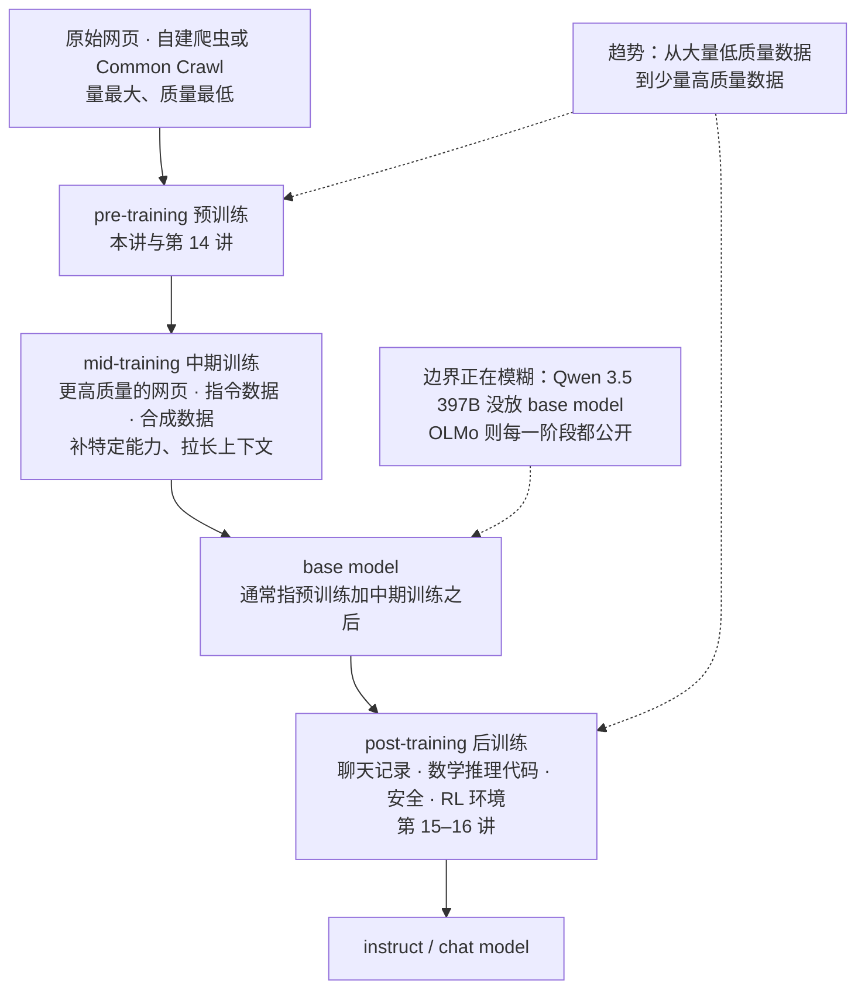
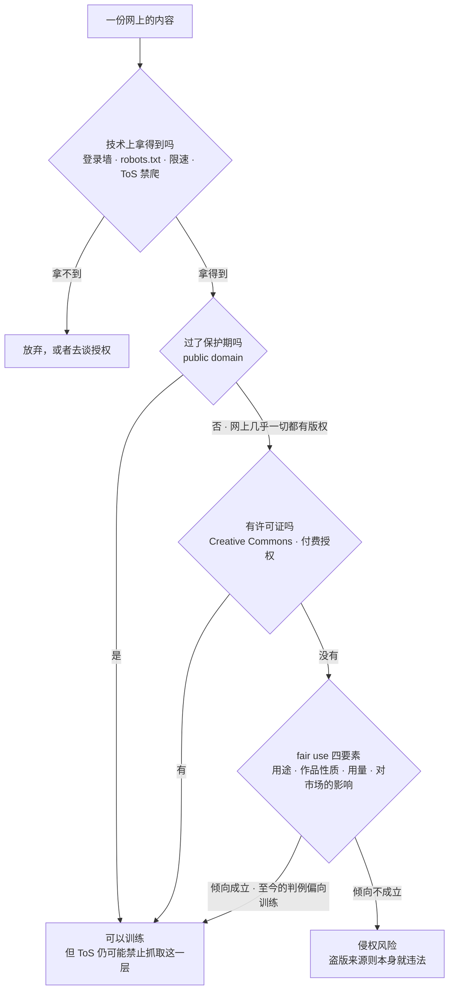
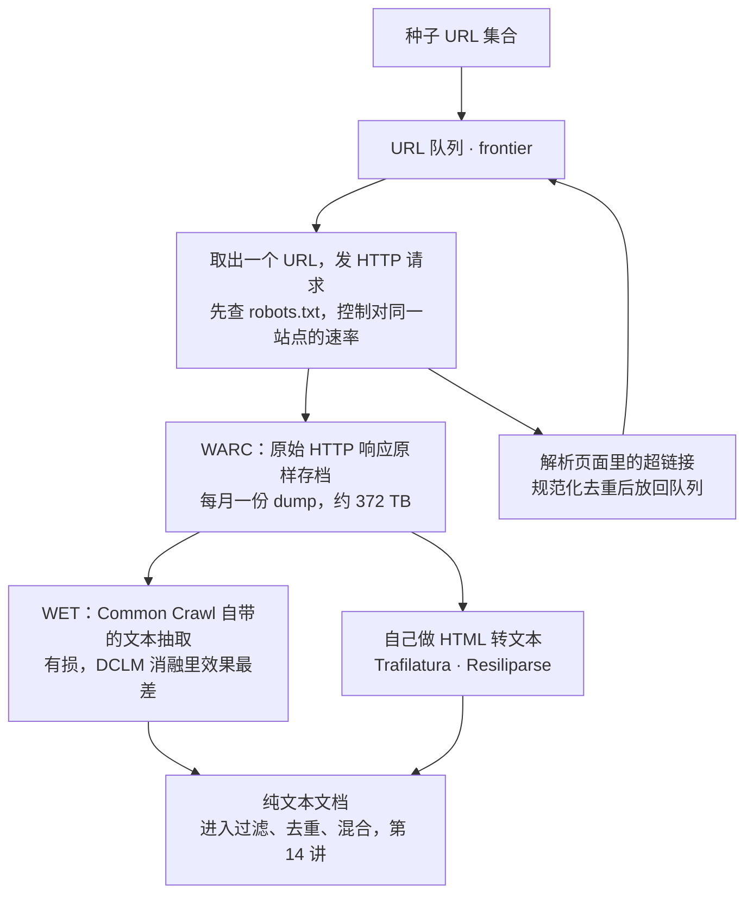
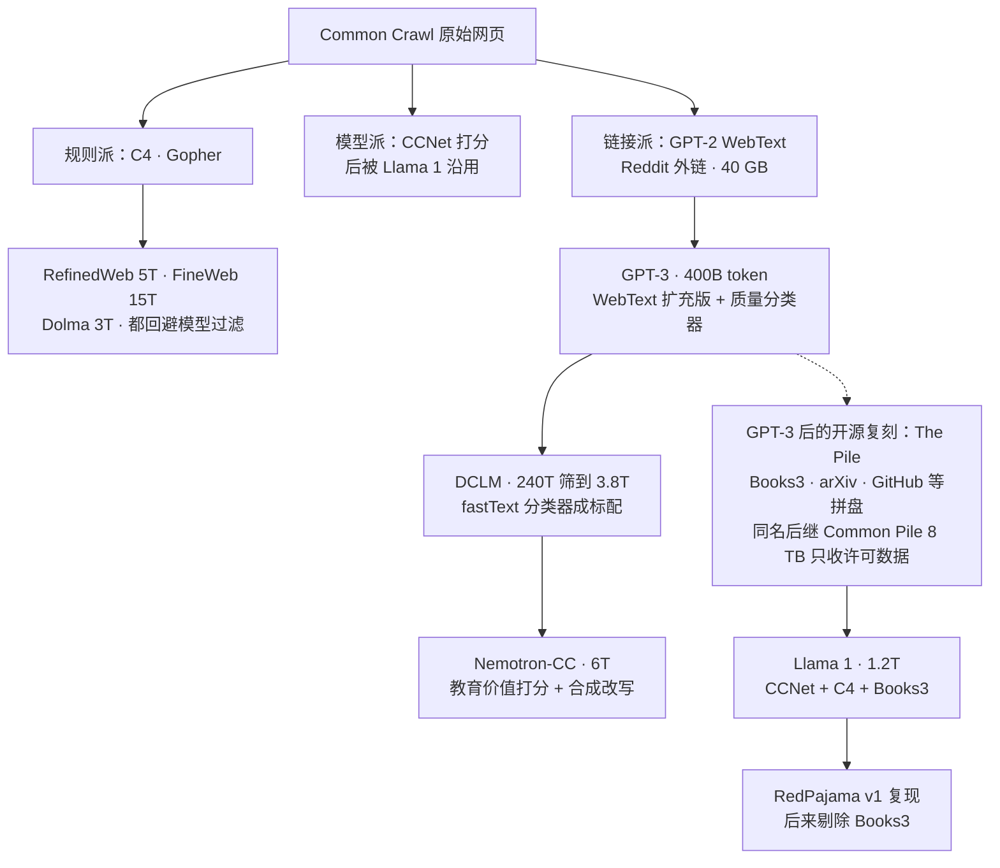
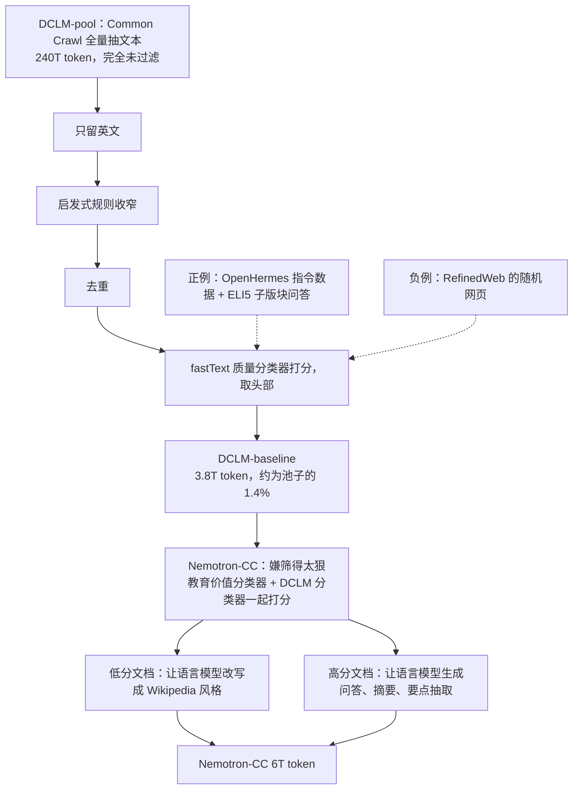
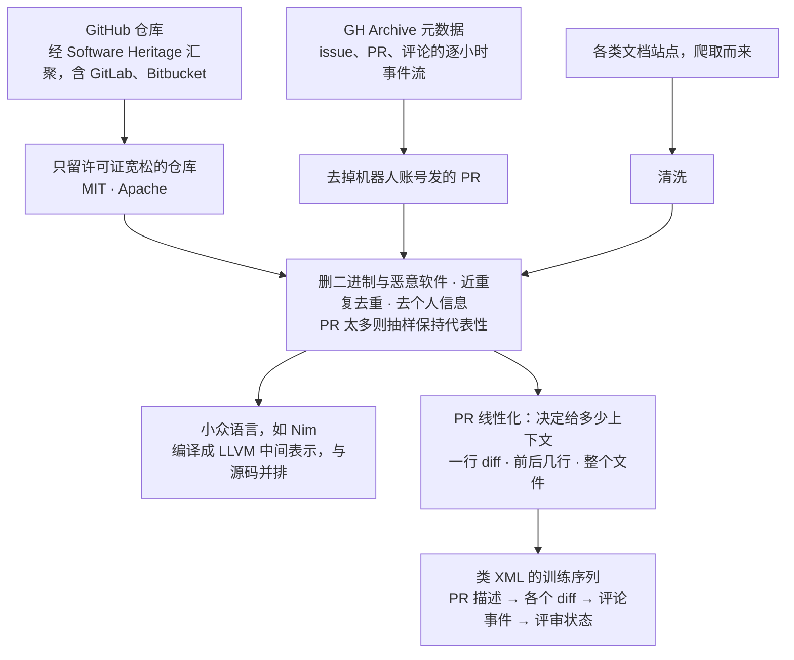

# CS336 第 13 讲｜数据（上）：来源与数据集（Data I: Sources, Datasets）

> Stanford CS336: Language Modeling from Scratch（2026 春）· 第 13 讲（课程表上是 2026 年 5 月 11 日）；数据单元的第一讲：第 12 讲讲了怎么评，这两讲回答"该在什么数据上训练"——本讲讲数据从哪来、各代数据集怎么造；第 14 讲讲过滤、去重、混合与合成数据
> 视频：<https://www.youtube.com/watch?v=-qm0ln33G24>（1:22:01；英文字幕为自动生成，数据集名、人名和缩写错得不少，见文末勘误）
> 讲者：Percy Liang（全程；开场说"按这门课的精神，从零讲起"，结尾预告"下次继续讲数据"并点到 assignment 4，与课程表一致）
> 课程主页：<https://stanford-cs336.github.io/>；本讲不围绕某一篇论文，而是串起一条开源数据集谱系：[C4](https://arxiv.org/abs/1910.10683) · [The Pile](https://arxiv.org/abs/2101.00027) · [RefinedWeb](https://arxiv.org/abs/2306.01116) · [Dolma](https://arxiv.org/abs/2402.00159) · [DCLM](https://arxiv.org/abs/2406.11794) · [Nemotron-CC](https://arxiv.org/abs/2412.02595) · [Common Pile](https://arxiv.org/abs/2506.05209)；法律部分的主线是 [Consent in Crisis](https://arxiv.org/abs/2407.14933)（Longpre et al., 2024）

**一句话**：数据是语言模型里最重要、也最少被公开的环节——Llama 3 论文把架构和训练流程写得一清二楚，数据只有一句"多种来源"，原因是竞争秘方和版权风险；所谓"在整个互联网上训练"并不成立，网络是一堆活服务器，能拿到的只是爬虫够得着、登录墙和 robots.txt 没挡住、terms of service 和许可证没禁止的那一部分，而且网上几乎一切内容都自动受版权保护，训练只能靠许可证或 fair use 的四要素，2025 年的 Anthropic 案给出的答案是"这次训练是 fair use，盗版书不是"（15 亿美元和解，约每本 3,000 美元）；实际的原料来自 Common Crawl（每月 30–50 亿页，一次 dump 约 372 TB）加上 Wikipedia、GitHub、arXiv 这些自带 dump 的高质量口袋，而从 2019 年的 WebText（40 GB）到 C4（156B token）、The Pile、Llama 1（1.2T）、RefinedWeb（5T）、FineWeb（15T）、DCLM（240T 的池子筛到 3.8T，约 1.4%）、Nemotron-CC（合成改写到 6T），每一代数据集的差别都在"怎么定义高质量"——规则、像不像 Wikipedia、Reddit 外链、还是训一个 fastText 分类器——这一步至今靠经验和 vibes，也正是第 14 讲和 assignment 4 的题目。

## 时间轴

| 时间 | 内容 |
|---|---|
| [0:05](https://www.youtube.com/watch?v=-qm0ln33G24&t=5s) | 开场：数据是最重要、也最少被公开的环节；Llama 3 论文对数据只字不提的两个原因；数据是长尾问题 |
| [2:09](https://www.youtube.com/watch?v=-qm0ln33G24&t=129s) | 数据出现在三个阶段：pre-training / mid-training / post-training；base model 与 instruct model；OLMo 全公开 |
| [4:41](https://www.youtube.com/watch?v=-qm0ln33G24&t=281s) | "在整个互联网上训练"不成立：网络是活服务器，得靠爬虫；动态内容、登录墙、robots.txt、Cloudflare、限速 |
| [9:19](https://www.youtube.com/watch?v=-qm0ln33G24&t=559s) | 法律层：terms of service 与许可证；Consent in Crisis：限制在 2023 年后陡增 |
| [11:21](https://www.youtube.com/watch?v=-qm0ln33G24&t=681s) | 爬虫一天打一百万次把网站压垮；影子图书馆 LibGen、Anna's Archive |
| [14:25](https://www.youtube.com/watch?v=-qm0ln33G24&t=865s) | 版权法：1709 / 1976；什么能受保护、门槛多低、保护多久；网上一切几乎都有版权 |
| [18:30](https://www.youtube.com/watch?v=-qm0ln33G24&t=1110s) | 合法使用的两条路：许可证（public domain、Creative Commons、付费）与 fair use 四要素 |
| [23:04](https://www.youtube.com/watch?v=-qm0ln33G24&t=1384s) | fair use 的例子：Google Books 案；版权不等于逐字记忆；对语言模型意味着什么 |
| [27:15](https://www.youtube.com/watch?v=-qm0ln33G24&t=1635s) | 判例现状：NYT 诉 OpenAI、Anthropic 案 15 亿美元和解、Meta 案；问答：许可证事后变更 |
| [32:04](https://www.youtube.com/watch?v=-qm0ln33G24&t=1924s) | Common Crawl：2007 年起每月 30–50 亿页；爬虫就是图遍历；WARC 与 WET；HTML 转文本的工具很要紧 |
| [36:09](https://www.youtube.com/watch?v=-qm0ln33G24&t=2169s) | 三个高质量口袋：Wikipedia（dump 投毒）、GitHub（GH Archive、Software Heritage）、arXiv |
| [43:30](https://www.youtube.com/watch?v=-qm0ln33G24&t=2610s) | 问答：模型生成的数据能不能用；爬取里混进盗版书怎么办 |
| [45:03](https://www.youtube.com/watch?v=-qm0ln33G24&t=2703s) | 数据集谱系 I：BERT 的 BooksCorpus、GPT-2 的 WebText、CCNet、C4、GPT-3 |
| [53:47](https://www.youtube.com/watch?v=-qm0ln33G24&t=3227s) | 数据集谱系 II：The Pile（Books3、Gutenberg、Stack Exchange、Enron）、Gopher 的 MassiveWeb |
| [59:21](https://www.youtube.com/watch?v=-qm0ln33G24&t=3561s) | Llama 1 的数据表与 RedPajama；"网络就够了"的 RefinedWeb → FineWeb；Dolma |
| [1:04:29](https://www.youtube.com/watch?v=-qm0ln33G24&t=3869s) | DCLM：240T 的池子筛到 1.4%，fastText 分类器；Nemotron-CC：教育价值打分与合成改写，6T |
| [1:10:45](https://www.youtube.com/watch?v=-qm0ln33G24&t=4245s) | 代码：The Stack v1 → v2，PR 怎么线性化；Common Pile：只用许可数据能走多远 |
| [1:19:30](https://www.youtube.com/watch?v=-qm0ln33G24&t=4770s) | 小结：数据不会从天上掉下来；过滤是 200T 到 3T 的大缩减；下一讲 |

## 核心内容

### 1. 为什么先讲数据：最重要，却最少被谈起



*图 13-1｜数据进入训练流程的三个阶段，以及每个阶段喂的是什么（自绘示意）· [▶ 看原幻灯片 2:09](https://www.youtube.com/watch?v=-qm0ln33G24&t=129s)*

- **本讲的位置**：前面十几讲解决的是"给定数据怎么训"，第 12 讲解决"怎么知道模型好不好"；这两讲回答"该在什么数据上训"。讲者的立场很直接：数据是语言模型里最该做对的一件事。
- **证据是各家的沉默**：Llama 3 是 open-weight 模型，论文对架构完全透明，连训练流程都写了，唯独数据只有一句"来自多种来源"（[0:36](https://www.youtube.com/watch?v=-qm0ln33G24&t=36s)）。保密有两个理由：数据是竞争的秘方，不想让对手知道自己在做什么；以及版权责任——说了训练了什么，就可能被告。
- **数据工作从来没消失**：foundation model 之前，"做数据"等于为监督学习标注；现在预训练几乎不标注了，但清洗与整理的活一点没少。数据永远是瓶颈，因为它本质上是长尾问题，而且随人力线性扩展——架构和系统只容得下少数人，数据的活可以无限并行，所以各家的数据团队都很大。
- **三个阶段**（图 13-1）：预训练吃原始网页文档；mid-training 用更高质量的数据补特定能力、给长上下文；post-training 用聊天记录，做 RL 就用环境，越来越任务化。实际的界线很模糊，也可能不止三段，但这是基本模板；趋势是从"大量低质量"走向"少量高质量"。文献里的 base model 通常指预训练加中期训练之后，instruct / chat model 指后训练之后——可最新的大模型干脆不放 base model（讲者举 Qwen 3.5 397B：只有最终版，没有中间 checkpoint）。反过来 AI2 的 OLMo 每一阶段都公开，所以课上拿它当样本（[3:41](https://www.youtube.com/watch?v=-qm0ln33G24&t=221s)）：预训练是网页、学术论文、数学页面和证明；中期是更高质量的网页、指令数据和大量合成数据；后训练是聊天日志、更多的数学、推理和代码，安全也在这一步做。
- CME295 第 4 讲把这一段压成了一页（Common Crawl、GPT-3 的 300B token、Llama 3 的 15T）；这里把每个名字拆开看它是怎么来的。

### 2. "在整个互联网上训练"？——网络到底是什么，爬虫能碰到哪些

- **先过 type check**：互联网是一堆活着的服务器，你发一个请求、它回一个响应；模型没法"在服务器上训练"，除非它是个上网的 RL agent。稍准确的说法是"在公开的万维网上训练"——也不对，因为你拿到的只是某个爬虫的一份快照。
- **爬虫**：有人（不一定是你）写一个 crawler，从一个种子 URL 集合出发，边爬边发现新页面、下载。但爬不全，障碍分几层：

| 障碍 | 例子 | 性质 |
|---|---|---|
| 动态内容 / deep web | 现在很多网站是 app，URL 不再是内容的完整描述，得点按钮、提交表单；Discord 这类根本爬不到 | 技术 |
| 登录与付费墙 | Facebook、X、LinkedIn、New York Times：海量内容锁在 walled garden 里；只有平台自己能用——Meta 用 Facebook 的数据、xAI 用 X 的，别人不行 | 技术 + 合同 |
| robots.txt | 放在站点根目录，声明谁可以爬什么；nytimes.com 禁了一长串 AI 爬虫（OAI-SearchBot、PerplexityBot、ChatGPT-User、ClaudeBot……）；不是法律约束，是"好公民"约定：名字在名单上就别爬 | 约定 |
| 反爬 | Cloudflare 之类的机器人检测——你看到的验证码就是它判断你可能是机器人；封 IP 或封国家；限速 | 技术 |
| terms of service | 用网站等于接受一份合同，常写着"机器人走开""不得用于 AI 训练" | 法律 |
| 内容许可证 | 就算 ToS 没说，内容本身也可能没给你训练的许可（第 3 节） | 法律 |

- **限制在收紧**：Consent in Crisis（Longpre et al.）对常见数据集里的 URL 做纵向审计，同时看技术限制 robots.txt 和法律限制 ToS。图上（[10:19](https://www.youtube.com/watch?v=-qm0ln33G24&t=619s)）robots.txt 的"完全限制"到 2023 年之前一直平稳，2023 年中之后陡升到接近 50%；ToS 那张图，2016 年几乎没人给页面写条款，现在多数页面有，而且多数写着不能用于 AI。所以 2020 年还能爬到的互联网，今天能合法爬的部分小得多。
  > 小注：论文摘要的口径——2023 到 2024 一年之间，C4 里约 5% 以上的 token、或最活跃维护的关键来源的 28% 以上，被 robots.txt 完全限制；按 ToS 算，C4 的 45% 已受限。课上的"接近 50%"应是读的 ToS 那条线或头部站点那条线。
- **还没谈版权，爬虫已经会惹麻烦**：有站长抱怨 Anthropic 的爬虫 24 小时内打了它一百万次，Read the Docs 也被打爆（[11:52](https://www.youtube.com/watch?v=-qm0ln33G24&t=712s)）。违反 ToS 或 robots.txt 是一回事，纯粹把人家服务器压垮是另一回事——花的是别人的托管费，坏的是别人用户的体验。
  > 小注：应为 2024 年 7 月 iFixit 的公开抱怨（ClaudeBot 一天近百万次请求）和 Read the Docs 同期的博客（推断，讲者说忘了站名）。
- **影子图书馆**：LibGen、Anna's Archive 之类，完全无视版权、绕过付费墙，把本该付费的书和论文免费放出来；被下架、被诉，就把服务器搬到别的国家；主张"该自由的东西被解放了"，但法律上就是盗版和侵权。里面书和论文很多，第 3 节和第 7 节会再回到它。

### 3. 版权：什么受保护，怎样合法地用



*图 13-2｜"这份内容能不能拿来训练"的判断顺序：先技术、再保护期、再许可证、最后才是 fair use（自绘示意）· [▶ 看原幻灯片 18:30](https://www.youtube.com/watch?v=-qm0ln33G24&t=1110s)*

- **问题**：假设你守规矩——尊重 ToS、遵守限速——爬到了数据，能不能训练？这个问题没有完全解决，但过去一年有不少进展。它属于知识产权法，而这套法律的目的是激励智力创作，不是"技术上什么都不许"；四种形式里（copyright、patent、trademark、trade secret），和语言模型数据最相关的是版权。
- **版权是什么**：1709 年英国开始用版权来激励创作；美国的现代版权由 1976 年的 Copyright Act 定义，保护的是固定在任何有形媒介上的原创作品。几个要点：
    - 集合不受保护（电话簿，除非编排本身有创意）；保护的是表达不是想法——quicksort 算法没有版权，某个具体实现有。
    - 1976 年之后门槛大降：不需要发表、不需要登记，"固定下来"就行——写在网页上就自动有版权。要起诉才需要登记，65 美元，比律师费便宜得多。
    - 保护期讲者说是 75 年，到期进入 public domain，人人可用；理由是先保护创作者一阵子，过后再保护已无意义。
  > 小注：美国现行的保护期是作者终身加 70 年，雇佣作品是发表后 95 年或创作后 120 年取短者；"75 年"是课堂上的粗略说法。
- **结论**：互联网上的一切几乎都有版权。但"有版权"不等于"不能用"，两条路（图 13-2）：
    - **许可证**：合同法里 licensor 对 licensee 说"我不告你，你可以按许可的方式用"。Creative Commons（2001 年创立）让作品像 public domain 一样自由流通、不必等 75 年——Wikipedia、OpenCourseWare、Khan Academy 都是。没有 CC 的，有钱可以买：模型开发商和内容平台之间的授权交易已经不少。
    - **fair use**：Copyright Act 第 107 条——没有许可也可以用。四个要素，都是倾向不是硬规则，真上法庭要综合权衡：用途与性质（教育强于商业，转化性使用强于原样托管）；作品性质（事实性强于虚构性——一页二战史实比一首诗的保护弱）；用量（片段强于整本）；对原作市场的影响（替代了原作者的变现就不利，开辟新市场则有利）。最后这条回到版权的初衷：对齐经济激励。
- **例子**：看完电影写摘要；照着想法重新实现算法而不抄代码；Authors Guild 诉 Google——Google Books 展示受版权书籍的片段，打了 11 年，最终判 Google 胜（所以今天还能用它），这成了讨论"训练是不是 fair use"的先例。
- **对做 ML 的人可能陌生**：版权不是逐字记忆的问题。论文都盯着 verbatim memorization，可那只是侵权的一种——情节和角色也能受保护（Harry Potter 这个角色本身可以主张版权，不限于某一本书），而戏仿反而更可能是 fair use。版权讲的是语义和经济，不是 n-gram 重叠。
- **对语言模型的含义**（[25:10](https://www.youtube.com/watch?v=-qm0ln33G24&t=1510s)）：
    - 复制本身就可能侵权——copyright 这个词里就有 copy——哪怕复制完什么都不做。
    - 训练直觉上带有转化性：和原样托管明显不同，模型拿数据是手段不是目的，学的是世界怎么运作，不是那份具体表达。讲者强调这是直觉，不是既定事实。
    - 但语言模型确实会影响市场（第四要素），这一点对 fair use 不利。
    - 就算 fair use 或许可证成立，ToS 还是另一层：YouTube 的视频有许可，但 ToS 禁止用机器人下载或抓取。
- **判例现状**（[27:45](https://www.youtube.com/watch?v=-qm0ln33G24&t=1665s)）：
    - 2023 年 New York Times 诉 OpenAI：你用我们的新闻训练，证据是能让 ChatGPT 几乎逐字吐出文章。仍在审。
    - 诉 Anthropic：指控盗版了数百万本书来训 Claude。去年的标志性裁决：这一次的训练是 fair use；但盗版不行——这和训练无关，盗版本身违法。有意思的是 Anthropic 还买了书、拆掉书脊扫描数字化，法院说这是 fair use；但买了不能抵消之前的盗版。结果是 15 亿美元和解，约每本 3,000 美元。
    - 诉 Meta：你用我们的书训练——而且如第 7 节会看到，Llama 论文自己写了出来。紧随 Anthropic 案的判决：训练是 fair use；用种子下载书的部分仍待决，按先例看对 Meta 不利。
    - 小结：训练至今没有被判"不是 fair use"，但裁决都很窄，不能推广成"任何版权内容都能训"；盗版明确违法（本来就知道）；领域仍在快速演变。
  > 小注：三案应为 NYT v. Microsoft & OpenAI（2023 年 12 月起诉）、Bartz v. Anthropic（2025 年 6 月裁决、9 月和解）、Kadrey v. Meta（2025 年 6 月裁决）——推断，讲者没有报案名。
- **问答**：一份数据先有许可、后来许可变了怎么算？讲者先声明自己不是律师：先前许可覆盖的那批文档应该仍然可以训；但许可通常不只针对一批固定的文档——Reddit 这样的站点不断有新内容，许可变更意味着之后的内容不能再用。

### 4. 来源一：Common Crawl，以及一次爬取是怎么工作的



*图 13-3｜从种子 URL 到纯文本：爬取是图遍历，存档是 WARC，抽文本有自带的 WET 和更好的第三方工具两条路（自绘示意）· [▶ 看原幻灯片 33:35](https://www.youtube.com/watch?v=-qm0ln33G24&t=2015s)*

- **谁来爬**：多数模型开发商有自己的爬虫，为的是完全掌控数据。没有的可以用 Common Crawl：2007 年起每月一次爬取，每次 30–50 亿页，和上次有重叠但会刻意找新页面；官网说累计 3,000 亿页，讲者觉得偏大，按每月的量乘下来对不上。总共有多少 URL 没人说得清，Google 的索引按其自述至少 100 PB。一次 dump 讲者说约 20 亿页、372 TB（和前面的 30–50 亿略有出入，两处都按原话记），主要是文本，不含图片。
- **爬取概念上简单，细节全在实现**（图 13-3）：本质是图遍历——种子 URL 进队列，弹出、下载、抽出页面里的超链接、入队，多机并行。要做的决策：下载哪些页；尊重 robots.txt；别压垮服务器；网页会变，需要一个回访策略——常变的页面多回访，不变的别浪费；URL 是动态的——同一 URL 因浏览器状态不同给出不同内容，不同 URL 又常指向同一内容，不小心就大量重复，mirror 站点更是明摆着的重复。

```python
frontier = deque(seed_urls); seen = set(seed_urls)
while frontier:
    url = frontier.popleft()
    if not robots_allows(url, agent="my-bot") or rate_limited(host(url)):
        continue                                  # 好公民：看 robots.txt，别压垮同一台服务器
    resp = http_get(url)
    archive.write_warc(url, resp)                 # 原始响应原样存档，晚点再抽文本
    for link in extract_links(resp.html):
        if canonical(link) not in seen:           # 很多 URL 指向同一份内容
            seen.add(canonical(link)); frontier.append(link)
    schedule_revisit(url, change_rate(url))       # 常变的页面多回访
```

这就是讲者口中的"图遍历加一堆策略"：真正的难点不在循环本身，而在 robots.txt、限速、回访和去重这几行里。

- **两种格式**：WARC 是原始 HTTP 响应的存档——HTTP 就是"发一个带 URL 的 GET，回一个响应"，WARC 存的就是那个响应。Common Crawl 还多做一步，给出抽好文本的 WET 文件——这必然有损，而且不一定是用网络数据的最好方式。
  > 小注：Common Crawl 每次 dump 发三种文件：WARC（原始响应）、WAT（元数据）、WET（抽出的纯文本）；字幕里的 "WAT" 按上下文应为 WET。
- **HTML 转文本的工具本身有影响**：Trafilatura、Resiliparse 之类很多，而且怎么转真的会改变下游效果。DCLM 论文的消融（[35:39](https://www.youtube.com/watch?v=-qm0ln33G24&t=2139s)）拿 Common Crawl 自带的 WET 对比这两个工具，后者更好。

```python
from warcio.archiveiterator import ArchiveIterator
import trafilatura
for record in ArchiveIterator(open("CC-MAIN-xxxx-00000.warc.gz", "rb")):
    if record.rec_type != "response":                       # 只要 HTTP 响应，跳过请求与元数据记录
        continue
    if "text/html" not in record.http_headers.get_header("Content-Type", ""):
        continue
    html = record.content_stream().read()
    text = trafilatura.extract(html)                        # 去导航、广告、样板，只留正文
    if text:
        yield {"url": record.rec_headers.get_header("WARC-Target-URI"), "text": text}
```

读 WARC 的骨架：一条记录一个响应，正文抽取交给专门的工具——换成 WET 就等于把这一步交给 Common Crawl 替你做，而消融说明它做得不如你自己做。

### 5. 来源二：三个高质量的"口袋"——Wikipedia、GitHub、arXiv

- **网络不是均匀的**：不是随机抽一部分网站就成了数据集，有些角落质量特别高，讲者挑了三个。
- **Wikipedia**（2001 年起，各语言共 6,700 万篇）：不允许原创研究，一切都要有引用，所以理论上"不含网上没有的东西"——但它引用书，书拿不到，所以 Wikipedia 依然极好；条目有 notability 门槛。谁都能编辑，破坏会被管理员或机器人回滚；和任何 peer production 系统一样，少数人做了大部分工作（某位编辑有 500 万次编辑）。每隔几周做一次 dump 供整包下载——别去爬 Wikipedia，他们也不希望你爬。
    - **dump 投毒**（Carlini 等，[38:46](https://www.youtube.com/watch?v=-qm0ln33G24&t=2326s)）：以为破坏总会被回滚就安全？dump 有固定节奏，在 dump 前一刻编辑，编辑随后被回滚，但 dump 里已经带上了恶意内容。能往训练页面注入内容，就能让模型对某个触发词（比如 iPhone）产生负面情感。教训：一旦考虑对手，所谓高质量来源也可能有毒。讲者说此事后来已修复。
- **GitHub**（2008 年起，和 Common Crawl 同龄；4.2 亿个仓库，2,800 万公开）：代码不只是为了写代码的能力，也为了通用推理。一个仓库不是一个文件，是带提交历史、issue、PR、评论的目录；代码重复极多，因为复制和 fork。GitHub 认可在许可宽松（MIT、Apache）的公开仓库上训练。两类数据：仓库本身走 git 协议下载，别去抓网页；元数据（issue、PR 等）来自 GH Archive——逐小时快照的事件流，每一条评论、star、动作都有记录。Software Heritage 专注仓库而非元数据，把 GitHub、GitLab、Bitbucket 等汇聚在一起。
- **arXiv**（1991 年起，从物理开始；300 万篇投稿，每篇有元数据、PDF、可选的 LaTeX 源）："在 arXiv 上训练"是什么意思并不显然——PDF 要转文本，或者用一堆 LaTeX 文件。不是同行评审但有审核；作者可以保留权利或选 CC，所以许可非常清楚：元数据一律宽松许可，论文挑 CC 的下载（讲者说多数是 CC）；同样是批量下载，不爬。
- **问答**（[43:30](https://www.youtube.com/watch?v=-qm0ln33G24&t=2610s)）：模型生成的数据有没有限制？短答案：大概可以，第 11 节和下一讲再谈。爬取里混进盗版书站怎么办？看不完所有网站，保证不了——Common Crawl 里多半有不该训的受版权的书和内容，只能诉诸 fair use；书和网页在版权上没有本质区别，都受保护，只是出版了的书作者上法庭更容易维权。要真谨慎，有一条路，第 11 节讲（Common Pile）。

### 6. 数据集谱系 I（2018–2020）：BERT、WebText、CCNet、C4、GPT-3



*图 13-4｜开源预训练数据集的谱系：三种"高质量"的定义各成一脉，The Pile 是拼盘支线；GPT-3 到 DCLM 的"分类器思路"和 The Pile 到 Common Pile 的承接为推断（自绘示意）· [▶ 看原幻灯片 45:03](https://www.youtube.com/watch?v=-qm0ln33G24&t=2703s)*

- **BERT**（2018）：Wikipedia 加 books。books 来自 Smashwords——谁都能上传出版电子书的网站，2024 年约 50 万本；2015 年一篇论文把免费的那些抓下来做成语料，那是"没人在意"的年代。这份 BooksCorpus 在学界流传多年，后因违反 ToS 下架——免费能拿到，不等于合法能用。BERT 的另一点：序列是文档而不是句子，此前的语言建模研究都以句子为单位。
- **GPT-2 的 WebText**（2019，[47:06](https://www.youtube.com/watch?v=-qm0ln33G24&t=2826s)）：想要高质量网页，Common Crawl 太脏。点子很巧：取 Reddit 上 karma 大于 3 的帖子的外链——好帖子必然链向好网站。得到 40 GB 文本。从未发布，但有开源复现 OpenWebText，用得很多。
  > 小注：GPT-2 报告的数字是 4,500 万条链接、约 800 万篇文档、40 GB；字幕里的"一百万页"应是听错。
- **CCNet**（当时的 Facebook）：目标是为预训练造大而高质量的数据集，尤其关心低资源语言，所以不要只对英语有效的手工流程。做了去重、语言识别（训一个分类器只留目标语言）；质量过滤的想法是留下"像 Wikipedia"的文档——在 Wikipedia 上训一个语言模型，给新文档打分：

$$
\mathrm{PPL}_{\mathrm{wiki}}(d)=\exp\Big(-\frac{1}{|d|}\sum_{t=1}^{|d|}\log p_{\mathrm{wiki}}(x_t\mid x_{<t})\Big)
$$

d 是一篇文档，x_t 是它的第 t 个 token，p_wiki 是只在 Wikipedia 上训的语言模型（应为 n-gram 模型，推断）；困惑度越低越像 Wikipedia，按它排序留头部。这样筛出的数据量远大于 Wikipedia 本身，效果也超过只在 Wikipedia 上训练；这个工具后来在别的论文里反复出现。

- **C4**（Google，2019，[49:40](https://www.youtube.com/watch?v=-qm0ln33G24&t=2980s)）：出自 T5 论文——那篇更出名的是"把所有 NLP 任务都当 text-to-text"，但这份很长的报告里很大一块贡献是 C4。当时的共识：Common Crawl 对自然语言基本没用，直接训就是垃圾；问题是怎么从这团糟里挖一个又大又干净的子集。C4 的路线是定一堆规则，结果相当有效——留以标点结尾、超过五个词的行；删少于三句的页面；删含脏词的页面；删 terms of use 之类的样板；删含花括号的页面（顺手滤掉了代码，可见当时没想过代码模型）；只留英文。

```python
def c4_keep(page):
    lines = [l for l in page.text.split("\n")
             if l.rstrip().endswith((".", "!", "?", '"')) and len(l.split()) >= 5]
    if len(lines) < 3:                                   # 页面太短
        return None
    doc = "\n".join(lines)
    if "{" in doc or has_bad_words(doc) or "terms of use" in doc.lower():
        return None                                      # 花括号顺手滤掉了代码
    if lang_id(doc) != "en":
        return None
    return doc
```

规则派的全部家当就这几行 if；它便宜、可解释、可控，代价是"好文本"被定义成了"长得像英文散文的文本"。

- C4 的结果是 156B token、800 GB，远大于 GPT-2 的 40 GB。后来的分析（[51:11](https://www.youtube.com/watch?v=-qm0ln33G24&t=3071s)）看了 C4 里有哪些网站：Wikipedia 不少，专利站点占比很高。同一篇论文还做了一个 WebText 式的数据集（同样用 Reddit 上 karma 大于 3 的外链）：用 12 个 Common Crawl dump 只得到 17 GB——WebText 是 40 GB，说明 Common Crawl 并不完整；用这些数据在一批 NLP 基准上有提升。
- **GPT-3**（[52:43](https://www.youtube.com/watch?v=-qm0ln33G24&t=3163s)）：Common Crawl 自己处理，加上扩充版的 WebText、Books1 和 Books2（论文只说"基于互联网的书籍语料"，至今是谜）、Wikipedia；约 500 GB、400B token。处理 Common Crawl 时训了一个质量分类器，区分"他们认为的高质量"和其余；WebText 和 Common Crawl 有重叠，做了模糊去重。
  > 小注：GPT-3 论文的表里各来源合计约 500B token（过滤后的 Common Crawl 约 410B），实际训练用了 300B token——CME295 第 4 讲说的就是这个 300B；课上的"400B"应是指 Common Crawl 那一项。
- **到这里已有四种"高质量"的定义**：规则（C4）、像 Wikipedia（CCNet）、Reddit 外链（WebText）、自训分类器（GPT-3）。后面的每个数据集都是在这四种里选一种或混着用。

### 7. 数据集谱系 II（2020–2023）：The Pile、Gopher、Llama 1、RedPajama

- **The Pile**（EleutherAI，[54:17](https://www.youtube.com/watch?v=-qm0ln33G24&t=3257s)）：GPT-3 之后的开源运动之一，草根项目——一群人在 Discord 上凑高质量来源，凑出一份至今仍有意思、很多样的清单：Pile-CC、PubMed、Books3、arXiv、GitHub、Wikipedia、IRC 聊天记录、另一份书籍语料、哲学论文、Enron 邮件……Enron 2002 年破产，邮件被公开，成了少有的邮件数据集——对"邮件"来说分布很怪，但只有这个。
    - **书**：Project Gutenberg 1971 年起，只收有版权许可的书，基本是 public domain；打包成 PG-19（2019 年前的 Gutenberg），既然要等 75 年才进 public domain，2019 年前的差不多就是全部。Books3（[55:47](https://www.youtube.com/watch?v=-qm0ln33G24&t=3347s)）：来自影子图书馆 Bibliotik 的 20 万本书，"你喜欢的作者都在"；2020 年没人在意，大家拿来训模型；现在已下架，不能再用、也不该再用。
    - **Stack Exchange**：2008 年起的用户问答。格式本身就接近真实应用——预训练数据不都是 Wikipedia 那种"原始文本"，网上本来就存在长得像监督数据的东西，也许正是这类数据教会了模型某些问答行为，"不是什么都神奇地涌现"。元数据（投票数）可用于过滤；同样是 dump 下载，不用爬。
- **Gopher**（DeepMind，2021，[57:49](https://www.youtube.com/watch?v=-qm0ln33G24&t=3469s)）：模型没发布，后来被 Chinchilla 取代（第 9 讲），但数据描述写得很好，值得读——除了不告诉你数据里有什么的那部分。自建 MassiveWeb，加 C4、书、新闻、GitHub、Wikipedia（后几样怎么来的没说）。MassiveWeb 只留英文、去重，质量过滤用手工规则，理由是可控。到这里"规则派"和"分类器派"的分野已经很清楚。文本量巨大，模型只训了其中很小一部分。
- **Llama 1**（[59:51](https://www.youtube.com/watch?v=-qm0ln33G24&t=3591s)）：论文好在把数据处理写清楚了——大概是最后一个非开源却谈数据的模型。Common Crawl 用 CCNet 处理，但分类目标换成"页面是否被 Wikipedia 引用"，而不是"像不像 Wikipedia"——Wikipedia 文章可能太程式化，它引用的那些页面想必是好的；加 C4；GitHub 只取宽松许可；Wikipedia；Books3 和 Project Gutenberg；arXiv 用 LaTeX 源处理；Stack Exchange。合计 1.2T token。Books3 让他们惹了大麻烦——向全世界宣布"我用了这个"，一查来自 The Pile，再查来自影子图书馆，这就是后来没人再谈数据的原因。数据集没发布，但描述足够详细，Together 的 RedPajama v1 复现了它；RedPajama 起初也含 Books3，后来剔除——早年一个版权决定，影响是分水岭式的。
  > 小注：Llama 1 论文发表于 2023 年 2 月；讲者口误说 2022。

### 8. "网络就够了"：RefinedWeb → FineWeb → Dolma

- **RefinedWeb**（[1:01:53](https://www.youtube.com/watch?v=-qm0ln33G24&t=3713s)）：立论是"web data is all you need"——网络本身就是一切，何必再要 GitHub、arXiv、Stack Exchange 那些专项来源？做法：把 HTML 转文本做好；用 Gopher 规则过滤（基本是"留下像英文的"）；明确说避免 ML 过滤，怕引入偏差、把网络筛成过窄的子集；去重。5T token，发布了约 600B。
- **FineWeb**（Hugging Face）：复现 RefinedWeb 并改进——当时所有 Common Crawl dump 全用；仍用手工规则（同样为了不注入偏差）；去重；去 PII；15T token。数据集尺寸在快速增长。
- **Dolma**（AI2，[1:03:26](https://www.youtube.com/watch?v=-qm0ln33G24&t=3806s)）：自己处理的 Common Crawl，加 The Stack（第 10 节）、C4、Reddit（来自 Pushshift 项目——那时还拿得到，后来锁上了），以及 AI2 自家爬的学术论文库 Semantic Scholar 派生的数据集。Common Crawl 的处理：语言识别用模型，质量过滤仍回避模型，毒性用规则加分类器。3T token。
- 三者的共同点：规则派的顶点——数据越做越大（5T → 15T），但"什么是好文本"仍由人手写的规则定义，理由都是怕分类器把网络筛歪。

### 9. 模型打分成为常态：DCLM 与 Nemotron-CC



*图 13-5｜DCLM 的漏斗，以及 Nemotron-CC 怎么用合成数据把筛掉的部分补回来（自绘示意）· [▶ 看原幻灯片 1:05:02](https://www.youtube.com/watch?v=-qm0ln33G24&t=3902s) · 出处：[Li et al., 2024](https://arxiv.org/abs/2406.11794)*

- **DCLM（DataComp-LM）是转折点**：模型打分的质量过滤从此成了主流。初衷是定义一条标准流水线，让人用统一的方式比较各种数据方法；实际上大家主要是拿它发布的数据集训模型。
- **漏斗**（图 13-5）：把 Common Crawl 全量抽成 DCLM-pool，240T token，完全未过滤——比任何人实际训练的 token 都多，但大多低质。然后只留英文、规则收窄、去重、模型过滤，最后剩 1.4%，也就是 3.8T token，效果相当好。
- **分类器的训练"有点怪但有效"**（[1:06:05](https://www.youtube.com/watch?v=-qm0ln33G24&t=3965s)）：正例是 OpenHermes（GPT-4 生成的指令数据）和 ELI5（Reddit 上"像我五岁一样解释"子版块的问答）；负例随机取自 RefinedWeb——"基本就是网络"；训一个 fastText，也就是线性分类器：

$$
s(d)=\sigma\!\left(w^{\top}\phi(d)+b\right),\qquad \text{keep } d \iff s(d)\ge\tau
$$

φ(d) 是文档 d 的词与 n-gram 词袋向量，w、b 是学出来的权重和偏置，σ 是 sigmoid，s(d) 就是"像正例"的概率，τ 是保留阈值；模型简单到极点，关键全在正例的选择——它在替你定义什么叫高质量。

```python
pos = load("OpenHermes-2.5") + load("r/explainlikeimfive")   # 想要的样子：指令回答 + 通俗问答
neg = sample(refinedweb, n=len(pos))                         # 不想要的样子：普通网页
clf = fasttext.train_supervised(labeled(pos, "good") + labeled(neg, "bad"))
scores = [clf.predict(doc)["good"] for doc in dedup(rules_filter(english(pool)))]
keep = top_fraction(scores, tau)                             # 按分数取头部，阈值是超参数
```

这个"神奇的"分类器胜过他们试的其他方法，一度成为开源社区质量过滤的金标准。

- **算一下**：

$$
\frac{3.8\,\mathrm{T}}{240\,\mathrm{T}}\approx 1.6\%
$$

3.8T 是 DCLM-baseline 的 token 数，240T 是池子；和课上说的 1.4% 同一量级——每六七十个 token 才留一个，过滤才是数据流水线里最大的一刀。

- **Nemotron-CC**（NVIDIA，[1:07:39](https://www.youtube.com/watch?v=-qm0ln33G24&t=4059s)）：DCLM 筛得太狠，扔掉了绝大多数，只剩 3.8T，而我们要更多 token。办法更"讲究"：让现有的语言模型按"教育价值"给网页打分，造出标签，训一个 fastText 分类器；再加上 DCLM 的分类器；然后大举合成——讲者说这大概是最早真正把合成数据用于预训练的主要数据集之一：分类器判为低质的，让模型改写成更像 Wikipedia 的样子；高质的，让模型据此生成各种任务（给一篇 Wikipedia 文章生成问答、"请总结这份文档"、抽取关键信息）。6T token，比 DCLM 大不少；高质量子集打败此前的数据集。
  > 小注：论文摘要写的是 6.3T token，应为约 4.4T 全局去重后的原文加约 1.9T 合成文本；讲者的"6T"是取整。
- **参照系**：Llama 3 训了 15T，Qwen 3 训了 36T。但"token 数"不一定是"独特 token"：论文里的数常包含重复——跑两个 epoch 就是两倍，看这些数要小心（第 9、11 讲的 scaling law 里 D 指的是训练 token，不是独特 token）。

$$
D_{\mathrm{reported}}=\sum_{i} e_i\,D_i^{\mathrm{unique}}
$$

D_i^unique 是第 i 个来源的独特 token 数，e_i 是它被重复的 epoch 数；论文报告的训练 token 是二者乘积之和，所以 36T 未必意味着见过 36T 不同的文本。

- **过滤方法一览**：都长得差不多——拿一份网络爬取，要么用规则，要么用模型；用模型就得先定义"什么是好数据"，训分类器，给所有文档打分再选。权衡：240T 的低质，还是 1T 的高质，甜点在中间的某处。

### 10. 代码：The Stack v1 → v2，以及怎么把 PR 变成序列



*图 13-6｜The Stack v2 的三路来源、清洗步骤，以及把非线性的 PR 元数据压成训练序列的两个设计点（自绘示意）· [▶ 看原幻灯片 1:11:47](https://www.youtube.com/watch?v=-qm0ln33G24&t=4307s) · 出处：[Lozhkov et al., 2024](https://arxiv.org/abs/2402.19173)*

- **The Stack v1**（[1:11:17](https://www.youtube.com/watch?v=-qm0ln33G24&t=4277s)）：到 2022 年已经清楚代码很重要，这个项目想做一份真正好的代码数据集。做法：克隆 1.37 亿个仓库，只留宽松许可的，去近重复，得到 3 TB 代码。
  > 小注：The Stack 论文摘要写的是 3.1 TB、30 种编程语言。
- **v2**（2024，图 13-6）：加了元数据（issue、评论、PR，来自 GH Archive）、Software Heritage 的仓库、爬取的各类文档。处理：删二进制文件、删恶意软件、过滤机器人（尤其 PR 里大量是机器人发的）、去重、去 PII；PR 太多就抽样，保持代表性和可管理的规模。一个巧点子：编程语言也有长尾——Python、C 很多，Nim 这种小众语言很少；把代码编译成 LLVM 中间表示（C 编译器等都能出这个），把小众语言的源码和它的 IR 并排放，让模型学到"共享的低层表示（数据多）"和"小众语言（数据少）"之间的映射。v2 主要是代码，再加了些别的，用来训他们的代码模型。
- **PR 怎么变成序列**（[1:14:19](https://www.youtube.com/watch?v=-qm0ln33G24&t=4459s)）：PR 和它的元数据天然不是线性序列，要设计线性化。第一个决定是给多少上下文——一个事件可能只改了一行，但要学会它，可能需要前后几行、甚至整个文件。最终的训练 token 长成类 XML 的结构：先是 PR，然后一串 diff，评论则以事件的形式出现（评论发布、评审状态变化）。模型学的不只是写代码，还有代码周围的软件开发过程。

### 11. 只用许可数据能走多远：Common Pile

- **态度**：几乎一切都有版权，只有一部分是宽松许可或 public domain，fair use 又没定论；极度厌恶风险的人会说"不确定就是不行"。Common Pile 就是这个态度的产物：只用许可数据能走多远？
- **翻遍互联网找许可数据**（[1:15:53](https://www.youtube.com/watch?v=-qm0ln33G24&t=4553s)）：The Stack v2 的代码；政府会议记录（很多是宽松许可）；wiki；一些网页；一些新闻站；学术论文；在线论坛；public domain 的作品；教育资源……共 8 TB，对许可数据来说相当可观。
- **比看上去难得多**：不是看一眼许可证写着 Apache 或 CC 就行。
    - **license laundering**：人们对许可证很随意，把受版权的东西贴个 CC BY 就放上网——谁都能这么写，很难辨真假。
    - **集合的许可不覆盖单件**：Dolma 是宽松许可的集合，但集合的许可不延伸到每一篇文档（集合本身能否有版权、能否贴许可是另一回事）。Hugging Face 上很多数据集标着宽松许可，往下挖到单件就不是了。
    - **放弃合成数据**：用未许可数据训出的模型（哪怕权重是 MIT 开源）生成的数据，法律上不清楚——诚实地说有点 data laundering。这也回答了第 5 节的问答。
- **结果**（[1:18:27](https://www.youtube.com/watch?v=-qm0ln33G24&t=4707s)）：与 Llama 1、MPT、Qwen 等比较，一批基准上"不差"：肯定不如 Qwen，但胜过 2023 年那批老模型。讲者的结论：能做得不错，但不上更多 token 很难竞争；这不是终局，许可数据里应该还能榨出更多。
  > 小注：论文的模型叫 Comma v0.1，7B 参数，分别在 1T 和 2T token 上训练；和它比的 Qwen 是用几十 T token 训的，差距里有相当一部分是 token 数量的差距。

### 12. 小结与下一讲

- **数据不会从天上掉下来**，也不是上 Hugging Face 点下载就完事：网站给 dump 或有人建爬虫，才有原料；过滤、转换、去重，每一步都影响最终模型，其中过滤是最大的一刀——从 200T 到不到 3T（[1:20:31](https://www.youtube.com/watch?v=-qm0ln33G24&t=4831s)）。
- **数据是区分语言模型的关键**：架构大同小异（第 3 讲），数据处理能拉开差距；法律与伦理问题比一讲能讲的多。
- **过程很乱，靠 vibes**：不像课程其他部分基于第一性原理，数据处理现在是定个分类器、定条规则、设个阈值，改进空间很大——做 assignment 4 时想想有没有更好的办法，也许就是研究方向。下一讲继续讲数据：后训练数据，以及更多的过滤。

## 关键图表速查（点时间戳跳到原幻灯片）

| 图 | 看什么 | 跳转 | 出处 |
|---|---|---|---|
| Llama 3 论文的"数据"段 | 架构、训练流程写得很细，数据只有一句"多种来源" | [0:36](https://www.youtube.com/watch?v=-qm0ln33G24&t=36s) | [Llama 3](https://arxiv.org/abs/2407.21783) |
| OLMo 的三阶段数据表 | 预训练：网页、论文、数学；中期：高质量网页、指令、合成；后训练：聊天、数学推理代码、安全 | [3:41](https://www.youtube.com/watch?v=-qm0ln33G24&t=221s) | [OLMo](https://allenai.org/olmo) |
| nytimes.com 的 robots.txt | 一长串被禁的 AI 爬虫名；它不是法律，是约定 | [7:49](https://www.youtube.com/watch?v=-qm0ln33G24&t=469s) | — |
| Consent in Crisis 两张图 | 上图 robots.txt 的红色"完全限制"在 2023 年中陡升到近 50%；下图 terms 从 2016 年几乎没有到现在多数都有 | [10:19](https://www.youtube.com/watch?v=-qm0ln33G24&t=619s) | [Longpre et al., 2024](https://arxiv.org/abs/2407.14933) |
| 判例表 | NYT 诉 OpenAI 待决；Anthropic 案训练 fair use 但盗版不行，15 亿美元和解；Meta 案训练 fair use，种子下载待决 | [27:15](https://www.youtube.com/watch?v=-qm0ln33G24&t=1635s) | — |
| Common Crawl 的数字 | 每月 30–50 亿页、累计 3,000 亿页（讲者存疑）、一次 dump 约 372 TB | [32:34](https://www.youtube.com/watch?v=-qm0ln33G24&t=1954s) | [Common Crawl](https://commoncrawl.org/) |
| WARC 与 WET | WARC 是原始 HTTP 响应，WET 是有损的文本抽取 | [35:08](https://www.youtube.com/watch?v=-qm0ln33G24&t=2108s) | — |
| DCLM 的 HTML 转文本消融 | WET 对比 Trafilatura、Resiliparse：抽取工具本身改变下游效果 | [35:39](https://www.youtube.com/watch?v=-qm0ln33G24&t=2139s) | [Li et al., 2024](https://arxiv.org/abs/2406.11794) |
| Wikipedia 投毒 | 在定期 dump 之前的窗口编辑，回滚来不及，dump 里已经带毒 | [38:46](https://www.youtube.com/watch?v=-qm0ln33G24&t=2326s) | [Carlini et al., 2023](https://arxiv.org/abs/2302.10149) |
| C4 的规则清单与网站分析 | 规则逐条：标点、词数、句数、脏词、样板、花括号、英文；后来的分析里专利站点占比很高 | [50:40](https://www.youtube.com/watch?v=-qm0ln33G24&t=3040s) | [Raffel et al., 2019](https://arxiv.org/abs/1910.10683) · [Dodge et al., 2021](https://arxiv.org/abs/2104.08758) |
| The Pile 的来源清单 | Pile-CC、PubMed、Books3、arXiv、GitHub、Wikipedia、IRC、哲学论文、Enron 邮件…… | [54:17](https://www.youtube.com/watch?v=-qm0ln33G24&t=3257s) | [Gao et al., 2020](https://arxiv.org/abs/2101.00027) |
| Llama 1 的数据表 | 各来源一览，Books3 赫然在列；合计 1.2T token | [59:51](https://www.youtube.com/watch?v=-qm0ln33G24&t=3591s) | [Touvron et al., 2023](https://arxiv.org/abs/2302.13971) |
| DCLM 漏斗 | 240T → 英文 → 规则 → 去重 → 分类器 → 1.4%；分类器正例是 OpenHermes 加 ELI5 | [1:05:02](https://www.youtube.com/watch?v=-qm0ln33G24&t=3902s) | [Li et al., 2024](https://arxiv.org/abs/2406.11794) |
| Stack v2 的 PR 线性化样例 | 类 XML：PR、一串 diff、评论事件、评审状态 | [1:14:19](https://www.youtube.com/watch?v=-qm0ln33G24&t=4459s) | [Lozhkov et al., 2024](https://arxiv.org/abs/2402.19173) |
| Common Pile 的对比表 | 比 2023 年的 Llama 1、MPT 强，比 Qwen 弱 | [1:18:27](https://www.youtube.com/watch?v=-qm0ln33G24&t=4707s) | [Kandpal et al., 2025](https://arxiv.org/abs/2506.05209) |

## 提到的工作

| 名称 | 在本讲里的作用 |
|---|---|
| [Llama 3](https://arxiv.org/abs/2407.21783)（2024） | "只谈架构不谈数据"的样本；训练 15T token 的参照系 |
| [OLMo](https://allenai.org/olmo)（AI2） | 每一阶段的数据都公开的模型，课上用它展示三阶段各喂什么 |
| Qwen 3.5 397B · [Qwen 3](https://arxiv.org/abs/2505.09388) | 前者是"不放 base model"的例子；后者训练 36T token 的参照系 |
| [Consent in Crisis](https://arxiv.org/abs/2407.14933)（Longpre et al., 2024） | robots.txt 与 ToS 的纵向审计：限制在 2023 年后陡增 |
| LibGen · Anna's Archive · Bibliotik | 影子图书馆；Books3 的来源 |
| Authors Guild 诉 Google | Google Books 片段展示，11 年后判为 fair use；训练是否 fair use 的先例 |
| NYT 诉 OpenAI · Anthropic 案 · Meta 案 | 判例现状：训练被判 fair use，盗版不是；15 亿美元和解 |
| [Common Crawl](https://commoncrawl.org/) | 2007 年起的公共爬取，每月 30–50 亿页；WARC / WET 两种格式 |
| [Trafilatura](https://trafilatura.readthedocs.io/) · [Resiliparse](https://resiliparse.chatnoir.eu/) | HTML 转文本的工具；DCLM 消融里都优于自带的 WET |
| [Poisoning Web-Scale Training Datasets](https://arxiv.org/abs/2302.10149)（Carlini et al., 2023） | 卡 Wikipedia dump 的时间窗口投毒 |
| [GH Archive](https://www.gharchive.org/) · [Software Heritage](https://www.softwareheritage.org/) | GitHub 元数据的逐小时事件流；跨平台的代码仓库汇聚 |
| [BERT](https://arxiv.org/abs/1810.04805)（2018）· [BooksCorpus](https://arxiv.org/abs/1506.06724)（Zhu et al., 2015） | Wikipedia 加 Smashwords 免费书；后者因 ToS 下架 |
| [GPT-2](https://cdn.openai.com/better-language-models/language_models_are_unsupervised_multitask_learners.pdf)（2019）· [OpenWebText](https://skylion007.github.io/OpenWebTextCorpus/) | WebText：Reddit 上 karma 大于 3 的外链，40 GB；开源复现 |
| [CCNet](https://arxiv.org/abs/1911.00359)（Wenzek et al., 2019） | 用 Wikipedia 语言模型给文档打分；去重与语言识别；后被 Llama 1 沿用 |
| [C4 / T5](https://arxiv.org/abs/1910.10683)（Raffel et al., 2019）· [Documenting C4](https://arxiv.org/abs/2104.08758)（Dodge et al., 2021） | 规则过滤的代表，156B token；后者分析了 C4 里的网站构成 |
| [GPT-3](https://arxiv.org/abs/2005.14165)（Brown et al., 2020） | 自训质量分类器加模糊去重；Books1 / Books2 至今是谜 |
| [The Pile](https://arxiv.org/abs/2101.00027)（Gao et al., 2020） | EleutherAI 的多来源拼盘；Books3 从这里流向 Llama 1 |
| [PG-19](https://arxiv.org/abs/1911.05507)（Rae et al., 2019） | Project Gutenberg 2019 年前书籍的打包 |
| [Gopher](https://arxiv.org/abs/2112.11446)（Rae et al., 2021） | MassiveWeb 与手工规则过滤；数据描述写得很好 |
| [Llama 1](https://arxiv.org/abs/2302.13971)（Touvron et al., 2023） | 最后一个详述数据的非开源模型，1.2T token；Books3 惹祸 |
| [RedPajama](https://arxiv.org/abs/2411.12372)（Together, 2023） | Llama 1 数据的开源复现，后来剔除 Books3 |
| [RefinedWeb](https://arxiv.org/abs/2306.01116)（Penedo et al., 2023） | "网络就够了"：Gopher 规则、回避 ML 过滤，5T token |
| [FineWeb](https://arxiv.org/abs/2406.17557)（Penedo et al., 2024） | RefinedWeb 的复现与改进，15T token |
| [Dolma](https://arxiv.org/abs/2402.00159)（Soldaini et al., 2024） | AI2 的 3T token 数据集；Reddit 来自 [Pushshift](https://arxiv.org/abs/2001.08435) |
| [DCLM](https://arxiv.org/abs/2406.11794)（Li et al., 2024） | 240T 池子筛到 1.4%；fastText 分类器成为质量过滤的金标准 |
| [OpenHermes](https://huggingface.co/datasets/teknium/OpenHermes-2.5) · ELI5 | DCLM 分类器的正例：GPT-4 生成的指令数据加通俗问答 |
| [fastText](https://arxiv.org/abs/1607.01759)（Joulin et al., 2016） | DCLM 与 Nemotron-CC 用的线性文本分类器 |
| [Nemotron-CC](https://arxiv.org/abs/2412.02595)（Su et al., 2024） | 教育价值打分加合成改写，6T token |
| [The Stack](https://arxiv.org/abs/2211.15533)（Kocetkov et al., 2022）· [The Stack v2](https://arxiv.org/abs/2402.19173)（Lozhkov et al., 2024） | 许可代码 3 TB；v2 加元数据、LLVM IR 并排、PR 线性化 |
| [Common Pile](https://arxiv.org/abs/2506.05209)（Kandpal et al., 2025） | 只用许可数据的 8 TB；license laundering 与集合许可的坑 |
| MPT（MosaicML） | Common Pile 对比表里 2023 年的老模型之一 |

## 术语对照

| English | 中文 |
|---|---|
| pre-training / mid-training / post-training | 预训练 / 中期训练 / 后训练：数据从大量低质到少量高质的三段 |
| base model / instruct model | 基座模型（预训练加中期训练之后）/ 指令模型（后训练之后） |
| crawler / crawl | 爬虫 / 一次爬取：从种子 URL 出发做图遍历、下载页面 |
| seed set / frontier | 种子 URL 集合 / 待爬队列 |
| deep web | 深网：点按钮、提交表单才能到的内容，超链接够不着 |
| walled garden | 围墙花园：登录或付费才能看的内容平台 |
| robots.txt | 站点根目录下声明"谁可以爬什么"的文件；约定而非法律 |
| rate limit | 限速：同一来源单位时间内的请求上限 |
| terms of service (ToS) | 服务条款：使用网站即接受的合同 |
| intellectual property | 知识产权：版权、专利、商标、商业秘密 |
| copyright | 版权：保护固定下来的原创表达，不保护想法 |
| public domain | 公有领域：保护期已过，人人可用 |
| license / licensor / licensee | 许可证 / 授权方 / 被授权方 |
| Creative Commons (CC) | 让作品像 public domain 一样流通的许可证 |
| fair use | 合理使用：无许可也可使用，按四要素权衡 |
| transformative use | 转化性使用：改变了原作的用途或性质 |
| verbatim memorization | 逐字记忆：侵权的一种，不是全部 |
| shadow library | 影子图书馆：无视版权的盗版书库 |
| piracy | 盗版 |
| data dump | 数据快照：站点定期打包的完整下载，替代爬取 |
| WARC / WAT / WET | 原始 HTTP 响应存档 / 元数据 / 抽出的纯文本 |
| HTML-to-text extraction | HTML 转文本：去导航、广告、样板，留正文 |
| boilerplate | 样板文本：条款、导航等重复出现的非正文 |
| mirror site | 镜像站：内容完全重复的站点 |
| deduplication (exact / fuzzy / near-duplicate) | 去重（精确 / 模糊 / 近重复） |
| language identification | 语言识别 |
| quality filter / quality classifier | 质量过滤 / 质量分类器 |
| heuristic rules | 启发式规则：人手写的过滤条件 |
| perplexity | 困惑度：语言模型对一段文本的"意外程度"，越低越像训练分布 |
| fastText | 基于词与 n-gram 词袋的线性文本分类器 |
| PII removal | 去个人信息 |
| toxicity filter | 毒性过滤 |
| synthetic data / rephrasing | 合成数据 / 改写：让模型重写或生成训练文本 |
| epoch | 一遍：数据被重复训练的次数；报告的 token 数常含重复 |
| karma | Reddit 帖子的净赞数 |
| notability | 显著性：Wikipedia 收录条目的门槛 |
| peer production | 同侪生产：Wikipedia 式的众包协作 |
| data poisoning | 数据投毒：往训练数据里注入恶意内容 |
| permissive license | 宽松许可证：MIT、Apache 等允许自由使用的许可 |
| license laundering / data laundering | 许可洗白 / 数据洗白：给受版权内容贴假许可；用未许可数据训的模型再生成数据 |
| collection license | 集合许可：整个数据集的许可，不延伸到单篇文档 |
| LLVM IR | LLVM 中间表示：多种语言共享的低层代码表示 |
| linearization | 线性化：把 PR 这类非线性结构压成 token 序列 |
| pull request (PR) | 合并请求：代码改动加评审过程 |
| risk-averse | 厌恶风险：不确定就不用 |

## 字幕勘误

"Shane Lampray" → Shayne Longpre；"WAT file"（两处）→ WET file（Common Crawl 的文本抽取格式，WAT 是元数据）；"Brazilia Parser" → Resiliparse；"Data Comp at WLM / DCL M / DCLAM" → DataComp-LM（DCLM）；"archive" → arXiv；"web text" → WebText；"Open or Hermes" → OpenHermes；"Eli5" → ELI5；"Nematron" → Nemotron-CC；"Gwen 3" → Qwen 3；"Doma" → Dolma；"MBT" → MPT；"Bibliotek" → Bibliotik；"137 new repos" → 137M repos（1.37 亿个仓库）；"fear it" → fair use；"PI removal / PI reduction" → PII removal；"Red Pajama" → RedPajama；"Refined Web" → RefinedWeb；"fine-web" → FineWeb；"Olmo" → OLMo；"Libgen" → LibGen；"Books 3" → Books3；"Stack V2" → The Stack v2；"PushShift" → Pushshift；"11 labs" → ElevenLabs；"a million pages"（WebText）→ 应为 8 million；"Software Heritage Foundation" → Software Heritage。

## 带走的问题

1. DCLM 的漏斗从 240T 到 3.8T，每一级各扔掉多少？分类器的正例（OpenHermes 加 ELI5）实际上在定义"高质量"——如果你的目标是代码或多语言，正例该换成什么？这和第 12 讲里"benchmark 的选择决定了你在优化什么"是不是同一种风险？
2. fair use 四要素里"对市场的影响"对语言模型最不利：一个训练在 NYT 文章上的模型替代了读 NYT，这条怎么权衡？Anthropic 案说"训练是 fair use、盗版不是"，那 Common Crawl 里混进来的盗版书，按讲者的说法只能诉诸 fair use——它算哪一种？
3. Wikipedia 的 dump 投毒说明"高质量来源"也不安全。如果你在给 agent 建知识库或 RAG 语料，哪些来源有类似的"定期快照"漏洞？除了回滚，还有什么机制能挡住卡时间窗口的攻击？
4. Nemotron-CC 用改写和生成把 3.8T 变成 6T，其中"独特 token"有多少？第 9、11 讲的 scaling law 用 D 计训练 token，合成 token 和重复 epoch 该不该按同样的权重算进 D？
5. Common Pile 8 TB 只用许可数据，效果落后于 Qwen——差距来自 token 数量还是数据分布？如果许可数据是硬约束，第 14 讲要讲的过滤、去重、混合和合成数据里，哪一步最能把差距补回来，又会不会踩到"data laundering"的线？
