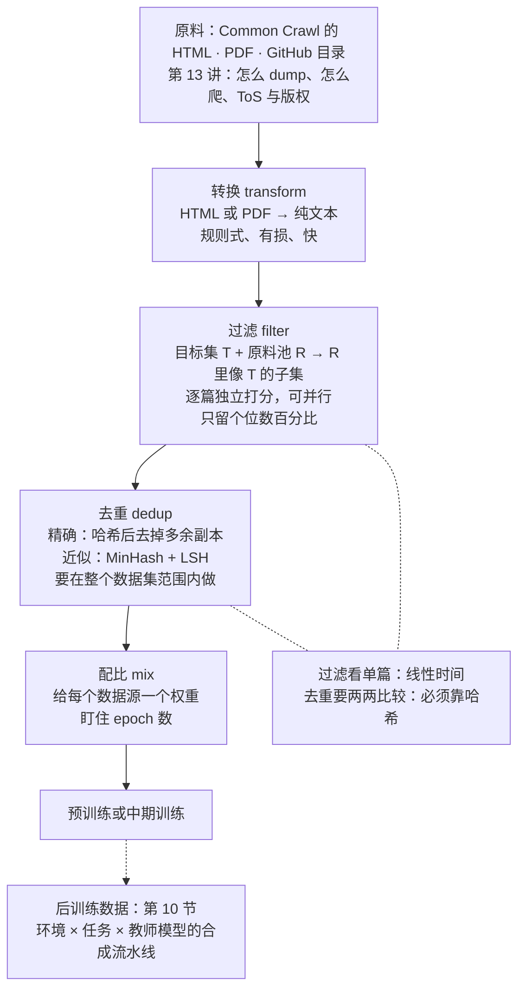
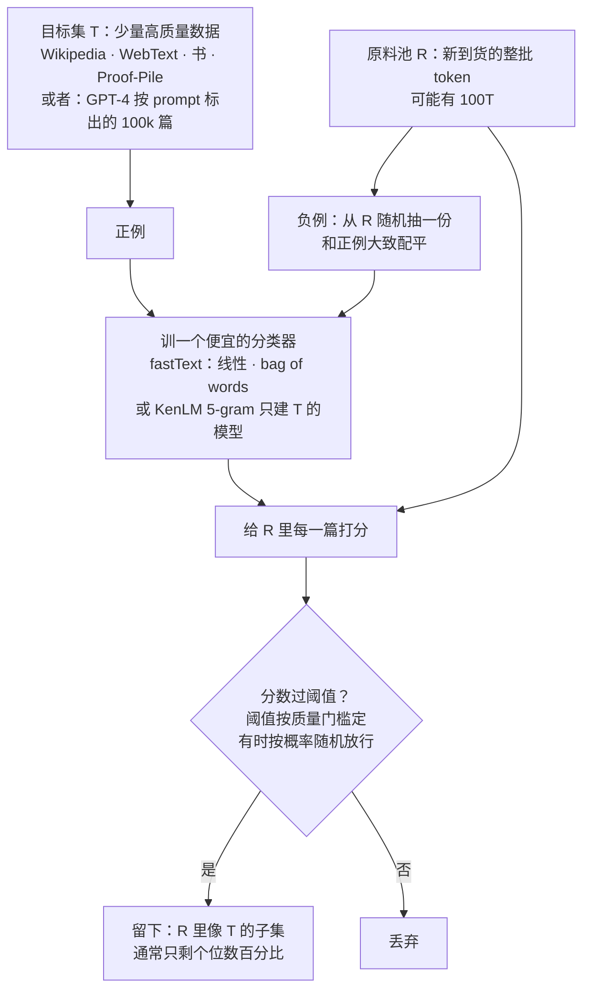
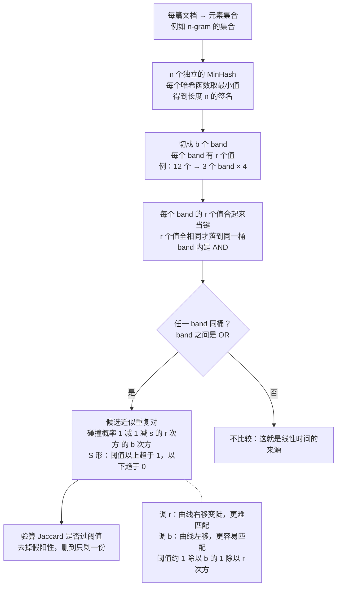
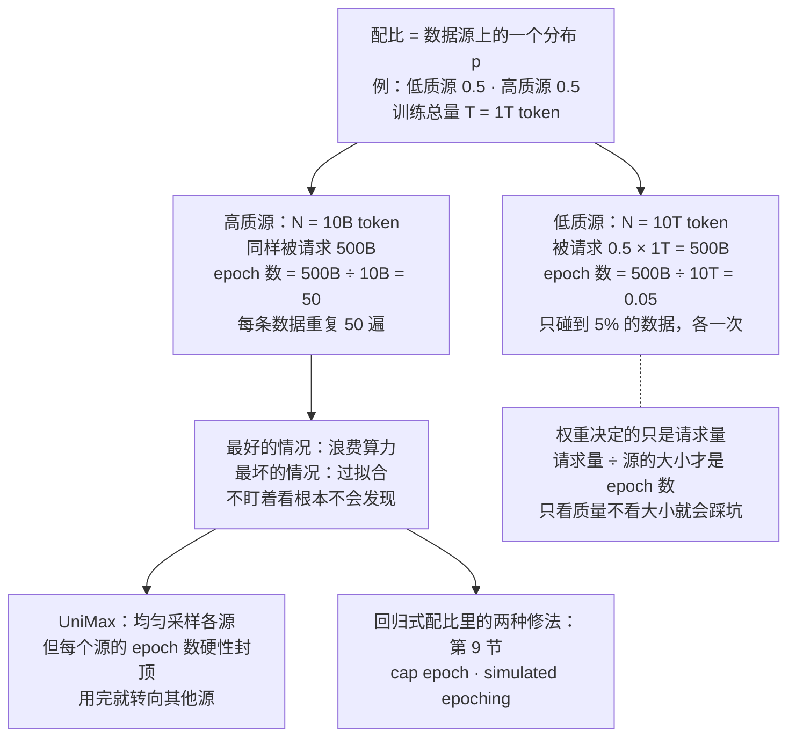
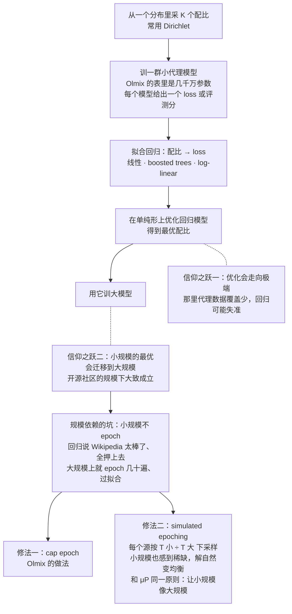
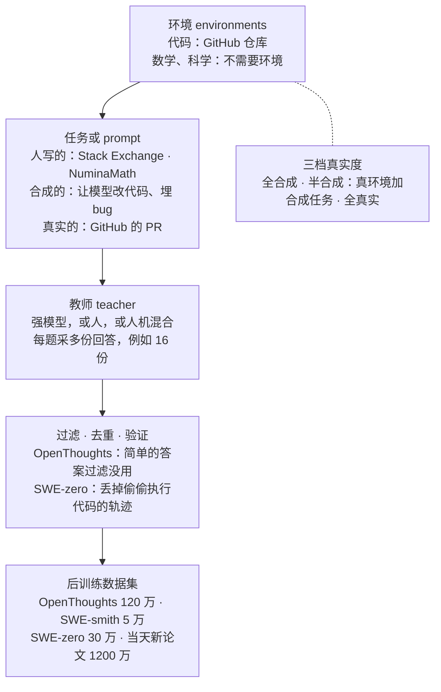

# CS336 第 14 讲｜数据（下）：过滤、去重、配比与合成数据（Data II）

> Stanford CS336: Language Modeling from Scratch（2026 春）· 第 14 讲，数据部分的下半场（第 13 讲讲数据从哪来、有哪些数据集；这一讲讲拿到原始数据之后的流水线）；课程表标注 2026 年 5 月 13 日
> 视频：<https://www.youtube.com/watch?v=5sxHosTLPF8>（1:24:46；英文字幕为自动生成，工具名、数据集名和算法名错得不少，见文末勘误）
> 讲者：Percy Liang（全程；讲到 μP 时说"Tatsu 讲过"，epoch 实验出自他的学生 Michael Ryan，数据源清单来自他主持的 Marin 项目）
> 课程主页：<https://stanford-cs336.github.io/> · 去重的算法主线出自 [Deduplicating Training Data Makes Language Models Better](https://arxiv.org/abs/2107.06499)（Lee et al., 2021）；配比部分以 [RegMix](https://arxiv.org/abs/2407.01492)（Liu et al., 2024）和 [Olmix](https://arxiv.org/abs/2602.12237)（Chen et al., 2026）为主；合成数据以 [OpenThoughts](https://arxiv.org/abs/2506.04178)（Guha et al., 2025）和 [SWE-smith](https://arxiv.org/abs/2504.21798)（Yang et al., 2025）为例

**一句话**：原始网页变成能训模型的 token 要过四道工序，每道工序都由一个"想要什么"的定义和一个"怎么在 100T token 上跑得动"的算法组成——过滤是"给一小份目标数据 T、一大池原料 R，找出 R 里像 T 的子集"，做法就是拿 T 当正例、R 的随机样本当负例训一个 fastText 线性分类器再逐篇打分（GPT-3、LLaMA、OpenWebMath、phi-1 全是这个骨架的实例），最后只留个位数百分比，而且阈值没有最优值，取决于你打算训多少 token；去重要在线性时间里找到"几乎一样"的文档，靠的是 MinHash 让哈希碰撞的概率恰好等于 Jaccard 相似度，再用 LSH 的 b 个 band × r 个哈希把这个概率削成一个陡峭的 S 形开关（阈值约为 (1/b)^(1/r)，真实系统用 b = 20、r = 450）；配比要给几十个数据源定权重，最大的坑是 epoch——10T 低质 + 10B 高质各占一半、训 1T token，高质源就被重复了 50 遍，所以要么像 UniMax 那样给 epoch 数设上限，要么用一群小模型拟合"权重 → loss"的回归再优化（RegMix / Olmix），并用 simulated epoching 让小规模也体会到大规模的数据稀缺；后训练数据则几乎全是"环境 × 任务 × 教师模型"的合成流水线，OpenThoughts 的 120 万条、SWE-smith 的 5 万个任务、SWE-zero 的 30 万条无执行轨迹、当天刚发布的 1200 万条，都是它的实例。

## 时间轴

| 时间 | 内容 |
|---|---|
| [0:05](https://www.youtube.com/watch?v=5sxHosTLPF8&t=5s) | 开场：回顾第 13 讲（数据要 dump 或爬、要处理、有 ToS 和版权问题）；今天：转换 → 过滤 → 去重 → 配比，末尾讲后训练数据 |
| [1:09](https://www.youtube.com/watch?v=5sxHosTLPF8&t=69s) | 转换回顾：HTML 线性化是有损的、规则式的；PDF 与 FinePDFs（[4:14](https://www.youtube.com/watch?v=5sxHosTLPF8&t=254s)）：截断、重爬、OCR 贵，但平均质量高 |
| [6:51](https://www.youtube.com/watch?v=5sxHosTLPF8&t=411s) | 过滤的抽象骨架：目标集 T、原料池 R，找 R 里像 T 的子集；要能泛化、要快到扫完 100T token；两类打分器（KenLM 生成式、fastText 判别式） |
| [11:34](https://www.youtube.com/watch?v=5sxHosTLPF8&t=694s) | 语言识别：fastText 的 176 种语言；OpenWebMath 的三步定向过滤：15B token 打赢 20 倍的数据 |
| [14:09](https://www.youtube.com/watch?v=5sxHosTLPF8&t=849s) | 质量过滤实例：GPT-3、LLaMA、phi-1（GPT-4 标 100k 篇 → 训便宜的分类器）；毒性过滤：Jigsaw |
| [17:12](https://www.youtube.com/watch?v=5sxHosTLPF8&t=1032s) | 没有万能阈值：训练 token 越多越能容忍低质数据；157M 模型在 100 个 WARC 上的 epoch 实验；问答：置信区间、更高质量数据训更久 |
| [22:47](https://www.youtube.com/watch?v=5sxHosTLPF8&t=1367s) | 去重：精确重复（镜像站、fork）与近似重复（许可证、页眉页脚、模板、标点差异）；C4 里出现 61,000 次的商品描述；为什么去重 |
| [27:21](https://www.youtube.com/watch?v=5sxHosTLPF8&t=1641s) | 去重的设计空间（粒度、匹配方式、留几份）；n² 比较不可行 → 哈希；精确去重与 C4 的三句跨度 |
| [31:30](https://www.youtube.com/watch?v=5sxHosTLPF8&t=1890s) | Jaccard 相似度；MinHash：碰撞概率恰好等于 Jaccard，特征矩阵 + 随机置换的证明；100 个哈希函数估出 0.6 |
| [37:41](https://www.youtube.com/watch?v=5sxHosTLPF8&t=2261s) | LSH：b 个 band × r 个哈希的"或—与"结构；S 形曲线；加 r 右移变陡、加 b 左移；阈值 (1/b)^(1/r)；真实系统 b = 20、r = 450 |
| [49:06](https://www.youtube.com/watch?v=5sxHosTLPF8&t=2946s) | 数据配比：Marin 的数据源清单、The Pile 的权重；vibes / 均匀 / 按 token 数比例；两条约束：多样性、每个源是有限的 |
| [53:42](https://www.youtube.com/watch?v=5sxHosTLPF8&t=3222s) | epoch 陷阱：10T + 10B、各一半、训 1T → 高质源 50 个 epoch；问答：配比在 batch 里怎么实现；UniMax 的 epoch 上限 |
| [59:51](https://www.youtube.com/watch?v=5sxHosTLPF8&t=3591s) | 回归式配比：小模型群 → 拟合"权重 → loss" → 优化 → 放大；RegMix；设计选择（Dirichlet、回归模型、目标指标）；Olmix 的方法总表 |
| [1:04:30](https://www.youtube.com/watch?v=5sxHosTLPF8&t=3870s) | 两次信仰之跃；规模依赖：小规模不 epoch 会高估高质源；两种修法：cap epoch、simulated epoching（和 μP 同一思想） |
| [1:10:44](https://www.youtube.com/watch?v=5sxHosTLPF8&t=4244s) | 问答：下采样太小怎么办；一个数据集内部按 domain × quality 再切格子配比（WebOrganizer） |
| [1:12:46](https://www.youtube.com/watch?v=5sxHosTLPF8&t=4366s) | 后训练数据的通用配方：环境 · 任务 · 教师；OpenThoughts 的 120 万条与四条发现 |
| [1:17:29](https://www.youtube.com/watch?v=5sxHosTLPF8&t=4649s) | agentic coding 数据：SWE-smith 5 万个合成任务、SWE-zero 30 万条无执行轨迹、SWE-rebench、当天新论文的 1200 万条 |
| [1:23:46](https://www.youtube.com/watch?v=5sxHosTLPF8&t=5026s) | 总结：定义好数据 → 训轻量分类器；去重省 FLOPs 防过拟合；配比小规模试大规模用；数据工作又脏又具体 |

## 核心内容

### 1. 这一讲在流水线里的位置，以及"转换"为什么是有损的



*图 14-1｜从原始抓取到可训练数据的四道工序，以及本讲各节对应的位置（自绘示意）· [▶ 看原幻灯片 0:37](https://www.youtube.com/watch?v=5sxHosTLPF8&t=37s)*

- **接着第 13 讲讲**：上一讲的结论是数据不会从天上掉下来——互联网是一堆在线服务，数据要么被 dump 出来要么被爬下来，之后还要处理，而且绕不开 terms of service 和版权（要么拿许可，要么诉诸 fair use）。这一讲从"手里已经有一批原始抓取"开始，走完转换、过滤、去重、配比四步，前四分之三讲预训练数据，最后一段看后训练数据现在怎么合成。
- **转换（transformation）**：原始数据不是文本——Common Crawl 里是 HTML，有时是 PDF，GitHub 给的是目录。精力主要花在 HTML 上：去 boilerplate（导航、广告、页眉页脚、菜单）抽"正文"，可什么算正文并不总清楚（导航元素有时反而能教模型"网页长什么样"），图片和表格也没有定论。这一步本质上**有损**：层级的 HTML 要压成一维 token 序列，简单表格能转 markdown，嵌套表格只能放弃或近似。用规则而不用模型，是因为规则式处理器极快、这一步也不需要多少"智能"（Percy 认为模型式干预有空间，但必须同样快）；代价是任何规则都有失误率，工具选择也影响结果——第 13 讲比过 Resiliparse 和 Trafilatura，扩展 DCLM 评测上 Resiliparse 更好。
- **PDF**（Hugging Face 的 FinePDFs 工作）：Common Crawl 以文本为主，URL 没带扩展名时抓之前未必知道是 PDF，而且很多 PDF 因为太大被**截断**了，要重新爬；扫描件本质是图片，得用 VLM 做 OCR，比处理文本贵得多。值得做，因为 PDF 虽只占互联网很小一部分，**平均质量比 HTML 高**——肯费事做成 PDF，多半有东西要说；代价是清洗更重：HTML 有 H1、P 这类语义标签，PDF 天生只管版式，语义结构基本丢了。
  > 小注：FinePDFs 是 Hugging Face FineWeb 团队 2025 年发布的 PDF 语料，托管在 [Hugging Face](https://huggingface.co/datasets/HuggingFaceFW/finepdfs)；讲者说的"这篇博客里有一大堆细节"应指它的发布文章。

### 2. 过滤的通用骨架：目标集 T、原料池 R，和一个必须很快的打分器



*图 14-2｜质量分类器怎么训、怎么用：T 当正例，R 的随机样本当负例（自绘示意）· [▶ 看原幻灯片 8:56](https://www.youtube.com/watch?v=5sxHosTLPF8&t=536s)*

- **一个骨架套所有过滤**：手里有一小份想要的目标数据 T（通常量小、质量高）和一大池原料 R（上一步转换出来的新鲜 token），目标是找 R 里**和 T 相似的子集**。语言识别（只要英文或只要德文）、质量过滤（要百科不要垃圾邮件，这是最主要的用途）、毒性过滤，都是这个形状。
- **两个硬要求**：一是要能**泛化**——T 你已经有了，过滤的意义是找到 T 之外的同类；二是要**极快**——它要跑遍整个互联网，量级可能是 100T token。过滤的典型结果是只留下**个位数百分比**。
- **怎么打分**：用 T 和 R 估一个模型，导出打分函数，按分数留人。两类做法：
    - *生成式*：只对 T 建模。必须便宜，所以不是训大语言模型，而是 KenLM 这种 5-gram 模型，用困惑度当分数。
    - *判别式*（现在的主流）：T 是正例，R 的随机子集是负例，配平后训分类器；工具几乎都是 fastText——一个 bag-of-words 的线性分类器，胜在快。然后给每篇新文档打分，按你的质量门槛定阈值，留下高分的，有时按分数随机放行而不是一刀切。

$$
\hat{S}=\{\,x\in R:\ s_{T,R}(x)\ \ge\ \tau\,\},\qquad s_{T,R}=\text{fastText}(T\ \text{为正},\ \text{sample}(R)\ \text{为负})\ \ \text{或}\ \ -\log\text{ppl}_{\text{KenLM}(T)}
$$

R 是原料池，T 是目标集，s 是从 T 和 R 估出来的打分函数（判别式分类器的正类概率，或生成式模型下的困惑度取负），τ 是阈值；过滤的输出 Ŝ 就是 R 里分数过线的那部分。

```python
# 判别式质量过滤的骨架（示意）
pos = sample(target_T)                       # 想要的数据：Wikipedia、书、GPT-4 标过的 100k 篇……
neg = sample(raw_R, n=len(pos))              # 从原料池随机抽同样多当负例
clf = fasttext.train_supervised(pos + neg)   # 线性 bag-of-words，快到能扫 100T token
kept = []
for doc in stream(raw_R):                    # 逐篇独立打分：线性时间，可并行
    p = clf.predict_proba(doc)               # 像 T 的概率
    if p > tau or random() < keep_prob(p):   # 硬阈值，或按分数随机放行
        kept.append(doc)
```

这段展示的是骨架本身：正例来自 T、负例来自 R、分类器要便宜、打分逐篇独立；GPT-3、LLaMA、OpenWebMath、phi-1 只是换了 T 和分类器。

- **要不要用模型来过滤**：几年前的一些数据集（第 13 讲提过）刻意不用模型式过滤，怕引入偏差；现在基本人人都用——除非你算力充裕到可以什么都训，否则不聪明地过滤就是把 FLOPs 浪费在低质内容上。"算力穷人"是常态。

### 3. 骨架的实例：语言识别、数学、GPT-3 / LLaMA / phi-1、毒性

| 实例 | 目标集 T | 原料池 R | 打分器 | 结果 |
|---|---|---|---|---|
| 语言识别 | 多语言站点（Wikipedia 各语言版、翻译站） | 任何文本 | Meta 训好的 fastText，直接用，支持 176 种语言 | 阈值按经验定 |
| OpenWebMath（2023） | Proof-Pile（数学语料） | Common Crawl | 规则（有没有 LaTeX 命令）→ KenLM 困惑度 → fastText"是不是数学写作" | 15B token；数学能力胜过用 20 倍未过滤数据训的模型 |
| GPT-3 | Wikipedia、WebText（高分 Reddit 帖子链出的页面）、书 | 网页 | 线性分类器，分数够高才留 | 第 13 讲讲过，这里放进骨架 |
| LLaMA 1 | 被 Wikipedia 引用的页面（不是 Wikipedia 文章本身） | 网页 | 同上 | 同一思路 |
| phi-1（Microsoft） | GPT-4 用 prompt"判断教育价值"在 100k 篇上标出的正例 | The Stack 的 Python 子集 | 随机森林（用 fastText 也行） | 比直接用原料训得更快、上限更高 |
| 毒性 | Jigsaw toxic comments：Wikipedia 讨论页的人工标注 | 网页 | 同样的正负例分类器 | 过滤掉不想学的内容 |

- **语言识别**：Meta 的 fastText 语言识别模型现成可用，176 种语言，在 Wikipedia 这类多语言站点上训的。这是相对容易的问题——看几个词就知道是西班牙语还是日语；code switching 和方言有麻烦，但不是训好模型的瓶颈。
- **OpenWebMath**：想让模型擅长数学，就去找数学文本。三步：规则看有没有 LaTeX 命令；在 Proof-Pile 上训的 KenLM 算困惑度，低于阈值才留（生成式那一路）；再训 fastText 判断是不是数学写作。两套阈值：**有 LaTeX 的门槛低，没有的门槛高**。得到 15B token，用它训的模型比用 20 倍普通数据训的更会数学。质量没有统一定义——定义成数学，就得到数学。
  > 小注：论文摘要的数字是 14.7B token，"超过用 20 倍以上通用语言数据训的模型"（[Paster et al., 2023](https://arxiv.org/abs/2310.06786)）。
- **phi-1 的两级结构**：T 不是现成数据集，而是一个**贵的分类器的输出**——写一条 prompt（判断教育价值），让 GPT-4 在 R 的 100k 篇子集上打标，标为正的就是 T；再用 T 训便宜的分类器（他们用随机森林）扫全量。结果曲线里，这份数据"更少步数就到更高的值"。GPT-3 和 LLaMA 的做法第 13 讲讲过，重点是它们落在同一个骨架里。
- **毒性过滤**：Jigsaw 的数据来自"让网上讨论更好"的项目，标注的是 Wikipedia 讨论页（争议话题下吵得很凶），同样定义正负例、训分类器。
- **到此为止的配方**：认准你想要的数据——要么"有个现成数据集我喜欢，想要更多"，要么写条 prompt 让语言模型先粗筛一批——训一个小分类器，去 Common Crawl 里捞。

### 4. 阈值没有最优值：质量门槛取决于你打算训多少 token

- **一个容易忽略的事实**：分类器给的是连续分数，没法说"0.9 最好"——**想要什么数据，取决于要训什么模型**，尤其是训练 token 数。直觉是：训得越久，越能容忍低质量数据；训得短，就要高质量。当然最好是"训得久 + 全是高质量"，但数据池就那么大，这不是你能选的。
- **Michael Ryan 的初步实验**（[18:12](https://www.youtube.com/watch?v=5sxHosTLPF8&t=1092s)）：157M 参数的模型，数据池故意取得很小——100 个 WARC，只是 Common Crawl 的零头——然后越训越久，看 loss。
    - 蓝线是 DCLM 那套过滤后的数据：loss 从高处一路下来；图上每条竖线是一个 epoch，数据不多，只能反复过。第二遍还在学（loss 还在降），再往后开始过拟合。
    - 另一条是 Resiliparse 直出、基本没过滤的数据：开头差很多，但训得久、也 epoch 之后，下降只是变慢。
    - 趋势：**不 epoch 的区间高质量数据更好；token 很多之后，高质量数据就不再那么占优**。而且高质量那条你根本不想训到那个区间——已经过拟合了，会在拐点早停；可早停的那个点，比"拿低质数据训更久"还差。
  > 小注：WARC（Web ARChive）是 Common Crawl 发布抓取结果的归档格式，一个月的抓取就有几万个这样的文件，100 个只是零头；字幕把它识别成了"works"。
- **问答**
    - 图上每个点是一次训练 run，要不要重复跑、报置信区间？理想上应该；论文里少见，因为每个 run 都贵。实际经验：预训练这类实验结果相当稳定。
    - 如果能拿到更多高质量数据并训得更久，会不会同样边际递减？会——任何数据集都是有限的，终究递减；但整条曲线会在更低的位置一直往下。
- **小结**：对算力穷人（也就是绝大多数人）来说过滤至关重要；算力无限才可以什么都训。配方就是：搞清好数据长什么样 → 训分类器 → 外推到全部原料。

### 5. 去重：重复从哪来、为什么去、设计空间在哪

- **两类重复**（过滤完仍然大量存在）
    - *精确重复*：镜像站——镜像的意义就是复制，而爬虫未必知道这是镜像，全都爬一遍；fork 的代码仓库——就算改了几个文件，99% 还是一样的。
    - *近似重复*：不是镜像也不是衍生，只是差几个 token 的相同文本，多半来自复制或共同来源。例子：terms of service 和许可证（MIT license 到处都有，除非抄的人打错字，那一段是精确复制，但它所在页面的其余部分各不相同）；网站共用的页眉页脚；LM1B 里同一篇文章的两个版本只差一个逗号；模板化内容——像一条广告，把 Canada 换成 USA 又发一遍。拿这些变体训练是在浪费 GPU。
    - *极端案例*：对 C4 的一次审计发现，同一段商品描述（一个防毒面具）在数据集里出现了 61,000 次，追溯不出为什么。网络很怪——所以要看数据。
  > 小注：这个例子和第 7 节的 LSH 参数都出自 [Lee et al., 2021](https://arxiv.org/abs/2107.06499)。摘要的说法是 C4 中有一个 61 个词的英文句子重复了 6 万多次；去重之后，模型吐出记忆文本的频率降到十分之一，用更少的训练步数达到同样或更好的准确率，而且标准数据集验证集里 4% 以上的内容与训练集重叠。
- **为什么去重**：一是训练更高效——去重缩小数据集，却几乎不丢信息；二是避免记忆——版权内容重复太多就会被背下来，还有隐私问题；主要还是别把 FLOPs 浪费在重复上。同一套工具还用于**去污染**（decontamination）：确保测试集不在训练集里，这一点可以说更重要。
- **设计空间**
    - 单位：句子、段落，还是文档？
    - 匹配：精确匹配？存在共同的子项？共同子项的比例（这就是近似去重）？
    - 找到之后：全删，还是只留一份？
- **算法上的难点**：过滤是逐篇判断"这篇好不好"，线性时间、可并行，即便如此还要靠规则和小模型提速；去重却是**项目和项目之间的比较**，不能做 n² 的全比较，网络规模下必须是线性时间算法——出路是哈希。
- **哈希函数**：把一个值（比如字符串）映成小得多的值；两个不同的项映到同一个值叫碰撞。密码学哈希抗碰撞（比特币在用），哈希表用的那类更快、碰撞不是世界末日——这里用后者。
- **精确去重**：把字符串哈希，找完全匹配，删到只剩一份；写成 MapReduce 风格就好并行。C4（T5 论文）的单位是**三句话的跨度**：找到两篇文档共享三句话，就从其中一篇里挖掉这三句——连贯性被破坏了，但他们就是这么做的。精确去重不够用，因为网络数据的重复大多是近似的。

### 6. 近似去重的度量与哈希：Jaccard 和 MinHash

- **先定义"近似匹配"**：Jaccard 相似度 = 交集大小 / 并集大小。例：{1, 2, 3, 4} 和 {1, 2, 3, 5}，交集 3 个、并集 5 个，Jaccard = 0.6。取值在 0（不相交）到 1（相同）之间。于是可以定义：Jaccard 超过某个阈值（比如 0.99）就算近似重复。

$$
J(A,B)=\frac{|A\cap B|}{|A\cup B|},\qquad h_{\min}(A)=\min_{a\in A}h(a),\qquad \Pr_{h}\!\big[h_{\min}(A)=h_{\min}(B)\big]=J(A,B)
$$

A、B 是两篇文档各自的元素集合（比如 n-gram 集合），J 是它们的 Jaccard 相似度；h 是一个随机哈希函数，h_min(A) 是对 A 里每个元素哈希后取最小值，即 MinHash；第三个式子是 MinHash 的核心性质——在随机选 h 的意义下，两个集合 MinHash 相等的概率恰好等于它们的 Jaccard。

- **怎么在线性时间里找**：这是算法界已经解决的问题，第一步是 **MinHash**（不是最终答案）。它是一个随机哈希函数，使得碰撞概率**恰好等于** Jaccard(A, B)。妙处在于：哈希让事情线性，Jaccard 是我们要的度量，MinHash 把两者接上了（期望意义下）。反常之处也在这里——通常设计哈希函数是要避免碰撞，这里要的却是**受控的碰撞**：相似的东西比不相似的更容易撞在一起。
- **做法**：对集合里每个元素做哈希，取最小值。取最大值也行，只是一种打破平局的约定。
- **为什么成立**（讲者的图景）：把两个集合画成特征矩阵——行是所有元素 1 到 5，列是 A 和 B。一个随机哈希函数等价于对行做一次随机置换（比如 4, 3, 1, 5, 2）；MinHash 相等，当且仅当按这个顺序排最前的那个元素同时属于 A 和 B。每个元素被排到最前的概率相同：排最前的是 1、2、3 之一，两边相同；是 4 或 5，两边不同。所以概率就是交集除以并集。
- **代码验证**：生成 100 个不同的哈希函数（每个由一个 seed 决定），数 MinHash 相等的比例，得到约 0.6。
- **关键收益**：不用 n²。算出每个集合自己的 MinHash，然后只看谁和谁碰撞。

### 7. LSH：把"碰撞概率等于相似度"削成一个开关



*图 14-3｜MinHash 签名加 LSH 分 band 怎样在线性时间里找到近似重复（自绘示意）· [▶ 看原幻灯片 39:12](https://www.youtube.com/watch?v=5sxHosTLPF8&t=2352s) · 出处：[Lee et al., 2021](https://arxiv.org/abs/2107.06499)*

- **MinHash 还不够**：我们要的是"找出 Jaccard 大于 0.99 的 A、B"，可单次碰撞只是一个概率等于 Jaccard 的随机事件，方差太大。得把概率**削尖**：高于阈值几乎必碰，低于几乎不碰。
- **LSH**（locality sensitive hashing，局部敏感哈希）是理论计算机科学的经典想法：用更多**独立**的哈希函数，按"或—与"结构组合——n 个哈希函数分成 b 个 band、每个 r 个（12 个 → 3 个 band × 4）；一个 band 里 r 个哈希**全部**相同才算触发（AND），**任何一个** band 触发就判定碰撞（OR）。

$$
\Pr[\text{某个固定 band 全部匹配}]=s^{r},\qquad \Pr[\text{A 与 B 碰撞}]=1-\left(1-s^{r}\right)^{b}
$$

s 是 A、B 的 Jaccard 相似度，r 是每个 band 里的哈希函数数，b 是 band 数；一个 band 要 r 个哈希全撞上，概率是 s 的 r 次方，指数级地小；"没有任何 band 撞上"的概率是 (1 − s^r)^b，取补就是至少一个 band 撞上的概率。

- **算一个**：s = 0.8、b = 5、r = 10——固定 band 匹配的概率是 0.8 的 10 次方，很低；碰撞概率约 0.4，比单个 band 高，因为有 b 次机会。
  > 小注：代进公式：0.8^10 ≈ 0.107，1 − (1 − 0.107)^5 ≈ 0.43，与讲者说的"零点四几"一致。
- **画出来是 S 形**：横轴相似度，纵轴碰撞概率，0 对 0、1 对 1，中间一个相变——阈值以下尽量低，以上尽量高，正是要的。
- **读表**（相似度 0.7 到 0.98）：
    - b = 10、r = 10：碰撞概率从 0.25 到 1。阈值设在 0.9 的话，低于的仍有假阳性，可以事后验算 Jaccard 过滤掉；高于的基本都留下。
    - 加大 r（每个 band 里的哈希数）：曲线变陡并**右移**，什么都更难匹配——0.7 处从 0.25 掉到 0.008，0.9 处只剩 0.72。
    - 加大 b（band 数）：曲线**左移**，更容易匹配——0.9 处从 0.72 升到 0.92，低处也涨一点，但不多。
  > 小注：讲者只说了"加大 r""加大 b"，没念具体值；按公式反推，0.008 和 0.72 对应 b = 10、r = 20，0.92 对应 b = 20、r = 20（推断）。
- **想多陡都行**，代价是更多哈希函数。真实系统的量级：去重论文里 **b = 20、r = 450**——每篇文档算 9,000 个 MinHash。

$$
s^{*}\approx\Big(\frac{1}{b}\Big)^{1/r},\qquad \Pr[\text{碰撞}\mid s=s^{*}]=1-\Big(1-\frac{1}{b}\Big)^{b}\approx 1-\frac{1}{e}\approx 0.63
$$

s* 是相变发生的相似度阈值：在这一点固定 band 匹配的概率恰好是 1/b，于是碰撞概率是一个与 b、r 几乎无关的常数（讲者念作 0.64）；想按 Jaccard 大于 0.9 去重，就把 b、r 调到让 s* 等于 0.9，再同时调大两者让相变更陡——阈值以下趋于 0，以上趋于 1。

```python
# MinHash 签名 + LSH 分 band（示意）
def minhash(doc, seeds):                                  # n 个独立哈希函数，各由一个 seed 决定
    grams = set(ngrams(tokens(doc), 5))                   # 文档 → 集合，例如 5-gram
    return [min(h(g, s) for g in grams) for s in seeds]   # 每个哈希函数取最小值
buckets = defaultdict(list)
for doc in corpus:                                        # 线性时间：每篇只算自己的签名
    sig = minhash(doc, seeds)                             # 长度 n = b * r
    for band in range(b):                                 # b 个 band，各 r 个值
        key = (band, tuple(sig[band * r:(band + 1) * r])) # r 个值全相同才落到同一桶
        buckets[key].append(doc.id)                       # 同桶 = 候选近似重复对
# 之后只对候选对验算 Jaccard，再删到只剩一份
```

这段展示的是线性时间从哪来：每篇文档只和"同桶"的文档比，桶的键由一个 band 的 r 个 MinHash 值决定，而不是两两比较。

- **名字**：这套方法叫 MinHash LSH——LSH 对任何哈希函数族都成立，语言模型的数据处理里用的是近似 Jaccard 的 MinHash 这一种。
- **一个实践备注**：数据集常常一份一份进来，各自去过重；但应当**跨整个数据集**去重，因为数据集之间也经常冗余。这一步常被省掉，不该省。

### 8. 数据配比：权重从哪来，以及 epoch 这个最大的坑



*图 14-4｜同一个"各占一半"的配比，在 10T 的源上只碰到 5% 的数据，在 10B 的源上却重复 50 遍（自绘示意）· [▶ 看原幻灯片 53:42](https://www.youtube.com/watch?v=5sxHosTLPF8&t=3222s) · 出处：[Chung et al., 2023](https://arxiv.org/abs/2304.09151)*

- **到这一步**：转换 → 过滤 → 去重之后，手里是一小批高质量文档——但这只是**一个**数据源的事，语言模型是在很多个源上训的。Marin 的网站上跟踪着下一个模型会用的源：Nemotron 那套网页数据、刚才说的 FinePDFs、Institutional Books、代码……老一点的 The Pile 也是一堆源，每个配一个权重。**配比（data mixture）就是数据源上的一个分布**。
- **权重从哪来**（讲者说这远谈不上第一性原理，甚至是它的反面）
    - *vibes*：凭直觉手动设——比你想的常见得多；就算新论文用了某种方法，最后也往往再手调。
    - *均匀*：每个源等概率，每采一个 chunk 先采一个源。
    - *按比例*：按各源的 token 数采样，也算理性——但一个巨大的低质源会吃掉大部分 token，不太对；直觉上应该上调高质量的源。
- **两条约束**
    - *多样性*：源之间往往不可比——文学、代码、论文，说"这篇论文比这段代码质量高"没有意义；想让模型什么都行，就不能把质量全押在论文上。
    - *每个源是有限的*：小源权重太大就会用完，只能 epoch——反复训练字面上相同的 token——后果很坏。这一点要展开算。
- **算一遍**（图 14-4）：低质源 10T token，高质源 10B token（高质源一般都小）。天真地均匀配比各 0.5，训 1T token——这里的"1T"是步数乘以 batch size，不是 unique token。低质源被请求 0.5 × 1T = 500B，除以它的 10T 是 0.05：只碰到 5% 的数据，各一次。高质源同样被请求 500B，可它只有 10B，每条数据要重复 **50 次**。一些大模型的训练就在这里翻过车：只看数据的质量定分布，忘了看每个源里到底有多少数据。

$$
e_i=\frac{p_i\,T}{N_i},\qquad \text{UniMax 约束：}\ p_i\,T\ \le\ c\,N_i\quad\text{对每个源 } i
$$

e_i 是第 i 个源被训练的 epoch 数，p_i 是它在配比里的权重，T 是训练总 token 数（步数乘 batch size），N_i 是这个源的大小；UniMax 要求每个源被请求的 token 数不超过它自身大小的 c 倍，c 就是 epoch 上限。

- **问答**
    - 为什么需要 50 个 epoch？——不需要。最好的情况是浪费算力，最坏是过拟合；50 只是"不注意就会发生"的数。教训：看清自己实际在每个源上做了多少 epoch。
    - 配比在训练时怎么落地——每步换一个源，还是 10 步代码、10 步别的？——填 batch 时对**每条序列**采样它来自哪个源，一条序列只来自一个源，不按 token 采；一个 batch 应当是混合的，这样方差小。
- **UniMax**：这个问题很早就被注意到——训多语言模型时低资源语言的问题非常明显。此前的做法是把按比例的分布取一个幂来压平；UniMax 更直接：**均匀采样各源，但对每个源的 epoch 数硬性封顶**（比如 20 个 epoch），用完就不再取，转向其他源——像一张安全网。有一个简单的过程能在这个约束下解出配比。

### 9. 回归式配比：小模型群、两次信仰之跃，和 simulated epoching



*图 14-5｜回归式配比的闭环，以及它的两个信仰之跃和两种修法（自绘示意）· [▶ 看原幻灯片 1:00:21](https://www.youtube.com/watch?v=5sxHosTLPF8&t=3621s) · 出处：[Liu et al., 2024](https://arxiv.org/abs/2407.01492)*

- **动机**：50 个源就要填 50 个数。按比例不够；按估出来的某个质量指标加权，也还是启发式。最有原则、也最容易看懂发生了什么的，是回归式方法（RegMix 等）。
- **步骤**：要训一个大模型，先到小规模（比如 300M 参数）试不同的配比——训一群（swarm）小模型，每个给出一个目标指标（下游评测或困惑度都行）；用这些点拟合一个回归：配比权重 → loss。于是你有了一个极便宜的模型，能回答"如果用这个配比训，loss 会是多少"；对它优化得到最优配比，拿去训大模型。和 scaling laws（第 9、11 讲）一个套路：便宜的计算找答案，再放大。

$$
\hat{L}(p)\ \leftarrow\ \text{fit on }\{(p_k,\,L_k)\}_{k=1}^{K},\qquad p^{*}=\arg\min_{p\in\Delta^{m}}\hat{L}(p)
$$

p_k 是第 k 个采出来的配比（m 个源上的分布，常从 Dirichlet 采），L_k 是用它训的小模型的 loss，L̂ 是拟合出的"配比到 loss"的回归函数，Δ^m 是 m 维单纯形；p* 是在回归函数上解出的最优配比，用于大规模训练。

- **设计决策**
    - *试哪些配比*：需要一个"分布上的分布"，常用 Dirichlet。
    - *回归方法*：线性模型、boosted decision trees；Olmix 的表里 log-linear 效果不错。
    - *目标指标*：常基于下游评测，要非常小心过拟合——预训练是在训通用模型，不是拟合几个评测：评测全是代码，回归就会上调所有代码数据，之后让它写诗就露馅。按比例和均匀配比没这个问题，因为它们不看评测。
    - *小规模和大规模差多少*：代价与准确度的权衡——太小没有代表性，太大就等于在最大规模上调超参，没意义。
    - Olmix 的总表把一批方法放进同一框架比：代理模型大小（几千万参数）、采多少个配比（随域数 m 变）、Dirichlet 还是指数分布、log-linear 回归、优化解法。
  > 小注：Olmix（[Chen et al., 2026](https://arxiv.org/abs/2602.12237)，AI2，为 Olmo 3 做的配比工作）的摘要：代理模型 3000 万参数（1500 万以上即可），代理 run 的数量随域数线性增长；它得到的最好配比比自然分布好 12.2%，数据效率 3.05 倍。这些数课上没念。
- **两次信仰之跃**（都要小心）
    1. 回归模型是在随机采的配比上训的。随机采一个配比来预测没问题——经典泛化，分布内；但**优化**会把你推向极端，那里的覆盖少，回归可能失准。
    2. 小规模的最优配比要能迁移到大规模。在开源社区的规模上大致成立，至少没有明显错；但显然有规模依赖效应——回想第 4 节：训更多 token 时低质数据也变得可以接受，所以最优点并不相同，只能"往好处想"。
- **一个必须处理的规模依赖效应**：还是 10T 低质 + 10B 高质。小模型、少 token 时根本不 epoch，回归就会说"Wikipedia 太棒了，全押上去"；到大模型上用这个配比，高质数据被 epoch 几十遍，过拟合。两种修法：
    - *cap epoch*（Olmix 的做法）：直接给 epoch 数封顶。
    - *simulated epoching*（名字不止一个）：原则是**让小规模看起来像大规模**——这门课的通用主题，Tatsu 讲 μP（第 11 讲）也是它：参数化得让超参能迁移。天真缩放的问题是小规模不 epoch、大规模 epoch，是两种性质不同的操作。做法：把每个源按比例下采样——小 run 10B token、大 run 1T token，就是 1/100——再做回归。这样"全押 Wikipedia"在小规模就会露馅：只有一点点 Wikipedia，马上 epoch 很多次、loss 很差，优化自然转向更均衡的配比。你在低规模上模拟了高规模的数据稀缺。

```python
# 回归式配比 + simulated epoching（示意）
scale = T_small / T_big                                   # 例：10B ÷ 1T = 1/100
sources = {k: subsample(v, scale) for k, v in sources.items()}   # 让小规模也感到稀缺
runs = []
for _ in range(K):                                        # 一群小代理模型
    p = dirichlet(alpha, m)                               # 采一个配比
    loss = train_small(mix(sources, p), tokens=T_small)   # 权重太偏就会 epoch，loss 会差
    runs.append((p, loss))
L_hat = fit_log_linear(runs)                              # 配比 → loss
p_star = minimize(L_hat, simplex=True, epoch_cap=20)      # 也可以再加 epoch 上限
train_big(mix(full_sources, p_star), tokens=T_big)
```

这段展示的是闭环的形状，以及 simulated epoching 插在哪里：下采样发生在采配比之前，让"过度偏向小源"在小规模就得到惩罚。

- **小结**：Wikipedia、Common Crawl、代码、数学各配多少——回归式配比是个好框架：小规模拟合"权重 → loss"，优化，推广到大规模；但 epoch 和过拟合要用 capped epoching 或 simulated epoching 管住。更大的教训：**你在优化任何东西时，都有优化错目标的危险**。
- **问答**
    - 下采样之后一个源太小怎么办？——确实可能只剩极少 token；那样最优解会给它很小的权重，放大之后也许恰好是对的。原则上行得通，但可能有"舍入误差"：本想训一遍，结果一遍都没训到；可以规定每个源至少训一遍来兜底。
    - 配比只在源之间做，还是也在一个数据集内部做？——讲者说忘了讲，好问题。Nemotron 的论文和一些 OLMo 的工作里：把 Common Crawl 按域分组（AI2 的 WebOrganizer 能按主题分），再按质量分档，得到一张"域 × 质量"的二维格子，每个格子当一个源来配比；这是自动定义域的办法，再加上别人交给你的额外数据源。

### 10. 后训练数据：环境 × 任务 × 教师模型的合成流水线



*图 14-6｜后训练数据的通用配方：定义环境、定义任务、找教师生成回答、再过滤（自绘示意）· [▶ 看原幻灯片 1:13:49](https://www.youtube.com/watch?v=5sxHosTLPF8&t=4429s) · 出处：[Guha et al., 2025](https://arxiv.org/abs/2506.04178)*

- **和前面的分界**：到此为止讲的是预训练或中期训练的数据，基本与任务无关——回归式配比虽然在最小化某个 loss，数据本身仍是通用的，目的是打基本功。后训练的数据则**高度依赖任务**。这一段不做综述，只挑几个最近发布、尤其是编程方向的数据集。
- **通用配方**：定义一组环境（代码的话就是 GitHub 仓库），定义一组任务或 prompt，然后从一个强模型（教师）那里收集回答。言外之意：至少在开源社区，后训练数据**几乎全是合成的**。教师也可以换成人——慢、贵；几年前在前沿就得花大钱请很多人写回答，现在即便前沿也是人机混合。不变的是：总有一个教师在给回答。
- **OpenThoughts**：起因是 o1 发布后大家都盯着数学和科学的推理，问题是怎么做出好的后训练数据。最终版本是 **120 万条**样本，由一个教师模型生成。
    - *任务从哪来*：很多源，人写的（Stack Exchange、NuminaMath）和合成的都有；编程部分有练习题、code golf（不算真实）、code review（更真实一些），此外还有数学、化学。这是很多人合作的大项目。
    - *系统分析的发现*：源不必全上，选几个好的就行；每题**采多份回答**（比如 16 份）有帮助；**更强的模型不一定是更好的教师**——QwQ-32B（现在看又老又小）当教师比当时最强的开源模型之一 DeepSeek-R1 更好；简单的答案过滤没有帮助。
    - *流水线*：各源 → 去重 → 随机下采样题目 → 每题生成多份回答 → 最终数据集。120 万是样本数，除以 16 才是题目数。
  > 小注：论文摘要（Guha et al., 2025）：用 QwQ-32B 当教师、规模到 120 万条的 OpenThoughts3 训出的 7B 模型在 AIME 2025 得 53%、LiveCodeBench 51%、GPQA Diamond 54%，比 DeepSeek-R1-Distill-Qwen-7B 分别高 15.3、17.2、20.5 个百分点。120 万 ÷ 16 ≈ 7.5 万道题是按讲者的说法算出来的。
- **agentic coding**：最近的兴趣从"会写代码的模型"转向"能做软件开发的模型"，数据集随之复杂起来。
    - *SWE-smith*：给一个仓库，让语言模型的 agent 先把它弄到能用（装依赖等），再自动生成任务——改代码、埋 bug——经验证得到任务实例。任务是合成的，但有 **5 万个**，在当时（去年）算大。
    - *SWE-zero*（NVIDIA；名称按字幕发音复原，推断）：软件工程任务和数学不同，依赖极重——大多数 GitHub 仓库根本跑不起来，回滚到某个 PR 当时的状态更是一团糟。与其给每个仓库做 docker 镜像，不如利用一个事实：模型已经强到**不需要执行反馈**也能解掉很多任务——允许执行大约 80，不允许也有将近 70——说明模型对代码有某种内部语义。于是生成 **30 万条** agent 轨迹，全部来自真实 GitHub PR（不像 SWE-smith 是合成任务），用 OpenHands 脚手架；为防 agent 作弊，"zero"版本不许运行 Python，只能用 sed、grep 这类基本操作；从一个大编程模型蒸馏再过滤——编程模型有时会无视指令偷偷执行。另有 1.3 万条需要执行反馈的轨迹（字幕作"sweet hero"，应为论文里带执行反馈的子集名，未能核实）；先在 30 万条上微调，再在这 1.3 万条上微调，有进步，离前沿还远。
    - *SWE-rebench*：另一次"抓尽可能多的 PR"的尝试：收集仓库、尝试安装、大多失败、再努力，然后让语言模型给回答。
    - *当天刚发布的一篇*：把 SWE-zero 的思路放大到 **1200 万条**轨迹，用的是 SWE-rebench 的任务——那边只让 3.2 万个任务跑起来了，12 万个没跑起来；zero 式的做法不在乎能不能执行，全都能用。因为数据大了，用的是一个很小的模型。
- **趋势与取舍**：数据集从不需要环境的数学，到编程，再到规模越来越大的编程数据。任务有三档真实度：全合成、半合成（真环境 + 合成任务）、全真实；回答来自有能力的模型，但它们还得是好教师；代码环境很折磨人，过滤和细节一大堆，课上没时间展开。

### 11. 收尾：四道工序的一句话总结，和"数据工作不长这样"

- **过滤**：定义什么是好数据，训一个轻量分类器，扫一遍网页抓取，得到像它的一小份。
- **去重**：为了不过拟合、不浪费 FLOPs；近似去重靠 MinHash + LSH。
- **配比**：小规模试，大规模用；盯住 epoch。
- **后训练数据**：环境 × 任务 × 教师，几乎全合成。
- **讲者的提醒**：真正的数据工作又脏又具体，高度依赖领域，要靠盯着一个个具体样本看才能做出高质量数据集——这一讲展示的是数据的版图，不是数据工作本身的样子。
- **这一讲没讲到的**：DoReMi 一类在训练中在线调权重的方法、退火 / cooldown 阶段专门的数据、PII 处理，课上都没出现；退火阶段的数据应在第 15 讲（推断）。
  > 小注：课程主页上 Assignment 4（Data）就是把这一讲自己做一遍：从 Common Crawl 的 WARC 文件抽文本，做语言识别、PII 遮蔽、有害内容和质量分类器，做精确与 MinHash 去重，再训小模型比 loss——课上没有提作业。

## 关键图表速查（点时间戳跳到原幻灯片）

| 图 | 看什么 | 跳转 | 出处 |
|---|---|---|---|
| HTML 抽取工具对比 | 第 13 讲的回放：Resiliparse 与 Trafilatura 在扩展 DCLM 评测上的差距，说明规则式工具的选择也影响模型 | [3:44](https://www.youtube.com/watch?v=5sxHosTLPF8&t=224s) | [DCLM](https://arxiv.org/abs/2406.11794) |
| 过滤的骨架图 | 一小份目标 T、一大池原料 R，要找的是 R 里像 T 的子集；后面所有实例都套这张图 | [6:51](https://www.youtube.com/watch?v=5sxHosTLPF8&t=411s) | — |
| OpenWebMath 流水线 | 三步：LaTeX 规则 → KenLM 困惑度 → fastText；两套阈值，有 LaTeX 门槛低 | [12:37](https://www.youtube.com/watch?v=5sxHosTLPF8&t=757s) | [Paster et al., 2023](https://arxiv.org/abs/2310.06786) |
| phi-1 的训练曲线 | 用 GPT-4 标注再训分类器筛出的数据：更少的步数到更高的值 | [16:12](https://www.youtube.com/watch?v=5sxHosTLPF8&t=972s) | [Gunasekar et al., 2023](https://arxiv.org/abs/2306.11644) |
| epoch 实验（157M 模型、100 个 WARC） | 蓝线 DCLM 先低后过拟合；未过滤的 Resiliparse 先高、后来反超；竖线是 epoch 边界 | [18:12](https://www.youtube.com/watch?v=5sxHosTLPF8&t=1092s) | — |
| C4 里的防毒面具描述 | 同一段商品描述出现 61,000 次；"看数据"的理由 | [25:50](https://www.youtube.com/watch?v=5sxHosTLPF8&t=1550s) | [Lee et al., 2021](https://arxiv.org/abs/2107.06499) |
| 特征矩阵与随机置换 | 行是元素、列是 A 和 B；哪一行被置换到最前决定 MinHash 是否相等，读出"概率 = 交集 / 并集" | [34:04](https://www.youtube.com/watch?v=5sxHosTLPF8&t=2044s) | — |
| LSH 的 S 形曲线 | 横轴相似度、纵轴碰撞概率；看相变发生的位置和陡度 | [42:47](https://www.youtube.com/watch?v=5sxHosTLPF8&t=2567s) | — |
| b、r 的数字表 | b = 10、r = 10 时 0.7 到 0.98 对应 0.25 到 1；加 r 后 0.7 处掉到 0.008、0.9 处 0.72；加 b 后 0.9 处升到 0.92 | [43:50](https://www.youtube.com/watch?v=5sxHosTLPF8&t=2630s) | — |
| Marin 的数据源清单 | 下一个模型要用的源：Nemotron 网页数据、FinePDFs、Institutional Books、代码 | [49:37](https://www.youtube.com/watch?v=5sxHosTLPF8&t=2977s) | [Marin](https://marin.community/) |
| epoch 的算术 | p 乘 T 除以 N：低质源 0.05、高质源 50；这页是整节配比的核心 | [53:42](https://www.youtube.com/watch?v=5sxHosTLPF8&t=3222s) | — |
| Olmix 的方法总表 | 各回归式方法的代理模型大小、采样的配比数、分布、回归模型、优化方式并排比 | [1:03:59](https://www.youtube.com/watch?v=5sxHosTLPF8&t=3839s) | [Chen et al., 2026](https://arxiv.org/abs/2602.12237) |
| OpenThoughts 流水线图 | 各源 → 去重 → 下采样题目 → 每题 16 份回答 → 120 万条 | [1:16:58](https://www.youtube.com/watch?v=5sxHosTLPF8&t=4618s) | [Guha et al., 2025](https://arxiv.org/abs/2506.04178) |
| SWE-zero 的执行与不执行 | 允许执行约 80、不允许约 70：模型不跑代码也能解题的证据 | [1:19:32](https://www.youtube.com/watch?v=5sxHosTLPF8&t=4772s) | 未能核实 |

## 提到的工作

| 名称 | 在本讲里的作用 |
|---|---|
| [Common Crawl](https://commoncrawl.org/) | 原料池；HTML 为主，夹杂 PDF；WARC 是它的归档格式 |
| [Resiliparse](https://github.com/chatnoir-eu/chatnoir-resiliparse) · [Trafilatura](https://trafilatura.readthedocs.io/) | HTML 抽正文的规则式工具；第 13 讲比过，Resiliparse 在扩展 DCLM 评测上更好；本讲 epoch 实验里 Resiliparse 直出代表"不过滤" |
| [DCLM](https://arxiv.org/abs/2406.11794)（Li et al., 2024） | 过滤后数据的代表，epoch 实验里的蓝线；扩展评测集 |
| [FinePDFs](https://huggingface.co/datasets/HuggingFaceFW/finepdfs)（Hugging Face，2025） | PDF 语料：截断要重爬、扫描件要 VLM 做 OCR、平均质量高 |
| [KenLM](https://kheafield.com/code/kenlm/) | 生成式过滤器：5-gram 模型，用困惑度打分 |
| [fastText](https://arxiv.org/abs/1607.01759)（Joulin et al., 2016） · [语言识别模型](https://fasttext.cc/docs/en/language-identification.html) | 判别式过滤的标准工具，线性 bag-of-words；Meta 的现成语言识别模型支持 176 种语言 |
| [OpenWebMath](https://arxiv.org/abs/2310.06786)（Paster et al., 2023） | 定向过滤的范例：规则 + KenLM + fastText，15B token 胜过 20 倍数据 |
| Proof-Pile | 数学语料，OpenWebMath 拿它训 KenLM |
| [GPT-3](https://arxiv.org/abs/2005.14165)（Brown et al., 2020） | 质量分类器：Wikipedia、WebText、书为正例，网页为负例 |
| [LLaMA](https://arxiv.org/abs/2302.13971)（Touvron et al., 2023） | 正例是被 Wikipedia 引用的页面 |
| [phi-1 / Textbooks Are All You Need](https://arxiv.org/abs/2306.11644)（Gunasekar et al., 2023） | 两级过滤：GPT-4 按 prompt 标 100k 篇，再训随机森林扫 The Stack 的 Python 子集 |
| [The Stack](https://arxiv.org/abs/2211.15533)（Kocetkov et al., 2022） | phi-1 的原料池 |
| [Jigsaw Toxic Comment Classification](https://www.kaggle.com/c/jigsaw-toxic-comment-classification-challenge) | 毒性过滤的训练数据：Wikipedia 讨论页的人工标注 |
| [C4 / T5](https://arxiv.org/abs/1910.10683)（Raffel et al., 2020） | 精确去重的例子：三句话跨度，删到只剩一份；61,000 次的商品描述也出自对它的审计 |
| [LM1B](https://arxiv.org/abs/1312.3005)（Chelba et al., 2013） | 近似重复的例子：同一篇文章只差一个逗号 |
| [Deduplicating Training Data Makes Language Models Better](https://arxiv.org/abs/2107.06499)（Lee et al., 2021） | 61,000 次的审计；MinHash LSH 的真实参数 b = 20、r = 450；去重减少记忆 |
| MinHash · LSH | 来自算法界的经典工具，讲者没报出处；应出自 Broder（1997）与 Indyk–Motwani（1998）（推断） |
| [Marin](https://marin.community/) | Percy 主持的开放训练项目；网站上跟踪下一个模型的数据源 |
| [The Pile](https://arxiv.org/abs/2101.00027)（Gao et al., 2020） | 多源加权配比的早期例子 |
| Nemotron · Institutional Books | Marin 数据源清单里的两项；Nemotron 的论文还被引为"域 × 质量"格子配比的例子（应为 Nemotron-CC，推断） |
| [UniMax](https://arxiv.org/abs/2304.09151)（Chung et al., 2023） | 均匀采样 + 每个源 epoch 数硬上限；多语言场景提出 |
| [RegMix](https://arxiv.org/abs/2407.01492)（Liu et al., 2024） | 回归式配比：小模型群 → 拟合 → 优化 → 放大 |
| [Olmix](https://arxiv.org/abs/2602.12237)（Chen et al., 2026） | 回归式配比的统一框架和方法总表；用 cap epoch 处理规模依赖；字幕作"Omix" |
| [μP](https://arxiv.org/abs/2203.03466)（Yang et al., 2022） | "让小规模像大规模"的同一原则；第 11 讲 Tatsu 讲过 |
| [WebOrganizer](https://arxiv.org/abs/2502.10341)（Wettig et al., 2025） | AI2 的网页按主题分域工具，配合质量分档做格子配比（应为这篇） |
| OLMo | AI2 的开源模型系列；"一些 OLMo 的工作"里也做了数据集内部的配比 |
| [OpenThoughts](https://arxiv.org/abs/2506.04178)（Guha et al., 2025） | 推理后训练数据：120 万条，每题 16 份回答；QwQ-32B 比 DeepSeek-R1 更好的教师 |
| Stack Exchange · NuminaMath | OpenThoughts 的人写题目来源 |
| QwQ-32B · [DeepSeek-R1](https://arxiv.org/abs/2501.12948) · o1 | 教师模型的对比；o1 是 OpenThoughts 的起因 |
| [SWE-smith](https://arxiv.org/abs/2504.21798)（Yang et al., 2025） | 合成软件工程任务：agent 把仓库弄到能用、改代码埋 bug，5 万个任务 |
| SWE-zero（NVIDIA） | 30 万条来自真实 PR 的无执行轨迹，OpenHands 脚手架，只许 sed / grep；名称按字幕复原，未能核实 |
| [OpenHands](https://arxiv.org/abs/2407.16741)（Wang et al., 2024） | SWE-zero 用的 agent 脚手架 |
| [SWE-rebench](https://huggingface.co/datasets/nebius/SWE-rebench)（Nebius，2025） | 大规模收集真实 PR 的另一次尝试；当天新论文用它的任务 |
| 当天发布的 1200 万条轨迹论文 | SWE-zero 思路放大：3.2 万个能执行 + 12 万个不能执行的任务全用；讲者没报题目，未能核实 |

## 术语对照

| English | 中文 |
|---|---|
| data pipeline | 数据流水线：转换 → 过滤 → 去重 → 配比 |
| boilerplate | 样板内容：导航、广告、页眉页脚等非正文 |
| content extraction | 正文抽取 |
| linearize | 线性化：把层级或二维的 HTML 压成一维 token 序列 |
| lossy | 有损的 |
| OCR / VLM | 光学字符识别 / 视觉语言模型（用来读扫描版 PDF） |
| target data (T) / raw data (R) | 目标数据 / 原料数据：过滤骨架里的两个输入 |
| quality filtering | 质量过滤 |
| toxicity filtering | 毒性过滤 |
| language identification (LID) | 语言识别 |
| code switching | 语码混用：一段话里混用多种语言 |
| generative / discriminative classifier | 生成式 / 判别式分类器：只对 T 建模 vs 正负例训分类器 |
| n-gram model / perplexity | n-gram 语言模型 / 困惑度：KenLM 的打分方式 |
| bag of words | 词袋：不看顺序只看词频的表示 |
| linear classifier | 线性分类器 |
| threshold / stochastic keep | 阈值 / 按概率随机放行 |
| positive / negative examples | 正例 / 负例 |
| educational value | 教育价值：phi-1 让 GPT-4 判断的标准 |
| epoch | 轮：把一个数据源完整过一遍；这一讲的核心变量 |
| overfitting | 过拟合 |
| confidence interval | 置信区间 |
| exact / near duplicate | 精确重复 / 近似重复 |
| mirror site / fork | 镜像站 / 分叉的仓库 |
| decontamination | 去污染：确保测试集不在训练集里 |
| hash function / hash collision | 哈希函数 / 哈希碰撞：两个不同的项映到同一个值 |
| cryptographic hash | 密码学哈希：抗碰撞，这里不需要 |
| MapReduce | 分而治之的并行计算范式，精确去重按它写便于扩展 |
| Jaccard similarity | Jaccard 相似度：交集大小除以并集大小 |
| characteristic matrix | 特征矩阵：行是元素、列是集合，标明谁包含谁 |
| permutation | 置换：随机哈希函数等价于给元素随机排序 |
| MinHash | 最小哈希：集合里每个元素哈希后取最小值 |
| locality sensitive hashing (LSH) | 局部敏感哈希：相似的项更容易落进同一桶 |
| band / signature / bucket | 带 / 签名 / 桶：r 个哈希一组叫 band，n 个 MinHash 组成签名，band 的值决定桶 |
| false positive | 假阳性：阈值以下却碰撞了的对 |
| phase transition | 相变：S 形曲线里从"几乎不碰"到"几乎必碰"的陡坡 |
| data mixture | 数据配比：各源上的一个分布 |
| uniform / proportional mixing | 均匀配比 / 按 token 数比例配比 |
| cap | 上限：UniMax 给每个源的 epoch 数封顶 |
| proxy model / swarm | 代理模型 / 模型群：小规模上并行训的一批小模型 |
| regression-based mixing | 回归式配比：拟合"配比 → loss"再优化 |
| Dirichlet distribution | 狄利克雷分布：单纯形上的分布，用来采配比 |
| log-linear model | 对数线性模型：Olmix 表里表现好的回归形式 |
| simplex | 单纯形：所有配比的取值空间 |
| downstream eval | 下游评测 |
| in-distribution / extrapolate | 分布内 / 外推 |
| scale-dependent effect | 规模依赖效应：小规模和大规模的最优不一样 |
| simulated epoching | 模拟 epoch：把源按比例下采样，让小规模也感到数据稀缺 |
| downsampling | 下采样 |
| domain × quality grid | 域 × 质量格子：一个数据集内部自动切出的"源" |
| post-training data | 后训练数据 |
| environment / task / teacher | 环境 / 任务 / 教师：合成数据配方的三要素 |
| distillation | 蒸馏：用强模型的回答训小模型 |
| agent trajectory | agent 轨迹：一次任务里的完整交互记录 |
| scaffold | 脚手架：跑 agent 的框架（如 OpenHands） |
| agent hacking | agent 作弊：绕过限制（如偷偷执行代码） |
| execution feedback | 执行反馈：跑代码得到的结果 |
| dependencies / docker image | 依赖 / docker 镜像：让仓库能跑起来的环境 |
| code golf / code review | 代码高尔夫（最短代码解题）/ 代码评审 |
| semi-synthetic | 半合成：真实环境 + 合成任务 |

## 字幕勘误

"Chromic Crawl / comic crawl / common call" → Common Crawl；"Brazil parse / Brazilia parse / resilient pars" → Resiliparse；"Traflera" → Trafilatura；"find PDFs" → FinePDFs；"heristic" → heuristic；"dduplication / due duplication / DDUP / dubbing" → deduplication / dedup；"klm" → KenLM；"fastax" → fastText；"latte" → LaTeX；"51 from Microsoft" → phi-1；"GPD4" → GPT-4；"100 works" → 100 WARCs；"jakard / chakard / your card" → Jaccard；"minash" → MinHash；"sarcastic" → stochastic；"BNR" → b and r；"beach tries" → b tries；"paralyzed / paralyzable" → parallelized / parallelizable；"epoing / epox" → epoching / epochs；"neatron / Neotron" → Nemotron；"durlay / dishlay" → Dirichlet；"ragmix" → RegMix；"Omix / OMIX" → Olmix；"unimax" → UniMax；"MUP" → μP；"OMO" → OLMo；"sack exchange" → Stack Exchange；"num math" → NuminaMath；"01 came out" → o1；"QWQ 32B" → QwQ-32B；"deepseeek R1" → DeepSeek-R1；"Swissmith / Sweenith Smith" → SWE-smith；"sweet zero / three zero" → SWE-zero（推断）；"sweet ben rebench" → SWE-rebench；"educa / education execution" → execution；"open hands" → OpenHands；"set and grap" → sed and grep；"one billion or benchmark" → One Billion Word Benchmark（LM1B）；"R&T" → R and T；"Meta ... fast text" 无误；"security data collection" → targeted data collection（推断）。

## 带走的问题

1. 第 4 节说阈值取决于训练 token 数：数据池固定为 100 个 WARC，把模型从 157M 换成 1B（按 Chinchilla 配比 token 也要多 6 倍以上），质量阈值该往哪边挪？把这张 epoch 曲线和第 9 讲的数据 scaling law（重复数据收益递减）放在一起，能写出"最优阈值随 T 变化"的定性关系吗？
2. 按 s* ≈ (1/b)^(1/r) 算，Lee et al. 的 b = 20、r = 450 对应的 Jaccard 阈值约是 0.99——那它抓的是什么级别的重复？课上 100 个哈希函数就把 Jaccard 估到 0.6，为什么判定"是否超过阈值"却要 9,000 个？"估计相似度"和"做一个陡峭的开关"对哈希数量的要求为什么差这么多？
3. 给 Marin 那样十来个源写一个 epoch 检查：UniMax 的硬上限和 simulated epoching 谁更保守？高质源被下采样到只剩几百万 token 时，回归的解会不会把它"舍入"成 0？"每个源至少训一遍"的兜底和 epoch 上限会不会冲突？
4. 回归式配比的目标指标若是下游评测，怎么组合评测集合才不会"全押代码"？换成各源 held-out 困惑度的加权和，会不会退化成按比例配比？两次信仰之跃里哪一次更容易用实验证伪？
5. QwQ-32B 比 DeepSeek-R1 更好的教师——"更强 ≠ 更好的教师"可能的机制是什么（回答长度、风格、对学生的可学性）？SWE-zero 的"不许执行"既防作弊又省环境，训出来的模型在真能执行时会不会反而不会用执行反馈？1200 万条轨迹里那 12 万个跑不起来的任务，回答的正确性由谁保证？
