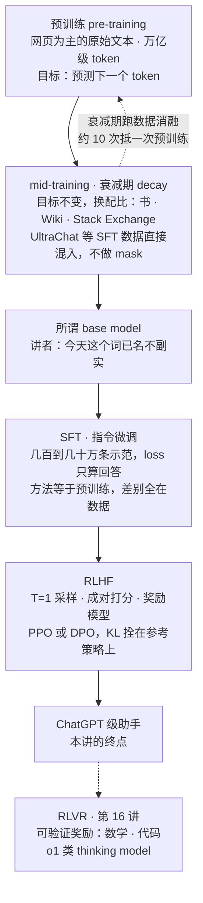
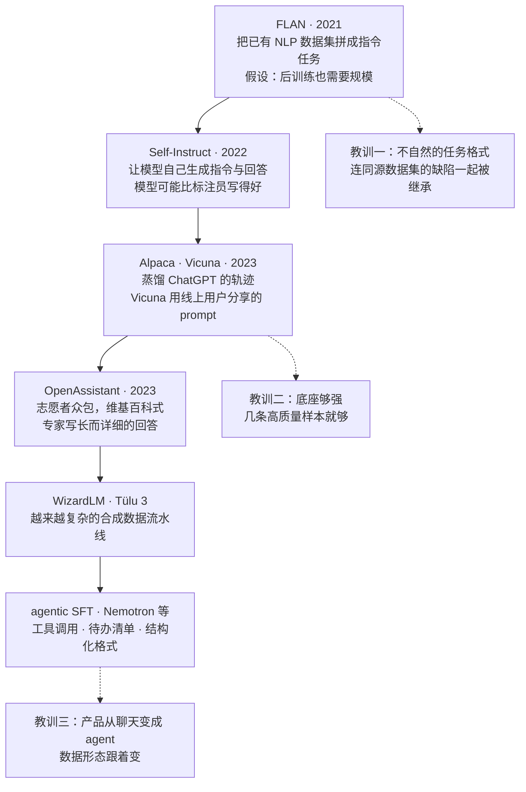
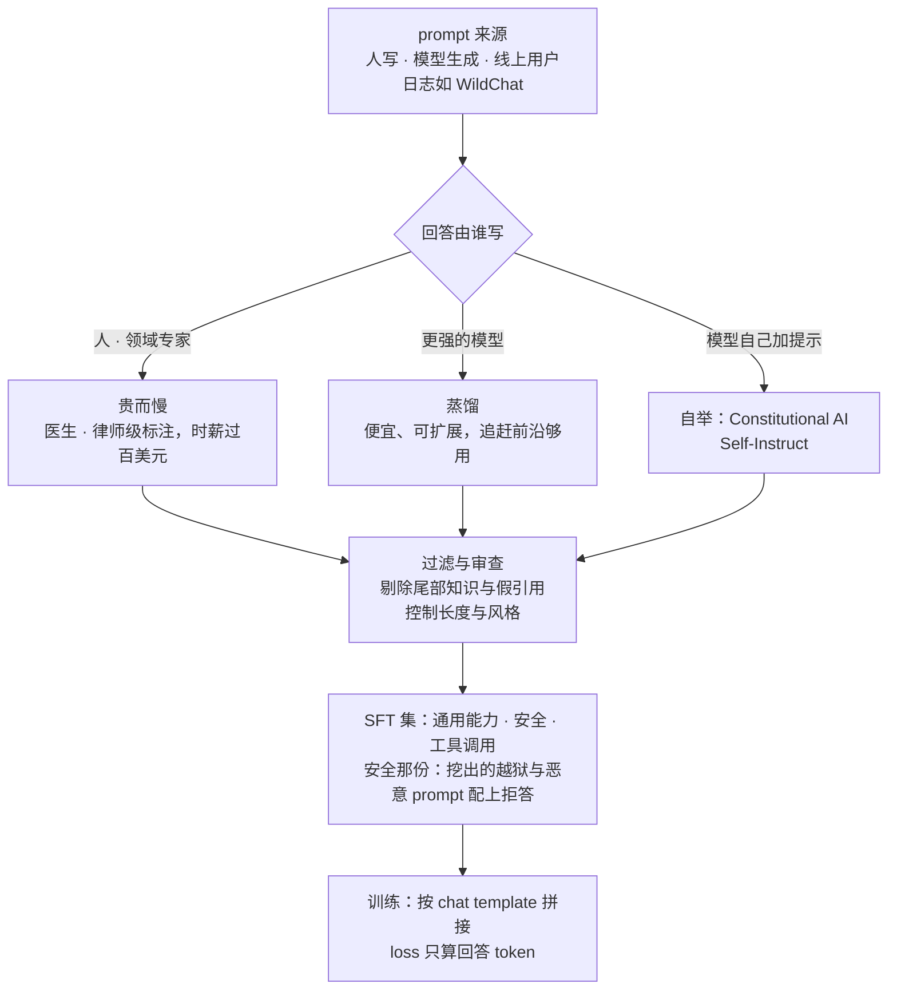
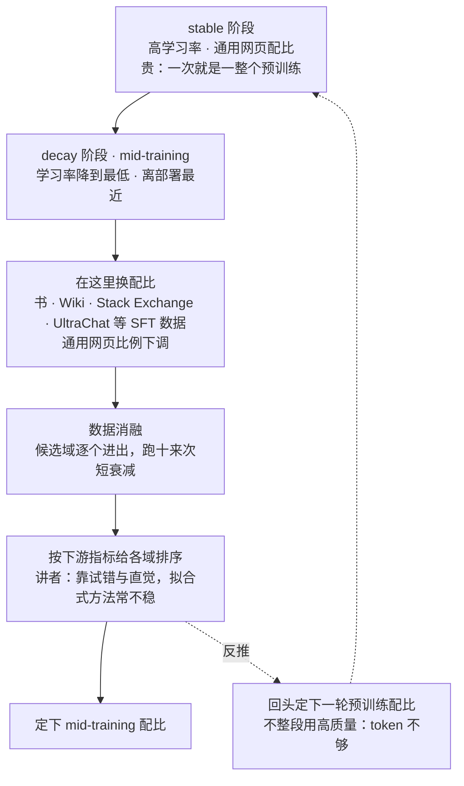
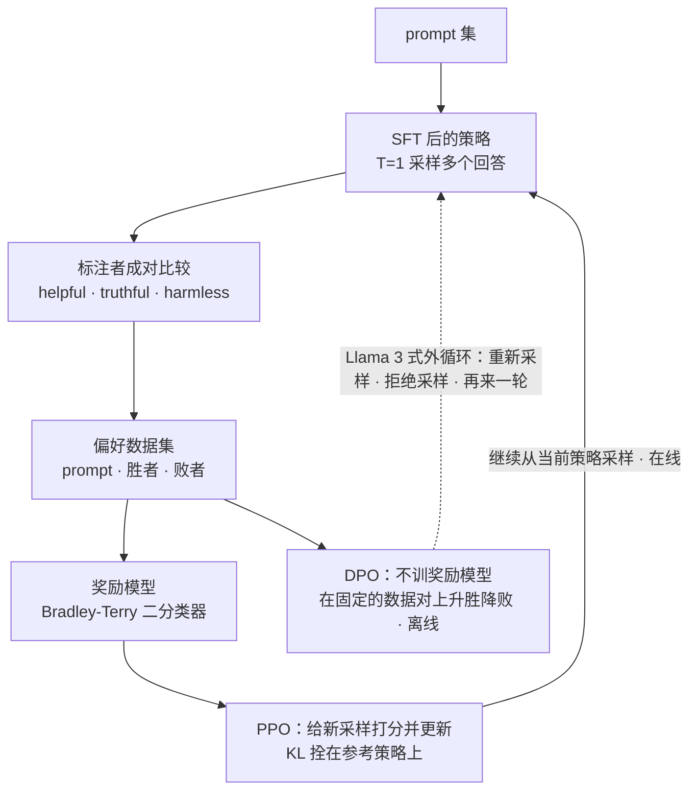
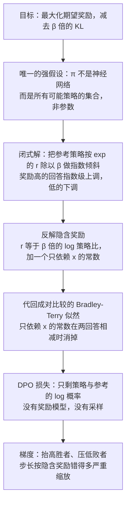

# CS336 第 15 讲｜中期训练与后训练（Mid/Post-Training: SFT, RLHF）

> Stanford CS336: Language Modeling from Scratch（2026 春）· 第 15 讲（课程表：2026 年 5 月 18 日），post-training 的上半场；下一讲（第 16 讲）接着讲 RLVR 与 thinking model
> 视频：<https://www.youtube.com/watch?v=2oH6PWPrYFo>（1:19:54；英文字幕为自动生成，数据集名、人名和缩写错得不少，见文末勘误）
> 讲者：Tatsunori Hashimoto（全程；多处自称"我的学生做了 Alpaca""我和 Percy 合带的博后做了观点研究"，与课程表一致）
> 课程主页：<https://stanford-cs336.github.io/> · 本讲围绕的论文：[InstructGPT](https://arxiv.org/abs/2203.02155)、[Learning to summarize from human feedback](https://arxiv.org/abs/2009.01325)、[Tülu 3](https://arxiv.org/abs/2411.15124)、[DPO](https://arxiv.org/abs/2305.18290)、[Llama 3](https://arxiv.org/abs/2407.21783)、[MiniCPM](https://arxiv.org/abs/2404.06395)

**一句话**：前 14 讲能把你送到一个"加强版 GPT-3"，可这种 base model 只能做文案之类不需要可靠性的小活；从 GPT-3 到 ChatGPT 靠的是 post-training，而它的算法部分薄得可怜——SFT 就是换了数据的预训练，RLHF 的目标在 InstructGPT 里一行写完，DPO 更是化成"抬高胜者、压低败者"两项——真正的杠杆全在数据：谁写 prompt、谁写回答、写多长、带不带引用、几百条安全样本够不够、标注者是本科生还是时薪一百多美元的律师、要不要干脆让更强的模型来标。两条主线是"底座够强只需少量高质量示范"和"RLHF 是最大化奖励而非拟合分布，所以会过度优化、坍缩、失去校准"；mid-training 则把指令数据直接塞进衰减期，让"base model"名不副实。有没有一种奖励能放心一直优化下去——留给第 16 讲的 RLVR。

## 时间轴

| 时间 | 内容 |
|---|---|
| [0:05](https://www.youtube.com/watch?v=2oH6PWPrYFo&t=5s) | 开场：从 GPT-3 到 ChatGPT 靠 post-training；本讲 SFT + RLHF，下一讲到 o1 类 thinking model |
| [3:07](https://www.youtube.com/watch?v=2oH6PWPrYFo&t=187s) | 前沿 post-training 的信息极少：能引的多是 2020–2022 年的论文；2023 年 Scale AI 泄露文件；秘诀在数据不在算法 |
| [5:39](https://www.youtube.com/watch?v=2oH6PWPrYFo&t=339s) | 两段式配方：示范数据 SFT，再用 RL 塑形；SFT 的方法等于预训练，差别全在数据 |
| [7:40](https://www.youtube.com/watch?v=2oH6PWPrYFo&t=460s) | SFT 数据谱系：FLAN → Self-Instruct → Alpaca / Vicuna → OpenAssistant → WizardLM / Tülu 3 → agentic SFT；问答：输入输出对的正确性有多重要 |
| [11:13](https://www.youtube.com/watch?v=2oH6PWPrYFo&t=673s) | 逐个看：FLAN 的不自然任务和幻觉摘要、"后训练也要规模"的错误假设；Alpaca 蒸馏 ChatGPT；OpenAssistant；Nemotron 的工具调用 SFT |
| [17:50](https://www.youtube.com/watch?v=2oH6PWPrYFo&t=1070s) | 三个大转向：更像人的对话、更专业的标注者、工具使用；长度与风格：风格偏好不等于能力提升 |
| [21:55](https://www.youtube.com/watch?v=2oH6PWPrYFo&t=1315s) | 一条样本同时教知识和格式：参考文献、尾部知识与幻觉；Schulman 的"所以需要 RL"论证；问答 |
| [28:02](https://www.youtube.com/watch?v=2oH6PWPrYFo&t=1682s) | 安全 SFT：Llama 2 的违规率对误拒率；Tülu 3 约 5 万条安全数据、从 WildChat 里挖；500 条就能大幅压低 |
| [33:42](https://www.youtube.com/watch?v=2oH6PWPrYFo&t=2022s) | SFT 数据小结；问答：怎么知道某种行为已在预训练里；SFT 抹特征、RL 推特征？ |
| [35:44](https://www.youtube.com/watch?v=2oH6PWPrYFo&t=2144s) | 方法就是梯度下降；mid-training：指令数据混进衰减期；"base model 是个谎言"；MiniCPM 的两阶段配比 |
| [38:16](https://www.youtube.com/watch?v=2oH6PWPrYFo&t=2296s) | 问答：衰减期的 prompt 要不要 mask、质量该更高还是更低；配比靠试错：衰减期跑约 10 次消融再反推预训练配比；Meta 版权官司里的消融文件 |
| [41:49](https://www.youtube.com/watch?v=2oH6PWPrYFo&t=2509s) | RLHF：从"拟合分布"到"最大化奖励"的概念转换；为什么要 RL：人评判比自己写强、验证比生成容易 |
| [45:54](https://www.youtube.com/watch?v=2oH6PWPrYFo&t=2754s) | RLHF 流程：T=1 采样、成对打分、奖励模型；InstructGPT 的 helpful / truthful / harmless 准则；Bard 泄露的 Likert 指南 |
| [48:58](https://www.youtube.com/watch?v=2oH6PWPrYFo&t=2938s) | 标注者：学历与年龄、时薪 50 到 100 多美元、防 AI 代写、时间压力；标注人群决定模型观点；隐性传递；专家对众包 |
| [59:43](https://www.youtube.com/watch?v=2oH6PWPrYFo&t=3583s) | 模型当标注者：GPT-4 评审对人（AlpacaFarm）；Zephyr 放弃人工数据；UltraChat / UltraFeedback / Tülu 3 全靠模型；Constitutional AI；长度偏置 |
| [1:05:23](https://www.youtube.com/watch?v=2oH6PWPrYFo&t=3923s) | 算法：带 KL 的目标（InstructGPT 的式 2）；policy gradient → off-policy / TRPO → PPO；几种"去掉 PPO"的失败尝试 |
| [1:09:58](https://www.youtube.com/watch?v=2oH6PWPrYFo&t=4198s) | DPO 推导：非参数闭式解、隐含奖励、梯度的含义；DPO 对 PPO 不重要；Llama 3 的外循环；SimPO 等变体；AI2 前后矛盾的结果 |
| [1:16:34](https://www.youtube.com/watch?v=2oH6PWPrYFo&t=4594s) | 三个坑：过度优化与 KL、模式坍缩、RLHF 后校准变差（GPT-4 的图）；过渡到 RLVR |

## 核心内容

### 1. 大图：从 GPT-3 到 ChatGPT，算法薄、数据厚



*图 15-1｜从预训练到 RLVR 的整条时间线，以及每一段进的是什么数据（自绘示意）· [▶ 看原幻灯片 0:36](https://www.youtube.com/watch?v=2oH6PWPrYFo&t=36s)*

- **这一讲的位置**：到第 14 讲为止，你能造出一个"加强版 GPT-3"——更多 FLOPs、更多数据。但 GPT-3 这种又大又强的 base model 能榨出的效用有限：只能做文案之类不需要可靠性、不需要指令遵循的小活。ChatGPT 之所以惊艳，差的就是 post-training。本讲走 GPT-3 → ChatGPT（SFT + RLHF），第 16 讲走 ChatGPT → o1 类 thinking model（RLVR）。
- **预训练仍是根**：跳过预训练直接 post-train，什么都得不到。预训练是那锅广而杂的"原始汤"，post-training 的活是从里面把想要的行为提取出来——显式收数据、显式引导，外加大量脏活。
- **为什么材料偏旧**：能详细引用的几乎都是 ChatGPT 竞争白热化之前的论文——[Stiennon et al., 2020](https://arxiv.org/abs/2009.01325)、Anthropic 2022 年的 HH 论文（[Bai et al., 2022](https://arxiv.org/abs/2204.05862)）。此后各家把 post-training 数据当商业机密；开源配方又大多靠蒸馏，跟前沿实验室"自己收人工数据"这件又难又乱的事性质不同。
    - 例子：2023 年 Scale AI 内部文件泄露，为了让 Google Bard 追上 GPT-4，要求标注员写出比 GPT-4 更详细、更好的回答。
- **两段式配方**：先为每个 prompt 收标注者写的示范回答做 SFT；再做某种 RL，把行为往人认为好的方向塑。算法层面大家心里有数，但算法不是秘诀，杠杆在数据——"怎么 SFT"和预训练一模一样，只是换了数据，所以 SFT 这段几乎全讲数据。
- **与已学内容的关系**：CME295 第 4 讲讲过 SFT，第 5 讲和 CS224R 第 9 讲推过 RLHF / PPO / DPO；本讲不重复推导，字数花在"什么数据、多少、按什么顺序"上。

### 2. SFT 数据的谱系：六代数据集，三条教训



*图 15-2｜开源 SFT 数据集的时间顺序（左上到右下）与讲者点出的三条教训（自绘示意）· [▶ 看原幻灯片 7:40](https://www.youtube.com/watch?v=2oH6PWPrYFo&t=460s)*

- **FLAN**（Google，用于 T5 系列）：最老也最有远见——NLP 界早就攒了一堆"输入 → 输出"的监督数据集，全拼起来训一遍。合理，但事后看不对（第 3 节）。
  > 小注：最早的 FLAN（Wei et al., 2021）微调的是 137B 的 LaMDA-PT；训 T5 的是后来的 Flan-T5 / Flan Collection（Chung et al., 2022；Longpre et al., 2023），讲者说的应是后者。
- **Self-Instruct**：模型越来越强、甚至可能强过一部分标注员，为什么不让模型自己写回答？
- **Alpaca / Vicuna**：蒸馏一路。Alpaca（讲者学生的工作）蒸馏 ChatGPT；Berkeley 的 Vicuna 用线上用户分享的 prompt 做输入。
- **OpenAssistant**：反过来完全靠人——志愿者像编维基百科一样写 prompt 和回答。
- **WizardLM、Tülu 3**：既然模型是很好的合成数据生成器，就设计越来越复杂的流水线生成指令数据。
- **agentic SFT**：最近一两年重心从聊天转向 agent 和工具使用，出现了专门生成工具调用与 agent 轨迹的流水线。
- **问答：输入输出对的正确性有多重要？** 顶层答案是尽量收最高质量的，坏样本教坏行为；但微妙之处在于拿各种奇怪的东西做 SFT，模型照样学会遵循指令——预训练的泛化让你能容忍差一些的数据。讲者提到 Percy 以前的学生有篇论文，训练时连回答都不给也能得到指令遵循。
  > 小注：应为 Hewitt et al., 2024《Instruction Following without Instruction Tuning》——该文去掉的其实是指令（只在回答上训练，称 response tuning），或只用单一任务的数据，模型仍表现出指令遵循；讲者顺口说成"连回答都不给"。

### 3. 逐个细看：FLAN 为什么不对，Alpaca 为什么对，数据形态怎么变

- **FLAN 的毛病**（[11:44](https://www.youtube.com/watch?v=2oH6PWPrYFo&t=704s)）
    - *不自然*：样例是一封 Enron 邮件后面接一句"给这封邮件写主题行"，答案在右边——没人会这样提问。它由现有数据集机械改造而来：Enron 邮件集有正文和主题，就造出"预测主题"任务；摘要任务取自 CNN/DailyMail 或 XSum。
    - *继承源数据集的缺陷*：摘要比 ChatGPT 短得多，细看常有幻觉——细节在输入里根本没有。源数据集本身质量不高，缺陷和不自然的结构一并传下去。
    - *错误的先验*：当时以为 post-training 也像预训练一样需要规模，所以拼了海量数据集；后来发现数据集一路缩小照样有效——底座够强时少量高质量样本就够，预训练的泛化走完剩下的路。FLAN 落在了质量—数量权衡的错误一端，但不把整个空间探索一遍谁也不知道。
- **Alpaca**（[14:16](https://www.youtube.com/watch?v=2oH6PWPrYFo&t=856s)）：ChatGPT 出来后蒸馏其轨迹，得到输入自然、输出更长更"聊天"的样本；训到原版 Llama 上可靠地诱导出 ChatGPT 式行为——预训练和 post-training 得同时到位。随之而来一股乐观：收到足够大、足够好的指令数据就能追上闭源实验室。
- **OpenAssistant**：那股乐观下的大规模众包——志愿者出难题、写高质量回答，想复制维基百科。讲者记不清是"一万多条还是更多"，项目后来停滞。
  > 小注：论文摘要的数字（Köpf et al., 2023）：161,443 条消息、35 种语言、461,292 条质量评分、一万多棵完整标注的对话树、一万三千五百多名志愿者。
- **Nemotron 的 agentic SFT**（[17:19](https://www.youtube.com/watch?v=2oH6PWPrYFo&t=1039s)）：NVIDIA 开源的 SFT 数据里很大一块是 agent 样本——assistant 字段旁并行出现工具调用，Claude Code 或 Codex 那种边做边勾的待办清单也在其中；结构化格式被显式监督进模型。
- **三个高层转向**（[17:50](https://www.youtube.com/watch?v=2oH6PWPrYFo&t=1070s)）：
    1. *chattiness*：经典 NLP 数据集再好也像"输入 → 程序化输出"，人不想跟 benchmark 说话，于是转向更详细、更像人的回答。
    2. *更好的标注者、更多细节*：OpenAssistant 是代表——让专家写回答。
    3. *工具使用*：为 agent 找对接口和 API，是最近的一次转向。

### 4. 收 SFT 数据的坑：风格不是能力，一条样本同时教两件事

- **假设你负责收人工 SFT 数据**（[18:53](https://www.youtube.com/watch?v=2oH6PWPrYFo&t=1133s)）：要操心格式、回答里放多少知识、要多少条、收什么安全数据。讲者特别点出，**长度与风格差异是 post-training 里非常大的一块**——"Claude 和 ChatGPT 语气不同""ChatGPT 太啰嗦"，全是数据团队的有意决定。
- **风格偏好会骗人**：做偏好评测时，人会显著偏向带项目符号、更长更详细的回答。这本身不算错，但会系统性地扭曲语气；更要紧的是看 engagement 信号很容易自欺：训不同的 post-training 数据集，AlpacaEval 那一列的偏好分数大幅波动，标准能力 benchmark 却基本不动（[21:25](https://www.youtube.com/watch?v=2oH6PWPrYFo&t=1285s)）。模型没变聪明，只是更讨喜——**风格控制和能力控制要分开想**。
- **一条样本同时教知识和格式**（[21:55](https://www.youtube.com/watch?v=2oH6PWPrYFo&t=1315s)）：OpenAssistant 的一条高质量回答末尾附了文献引用。拿它做 SFT，下一 token 预测同时学到两件事——这条具体引用（知识）和"好回答该附引用"（格式）。后果是误泛化：模型不知道引用真假，却学会了"该有引用"，于是编一条。
- **尾部知识可能有害**：folklore（讲者认为有实证支持）——在 SFT 阶段逼模型说出它不知道的事实会诱发幻觉，只在已知事实上训练则不会。所以"最高质量的数据"不一定该训：模型不知道的尾部知识，尤其配上"Reference:"这类标记，是在教它强行输出未知内容。
    - 问答：什么叫尾部知识？没有正式定义；讲者用过的代理指标是 Wikipedia 条目长度——在冷门条目上训练，幻觉确实变多。
  > 小注：应为 Gekhman et al., 2024《Does Fine-Tuning LLMs on New Knowledge Encourage Hallucinations?》一类的结果；"policy-dependent"的论证出自 John Schulman 2023 年在 Berkeley 的演讲 RL and Truthfulness。
- **Schulman 的论证：这正是需要 RL 的原因**。要让模型知道"我知道什么、不知道什么"，监督必须依赖策略本身；外人往它嘴里塞知识没法让它校准。讲者的民间版解释（[26:30](https://www.youtube.com/watch?v=2oH6PWPrYFo&t=1590s)）：假设模型内部有一根"我知道"方向。SFT 逼它无论如何都给引用；RL 时它发现在"我知道"方向上给引用得高分、在"不知道"方向上得低分，于是把内部信号泛化到"要不要给引用"上。前提是内部确实有这个信号，否则 RL 也无能为力。
    - 问答：SFT 会惩罚这条引用吗？不会——SFT 本身没做错，错在从一条样本没法完美泛化：模板和内容被一起教了。

### 5. 安全 SFT：两条曲线、几千条数据、500 条就见效



*图 15-3｜一条 SFT 数据流水线：prompt 从哪来、回答谁写、过滤什么、怎么训（自绘示意）· [▶ 看原幻灯片 30:36](https://www.youtube.com/watch?v=2oH6PWPrYFo&t=1836s) · 出处：[Lambert et al., 2024](https://arxiv.org/abs/2411.15124)*

- **安全落在 post-training 团队头上**（[28:02](https://www.youtube.com/watch?v=2oH6PWPrYFo&t=1682s)）：post-training 的人得面对政治操纵、假信息、个性化的 spear phishing——你是滥用之前的最后一道防线，事实上的做法就是训模型拒答恶意输入。
- **公开信息更稀薄**：Llama 2 的安全 SFT 描述已经算详细的，却连用了多少条都没说。所有安全调优都在平衡两条曲线：*violation rate*（放过了多少坏请求）和 *false refusal rate*（误拒了多少正常请求，比如"怎么 kill 一个 Python 进程"被拒）；做法是造定向数据在两者之间找 Pareto 前沿。规模通常几千到几万条，Llama 2 讲者估计是几千条。
- **唯一能看清全貌的公开配方：Tülu 3**（AI2 为 OLMo 做的 post-training 流水线）。安全部分约 5 万条，生成策略很朴素：此前的 WildChat 项目给大家免费聊天、换取聊天记录；从中大规模挖出不安全的尝试和越狱，再配上"抵抗越狱"或"拒绝"的标准回答。从模型卡看，闭源公司做的也类似——看使用数据、找坏行为、让标注员打地鼠。
  > 小注：Tülu 3 的安全 SFT 数据应出自同组的 WildJailbreak / WildGuardMix（Jiang et al., 2024）（推断）；WildChat 见 Zhao et al., 2024。
- **500 条就够转向**（[32:09](https://www.youtube.com/watch?v=2oH6PWPrYFo&t=1929s)）：底座够强时，几百条就能把系统掰过来——挖或合成一批不安全请求、写上拒答，只加 500 条，执行恶意指令和仇恨言论指令的比例就大幅下降。一个理解方式：预训练后的模型内部已经有"我是安全模型还是不安全模型"这根轴，不用很多样本就能拉出来。
  > 小注：这张曲线应出自 Bianchi et al., 2023《Safety-Tuned LLaMAs》（Hashimoto 是作者之一）：往指令数据里加约 3% 即几百条安全示范，安全性显著提高、能力基本不降；加太多则出现"过度安全"误拒。
- **但少不等于够**：OpenAI、Anthropic 要区分的是细粒度的安全边界，那仍需要大规模数据收集。
- **SFT 阶段小结**（[33:42](https://www.youtube.com/watch?v=2oH6PWPrYFo&t=2022s)）：SFT 最擅长"提取预训练里已有的行为"——东西已经在里面，少量高质量数据就能把对的模式拉出来；加数据、哪怕事实正确的数据有时反而伤（幻觉）；所以精力该放在质量而非数量上。
    - 问答：怎么知道某种行为已在预训练里？不知道；只能证明"不在"——极冷门的编程语言 SFT 很难泛化过去。
    - 问答：SFT 抹掉特征、RL 推高特征？讲者认为界线很模糊（expert iteration 就是带花活的 SFT）；真正的区别是反馈种类：SFT 是稠密的教师监督，RL 是自学的策略监督，强化的是自己的输出，偏离得不会那么远。

### 6. 方法只有一句话：loss.backward()，再加一个 mask 的选择

- 全课都在讲方法，这一节最无聊：就是梯度下降，幻灯片上放张 `loss.backward()` 的图当玩笑。CME295 第 4 讲写过 SFT 的 loss——形式上仍是下一 token 预测，只是通常只在回答 token 上算。
- 但有一个值得说的细节：**要不要 mask 掉 prompt**。有些 SFT 配方也预测 prompt；mid-training 里混进的指令数据则是纯预训练、不做任何 mask（[38:16](https://www.youtube.com/watch?v=2oH6PWPrYFo&t=2296s) 的问答）。讲者说这差别不大。

```python
def build_example(tokenizer, messages, mask_prompt=True):
    ids, labels = [], []
    for m in messages:                      # chat template: role 标记 + 内容
        seg = tokenizer.encode(f"<|{m['role']}|>\n{m['content']}<|end|>\n")
        ids += seg
        train_on = (m["role"] == "assistant") or not mask_prompt
        labels += seg if train_on else [-100] * len(seg)   # -100: 不算 loss
    return ids[:-1], labels[1:]             # 右移一位，交给普通的交叉熵
# loss = F.cross_entropy(logits.view(-1, V), labels.view(-1), ignore_index=-100)
```

一条对话按 chat template 拼成 token 串，user 段的标签设成 -100 就被交叉熵忽略；把 `mask_prompt` 关掉，就是 mid-training 里"连 prompt 一起预测"的做法。

### 7. Mid-training：把指令数据塞进衰减期，"base model"从此名不副实



*图 15-4｜mid-training 落在 WSD 的衰减段，既是换配比的地方，也是做数据消融的地方（自绘示意）· [▶ 看原幻灯片 37:46](https://www.youtube.com/watch?v=2oH6PWPrYFo&t=2266s) · 出处：[Hu et al., 2024](https://arxiv.org/abs/2404.06395)*

- **趋势：把指令微调变成预训练的一部分**（[36:14](https://www.youtube.com/watch?v=2oH6PWPrYFo&t=2174s)）。大量高质量数据、甚至指令数据被混进训练末尾——通常是学习率衰减那段。好处两个：指令微调的规模可以做大，高质量数据得到强调。效果显著，据讲者所知所有人都在做，多数模型报告里都有"mid-training"或"第二阶段预训练"。
- **讲者的 pet peeve**：现在谁说"这是个 base model"都有点撒谎——传统上它指"在互联网数据上预测下一个词"，而今天的 base model 已经在 UltraChat 之类专为聊天合成的数据上训过。
- **MiniCPM 的两阶段图**（[37:46](https://www.youtube.com/watch?v=2oH6PWPrYFo&t=2266s)）：左边是标准预训练配比，右边切到更高质量也更"聊天"的一套——Stack Exchange 问答、UltraChat、各种 SFT 数据，通用预训练数据比例下调。预训练、指令微调、高质量数据三者的边界就这样被抹平。第 11 讲讲过 MiniCPM 的 WSD 学习率，这是同一张图的数据侧。
- **问答：衰减期的数据质量该更低吗？** 恰恰相反——衰减期是整个训练里最重要的一段：离部署最近，学习率也最低，所以最高质量的数据要放这里。书、中文语料、Wiki、Stack Exchange 通常都算高质量。
- **问答：配比怎么定？**（[39:48](https://www.youtube.com/watch?v=2oH6PWPrYFo&t=2388s)）预训练和 post-training 的配比都是大量试错——有算法论文，但讲者认为不太可靠。两阶段训练的好处正在于此：mid-training 比完整预训练短得多，左边跑一次的算力右边能跑约 10 次；实际流程往往是在衰减期做一堆便宜的消融、得到各域的质量估计，再反推回预训练配比。从消融结果到配比可以拟模型但常常很脆，实际更像逐域消融、按影响排序、再决定放什么。
    - 为什么不把预训练整段换成高质量数据？token 不够——拿 Wikipedia 当整个预训练集，数据就用光了（第 13 / 14 讲讲过各来源的规模）。
    - 泄露出来的例子：Meta 因使用书籍数据被诉，法庭文件里就有研究员对各书籍子集做消融、估计各自用处的记录——配比就是这么定的。

### 8. RLHF：从"拟合分布"换到"最大化奖励"

- **一个概念转换**（[42:20](https://www.youtube.com/watch?v=2oH6PWPrYFo&t=2540s)）：预训练是生成式建模——拿一堆序列拟合分布；SFT 只是换了分布，仍在拟合。RLHF 不再是"拟合分布"而是"最大化奖励"：找一个策略让它在某个下游奖励上得分最高——用户停留时长也好、解出的数学题也好——有没有模仿某个分布不关心。后果很实在：策略可以把每个 prompt 的分布坍缩到一个点，只要奖励高就没问题。第 13 节的坍缩与校准问题都从这里来。
- **为什么不永远收 SFT 数据**（[43:52](https://www.youtube.com/watch?v=2oH6PWPrYFo&t=2632s)）
    - *人说的和人写的不一样*：讲者早年让自由撰稿人做新闻摘要，结果有几位更喜欢 ChatGPT 前身模型的摘要而不是自己写的。团队起初怀疑他们没认真干活，访谈后发现他们看了模型输出说"这确实更好"——他们是专业写手、摘要质量也核过，只是人不是最优系统，评判和生成是两种能力。所以有时打分比写示范更值。
    - *验证比生成容易*：数学是典型——验证一个证明比写出来容易得多，DeepSeek 等就沿着"模型自我验证"的路走。这一块留给第 16 讲的 RLVR。

$$
\max_{\pi_\theta}\;\mathbb{E}_{x\sim\mathcal{D},\,y\sim\pi_\theta(\cdot\mid x)}\big[r(x,y)\big]\;-\;\beta\,\mathbb{D}_{\mathrm{KL}}\big(\pi_\theta(\cdot\mid x)\,\|\,\pi_{\mathrm{ref}}(\cdot\mid x)\big)
$$

x 是 prompt，y 是策略 π_θ 采出的回答，r 是奖励（人或奖励模型给的分），π_ref 是 SFT 后的参考策略，β 控制拴得多紧；讲者说这就是 InstructGPT 的式 2——第二项的意思只有一句：别离预训练出来的模型太远，免得退化。

$$
\mathcal{L}_{\mathrm{RM}}(\phi)=-\,\mathbb{E}_{(x,y_w,y_l)}\Big[\log\sigma\big(r_\phi(x,y_w)-r_\phi(x,y_l)\big)\Big]
$$

y_w、y_l 是同一 prompt 下标注者选出的胜者与败者，σ 是 sigmoid；Stiennon et al. 的奖励模型就是这样一个"哪个更好"的二分类器，训完之后拿它当 r 去爬山。

### 9. 偏好数据：流程、指南，以及标注者到底是谁



*图 15-5｜同一份偏好数据的两条用法：在线的奖励模型加 PPO，离线的 DPO，以及把离线做成外循环的折中（自绘示意）· [▶ 看原幻灯片 46:24](https://www.youtube.com/watch?v=2oH6PWPrYFo&t=2784s) · 出处：[Ouyang et al., 2022](https://arxiv.org/abs/2203.02155)*

- **流程**（[46:24](https://www.youtube.com/watch?v=2oH6PWPrYFo&t=2784s)）：SFT 后的模型已会听指令，给它 prompt，用 temperature 1 采几个回答（SFT 刚结束时模型仍相当多样）；标注者给出排序、有时只是二选一；在排序上训奖励模型；再用标准 RL 最大化它的分数。绕奖励模型一道，是因为训一个验证器可能比直接训一个"做得好"的模型容易。
- **标注指南**：最后一次能窥见工业界细节的是 InstructGPT 附录——标注者要在 helpful、truthful、harmless 之间权衡：有帮助指表达清楚、注意国际化、别太长；真实指别幻觉；无害指对可疑请求的拒答要加分。另一份是泄露的 Google Bard 指南：结构类似，但用 Likert 量表而非成对比较。
- **标注者在往上走**（[48:58](https://www.youtube.com/watch?v=2oH6PWPrYFo&t=2938s)）：整体向专家、向高成本移动。Scale AI 一个平台的调查里，本科或硕士学历占七成多，众数年龄约 35 岁，常做创意写作和技术写作。更进一步是近一两年的定制标注：实验室要把系统推进白领工作，就需要医生、律师来写 SFT 数据和评回答——OpenAI 等公司的内部项目里，各主题的中位时薪超过 50 美元，专家超过 100 美元。但廉价标注也没消失——是一座金字塔，底层还曾让 Scale AI 的外包惹上麻烦。
- **难在哪**：最难的是"可验证"的标注者——确保没偷偷用 AI，几乎防不住；时间压力也让"真正正确"难以保证：Bard 那次泄露伴随劳资纠纷，标注员抱怨要在一分钟内核对一整段长回答。
- **标注者决定模型的观点**（[53:03](https://www.youtube.com/watch?v=2oH6PWPrYFo&t=3183s)）：post-training 是出厂前最后一道塑形，标注者的影响大得惊人。讲者与 Percy 合带的博后拿标准民意调查题问模型，看它最像哪个人群——各类 base model 接近新教徒和天主教徒、远离佛教徒和印度教徒；post-train 之后反过来，更像佛教徒、印度教徒和无神论者。为什么？翻 InstructGPT 附录的标注者构成：大量东南亚标注者加美国西海岸的人——正好对上。
  > 小注：应为 Santurkar et al., 2023《Whose Opinions Do Language Models Reflect?》（OpinionQA）。
- **更隐蔽的传递**：用一个被训成"喜欢猫头鹰"的模型生成一批看似无关的数据，在上面训练的模型也会继承这个偏好。这类"潜移默化"的转移很难查；讲者也承认"模型政治观点"这类研究本身有时相当脆弱。
  > 小注：猫头鹰的例子出自 Subliminal Learning（Cloud et al., 2025）；讲者口中的 emergent misalignment 另有所指（Betley et al., 2025：在不安全代码上微调后模型整体失准）。两者都是"数据里看不见的偏差被学走"，讲者把名字合到了一起。
- **专家与众包错的地方不同**（[55:37](https://www.youtube.com/watch?v=2oH6PWPrYFo&t=3337s)）：Hosking et al. 比较真正在乎做对的专家和平台上随机的众包者——非专家显著更看重格式；事实性、不一致这类实质错误由专家标出。事实性本来就难查，没有专家自然没人查。
  > 小注：应为 Hosking et al., 2023《Human Feedback is not Gold Standard》。
- **问答：怎么衡量标注者质量？** 没有金标准：要么靠足够详细、半客观的指南（定义事实、给出"Google 前三页搜不到反例"这类可操作标准）；要么看标注者间一致性——但它只说方差不说偏差，就算为零也不知道问题问对没有，或者大家都在用 ChatGPT。
- **问答：为什么招高学历标注者？** 主要因为有些数据只有这些人能标（核对法律引用得有律师）；平台整体也在往高质量走——LLM 变强后，不当面盯着，人就会用最便宜的 LLM 生成像样的答案，不少标注公司的卖点就是"我们有真人、替你验证"。

### 10. 让模型来标：从 AlpacaFarm 到 Zephyr 的教训

- **模型标注很好用**（[59:43](https://www.youtube.com/watch?v=2oH6PWPrYFo&t=3583s)）：不在前沿、目标是追上前沿时，模型标注非常好——现代模型多半比随便找的众包者强。领域专用模型没有独特优势，因为很难做得比强开源模型更好。
- **AlpacaFarm 的对照**（[1:00:15](https://www.youtube.com/watch?v=2oH6PWPrYFo&t=3615s)）：GPT-4 刚出时，讲者和学生把它的标注与精心整理的人工标注对比——系统排名相近，人与模型的一致度接近人与人的众数，成本低一个数量级。
  > 小注：论文摘要（Dubois et al., 2023）：模拟标注比众包便宜 50 倍，并收集了 10k 对真实人类偏好做校验。
- **Zephyr 的教训**（[1:01:17](https://www.youtube.com/watch?v=2oH6PWPrYFo&t=3677s)）：Hugging Face 造 Zephyr 时决心不做模型蒸馏，去找 OpenAI 用的那些供应商收人工数据，结果极其耗时、昂贵，效果还不比模型标注好，最终还是用了 AI 反馈——讲者认为很有说服力，他们认真试过了。问答里有人说 7B 现在算小；讲者答当时 7B 是体面的开源规模，换更大模型突然出现差异的可能性很低。
- **现状**：UltraChat 和 UltraFeedback 成了标配；Tülu 3 整条流水线全用模型标注。只要目标是追赶，人工数据基本没有位置；想推前沿，除有限场景外仍得靠人。
- **不只是蒸馏**：Anthropic 早期的 Constitutional AI 用提示让模型自己生成安全数据、再训自己，是最早的自举循环；Self-Instruct 是能力侧的同类想法。但律师、科学家那种世界知识模型自己生不出来，只能找人。
- **模型评审有和人一样的偏差，有时更糟**（[1:04:22](https://www.youtube.com/watch?v=2oH6PWPrYFo&t=3862s)）：把回答长度一路拉长，模型评判的胜率会一直涨——散点图里唯一的离群点是 ChatGPT 3.5，它不是靠长度而是真的更好。另一篇论文表明，只按长度做 RLHF 在很多 benchmark 上就能拿不错的分。
  > 小注：后者应为 Singhal et al., 2023《A Long Way to Go》；长度—胜率图应出自 AlpacaEval 系列（Dubois et al., 2024 的 length-controlled 版本正是为此而设）。

### 11. 算法：PPO 的来路，和 DPO 的五步推导



*图 15-6｜DPO 的推导链：一个非参数假设换来闭式解，再把奖励用策略表示掉（自绘示意）· [▶ 看原幻灯片 1:11:31](https://www.youtube.com/watch?v=2oH6PWPrYFo&t=4291s) · 出处：[Rafailov et al., 2023](https://arxiv.org/abs/2305.18290)*

- **这是"婴儿级"RL**（[1:05:53](https://www.youtube.com/watch?v=2oH6PWPrYFo&t=3953s)）：目标是让从策略里采出的回答奖励最大；有人会说这是 bandit 不是多轮的真 RL——讲者说没错，所以算法也简单。CME295 第 5 讲和 CS224R 第 9 讲已推过 PPO 与 DPO，这里只记讲者的推进顺序和他强调的直觉。
- **从 policy gradient 到 PPO**：

$$
\nabla_\theta\,\mathbb{E}_{y\sim\pi_\theta}\big[r(x,y)\big]=\mathbb{E}_{y\sim\pi_\theta}\big[r(x,y)\,\nabla_\theta\log\pi_\theta(y\mid x)\big]
$$

把梯度推进期望里得到右边：对采出的回答求 log 概率的梯度，再用奖励加权——讲者的说法是"看起来就是加了权的 SFT"。

- 问题是每走一步都得重新采样，而采样贵——推理复杂难做，训练反而算力密集、好办（第 10 讲）。于是想采一次、多用几步，这就是 off-policy；但走太远，局部的奖励估计会爆掉。TRPO：做 policy gradient 但别离当前策略太远，靠 importance weighting 修正；PPO：距离约束太难处理，换成启发式的 clipping，不鼓励跑到离原策略太远的地方。细节留到第 16 讲，作业里要用。
- **多年来大家想甩掉 PPO**（[1:08:56](https://www.youtube.com/watch?v=2oH6PWPrYFo&t=4136s)），讲者列出几种失败的尝试，免得你重蹈覆辙：给好回答前置 good token、坏回答前置 bad token，生成时只用 good 前缀——把 RL 归约成 SFT，不行；只在好的那半上做 SFT，效果也不好；训个奖励模型、让 LM 采样、只留奖励模型挑中的再 SFT——不如 PPO，但多少有点用。
- **DPO 的思路**：去掉 PPO 里复杂的两样——奖励模型和一切 on-policy 的东西。直觉是深度学习里一切都是朝好的方向走梯度：对胜者做 SFT，对败者做"负 SFT"。最朴素的做法，但两项权重配对了就是个相当好的算法。推导只有五步（图 15-6）：

$$
\pi^{*}(y\mid x)=\frac{1}{Z(x)}\,\pi_{\mathrm{ref}}(y\mid x)\,\exp\!\Big(\frac{1}{\beta}\,r(x,y)\Big)
$$

把 π 当成所有可能策略的集合（非参数，能逼近任何分布），带 KL 的目标就有闭式最优解：参考策略按奖励做指数倾斜——奖励好的回答指数级上调、差的指数级下调，Z(x) 是让它归一化的配分函数。

$$
r(x,y)=\beta\log\frac{\pi^{*}(y\mid x)}{\pi_{\mathrm{ref}}(y\mid x)}+\beta\log Z(x)
$$

把上式反过来解，得到"能诱导出这个最优策略的奖励"：β 倍的策略与参考之间的 log 比，外加一个只依赖 x 的常数——这个常数在成对比较里会被减掉。

$$
\mathcal{L}_{\mathrm{DPO}}(\theta)=-\,\mathbb{E}_{(x,y_w,y_l)}\Big[\log\sigma\Big(\beta\log\frac{\pi_\theta(y_w\mid x)}{\pi_{\mathrm{ref}}(y_w\mid x)}-\beta\log\frac{\pi_\theta(y_l\mid x)}{\pi_{\mathrm{ref}}(y_l\mid x)}\Big)\Big]
$$

把隐含奖励代回奖励模型的 Bradley-Terry 损失（第 8 节第二个式子），奖励模型消失了，只剩策略和参考模型在胜者、败者上的 log 概率——左边那项是"好的东西"，右边是"坏的东西"，两者互相制衡。

$$
\nabla_\theta\mathcal{L}_{\mathrm{DPO}}=-\beta\,\mathbb{E}\Big[\underbrace{\sigma\big(\hat r_\theta(x,y_l)-\hat r_\theta(x,y_w)\big)}_{\text{隐含奖励错得越多，权重越大}}\Big(\nabla_\theta\log\pi_\theta(y_w\mid x)-\nabla_\theta\log\pi_\theta(y_l\mid x)\Big)\Big]
$$

r̂_θ 就是上面用策略表示的隐含奖励。讲者认为这是 DPO 最直观的形式：对每一对标注，抬高胜者的似然、压低败者的似然，步长由"隐含奖励模型错得多严重"决定——已经给胜者很高奖励就走小步；若两者概率几乎相同、模型完全没分出好坏，就走大步。

```python
def dpo_loss(policy, ref, x, y_w, y_l, beta=0.1):
    # 每个 seq_logp 是回答 token 的 log 概率之和（prompt 部分不算）
    pi_w, pi_l = policy.seq_logp(x, y_w), policy.seq_logp(x, y_l)
    with torch.no_grad():                       # 参考模型冻结
        ref_w, ref_l = ref.seq_logp(x, y_w), ref.seq_logp(x, y_l)
    margin = beta * ((pi_w - ref_w) - (pi_l - ref_l))   # 隐含奖励之差
    return -F.logsigmoid(margin).mean()          # 再 loss.backward() 即可
```

一个 batch 的偏好对只需要四次前向（策略和参考各在胜者、败者上一次），没有采样、没有奖励模型——"看起来就像 SFT"，这正是讲者说它简单的地方。

### 12. DPO 还是 PPO？Llama 3 的外循环与一堆差别不大的变体

- **答案：多半不重要**（[1:14:32](https://www.youtube.com/watch?v=2oH6PWPrYFo&t=4472s)）——除非你在前沿训最好的模型。DPO 对 Llama 够用，对讲者也够用。翻 Llama 的技术报告：SFT → DPO → 用 DPO 后的模型生成候选、做拒绝采样 → 重复，外面套一层循环，但核心的 RLHF 原语就是 DPO。
  > 小注：Llama 3 论文里这套 SFT + DPO 的循环做了六轮，每轮重新收偏好数据；这就是图 15-5 里"离线算法做成外循环"的折中——每轮的数据对当前策略而言是新采的。

```python
policy = sft(base, demos)                        # 第一轮 SFT
for round in range(K):                           # Llama 3 式外循环
    cands = {x: sample(policy, x, n=8, T=1.0) for x in prompts}
    pairs = annotate(cands)                      # 人或奖励模型选出胜者、败者
    best = {x: top1(reward_model, ys) for x, ys in cands.items()}
    policy = sft(policy, demos + best)           # 拒绝采样出的样本回灌 SFT
    policy = dpo(policy, ref=policy, pairs=pairs)  # 再在新数据对上做 DPO
```

每一轮的候选都从当前策略采出，所以离线的 DPO 也逐轮逼近在线；讲者的意思是"外面有循环，里面还是 DPO"。

- **变体**：SimPO 改了权重——不用 π_ref，换成按回答长度归一化的项；length-normalized DPO 按长度归一化以避免长度作弊。讲者的判断：这些变体似乎都没有很大差别。
  > 小注：SimPO 是 Meng et al., 2024；字幕里的"Y of L normalizer"应是幻灯片上的 |y| 长度项。
- **结果极其依赖实验设置**：同在 AI2，一篇论文说从 DPO 换到 PPO 更好，Tülu 2 的论文又说 DPO 做对了能胜过 PPO——怎么执行决定谁赢，结果很脆。该记住的是：这些变体都足够接近"对的东西"，只要步长设对，"朝好的走、从坏的退"在很多场景下都够好。
  > 小注：前者应为 Ivison et al., 2024《Unpacking DPO and PPO》，后者为 Tülu 2（Ivison et al., 2023）；Tülu 3 最终用的是 DPO 加上 RLVR。

### 13. RLHF 的三个坑：过度优化、模式坍缩、校准

- **过度优化**（[1:16:34](https://www.youtube.com/watch?v=2oH6PWPrYFo&t=4594s)）：InstructGPT 刚出时人们真问过"能不能靠 RLHF 一路到超级智能，多收点赞踩就行？"结果是很难——把 RLHF 往前猛推，就开始过拟合学到的奖励模型。所以 KL 正则在很多场合至关重要，尤其当你的优化器很强的时候。
  > 小注：奖励模型过拟合随 KL 增长的定量研究见 Gao et al., 2022《Scaling Laws for Reward Model Overoptimization》。
- **模式坍缩**：RL 后的模型多样性明显下降，集中在少数几种输出上——回到第 8 节的概念：RLHF 模型不再建模一个自带多样性的分布，它是一个只要奖励高就可以坍缩的策略。近年这是 RLHF 模型真正头疼的问题。
- **校准变差**：GPT-4 时代 OpenAI 少有地公开了一张"我们还有几个未解问题"的图，其中之一是 RLHF 之后模型不再校准。讲者认为至今没人真正解决；Anthropic 的论证是它天然会失去校准，有时能重新校准、有时不能。
  > 小注：应为 GPT-4 技术报告里 MMLU 上 RLHF 前后的校准曲线，以及 Kadavath et al., 2022《Language Models (Mostly) Know What They Know》。
- **为什么第 16 讲更要紧**：RLVR 靠熵与探索走遍可能解法，熵坍缩正是那里的核心矛盾（CS329A 讲过 GRPO / DAPO 对熵的处理）。
- **收尾**：RLHF 的数据收集同样很难——post-training 之乱，大半在于好数据难得；算法复杂，PPO 尤其难，好在有更简单的 GRPO（作业里用）；最大的问题是过度优化。下一讲的问题：有没有一种奖励怎么优化都不会过度优化——算力一直堆、性能单调涨？这正是 RLVR 影响如此之大的原因。

## 关键图表速查（点时间戳跳到原幻灯片）

| 图 | 看什么 | 跳转 | 出处 |
|---|---|---|---|
| SFT 数据谱系总览 | 左上到右下按时间：FLAN → Self-Instruct → Alpaca / Vicuna → OpenAssistant → WizardLM / Tülu 3 → agentic SFT | [7:40](https://www.youtube.com/watch?v=2oH6PWPrYFo&t=460s) | — |
| FLAN 样例 | 邮件正文后面挂着"写主题行"；摘要比 ChatGPT 短得多，细节在输入里找不到 | [11:44](https://www.youtube.com/watch?v=2oH6PWPrYFo&t=704s) | [Wei et al., 2021](https://arxiv.org/abs/2109.01652) |
| Alpaca 与 OpenAssistant 样例 | 前者输入自然、输出长而"聊天"；后者专家长回答，末尾带一条文献引用（第 4 节的两种机制） | [14:46](https://www.youtube.com/watch?v=2oH6PWPrYFo&t=886s) | [Alpaca](https://crfm.stanford.edu/2023/03/13/alpaca.html) · [Köpf et al., 2023](https://arxiv.org/abs/2304.07327) |
| 风格对能力表 | 换 post-training 数据集，AlpacaEval 那列大幅波动，标准 benchmark 那几列几乎不动 | [21:25](https://www.youtube.com/watch?v=2oH6PWPrYFo&t=1285s) | — |
| Llama 2 的安全 SFT 与两条曲线 | violation rate 对 false refusal rate 的权衡；注意描述里没有样本数 | [29:03](https://www.youtube.com/watch?v=2oH6PWPrYFo&t=1743s) | [Touvron et al., 2023](https://arxiv.org/abs/2307.09288) |
| 500 条安全样本曲线 | 横轴是安全样本数，恶意指令的执行率在几百条处骤降 | [32:40](https://www.youtube.com/watch?v=2oH6PWPrYFo&t=1960s) | [Bianchi et al., 2023](https://arxiv.org/abs/2309.07875)（应为） |
| MiniCPM 两阶段配比图 | 左边通用网页配比；右边衰减期切到 Stack Exchange QA、UltraChat 等，通用数据比例下调 | [37:46](https://www.youtube.com/watch?v=2oH6PWPrYFo&t=2266s) | [Hu et al., 2024](https://arxiv.org/abs/2404.06395) |
| InstructGPT 标注指南与 Bard 泄露指南 | helpful / truthful / harmless 各自的措辞；Bard 用 Likert 量表而非成对比较 | [47:55](https://www.youtube.com/watch?v=2oH6PWPrYFo&t=2875s) | [Ouyang et al., 2022](https://arxiv.org/abs/2203.02155) |
| 标注者画像与时薪 | 本科 / 硕士七成多、众数年龄约 35；中位时薪 50 美元以上、专家 100 美元以上 | [49:28](https://www.youtube.com/watch?v=2oH6PWPrYFo&t=2968s) | — |
| 观点对齐表 | base model 列接近新教 / 天主教；post-train 后右三列转向佛教 / 印度教 / 无神论 | [53:34](https://www.youtube.com/watch?v=2oH6PWPrYFo&t=3214s) | [Santurkar et al., 2023](https://arxiv.org/abs/2303.17548) |
| 专家对众包的错误类型表 | 非专家那行格式类错误偏红（过多）；事实性、不一致集中在专家那行 | [55:37](https://www.youtube.com/watch?v=2oH6PWPrYFo&t=3337s) | [Hosking et al., 2023](https://arxiv.org/abs/2309.16349) |
| 长度对胜率散点 | 回答越长模型评判的胜率越高；唯一的离群点是 ChatGPT 3.5 | [1:04:52](https://www.youtube.com/watch?v=2oH6PWPrYFo&t=3892s) | — |
| DPO 梯度式 | 两个 log 概率梯度相减，前面的 sigmoid 权重就是"隐含奖励错了多少" | [1:13:32](https://www.youtube.com/watch?v=2oH6PWPrYFo&t=4412s) | [Rafailov et al., 2023](https://arxiv.org/abs/2305.18290) |
| GPT-4 校准图 | RLHF 前贴近对角线，RLHF 后明显偏离——讲者说至今没人解决 | [1:18:08](https://www.youtube.com/watch?v=2oH6PWPrYFo&t=4688s) | [GPT-4 技术报告](https://arxiv.org/abs/2303.08774) |

## 提到的工作

| 名称 | 在本讲里的作用 |
|---|---|
| [Learning to summarize from human feedback](https://arxiv.org/abs/2009.01325)（Stiennon et al., 2020） | 讲者推荐读附录的 RLHF 论文：标注指南、成对奖励模型都在里面 |
| [Anthropic HH-RLHF](https://arxiv.org/abs/2204.05862)（Bai et al., 2022） | 另一份写得详细的早期 post-training 材料 |
| [InstructGPT](https://arxiv.org/abs/2203.02155)（Ouyang et al., 2022） | 两段式配方；式 2 的带 KL 目标；附录的标注指南与标注者构成 |
| [FLAN](https://arxiv.org/abs/2109.01652) · [Flan-T5](https://arxiv.org/abs/2210.11416) | 把 NLP 数据集拼成指令任务的第一代；不自然、继承缺陷、错估了规模需求 |
| [Self-Instruct](https://arxiv.org/abs/2212.10560)（Wang et al., 2022） | 让模型自己生成指令数据的先驱；能力侧的自举 |
| [Alpaca](https://crfm.stanford.edu/2023/03/13/alpaca.html) · [Vicuna](https://lmsys.org/blog/2023-03-30-vicuna/) | 蒸馏 ChatGPT；Vicuna 用线上用户分享的 prompt |
| [OpenAssistant](https://arxiv.org/abs/2304.07327)（Köpf et al., 2023） | 维基百科式的志愿者众包；带引用的回答成为第 4 节的反面教材 |
| [WizardLM](https://arxiv.org/abs/2304.12244) · [Tülu 3](https://arxiv.org/abs/2411.15124) | 复杂的合成数据流水线；Tülu 3 是讲者眼中唯一完整公开的高性能 post-training 配方（含约 5 万条安全数据，全模型标注） |
| Nemotron（NVIDIA） | agentic SFT 数据的例子：并行工具调用与结构化格式 |
| [WildChat](https://arxiv.org/abs/2405.01470)（Zhao et al., 2024） | 免费聊天换日志；从中挖不安全请求与越狱，配上拒答 |
| [Llama 2](https://arxiv.org/abs/2307.09288)（Touvron et al., 2023） | 安全 SFT 的公开描述；violation rate 对 false refusal rate |
| [Safety-Tuned LLaMAs](https://arxiv.org/abs/2309.07875)（Bianchi et al., 2023） | "500 条安全样本就见效"的曲线应出自这里 |
| [Instruction Following without Instruction Tuning](https://arxiv.org/abs/2409.14254)（Hewitt et al., 2024） | "Percy 以前的学生"的论文：不给指令也能学会指令遵循（应为） |
| [Gekhman et al., 2024](https://arxiv.org/abs/2405.05904) | 在模型不知道的新知识上微调会诱发幻觉（应为讲者所指的实证） |
| John Schulman 的 RL and Truthfulness 演讲（2023） | "要校准就得依赖策略，所以需要 RL"的论证 |
| [MiniCPM](https://arxiv.org/abs/2404.06395)（Hu et al., 2024） | 两阶段训练、衰减期换配比的示例图（第 11 讲讲过它的 WSD） |
| [UltraChat](https://arxiv.org/abs/2305.14233) · [UltraFeedback](https://arxiv.org/abs/2310.01377) | 模型生成的 SFT 与偏好数据，如今的标配；也是"base model 名不副实"的原因 |
| [Zephyr](https://arxiv.org/abs/2310.16944)（Tunstall et al., 2023） | Hugging Face 认真试过人工数据后仍回到 AI 反馈的 7B 模型 |
| [AlpacaFarm](https://arxiv.org/abs/2305.14387)（Dubois et al., 2023） | GPT-4 标注对人工标注：排名相近、成本低一个数量级 |
| [Constitutional AI](https://arxiv.org/abs/2212.08073)（Bai et al., 2022） | 模型按提示自生安全数据再训自己：最早的自举循环 |
| [Whose Opinions Do Language Models Reflect?](https://arxiv.org/abs/2303.17548)（Santurkar et al., 2023） | 标注者人群决定模型观点（讲者与 Percy 合带博后的研究，应为） |
| [Subliminal Learning](https://arxiv.org/abs/2507.14805)（Cloud et al., 2025） · [Emergent Misalignment](https://arxiv.org/abs/2502.17424)（Betley et al., 2025） | "猫头鹰偏好"通过无关数据传递；讲者把两个名字合在了一起 |
| [Human Feedback is not Gold Standard](https://arxiv.org/abs/2309.16349)（Hosking et al., 2023） | 专家看事实性，众包看格式 |
| [A Long Way to Go](https://arxiv.org/abs/2310.03716)（Singhal et al., 2023） · [Length-Controlled AlpacaEval](https://arxiv.org/abs/2404.04475) | 只按长度做 RLHF 也能刷分；长度对胜率的散点（应为） |
| [TRPO](https://arxiv.org/abs/1502.05477) · [PPO](https://arxiv.org/abs/1707.06347)（Schulman et al.） | policy gradient → 信赖域 → clipping 的推进；PPO 细节留到第 16 讲 |
| [DPO](https://arxiv.org/abs/2305.18290)（Rafailov et al., 2023） | 去掉奖励模型与 on-policy 采样；五步推导 |
| [SimPO](https://arxiv.org/abs/2405.14734)（Meng et al., 2024）· length-normalized DPO | 换权重、按长度归一化的变体；讲者认为差别不大 |
| [Unpacking DPO and PPO](https://arxiv.org/abs/2406.09279) · [Tülu 2](https://arxiv.org/abs/2311.10702)（Ivison et al.） | 同一个 AI2 前后相反的结论：结果取决于怎么执行 |
| [Llama 3](https://arxiv.org/abs/2407.21783)（2024） | SFT → DPO → 拒绝采样 → 重复的外循环；核心原语是 DPO |
| [Scaling Laws for Reward Model Overoptimization](https://arxiv.org/abs/2210.10760)（Gao et al., 2022） | 过度优化的定量研究（小注补充） |
| [GPT-4 技术报告](https://arxiv.org/abs/2303.08774) · [Kadavath et al., 2022](https://arxiv.org/abs/2207.05221) | RLHF 后校准变差的图；Anthropic 关于能否重新校准的论证（应为） |

## 术语对照

| English | 中文 |
|---|---|
| post-training | 后训练：预训练之后的 SFT 与 RLHF 等阶段 |
| mid-training | 中期训练：预训练衰减期换成高质量、含指令数据的配比，目标函数不变 |
| decay / cooldown phase | 学习率衰减阶段（第 11 讲 WSD 的 D 段） |
| SFT (supervised fine-tuning) / instruction tuning | 监督微调 / 指令微调 |
| demonstration data | 示范数据：标注者为 prompt 写的参考回答 |
| distillation | 蒸馏：拿更强模型的输出当训练数据 |
| synthetic data | 合成数据：由模型生成的训练数据 |
| crowdsourcing | 众包 |
| annotator / annotation guideline | 标注者 / 标注指南 |
| inter-annotator agreement | 标注者间一致性：只反映方差，不反映偏差 |
| tail knowledge | 尾部知识：模型很可能不知道的冷门事实 |
| misgeneralization | 误泛化：学到模板却没学到内容 |
| hallucination | 幻觉 |
| violation rate / false refusal rate | 违规率（放过的坏请求）/ 误拒率（拒掉的好请求） |
| jailbreak | 越狱：绕过安全限制的 prompt |
| chat template | 对话模板：把多轮消息拼成 token 串的格式 |
| loss masking | 损失遮蔽：prompt 的 token 不算 loss |
| data mixture / ablation | 数据配比 / 消融实验 |
| engagement signal | 参与度信号：停留时长之类的产品指标 |
| RLHF | 基于人类反馈的强化学习 |
| reward model | 奖励模型：在偏好数据上训出的打分器 |
| pairwise preference / Likert scale | 成对偏好 / 李克特量表（逐条打分） |
| Bradley-Terry model | 成对比较的概率模型：胜率是奖励差的 sigmoid |
| policy gradient | 策略梯度 |
| on-policy / off-policy | 在线策略（每步重新采样）/ 离线策略（复用旧样本） |
| importance weighting | 重要性加权：用概率比修正旧样本 |
| TRPO / PPO / clipping | 信赖域策略优化 / 近端策略优化 / 裁剪 |
| DPO (direct preference optimization) | 直接偏好优化 |
| implied reward | 隐含奖励：β 倍的策略与参考的 log 比 |
| partition function | 配分函数：闭式解里的归一化项 Z(x) |
| KL regularizer / reference policy | KL 正则 / 参考策略（SFT 后冻结的那份） |
| rejection sampling | 拒绝采样：采多个、只留奖励最高的 |
| expert iteration | 专家迭代：采样、筛选、再 SFT 的循环 |
| bandit | 老虎机问题：单步决策的 RL，没有多轮状态 |
| over-optimization | 过度优化：过拟合学到的奖励模型 |
| mode collapse | 模式坍缩：输出多样性丧失 |
| calibration | 校准：置信度与正确率一致 |
| RLVR | 可验证奖励的强化学习（第 16 讲） |
| agentic SFT / tool call | 面向 agent 的 SFT / 工具调用 |
| temperature | 采样温度：RLHF 采样用 1 |

## 字幕勘误

"Flon" → FLAN；"Exxon" → XSum；"Chad GPT / chat GPT" → ChatGPT；"GPT-01" → o1；"Open Assistant" → OpenAssistant；"Wizard LM" → WizardLM；"Tulu" → Tülu；"Olmo" → OLMo；"mini CPM" → MiniCPM；"ultra chat / Ultra Feedback" → UltraChat / UltraFeedback；"Deep Seek" → DeepSeek；"Instruct GPT" → InstructGPT；"spear fishing" → spear phishing；"Claude code" → Claude Code；"hugging face" → Hugging Face；"224N" → CS224N；"Y of L normalizer" → 幻灯片上的 |y| 长度归一化项；"Boo- Buddhists" → Buddhists；"book Chinese" → 应是 books、Chinese 两类数据；"Blue Book annotation" → Bluebook（法律引用规范）；"CNN Daily Mail" → CNN/DailyMail。另：讲者把 Subliminal Learning 的猫头鹰例子说成 emergent misalignment，是口误不是字幕错。

## 带走的问题

1. 一条带引用的高质量回答同时教"知识"和"格式"。如果只想教格式不教知识，数据该怎么改（把引用换成模型已知的？换成占位符？）？为什么讲者说"知道自己知道什么"必须依赖策略本身、SFT 做不到？
2. 500 条安全样本就能大幅压低违规率，Llama 2 和 OpenAI 却仍收几千到几万条——多出来的数据买的是什么？在违规率对误拒率的 Pareto 前沿上，"怎么 kill 一个 Python 进程"这种样本在往哪个方向推？
3. mid-training 把 UltraChat 混进衰减期、连 prompt 一起预测；SFT 在同类数据上只算回答的 loss。两者的差别到底在哪——学习率、数据比例还是 mask？"衰减期跑 10 次消融、反推预训练配比"隐含了什么假设？
4. DPO 的推导假设策略是非参数的、闭式解存在，真实的 π_θ 是有限容量的网络。这个假设失效时隐含奖励和真实奖励差在哪？"在线对离线"的差距为什么能被 Llama 3 式的外循环部分补回？
5. RLHF 最大化奖励而非拟合分布，于是坍缩、失校准；第 16 讲的 RLVR 却需要熵来探索。既要 RLHF 的风格塑形又要 RLVR 的推理能力时，两者按什么顺序做、KL 拴在哪个参考策略上？
