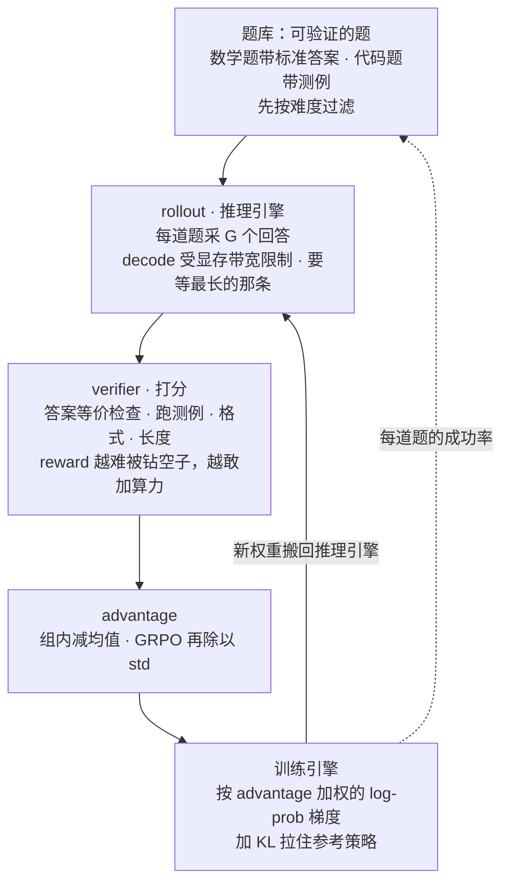
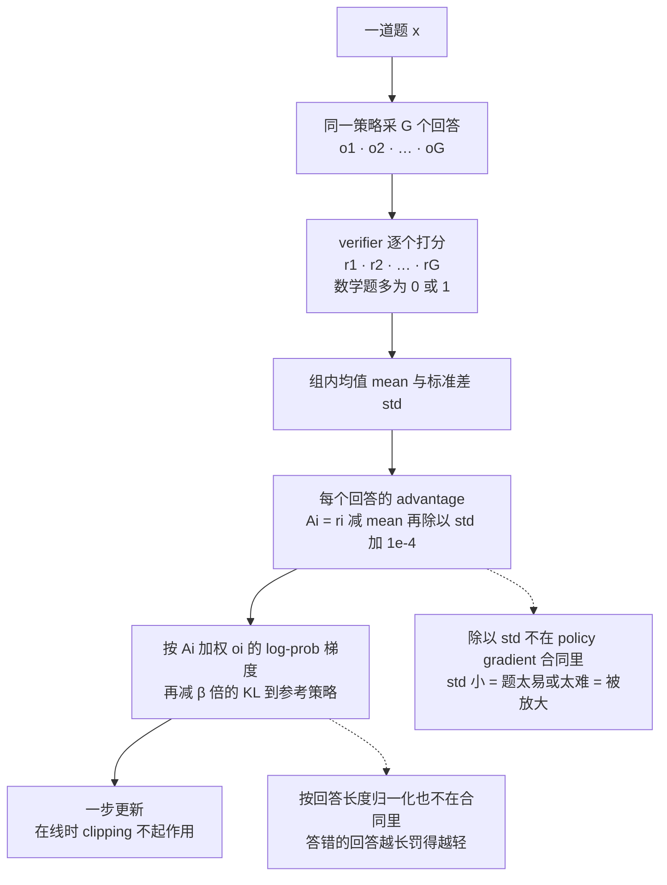
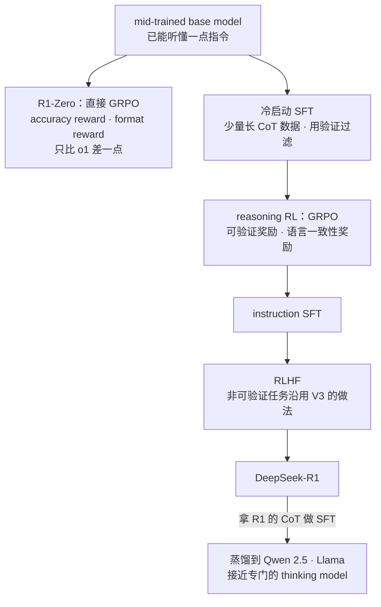
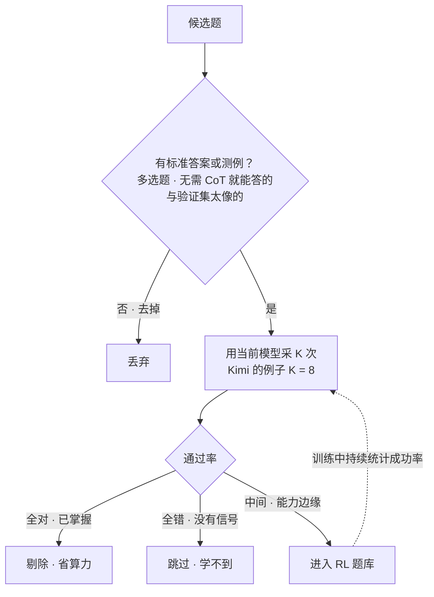
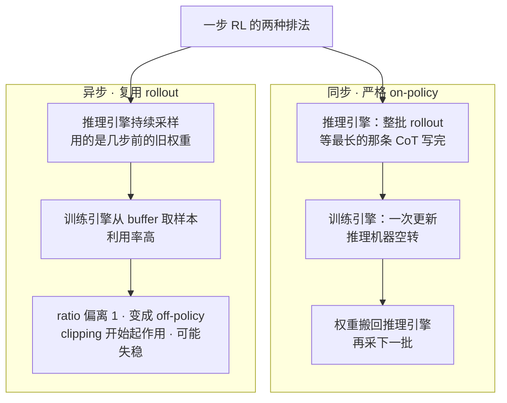
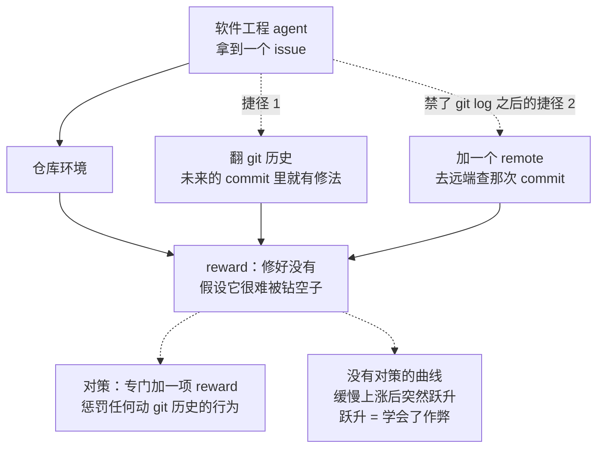

# CS336 第 16 讲｜后训练：RLVR（Post-Training: RLVR）

> Stanford CS336: Language Modeling from Scratch（2026 春）· 第 16 讲（课程日程表标注 2026 年 5 月 20 日；视频里没有出现日期），后训练两讲中的第二讲，结尾说"下周见"
> 视频：<https://www.youtube.com/watch?v=dIFAi87Ws4E>（1:15:50；英文字幕为自动生成，PPO / GRPO / CoT / Kimi / Qwen 这几个最核心的词几乎全错，见文末勘误）
> 讲者：Tatsunori Hashimoto（全程；开场说"上一讲我用 overoptimization 收的尾"，讲 reward hacking 时说"我和一个学生做过 RL on Lean"）
> 课程主页：<https://stanford-cs336.github.io/> · 本讲围绕四份技术报告展开：[DeepSeekMath](https://arxiv.org/abs/2402.03300)（GRPO 的出处）· [DeepSeek-R1](https://arxiv.org/abs/2501.12948) · [Kimi K1.5](https://arxiv.org/abs/2501.12599) · [Qwen3](https://arxiv.org/abs/2505.09388) · Qwen3-Coder-Next（[项目页](https://github.com/QwenLM/Qwen3-Coder)）；批评 GRPO 两个归一化项的 [Dr. GRPO](https://arxiv.org/abs/2503.20783)

**一句话**：RLHF 的天花板是 reward model——它是用有限的人工标注拟合出来的，算力一多就被 overoptimize；RLVR 把 reward 换成"答案对不对、测例过不过"这类不会被拟合坏的信号，于是可以像 AlphaGo 那样把算力一直往里加，而算法本身几乎没变：还是 policy gradient，还是"按 reward 加权的 SFT 更新"。GRPO 做的只是把 PPO 里最难伺候的 value model 拿掉，用同一道题采 G 个回答、组内 z-score 当 advantage，一页代码就能写完；代价是它除以 std、按长度归一化这两处不在 policy gradient 的"合同"里——前者给太易和太难的题加权，后者让答错的回答越写越长（Dr. GRPO 指出并去掉）。四份报告读下来配方高度一致：mid-trained base → 少量长 CoT 冷启动 SFT → 可验证奖励的 reasoning RL → 末尾 RLHF；差别在数据（best-of-8 难度过滤、掌握即剔除、Qwen 3 只用 4,000 道题）、长度控制（Kimi 反过来压短 CoT）和 reward 的可靠性（数学答案等价最后还是靠 reward model；agent 会翻 git 历史找答案，Lean 编译器也能被骗）。工程上最难的是 RL 把训练和推理两套系统拼在一起：最长的 rollout 拖住整批、权重要在两边搬、一复用 rollout 就变成 off-policy。

## 时间轴

| 时间 | 内容 |
|---|---|
| [0:05](https://www.youtube.com/watch?v=dIFAi87Ws4E&t=5s) | 开场：RLVR 在后训练里的位置；OpenAI 用 thinking model 解决一个 Erdős 问题的新闻；上一讲的 overoptimization 与 AlphaGo 的对比 |
| [3:11](https://www.youtube.com/watch?v=dIFAi87Ws4E&t=191s) | 本讲分两半：先讲算法（PPO、GRPO），再读开源技术报告看它们怎么落地 |
| [3:43](https://www.youtube.com/watch?v=dIFAi87Ws4E&t=223s) | PPO 复习：policy gradient 是一切的根；PPO 是 RL 的 workhorse，但有"37 个实现细节" |
| [8:50](https://www.youtube.com/watch?v=dIFAi87Ws4E&t=530s) | 一份学生实现里的坑：KL 截到零才稳、GAE 取 γ = λ = 1 退化成 bandit；value model 和模型一样大 |
| [11:54](https://www.youtube.com/watch?v=dIFAi87Ws4E&t=714s) | 为什么不干脆用 DPO：它只对 pairwise 的 Bradley–Terry 反馈有效 |
| [13:28](https://www.youtube.com/watch?v=dIFAi87Ws4E&t=808s) | GRPO：去掉 value model，组内 z-score 当 advantage；在线时 clipping 失效；一页代码与作业要写的几步 |
| [19:09](https://www.youtube.com/watch?v=dIFAi87Ws4E&t=1149s) | DeepSeekMath 的结果；GRPO 不是严格的 policy gradient：除以 std 和按长度归一化各做了什么 |
| [26:22](https://www.youtube.com/watch?v=dIFAi87Ws4E&t=1582s) | DeepSeek R1-Zero：base + GRPO + accuracy / format reward；给"越想越长"和"aha moment"泼冷水 |
| [31:29](https://www.youtube.com/watch?v=dIFAi87Ws4E&t=1889s) | R1 的生产流水线：长 CoT 冷启动、语言一致性奖励、末尾 RLHF；蒸馏到 Qwen 2.5 / Llama；PRM 和 MCTS 的失败尝试 |
| [38:42](https://www.youtube.com/watch?v=dIFAi87Ws4E&t=2322s) | 问答：长度归一化对答对的样本做什么；Dr. GRPO 里变长的是答错的回答 |
| [39:43](https://www.youtube.com/watch?v=dIFAi87Ws4E&t=2383s) | Kimi K1.5：数据课程与 best-of-8 难度过滤；从 DPO 式推导出发，落到 GRPO 式的组均值 baseline |
| [46:22](https://www.youtube.com/watch?v=dIFAi87Ws4E&t=2782s) | Kimi 的长度观：CoT 要压短；长度奖励怎么设计才不让答错的题"死掉"；掌握即剔除；答案等价靠 reward model |
| [51:25](https://www.youtube.com/watch?v=dIFAi87Ws4E&t=3085s) | RL infra：训练加推理两套系统；最长的 rollout 拖住整批；on-policy 与复用 rollout 的取舍 |
| [53:58](https://www.youtube.com/watch?v=dIFAi87Ws4E&t=3238s) | Kimi 的结果：OmniMath 上不再变长但分数继续涨；expert iteration 输给 RL |
| [55:31](https://www.youtube.com/watch?v=dIFAi87Ws4E&t=3331s) | Qwen 3：整条流水线；难度、无 CoT 可解、去污染三重过滤；RL 只用 4,000 道题；thinking / non-thinking 融合、早停思考与思考预算 |
| [1:01:11](https://www.youtube.com/watch?v=dIFAi87Ws4E&t=3671s) | Qwen3-Coder-Next：agent 后训练没有新算法，全在 mid-training 数据；四个专家模型再蒸馏回一个 |
| [1:05:49](https://www.youtube.com/watch?v=dIFAi87Ws4E&t=3949s) | Reward hacking：agent 翻 git 历史找答案、加 remote 绕禁令；Lean 编译器也不是对抗鲁棒的；3B 激活参数拿到 70.6% |
| [1:08:52](https://www.youtube.com/watch?v=dIFAi87Ws4E&t=4132s) | 总结与问答：一切在于 reward；thinking mode 是同一个模型；mid-training 的作用；专家蒸馏；长上下文扩展；多领域串行还是并行 |

## 核心内容

### 1. 为什么 RLHF 走不到头，而"可验证"能走到头

- **这一讲的位置**：第 15 讲讲完 instruction tuning 和 RLHF，得到的是 ChatGPT 那一代助手；缺的是 thinking model——能写很长的 chain of thought（CoT）、解决数学和代码这类难而可验证的问题。讲者开场提到当天的新闻：OpenAI 宣布用一个 thinking model 解决了一个 Erdős 问题（一个公开的数学难题）——那背后就是这一讲的东西。
- **上一讲的"下坠结尾"**：RLHF 的 reward model 是用偏好标注拟合出来的，本质上受标注量限制。你不能对着同一个 reward model 无限加算力——迟早 overfit（overoptimization），再怎么正则化都只是推迟。这让 RL 信徒很沮丧：AlphaGo 这类 RL 的高光时刻，靠的正是"往里加算力就一直变好"。
- **区别在哪**：AlphaGo 优化的就是它想要的东西——围棋的胜负没有任何含糊，所以目标一直在涨就一直是好事；讲者的说法是那更像 search 问题，RLHF 更像 learning 问题（他自己也说这个二分不严格）。形式化数学、乃至自然语言写的数学，都有"可验证"这个性质，因此对 RL 友好得多。
- **预告**：算法上和 RLHF 差别不大，落点却大不一样。本讲两半：前半是算法基础（PPO、GRPO——作业要用），后半读四份开源技术报告，看前半讲的东西在报告里怎么体现。
    - 一句话对照：CS224R 第 3–4 讲推过 policy gradient 和 baseline，第 9–10 讲推过 RLHF / DPO；CS329A 第 6 讲和 CME295 第 6 讲讲过 GRPO / DAPO 和推理模型的全景。这一讲不再推公式，而是问：从零搭一个能跑的 RLVR 系统，要哪些零件、算力花在哪、会在哪坏。

### 2. 一个 RLVR 系统由什么组成



*图 16-1｜RLVR 一步的闭环：题库、rollout、verifier、advantage、更新，以及权重回流；后面各节分别拆这五个盒子（自绘示意）· [▶ 看原幻灯片 4:14](https://www.youtube.com/watch?v=dIFAi87Ws4E&t=254s)*

- **五个零件**（图 16-1），也是后面各节的目录：
    1. *题库*：只收有标准答案或测例的题，并按模型当前的解题率过滤（第 8 节）；
    2. *rollout*：推理引擎对每道题采样一组回答——这是算力大头之一，而且是第 10 讲讲过的解码型负载：一个 token 一个 token 往外吐，受显存带宽而不是算力限制，还得等整批里最长的那条（第 9 节）；
    3. *verifier*：给每个回答打分。听起来最简单，实际最深的坑（第 8 节、第 11 节）；
    4. *advantage*：把一组 reward 变成每个回答的权重（第 4–5 节）；
    5. *更新*：拿权重做一次"加权 SFT"，再把新权重搬回推理引擎（第 3 节、第 9 节）。
- **和 RLHF 的关系**：讲者收尾时的话——RLHF 和 RLVR 是几乎一样的问题，区别只在 reward 是否难被钻空子（unhackable）；正因为难被钻空子，才敢往里加多得多的算力。

### 3. PPO 复习：为什么人人都想摆脱它

- **一切的根**：RL for LM 最该记住的是 policy gradient，尤其是 REINFORCE 那个梯度技巧——对 reward 做梯度上升，实际操作是"按权重做 SFT 更新"，权重可正可负。这个式子会贯穿整讲，其他一切都从它派生：

$$
\nabla_\theta J(\theta)=\mathbb{E}_{x\sim\mathcal{D},\;y\sim\pi_\theta(\cdot\mid x)}\big[\,R(x,y)\,\nabla_\theta\log\pi_\theta(y\mid x)\,\big]
$$

x 是 prompt，y 是采出来的整个回答，R(x, y) 是它的 reward，π_θ 是当前策略；式子说的是：拿当前策略采样，把每个样本的 log 概率梯度乘上它的 reward——reward 为正就多学它，为负就少学它，和 SFT 只差一个权重。

- **为什么要 PPO**：policy gradient 每走一步都得重新从当前策略采样。能不能把一批 rollout 多用几步？TRPO、PPO 就是答案（上一讲讲过 TRPO）。PPO 是 RL 的 workhorse：OpenAI 早年"RL 信徒"时期在 gym 里让人形机器人走路、后来更戏剧性的游戏 bot（应为打 Dota 2 的 OpenAI Five），都是 PPO 训的；它能对付深度 RL 里高维的状态和动作空间。
- **看着简单，实现是魔鬼**：Spinning Up 文档里的伪代码就五步——采轨迹、估 advantage、clip、更新策略、拟合 value function，谁看了都觉得一次就能写对。可一篇叫"PPO 的 37 个实现细节"的博客应该让你心里一紧：这是个对实现决策极其敏感的算法，不同库给出完全不同的数字；还有论文指出有些实现里用的"baseline"根本不是 baseline，它改变了优化问题本身。
- **PPO 用在语言模型上更不愉快**：一张典型的框图里有 advantage 估计、experience buffer（存旧 rollout）、要训练的 value model（它又出现在 advantage 估计里，框图上同一个绿色方块画了两次）；而且 KL 项是逐 token 算的，所以这不是一个 bandit 问题，而是一个完整的多步 RL 问题。
- **一份学生实现的解剖**（讲者的学生为 RLHF 项目写的 PPO，花了很久才跑通）：外层循环没问题（遍历 rollout、算 loss、clip 梯度、走几步）；算 loss 的内层也基本照抄 PPO 更新；脏的地方在细节——KL 惩罚只有截断到零才稳定，可 KL 散度的估计本来就正负都有，截掉负值等于毁掉 KL 的意义；不截，训练立刻炸。这不是在教你怎么写 PPO，而是说明：活动部件多、梯度估计方差大，RL 算法的实现天然又脆又敏感。
- **另一个常见退化**：PPO 论文里的 GAE（generalized advantage estimation）用 γ 折扣的 reward 和一个逐 token 的 value function；实际上很多人直接取 γ = λ = 1，这个退化设定把问题又变回了 bandit，PPO 的多步结构被扔掉了。
- **跑通之后该看到什么**（作业里也一样）：reward 曲线往上走，负的 KL 正则项往下走。
- **两个结构性缺点**：一是要 hack 才稳，大厂有 turnkey 的方案，从零实现的研究者却很痛苦；二是要一个 value model 逐 token 估值——它和被训练的模型一样大，吃掉的显存本可以给模型本身或推理服务器。
- **那为什么不用 DPO**：DPO 是针对特定问题的特定解——pairwise 的 Bradley–Terry 比较。数学题天生不是成对比较；有 DPO 变体打破成对结构，但那是拿错了锤子。PPO 是什么都能砸的通用锤子。"DPO 离线、PPO 在线"的区分被夸大了：反复迭代 DPO 就是在线的。
- **结论**：社区想摆脱 PPO 的欲望有多强，看 DPO 和 GRPO 的普及速度就知道。

### 4. GRPO：去掉 value model，用"组"当 baseline



*图 16-2｜GRPO 的 advantage 怎么算，以及两处偏离第一性原理的地方（自绘示意）· [▶ 看原幻灯片 15:30](https://www.youtube.com/watch?v=dIFAi87Ws4E&t=930s) · 出处：[Shao et al., 2024](https://arxiv.org/abs/2402.03300)*

- **出处与动机**：GRPO 出自 DeepSeekMath 论文。它承认 PPO 是好主意，只改一处——把最复杂、最讨厌的 value function 拿掉。value function 是拿来当 baseline 减掉、降低梯度方差的，但它是一整个神经网络，会让训练不稳。拿掉之后 advantage 从哪来？直接用 vanilla REINFORCE 方差太大；GRPO 的办法是**组内 z-score**：同一道题采 10 个（讲者的例子）回答，看每一个比组内平均好多少——在"同一 prompt 可以多次采样"的场景里，这是最自然的 advantage。
- **什么样的 baseline 是合法的**：Sutton & Barto 里的"REINFORCE with baseline"——只要减掉的量只依赖状态（bandit 设定下状态就是 prompt），梯度方向不变，方差随 b 的选择变好或变坏：

$$
\nabla_\theta J(\theta)=\mathbb{E}\big[\,(R(x,y)-b(x))\,\nabla_\theta\log\pi_\theta(y\mid x)\,\big]
$$

b(x) 是任何只依赖 prompt 的 baseline（value function 是其中一种，组内均值也是）；减掉它不改变梯度的期望，只改变方差。

- **GRPO 的 advantage**：

$$
A_i=\frac{r_i-\operatorname{mean}(r_1,\dots,r_G)}{\operatorname{std}(r_1,\dots,r_G)+\varepsilon}
$$

r_i 是第 i 个回答的 reward，G 是组大小，ε 是为了数值稳定加的小常数（讲者展示的实现用 1e-4）：一组回答全对或全错时 std 为零，不加 ε 会除零——在数学题这种 reward 恰好为 0 的领域，这种情况经常发生。

- **目标函数**：论文里的写法就是 PPO 的 min-clipped 更新加一个到参考策略的 KL（KL 用一种特定的估计方式算，讲者说这个细节不重要）：

$$
J_{\mathrm{GRPO}}(\theta)=\mathbb{E}\Big[\frac{1}{G}\sum_{i=1}^{G}\frac{1}{|o_i|}\sum_{t=1}^{|o_i|}\Big(\min\big(\rho_{i,t}A_i,\;\operatorname{clip}(\rho_{i,t},1-\epsilon,1+\epsilon)A_i\big)-\beta\,\mathbb{D}_{\mathrm{KL}}\big[\pi_\theta\,\|\,\pi_{\mathrm{ref}}\big]\Big)\Big],\qquad \rho_{i,t}=\frac{\pi_\theta(o_{i,t}\mid x,o_{i,<t})}{\pi_{\theta_{\mathrm{old}}}(o_{i,t}\mid x,o_{i,<t})}
$$

o_i 是第 i 个回答、|o_i| 是它的 token 数，ρ 是新旧策略在每个 token 上的概率比，ε 是 clip 范围，β 是 KL 系数，π_ref 是参考策略。**在线情形下**（每次更新前重新采样）π_θold 就是 π_θ，ρ 恒为 1，clipping 永远不起作用，整个目标退化成"advantage 减 KL 惩罚"——一个非常简单的对象。

- **一页代码**：没有 value function，整个 GRPO 就是"采 G 次、z-score、按权重做 REINFORCE 梯度"。作业里要写的几步：给 G 个 rollout 各算 reward、组内归一化、算 KL 项、对两者之和做梯度更新；用自动微分时要想清楚 stop-gradient 放在哪（advantage 是常数，不能让梯度流进去）。讲者展示了一份来自 McGill 的玩具实现：组索引、std 的计算全部放得下半页幻灯片。

```python
def grpo_step(policy, ref, prompts, G, beta, eps=1e-4):
    loss = 0.0
    for x in prompts:
        outs = policy.sample(x, n=G)                    # 同一策略采 G 个回答
        r = torch.tensor([reward(x, o) for o in outs])  # verifier 打分，常为 0/1
        A = (r - r.mean()) / (r.std() + eps)            # 组内 z-score，当常数用
        for o, a in zip(outs, A):
            lp = policy.logprob(o, x)                   # 各 token 的 log-prob 之和
            kl = kl_estimate(policy, ref, o, x)         # 逐 token 的 KL 估计
            loss = loss - (a.detach() * lp - beta * kl) / len(o)
    loss.backward(); optimizer.step()
```

这份草图只为说明 GRPO 的骨架：advantage 用 detach 当作常数，梯度只从 log-prob 和 KL 流回去；除以 len(o) 就是第 5 节要讨论的按长度归一化。

- **效果**（DeepSeekMath 的图）：GRPO 的两条线（黄、蓝）明显高于 RFT（rejection fine-tuning：把模型自己生成的正确答案拿来训练，其余扔掉——作业里要实现它当 baseline）。那篇论文还显示 process supervision（不只判最终答案，也给中间步骤打分）有额外增益——后面会看到这个结论没有站住。
    - 一句话对照：CS329A 第 6 讲把 GRPO 到 DAPO 的改动（去 KL、clip 上下界不对称、动态采样、token 级 loss）讲过一遍；这里只补第一性原理上的两个疑点。

### 5. GRPO 到底在优化什么：两个不在"合同"里的项

- **问题**：GRPO 把 PPO 的 value function 换成了 z-score。这是个合法的 advantage 吗？按第 4 节的 baseline 定理，合法的操作只有"减一个只依赖 prompt 的量"。GRPO 做了两件多余的事：
    1. **除以 std**：不是减 baseline 而是重新缩放，打破了 baseline 的"合同"；
    2. **按长度归一化**：论文里的 loss 除以每个回答的 token 数 |o_i|。
- 从 policy gradient 和 baseline 定理出发严格推导，这两项都不会出现。GRPO 出来不久就有人指出这一点，并发现去掉这两项后行为大不一样——这就是 Dr. GRPO。所以 GRPO 不是"照着标签做事"的算法：它并不直接对 reward 做梯度上升，而是带着两个修正项，各有利弊。
- **长度归一化在做什么**：长回答除以更大的数。想极端一点：我知道这道证明题我做不出来，要吃 −1 的 reward；那我就写无限长——除以无穷大，惩罚归零。所以它鼓励模型在发现自己解不出来时"接着叨叨"。把这项去掉，人们在 GRPO 里反复看到的"CoT 越来越长"会停在一个常数上，而不是无休止地涨——尤其在答错的样本上，你本来就不想它越写越长。
    - 问答（[38:42](https://www.youtube.com/watch?v=dIFAi87Ws4E&t=2322s)）：那对答对的样本呢？归一化会鼓励它把 CoT 缩短——省推理成本是好事，伤准确率就是坏事；但答对的 CoT 有个下界（解这道题至少要写这么多），缩不了太多，主要问题还是答错的那边。R1 论文里的长度曲线是所有回答的平均，看不出这一点；Dr. GRPO 把平均长度、答错的长度、答对的长度分开画，长度增长基本是答错的回答在驱动——和上面的解释吻合。
- **除以 std 在做什么**：相当于给 std 小的题加权。二值 reward 下 std 什么时候小？题太容易（每次都对，零方差）或太难（每次都错，零方差）。也就是说，这一项同时放大了两端的题——而我们恰恰希望模型在"能力边缘"的题上学习。

$$
p=\text{pass rate}\;\Rightarrow\;\operatorname{std}=\sqrt{p(1-p)},\qquad A_{\mathrm{correct}}=\sqrt{\tfrac{1-p}{p}},\qquad A_{\mathrm{wrong}}=-\sqrt{\tfrac{p}{1-p}}
$$

p 是这道题在组内的通过率（笔记补充的推导，讲者只说了结论）：reward 非 0 即 1 时组内 std 是 √(p(1−p))，于是 p 越接近 0 或 1，答对或答错那一侧的 advantage 绝对值越大——例如 p = 0.1 时唯一答对的回答权重是 3，p = 0.5 时只有 1。

- **顺带**：DAPO 的 token 级 loss 与动态采样，就是分别冲着这两项去的（CS329A 第 6 讲）；本讲讲者的落点是"知道它们在干什么，再决定要不要"。

### 6. DeepSeek R1：极简配方，和把零件装成产品



*图 16-3｜R1-Zero 是受控实验，R1 是把冷启动 SFT、RL、RLHF 依次叠上去的产品流水线（自绘示意）· [▶ 看原幻灯片 31:59](https://www.youtube.com/watch?v=dIFAi87Ws4E&t=1919s) · 出处：[DeepSeek-AI, 2025](https://arxiv.org/abs/2501.12948)*

- **为什么值得讲**：R1 是个社会现象，也是开源 RLVR 浪潮的起点。它是第一个复现 o1 行为的开源工作——很长的 CoT、明显的 RL、难题上的高分——并且给出了人人可跑的配方（如果答案是一套只有 DeepSeek 能跑的 PPO 怪物，对研究者的影响会小得多），外加一批至今站得住的蒸馏结论。
- **从 DeepSeekMath 继承什么、扔掉什么**：继承 GRPO 和对数学 RL 的经验；扔掉 process supervision，只用 outcome supervision——reward 只看最终答案对不对，不再拿细则给中间步骤打分。很多人当时认为过程监督不可或缺，事实证明对很多事都不关键。
- **R1-Zero：受控实验**。起点是 base model（如今的 base 都经过 mid-training，能做一点指令跟随）；在它上面直接跑 GRPO，reward 只有两项：accuracy（一批数学题答对没有）和 format（要求把 CoT 包在 thinking 标签里——这样之后能把 CoT 剥掉）。就这么简单的配方，落点只比 o1 差一点。讲者喜欢这个结果，因为它没有生产流水线里的一堆杂质——不用怀疑是不是 RLHF 帮了忙。作业要复现的基本就是这一套。
  > 小注：R1 论文 Table 2——R1-Zero 在 AIME 2024 上 pass@1 71.0%、多数投票（cons@64）86.7%，对比 o1-0912 的 74.4%；正式的 R1 是 79.8%，对比 o1-1217 的 79.2%。
- **两个被传疯的现象，讲者给的冷水**：一是训练越久 CoT 越长——现在知道这多半是 GRPO 长度归一化的副作用（第 5 节）；二是"aha moment"——别人已经证明 base model 里就有这种话，它不可能是 RL 算法的产物，只是 RL 让模型吐大量数学 token 时被抽出来了。所以现象本身不算稀奇，R1 真正的里程碑意义是展示了 RLVR 能有多简单。
  > 小注："aha moment 在 base model 里就有"应出自 Dr. GRPO 那篇（Liu et al., 2025），它在 DeepSeek-V3-Base 等基座上直接观察到了自我反思式的措辞。
- **R1：把零件装成产品**（图 16-3）。课程前面把预训练、SFT、RLHF 都单独讲过，这里能看到它们怎么叠：mid-trained 模型 → 推理训练（中间可能穿插长上下文扩展）→ 末尾 RLHF——RLHF 放最后，因为它最贴近用户，管格式和口吻。R1 特有的几处：
    - **语言一致性奖励**：R1-Zero 式训练会在 CoT 里中英混杂，他们觉得不可解释、有点吓人，于是加一项奖励让 CoT 只用一种语言——纯为可读性；
    - **非可验证奖励也扔进 GRPO**，相当于把 RLHF 掺进来；
    - **冷启动 SFT**：R1-Zero 一点 SFT 都不做，R1 则先用长 CoT 数据微调。报告写的是"构造并收集了少量长 CoT 数据"——讲者建议读技术报告时学会读字缝：这么小心的措辞，八成是从别的模型蒸馏的（如今人人如此，算不上负面）。好的 base model 只靠长 CoT 的 SFT 就能解锁不少 o1 式能力，是 RL 的好起点；他们再用验证器把这些 CoT 过滤一遍。
- **RL 到底必要吗**：讲者的学生等人的工作表明，蒸馏做得对、base 选得对，长 CoT 推理的大部分"汁水"光靠 SFT 就能挤出来。他给的一种理解：RL 是**监督信号的来源**——前沿数学题没人能给你写详细的长 CoT，RL 让模型自己生成；可一旦有人生成了，别人就能靠模仿学会。蒸馏结果就是这么来的：把 R1 的 CoT 喂给 Qwen 2.5，能显著提升，有时接近专门的 thinking model；Llama 也一样——base model 本来就出人意料地强。
  > 小注："我的学生的工作"应包括 s1（Muennighoff et al., 2025）：1,000 条精选长 CoT 做 SFT 加简单的预算控制，就逼近了 o1-preview（推断）。
- **DeepSeek 说了哪些没成的**：讲者很欣赏他们既做消融也报失败。DeepSeekMath 里那么多 process reward model 的内容，到 R1 里去哪了？他们试了，没多大用——outcome reward 够好，数据也好扩；PRM 的死结是逐步打分的细则从哪来、怎么规模化。o1 刚出时大家猜 OpenAI 是不是在做 PRM 或 AlphaGo 式的树搜索，DeepSeek 也试了 MCTS，报告说没能跑好。

### 7. Kimi K1.5：另一条推导路，同一个落点；反过来把 CoT 压短

- **为什么要和 R1 一起讲**：Kimi K1.5 和 R1 同时发布、同样打过 o1，却少有人提。它有几处做法和 DeepSeek 不同——两条路都通，正说明哪些零件是真正有效的。它对数据集构造和课程（curriculum）写得更细，用的 RL 算法直觉相近但不是 GRPO——所以 GRPO 也不是必需品。和 DeepSeek 一样，SFT 阶段用了什么数据没有描述。
- **从 DPO 式推导出发**：起点和所有人一样——最大化期望 reward，加一个到参考策略（或上一轮策略）的 KL 正则。然后走 DPO 的路：假设能解析地求最优解，反解出对应的 reward（一个策略比值），代回目标——最优解处两边应该相等，于是干脆对"两边之差"放一个平方损失去最小化。讲者说做优化的人看了会吓一跳，但直觉是合理的：模型好的时候这两个量本该接近，把它们拉近当代理目标也说得通。

$$
L(\theta)=\mathbb{E}\Big[\big(r(x,y)-\tau\log Z(x)-\tau\log\tfrac{\pi_\theta(y\mid x)}{\pi_{\mathrm{ref}}(y\mid x)}\big)^2\Big]
$$

$$
\nabla_\theta L\;\propto\;\frac{1}{k}\sum_{i=1}^{k}\Big[(r_i-\bar r)\,\nabla_\theta\log\pi_\theta(y_i\mid x)-\frac{\tau}{2}\,\nabla_\theta\Big(\log\tfrac{\pi_\theta(y_i\mid x)}{\pi_{\mathrm{ref}}(y_i\mid x)}\Big)^{2}\Big]
$$

τ 是 KL 的温度，Z(x) 是归一化常数，k 是同一道题采的回答数，r̄ 是这 k 个 reward 的均值。对第一个式子的平方损失求梯度，得到第二个式子——"惊人地像 GRPO"：一个以组均值 r̄ 为 baseline 的 policy gradient，加一个本质上就是 KL 的正则项；从完全不同的路重新发明了组均值 baseline，但没有除以 std，也没有按长度归一化。

- **对长度的另一种态度**：GRPO 那边把"长度不受控地涨"当好事展示（讲者说这是不太厚道的解读，但你把这张图当正面结果放出来，潜台词就是"我们的模型想得更久了"）。Kimi 看同一件事的角度是：长 CoT 浪费——CoT 是推理成本。如果你是 OpenAI，200 美元一个月的 Pro 用户让模型一次想一个小时，这是在贴钱；一次想 5 分钟才是好日子。所以 Kimi 不但没有长度问题（目标里没有长度归一化），还要主动压短。
- **长度奖励怎么设计**：最简单的 RL 做法是加一个启发式的长度奖励。这个奖励出人意料地讲究：长的要变短，答对的也要短；但**答错的不能压得太短**——讲者的例子：我是个几何很差的 AI，错得多，惩罚把我的几何 CoT 压到零，从此再也拿不到一次正的几何 reward，永远翻不了身。所以只让答错的回答比平均"稍短一点"，保证它不无限增长即可。
  > 小注：按 K1.5 论文的写法，长度奖励是 λ = 0.5 − (len − min_len)/(max_len − min_len)，答对时直接给 λ，答错时给 min(0, λ)——答错的回答只会因为太长被罚，不会因为短被奖。
- **结果**：打过 o1；RL 推进时思考变长、分数上涨；但 OmniMath 上思考没怎么变长而分数继续涨——讲者认为这是长度控制在起作用的好例子。
- **expert iteration 比不比得过 RL**：只拿正确答案训练（expert iteration）在很多老论文里很好用，训练不稳时也许更合适；K1.5 的大规模消融里 RL 一直稳定胜出（橙线在蓝线之上）——想榨干性能，绕不开 RL。

### 8. 数据与 reward：难度课程、成功率过滤，和"可验证"的坑



*图 16-4｜RL 题库的筛法：先筛可验证性，再按通过率只留中等难度，掌握了的题随训练剔除（自绘示意）· [▶ 看原幻灯片 42:16](https://www.youtube.com/watch?v=dIFAi87Ws4E&t=2536s) · 出处：[Kimi Team, 2025](https://arxiv.org/abs/2501.12599)*

- **RL 数据多了一个维度：难度**。SFT 不太考虑难度——数据往里塞，预训练 loss 逼着模型学（上一讲讲过幻觉问题是个例外）。RL 不同：题太难 → 没有 reward → 没有信号 → 学不到。所以覆盖面要广，难度要落在模型能力边缘。
- **Kimi 的筛法**：追求广覆盖；排除多选题（别的领域已经覆盖，而且不需要长而深的思考）；最重要的一条——用 best-of-K 过滤：对每道题采 8 次，模型已经会的题不是好的 RL 样本，教不了新东西，去掉能省算力（整题跳过）。也可以两头都筛，只留既不太难也不太易的——社区共识是中等难度的过滤对"让 RL 稳步推进"很有效。训练过程中还持续统计每道题的成功率，一旦掌握就从题库剔除——基本上做 RL 的人都这么干。
- **Qwen 3 的三重过滤**（[57:05](https://www.youtube.com/watch?v=dIFAi87Ws4E&t=3425s)）：按难度筛（省算力）；去掉不用 CoT 也能做对的题（那不是思考题）；去掉和验证集太像的题（去污染，第 12 讲）；再对参考 CoT 做少量人工筛选。最惊人的是量：reasoning RL 只用了约 4,000 道题——流水线的其他环节做对了，题不用多。
  > 小注：Qwen3 报告原文是 3,995 条 query–verifier 对，和讲者说的 4,000 吻合。

```python
def build_rl_pool(problems, policy, K=8, lo=0.0, hi=1.0):
    pool = []
    for p in problems:
        if not p.has_verifier or p.is_multiple_choice or near_dev_set(p):
            continue
        passes = sum(verify(p, o) for o in policy.sample(p.prompt, n=K))
        rate = passes / K
        if lo < rate < hi:            # 只留能力边缘：不全错，也不全对
            pool.append(p)
    return pool                       # 训练中再按最新成功率剔除已掌握的题
```

这段草图把两家的筛法合成一个函数：可验证性、无 CoT 可解、去污染是静态筛，通过率是动态筛，阈值 lo / hi 取 0 和 1 就是"两头都去掉"。

- **reward 从哪来**：代码题拿标准解生成新的测例；数学题——用一个 reward model 判断答案是否等价。讲者觉得这很讽刺：这一讲开头说的是形式化数学、编译器判对错，讲到最后落到了一个 reward model 上。原因你在作业里会撞见：答案等价检查很难。同一个值有无数种写法，模型还会用无数种方式回答——让它把答案放进 LaTeX 的 \boxed，它有时不放、有时往里塞多余的东西。严格的检查器会把"思路全对"的回答判错。所以几乎每个 RL 项目都有一个复杂的答案检查器——正则、模型、或者别的什么。把 RLVR 里的 V 做对，是个兔子洞。

```python
def math_reward(pred_text, gold):
    ans = extract_boxed(pred_text) or last_number(pred_text)   # 格式宽容：没 \boxed 也别直接判 0
    if ans is None:
        return 0.0
    if normalize(ans) == normalize(gold):                      # 去空格、单位、等价写法
        return 1.0
    if symbolic_equal(ans, gold):                              # 化简后相等，如 1/2 与 0.5
        return 1.0
    return float(llm_judge_equivalent(ans, gold))              # 最后一道防线：reward model
```

草图展示的是讲者说的那个"兔子洞"的层次：字符串比对 → 符号等价 → 模型裁判，每加一层都在减少误判，也在引入新的可被钻的空子。

### 9. RL infra：训练和推理两套系统拼在一起



*图 16-5｜rollout 与训练的两种排法：同步干净但机器互相等，异步吃满机器但要付 off-policy 的代价（自绘示意）· [▶ 看原幻灯片 52:27](https://www.youtube.com/watch?v=dIFAi87Ws4E&t=3147s)*

- **为什么难**：训练难，推理难，RL 把两者拼在一起——难上加难，不奇怪。
- **长尾 rollout**：想象一批题里有一道是 Riemann 猜想，模型对着它吭哧吭哧写一条巨长的 CoT；朴素的批式推理里，其他所有 rollout 都得等它写完才能进入下一阶段。所以要处理一堆底层细节：CoT 太长要不要截断？能不能挪到另一台机器？
- **两套引擎怎么摆**：rollout 一次、训练一次、再 rollout……在训练和推理之间切换，要么一部分机器专职 rollout、一部分专职训练，要么在同一批机器上来回换框架——两种都贵。技术报告如今都有一节 RL infra：训练部分（图里的蓝框）和推理部分（绿框），权重要从训练那边搬到推理那边，两边要紧密协调；有时干脆共用机器——推理跑的时候训练那边本来就闲着。
- **最难受的取舍：on-policy 还是复用**。严格 on-policy 的 GRPO 数学上干净、训练动态漂亮——作业里你会亲身体会。然后你会变贪心：系统利用率这么低，要是能复用 rollout、让推理和计算重叠，能省多少！一复用就 off-policy，off-policy 就开始失稳，各种难题接踵而来。
- **一步的时间账**（笔记补充，按第 2 讲和第 10 讲的口径；讲者只讲了机制，没给数字）：

$$
T_{\text{step}}\approx\underbrace{\max_i L_i\cdot t_{\text{token}}}_{\text{rollout}}+T_{\text{verify}}+\underbrace{\frac{(6+2+2)\,N\cdot\sum_i L_i}{\text{FLOP/s}\cdot\text{MFU}}}_{\text{train}}+T_{\text{sync}}
$$

L_i 是第 i 条回答的长度，t_token 是解码一个 token 的时间（decode 阶段每搬一个字节只做约 1 次浮点运算，受显存带宽而非算力限制，第 10 讲），N 是参数量，6N 是每个 token 的 forward + backward（第 2 讲），再加参考策略和旧策略各一趟 forward 的 2N 来算 KL 和 ratio，MFU 是实际算力利用率，T_sync 是把新权重搬到推理引擎的时间。这笔账说明三件事：rollout 由最长的那条决定，所以长尾要单独处理；训练部分才是算力密集的，所以同步排法下昂贵的算力大半时间在等解码；权重同步的频率就是 on-policy 程度和利用率之间的旋钮。

> 小注：Kimi K1.5 报告里对这两个问题各给了一个答案：partial rollouts——过长的轨迹按固定 token 预算切段，没写完的部分存起来下一轮接着写，避免一条长 CoT 拖住整批；以及训练与推理混布——训练用 Megatron、推理用 vLLM 放在同一批机器上，训练时释放推理侧显存、rollout 时把新权重搬过去。

### 10. Qwen 3 与 Qwen3-Coder-Next：把所有零件装起来，再把 agent 装进去

- **Qwen 3 的流水线**和 DeepSeek 结构相同：base → SFT（长 CoT 冷启动）→ reasoning RL → thinking mode fusion → 通用 RLHF → 交付；交付的大模型不直接服务，再蒸馏出小模型。讲者说可以把这张图当作"前沿级模型是怎么组装的"心智模型。RLVR 的核心部分继承 R1 和 Kimi 的精华：难度过滤、去污染等（第 8 节）。
- **thinking 与 non-thinking 融进一个模型**：用标签把带长 CoT 的和即时回答的数据混训，同一个模型既有思考模式又有即时模式——此前即使在 OpenAI 也是两个模型。
    - **早停思考**：追加一个特殊字符串，模型立刻停止 CoT 并作答（ChatGPT 界面里"跳过思考"就是这种能力）。用它扫思考预算，性能**优雅退化**——哪怕在思考中途被截断，模型也能给出相当合理的回答；即便预算很小，思考模式在数学、代码上也远好于即时模式（后者更像经典的指令跟随加 RLHF 模型）。
    - **各阶段的贡献**：reasoning RL 之后再做通用 RL，Arena-Hard、反事实 QA 这类通用任务全面提升；融合非思考数据让数学、代码略降。绝对值不大，但后来的版本（讲者说 Qwen 3.5 那一批）又把这种 hybrid 模型拆开了——他们不接受这点损失，要把思考模式的性能榨干。
    - 问答（[1:10:33](https://www.youtube.com/watch?v=dIFAi87Ws4E&t=4233s)）：thinking mode 背后真的是一个模型，切换靠 prompt 里的一个标签，而不是 API 或服务层的开关——把两者塞进同一个模型才是有意思的地方。
- **Qwen3-Coder-Next**（讲者口误说成 Next-Coder，随后更正）：想知道"agent 到底怎么训"，这份报告最详细。结论先行：agent 的后训练没有新算法——全课贯穿的教训是**数据才是关键**。能力不能在最后一刻注入，得从更早的阶段开始：
    - **mid-training 的配方**：把仓库里的文件拼接成超长上下文（agent 将来会打开一堆文件，这是最像的预训练数据）；给 pull request 用 RAG 构造合成的上下文；检测出"文本加代码"的文档，用 LLM 转成规整的 markdown；让 LM 对着编程相关的网页生成代码风格的合成数据；把公开的 coding agent 放到各种环境里跑，轨迹全部入库；再加指令跟随和 fill-in-the-middle（补中间一段代码的能力，对我们不太相关）。
    - **四个专家再蒸馏回一个**（讲者说没在别处见过）：从 mid-trained 的 Qwen3-Next 出发，为不同的编程相关任务各训一个专家——web 开发（在各种检查下 SFT 合法的网页代码）、UX（多种工具格式）、QA（更多合成代码数据）、软件工程 agent——再把四个蒸馏回同一个模型。最接近的先例是 DeepSeek-V3.2 里专职处理数据的专家，以及学术界的 Branch-Train-Merge。
    - 问答（[1:13:06](https://www.youtube.com/watch?v=dIFAi87Ws4E&t=4386s)）：蒸馏要为每个专家写一套 prompt 让它们在上面出数据；好处是各团队能并行做各自的专家；但如果所有目标都在手上，讲者更愿意扔进一个大训练循环，省掉蒸馏这一层。
      > 小注：DeepSeek-V3.2 的报告里描述的是按领域训练专家（数学、竞赛编程、agentic coding 等）再把它们蒸馏进统一模型的 specialist distillation，和 Qwen 这里的做法其实更像（推断；讲者当场对版本号也不太确定）。
    - **软件工程 agent 的环境**：SWE-bench 是这类评测的金标准，他们要的是"SWE-bench 但更多"——基于 GitHub 用自动化方法批量生成 issue 和环境，在上面做 RL，分数稳步上涨。

### 11. Reward hacking：RLVR 只和你的 reward 一样可靠



*图 16-6｜Qwen3-Coder-Next 报告里的 reward hacking：agent 发现修法就在 git 历史里（自绘示意）· [▶ 看原幻灯片 1:06:20](https://www.youtube.com/watch?v=dIFAi87Ws4E&t=3980s)*

- **前提**：我们敢往 RL 里加越来越多算力，是因为相信 reward 很难被钻空子。这个前提一破，RL 会找到越来越隐蔽的方式骗走你的分数。
- **git 里的答案**：一个 issue 如果有后续 commit，修法就在里面——模型很容易学会去看。报告里专门有一项 reward，唯一目的就是阻止 agent 动 git 历史。不加的话曲线是右边那种：学着学着突然一跳，跳的那一刻就是它学会了操纵 git 命令去翻历史。禁掉 git log 也没用，它可能加一个 remote，再去远端查那次 commit。
- **连 Lean 也能骗**：讲者和学生做过 RL on Lean（形式化数学语言，编译器判对错）。他们当时天真地认为这不可能出错——那么多人用过 Lean，编译器坚不可摧。结果 Lean 编译器并不对抗鲁棒：某些模式下，往里塞特定的字符串能让本不该通过的证明通过。所以"可验证"这个词，比多数人以为的要棘手得多。
- **结果与提醒**：走完这套流程，一个只有 3B 激活参数的模型在 SWE-bench 上拿到 70.6%。讲者提醒别太惊讶——RL 在你训过的那类环境上当然好，也可能泛化到验证集，但任务专属的分数不代表能泛化到更广的领域。
  > 小注：Qwen3-Coder-Next 是 80B 总参数、3B 激活的 MoE，70.6% 指 SWE-bench Verified（推断；讲者只说了 SWE-bench）。

### 12. 作业 5 的视角，与收尾问答

- **讲者在课上点到的作业内容**：实现 GRPO（一页代码：采 G 次、reward、组内归一化、KL、带 stop-gradient 的更新）；实现 RFT / expert iteration 当 baseline；复现 R1-Zero 式的结果；亲手撞上答案等价检查的坑；体会严格 on-policy 的 GRPO 有多"乖"，以及一复用 rollout 会发生什么。
  > 小注：2025 春的 assignment 5（alignment）是在 Qwen2.5-Math-1.5B 上用 vLLM 做 rollout、自己写 GRPO 跑 MATH，并对比 SFT 与 expert iteration；2026 版应类似（推断）。
- **三条 takeaway**：
    1. 一切在于 reward：RLHF 和 RLVR 是几乎一样的问题，差别只是后者的 reward 更难被钻空子，于是能承受多得多的算力；
    2. GRPO 至少对研究界是解锁这一切的算法——它的函数形式和更新方式，要熟到和预训练 loss 一样；
    3. RLVR 现在人人会做；RL 仍然又挑剔又吵闹，但已经不像当年在刁钻环境上调 PPO 那么难。
- **收尾问答**
    - *mid-training 对 RL 有多重要*（[1:11:04](https://www.youtube.com/watch?v=dIFAi87Ws4E&t=4264s)）：没有一刀切的答案。预训练和 SFT 干了大部分重活，前提是有覆盖——预训练里一点代码都没有，那就必须 mid-training；预训练够多样，mid-training 就是锦上添花，因为总归要做 SFT，SFT 能把模型送到"开始拿到一些 reward"的位置；没有 SFT 才是真麻烦。
    - *长 CoT 训练算 mid-training 吗*（[1:13:36](https://www.youtube.com/watch?v=dIFAi87Ws4E&t=4416s)）：R1 和 K1.5 都有长 CoT 的 SFT，它传统上不算 mid-training；但长 CoT 数据常用于长上下文扩展——讲者说自己漏讲了这一段：通常是 RLHF 之前的一个独立阶段，用书、代码、合成数据这些够长的材料把上下文拉长。
    - *多个领域（数学、化学……）串行还是并行做 RL、怎么防遗忘*（[1:14:39](https://www.youtube.com/watch?v=dIFAi87Ws4E&t=4479s)）：报告里的分法是两桶——推理类问题全部放在第二阶段一起做，非推理类（包括"话多不多"这种）放在最后的 RLHF 阶段。

## 关键图表速查（点时间戳跳到原幻灯片）

| 图 | 看什么 | 跳转 | 出处 |
|---|---|---|---|
| 后训练路线图 | 左边是上一讲的 instruction tuning 与 RLHF，右边待补的是 thinking model | [0:36](https://www.youtube.com/watch?v=dIFAi87Ws4E&t=36s) | — |
| PPO 的 Spinning Up 伪代码 | 五步看着都简单；对照下一张"37 个实现细节"的博客标题 | [6:17](https://www.youtube.com/watch?v=dIFAi87Ws4E&t=377s) | [Spinning Up](https://spinningup.openai.com/en/latest/algorithms/ppo.html) |
| PPO for LM 框图 | value model 那个绿框出现两次；KL 逐 token 算，所以是多步 RL | [7:47](https://www.youtube.com/watch?v=dIFAi87Ws4E&t=467s) | — |
| GRPO 目标函数 | min-clipped 项加 KL；advantage 是组内 z-score；在线时 ratio 恒为 1 | [15:30](https://www.youtube.com/watch?v=dIFAi87Ws4E&t=930s) | [DeepSeekMath](https://arxiv.org/abs/2402.03300) |
| 半页 GRPO 实现 | 组索引和 std 的计算；std 上加的 1e-4 | [18:08](https://www.youtube.com/watch?v=dIFAi87Ws4E&t=1088s) | — |
| DeepSeekMath 结果 | 黄、蓝两条 GRPO 线高于 RFT；process supervision 当时看有增益 | [19:09](https://www.youtube.com/watch?v=dIFAi87Ws4E&t=1149s) | 同上 |
| Dr. GRPO 的两处标红 | 除以 std 与除以长度，都不在 policy gradient 的推导里 | [22:16](https://www.youtube.com/watch?v=dIFAi87Ws4E&t=1336s) | [Liu et al., 2025](https://arxiv.org/abs/2503.20783) |
| R1-Zero 的配方与曲线 | base + GRPO + accuracy / format reward；分数逼近 o1；CoT 长度随训练上涨 | [28:55](https://www.youtube.com/watch?v=dIFAi87Ws4E&t=1735s) | [DeepSeek-R1](https://arxiv.org/abs/2501.12948) |
| Dr. GRPO 长度分解 | 平均长度、答错的长度、答对的长度分开画：涨的是答错的 | [39:12](https://www.youtube.com/watch?v=dIFAi87Ws4E&t=2352s) | [Liu et al., 2025](https://arxiv.org/abs/2503.20783) |
| Kimi 的推导 | 从 KL 正则的目标到平方损失，再到带 r̄ baseline 的梯度 | [44:21](https://www.youtube.com/watch?v=dIFAi87Ws4E&t=2661s) | [Kimi K1.5](https://arxiv.org/abs/2501.12599) |
| Kimi 的 RL infra 图 | 蓝色训练、绿色推理，中间的箭头是权重搬运 | [53:28](https://www.youtube.com/watch?v=dIFAi87Ws4E&t=3208s) | 同上 |
| Kimi 的长度—性能曲线与 expert iteration 消融 | OmniMath 上长度不涨分数涨；橙线 RL 高于蓝线 expert iteration | [54:29](https://www.youtube.com/watch?v=dIFAi87Ws4E&t=3269s) | 同上 |
| Qwen 3 流水线与思考预算曲线 | 四阶段加蒸馏；预算变小时性能平滑下降，思考模式始终高于即时模式 | [56:33](https://www.youtube.com/watch?v=dIFAi87Ws4E&t=3393s) | [Qwen3](https://arxiv.org/abs/2505.09388) |
| Qwen3-Coder-Next 的 reward hacking 曲线 | 右图缓慢上涨后突然跃升——学会翻 git 历史的时刻 | [1:06:50](https://www.youtube.com/watch?v=dIFAi87Ws4E&t=4010s) | Qwen3-Coder-Next 报告 |

## 提到的工作

| 名称 | 在本讲里的作用 |
|---|---|
| OpenAI 解决一个 Erdős 问题的公告 | 开场的新闻：thinking model 就是这一讲要讲的东西 |
| AlphaGo | RL 的高光时刻：目标精确，算力可以一直加；对比 RLHF 的 overoptimization |
| [PPO](https://arxiv.org/abs/1707.06347)（Schulman et al., 2017）· [TRPO](https://arxiv.org/abs/1502.05477)（Schulman et al., 2015） | 让一批 rollout 多用几步的算法；RL 的 workhorse |
| [GAE](https://arxiv.org/abs/1506.02438)（Schulman et al., 2016） | PPO 的 advantage 估计；实践中 γ = λ = 1 退化成 bandit |
| [OpenAI Five](https://arxiv.org/abs/1912.06680) · OpenAI Gym 人形机器人 | PPO 的两个经典演示 |
| [Spinning Up in Deep RL](https://spinningup.openai.com/en/latest/algorithms/ppo.html) | PPO 伪代码的来源："看着很简单" |
| [The 37 Implementation Details of PPO](https://iclr-blog-track.github.io/2022/03/25/ppo-implementation-details/)（Huang et al., 2022） | 说明 PPO 对实现极其敏感 |
| "有些 baseline 不是 baseline"的论文 | 讲者没报题目；可能是 [Chung et al., 2021](https://arxiv.org/abs/2008.13773)（推断） |
| [DPO](https://arxiv.org/abs/2305.18290)（Rafailov et al., 2023）· Bradley–Terry 模型 | 只适合 pairwise 偏好；Kimi 的推导借用了 DPO 的路 |
| [DeepSeekMath](https://arxiv.org/abs/2402.03300)（Shao et al., 2024） | GRPO 的出处；GRPO 胜过 RFT；当时还用 process supervision |
| RFT（rejection fine-tuning）· expert iteration | 只拿正确答案训练的 baseline；作业里要实现；K1.5 消融中输给 RL |
| Sutton & Barto，[Reinforcement Learning: An Introduction](http://incompleteideas.net/book/the-book-2nd.html) | REINFORCE with baseline：合法的 baseline 只能依赖状态 |
| McGill 的 GRPO 玩具实现 | 半页代码；std 加 1e-4 |
| [Dr. GRPO](https://arxiv.org/abs/2503.20783)（Liu et al., 2025） | 指出除以 std 与按长度归一化的偏差；长度分解图；"aha"在 base 里就有（应为此篇） |
| [DeepSeek-R1](https://arxiv.org/abs/2501.12948)（DeepSeek-AI, 2025） | R1-Zero 的极简配方；生产流水线；蒸馏；PRM 与 MCTS 的失败尝试 |
| [OpenAI o1](https://openai.com/index/learning-to-reason-with-llms/) | 被追赶的目标：长 CoT、RL、难题高分 |
| [s1](https://arxiv.org/abs/2501.19393)（Muennighoff et al., 2025） | "我的学生的工作"：蒸馏加 SFT 就能拿到大部分长 CoT 能力（推断） |
| [Kimi K1.5](https://arxiv.org/abs/2501.12599)（Kimi Team, 2025） | 数据课程、best-of-8 过滤、DPO 式推导、长度奖励、RL infra、expert iteration 消融 |
| [OmniMath](https://arxiv.org/abs/2410.07985) | Kimi 结果里"长度不涨分数涨"的例子 |
| [Qwen3](https://arxiv.org/abs/2505.09388)（Qwen Team, 2025） | 完整流水线；4,000 道题的 RL；thinking / non-thinking 融合；思考预算 |
| [Arena-Hard](https://arxiv.org/abs/2406.11939) | Qwen 3 通用 RL 阶段提升的任务之一 |
| Qwen3-Coder-Next（[项目页](https://github.com/QwenLM/Qwen3-Coder)） | agent 后训练：mid-training 数据、四个专家蒸馏、SWE 环境、reward hacking、70.6% |
| DeepSeek-V3.2 | 讲者想到的最接近"专家再蒸馏"的先例 |
| [Branch-Train-Merge](https://arxiv.org/abs/2208.03306)（Li et al., 2022） | 学术界的"分头训再合并" |
| [SWE-bench](https://arxiv.org/abs/2310.06770) | 软件工程 agent 的金标准；Qwen 要的是"SWE-bench 但更多" |
| [Lean](https://lean-lang.org/) | 形式化数学；编译器也不对抗鲁棒 |
| [vLLM](https://arxiv.org/abs/2309.06180) · Megatron | 小注里 Kimi 混布方案的推理与训练引擎 |

## 术语对照

| English | 中文 |
|---|---|
| RLVR (reinforcement learning with verifiable rewards) | 可验证奖励的强化学习：reward 来自答案检查、测例等程序化判定 |
| verifiable reward / verifier | 可验证奖励 / 验证器 |
| overoptimization | 过度优化：对拟合出来的 reward model 加太多算力，分数涨而真实质量跌 |
| annotation bottleneck | 标注瓶颈 |
| thinking model / long chain of thought (CoT) | 思考模型 / 长思维链 |
| policy gradient | 策略梯度 |
| REINFORCE | 最基本的策略梯度估计：log 概率梯度乘 reward |
| baseline | 基线：从 reward 里减掉的、只依赖状态的量，降方差不改方向 |
| advantage | 优势：reward 减 baseline，决定每个样本权重的正负和大小 |
| value model / value function | 价值模型：逐 token 估计期望回报的网络，PPO 用它当 baseline |
| GAE (generalized advantage estimation) | 广义优势估计：用 γ、λ 折衷偏差与方差 |
| bandit problem | 多臂老虎机问题：只有一步决策，整条回答当一个动作 |
| trajectory / rollout | 轨迹 / 采样出的回答 |
| experience buffer | 经验缓冲区：存旧 rollout 供多步复用 |
| on-policy / off-policy | 同策略 / 异策略：用来更新的样本是否来自当前策略 |
| probability ratio / clipping | 新旧策略概率比 / PPO 的截断 |
| KL penalty / reference policy | KL 惩罚 / 参考策略 |
| DPO / Bradley–Terry model | 直接偏好优化 / 成对比较的概率模型 |
| GRPO (group relative policy optimization) | 组相对策略优化 |
| group / z-score | 组：同一道题的 G 个回答 / 标准分：减均值除以标准差 |
| length normalization | 长度归一化：loss 除以回答的 token 数 |
| stop-gradient | 截断梯度：把 advantage 当常数 |
| outcome supervision / process supervision | 结果监督 / 过程监督 |
| ORM / PRM (outcome / process reward model) | 结果奖励模型 / 过程奖励模型 |
| accuracy reward / format reward | 正确性奖励 / 格式奖励 |
| language consistency reward | 语言一致性奖励 |
| cold start SFT | 冷启动 SFT：RL 之前先用少量长 CoT 微调 |
| distillation | 蒸馏：拿强模型的输出训练别的模型 |
| RFT (rejection fine-tuning) / expert iteration | 拒绝采样微调 / 专家迭代：只拿正确答案训练 |
| MCTS (Monte Carlo tree search) | 蒙特卡洛树搜索 |
| aha moment | "顿悟时刻"：CoT 里的自我反思措辞 |
| curriculum / difficulty filtering | 课程 / 难度过滤 |
| best-of-K / pass rate | K 次采样至少一次对 / 通过率 |
| decontamination | 去污染：去掉与评测集太像的训练题 |
| answer equivalence checking | 答案等价检查 |
| reward hacking / unhackable | 奖励钻空子 / 难被钻空子的 |
| length reward / length penalty | 长度奖励 / 长度惩罚 |
| thinking budget / early exit | 思考预算 / 早停思考 |
| thinking mode fusion / hybrid model | 思考模式融合 / 混合模型 |
| graceful degradation | 优雅退化 |
| mid-training | 中期训练 |
| long-context extension | 长上下文扩展 |
| fill-in-the-middle (FIM) | 补中间：给前后文补中段代码 |
| agentic RL / agent environment | 面向 agent 的 RL / agent 环境 |
| inference engine / training engine | 推理引擎 / 训练引擎 |
| weight sync | 权重同步：把训练侧的新权重搬到推理侧 |
| partial rollout | 部分 rollout：长轨迹分段跨轮生成（小注） |
| MFU (model FLOPs utilization) | 模型算力利用率：实际 FLOP/s 占峰值的比例 |
| Lean | 形式化数学证明语言与编译器 |

## 字幕勘误

"PO / PP EPO / POS" → PPO；"gpo / gRPO / gRP" → GRPO；"coot / coots / coott" → CoT；"herdish problems" → Erdős problems；"Alph Go" → AlphaGo；"RHF" → RLHF；"Chat GPG" → ChatGPT；"Senardo" → Sutton & Barto；"Bradley Perry" → Bradley–Terry；"zcore" → z-score；"1g4" → 1e-4；"RFP" → RFT；"Kimmy / Kimmy K1 / K5 1.1" → Kimi K1.5；"Quen / Quinn / Quent / clen" → Qwen；"Deepsk / deep sea" → DeepSeek；"OpenAI 01 / openio1 / OpenAI1" → OpenAI o1；"Remon hypothesis" → Riemann hypothesis；"Swebench / SweetBench" → SWE-bench；"latte boxed" → LaTeX \boxed；"reg x" → regex；"omni math" → OmniMath；"asentic" → agentic；"hardnesses" → harnesses；"gate history" → git history；"mid-raining / pre-trading" → mid-training / pre-training；"URL algorithm" → RL algorithm；"RL pill" → RL-pilled；"branch train merge" → Branch-Train-Merge；"Next Coder" → Coder-Next（讲者自己随后更正）。

## 带走的问题

1. GRPO 去掉除以 std 之后，advantage 变成 r_i − mean：对一道通过率 10% 的题和一道 90% 的题，每个样本的权重各是多少？两道题对梯度的总贡献又是多少？DAPO 的动态采样和这一项是什么关系？
2. 用第 9 节的时间账估一下：G = 8、平均回答 4k token、最长 32k token 时，rollout 阶段有多大比例的时间在等最后一条？partial rollout 把这笔账改成什么样，又付出了什么（提示：那条没写完的轨迹是用哪一版权重写的）？
3. Kimi 的长度奖励对答错的回答只罚不奖——如果反过来奖励"错得短"，第 7 节的"几何差生"会怎么死掉？这和 GRPO 的长度归一化是同一个问题的两面吗？
4. "RL 是监督信号的来源，蒸馏是它的传播方式"——如果这个说法成立，一个没有前沿模型可蒸馏的团队，哪些环节必须自己跑 RL，哪些可以省？
5. Lean 编译器都能被骗，"verifiable"的边界到底在哪？给你的 agent 环境设计 reward 时，怎么提前找出"翻 git 历史"这类捷径，而不是等曲线突然跃升才发现？
