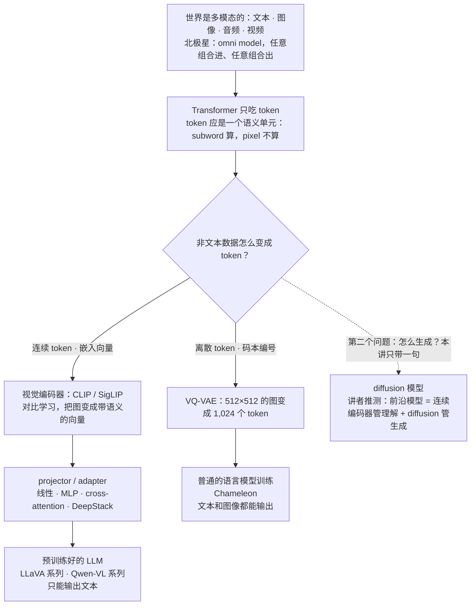
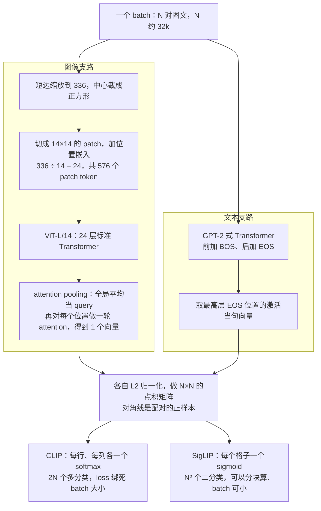
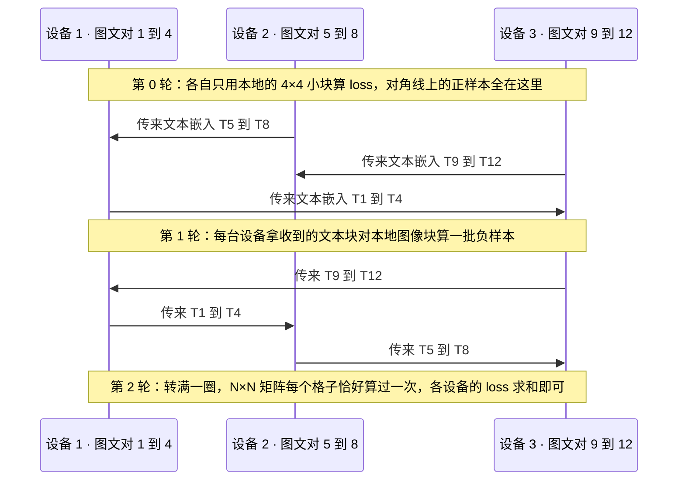
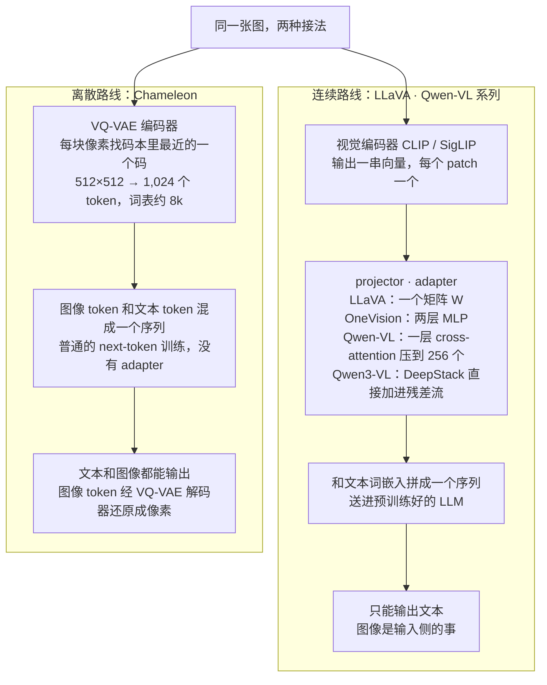
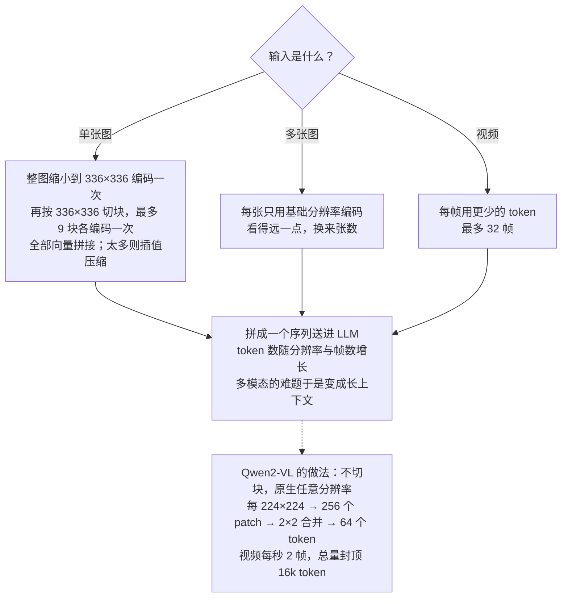
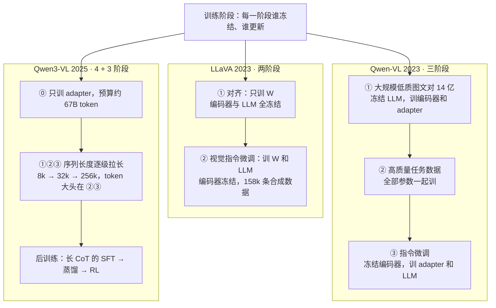

# CS336 第 17 讲｜对齐与多模态（Alignment, Multimodality）

> Stanford CS336: Language Modeling from Scratch（2026 春）· 第 17 讲，2026 年 5 月 27 日，客座讲座之前的最后一讲。课程表上的题目是 "Alignment - Multimodality"，但讲者开场就说：原计划再多讲些强化学习，考虑到只剩这一讲，改为通讲多模态——对齐部分实际一句没讲，77 分钟全是多模态
> 视频：<https://www.youtube.com/watch?v=26FtD08ZpOU>（1:17:39；英文字幕为自动生成，模型名与缩写错得多，见文末勘误）
> 讲者：Percy Liang（课程表所列；字幕里"第 1 讲我们讲了 tokenization、BPE 你们自己实现过""幻灯片是 HTML 写的，标签被吃掉了""我是做语言的人"等自述与之相符）
> 课程主页：<https://stanford-cs336.github.io/> · 本讲围绕的论文：[CLIP](https://arxiv.org/abs/2103.00020)、[SigLIP](https://arxiv.org/abs/2303.15343)、[LLaVA](https://arxiv.org/abs/2304.08485)、[LLaVA-OneVision](https://arxiv.org/abs/2408.03326)、[Qwen-VL](https://arxiv.org/abs/2308.12966)、[Qwen2-VL](https://arxiv.org/abs/2409.12191)、[Qwen3-VL](https://github.com/QwenLM/Qwen3-VL)、[Chameleon](https://arxiv.org/abs/2405.09818)

**一句话**：Transformer 在所有模态上都是目前最好用的，但它只吃 token，所以多模态的全部难点是"把图像、音频、视频变成 token"。走连续路线，就是先用对比学习训一个视觉编码器（CLIP 用 4 亿对网络图文、每个 batch 约 32k 对做 2N 个 softmax；SigLIP 把它换成 N² 个 sigmoid，batch 与 loss 解耦，芯片·天省 16 倍），把 336×336 的图变成几百个带语义的向量，再经一个只有几千万参数的 projector 注进一个几十到几百亿参数、已经预训练好的 LLM——LLaVA 与 Qwen-VL 两个系列共用这个模板，几代之间变的只是编码器、adapter、动态分辨率、位置编码和越来越多的训练阶段（LLaVA 两阶段，Qwen3-VL 四加三阶段、上下文拉到 256K）。走离散路线，就是 Chameleon：VQ-VAE 把 512×512 的图变成 1,024 个来自 8k 词表的 token，和文本一起做普通的语言模型训练，因此能生成图像，代价是训练不稳、细节丢失。讲者的判断：前沿模型大概率是"连续编码器管理解、diffusion 管生成"。

## 时间轴

| 时间 | 内容 |
|---|---|
| [0:05](https://www.youtube.com/watch?v=26FtD08ZpOU&t=5s) | 开场：原计划讲 RL，改讲多模态；北极星是任意模态进出的 omni model |
| [2:09](https://www.youtube.com/watch?v=26FtD08ZpOU&t=129s) | Transformer 只吃 token：token 可离散可连续，但得是语义单元；两个问题——怎么输入、怎么生成，本讲只答前者 |
| [4:13](https://www.youtube.com/watch?v=26FtD08ZpOU&t=253s) | 回到 2021：CLIP 的动机（把"爬网页"搬到图像上）与对比目标；伪代码 |
| [8:28](https://www.youtube.com/watch?v=26FtD08ZpOU&t=508s) | 数据 400M 对、OpenCLIP 与 LAION-5B；短边缩到 336 再中心裁剪；问答：为什么要配文本 |
| [12:37](https://www.youtube.com/watch?v=26FtD08ZpOU&t=757s) | 视觉编码器 ViT-L/14 与 attention pooling；文本编码器取 EOS 位置的激活 |
| [17:18](https://www.youtube.com/watch?v=26FtD08ZpOU&t=1038s) | 零样本 ImageNet 胜过 120 万张标注图训出的 ResNet；噪声与过滤；改成预测 caption 反而更差；CLIP 的代价 |
| [22:27](https://www.youtube.com/watch?v=26FtD08ZpOU&t=1347s) | SigLIP：每个格子一个 sigmoid；WebLI 十亿量级，OCR 也能造图文对 |
| [25:32](https://www.youtube.com/watch?v=26FtD08ZpOU&t=1532s) | 训练效率：256 张 v3 × 10 天对 32 张 v4 × 5 天；文本嵌入轮转的分块并行；batch 与 loss 解耦，32k 是临界 |
| [28:41](https://www.youtube.com/watch?v=26FtD08ZpOU&t=1721s) | VLM 模板：编码器 + projector + LLM；LLaVA 的零件与 158k 条 GPT-4 合成数据 |
| [33:21](https://www.youtube.com/watch?v=26FtD08ZpOU&t=2001s) | LLaVA 两阶段：先只训 W 做对齐，再训 W 和 LLM；"面包车后面熨衣服" |
| [35:26](https://www.youtube.com/watch?v=26FtD08ZpOU&t=2126s) | LLaVA-OneVision：SigLIP + Qwen2 + 两层 MLP；OCR 逼出 AnyRes |
| [39:41](https://www.youtube.com/watch?v=26FtD08ZpOU&t=2381s) | 单图 / 多图 / 视频的 token 预算；数据即任务、蒸馏 GPT-4；三阶段；跨模态迁移 |
| [45:52](https://www.youtube.com/watch?v=26FtD08ZpOU&t=2752s) | Qwen-VL：OpenCLIP + 一层 cross-attention 压成 256 个 token；三阶段，第一阶段连编码器一起训 |
| [49:29](https://www.youtube.com/watch?v=26FtD08ZpOU&t=2969s) | Qwen2-VL：原生动态分辨率、2×2 合并、三维 M-RoPE |
| [52:37](https://www.youtube.com/watch?v=26FtD08ZpOU&t=3157s) | Qwen3-VL：交错 M-RoPE、显式时间戳、√ 归一化的 loss、DeepStack、4 + 3 阶段、256K 上下文 |
| [59:47](https://www.youtube.com/watch?v=26FtD08ZpOU&t=3587s) | 问答：只输出文本；系统难点在数据加载；对齐阶段预算 67B token；视觉编码器为何远小于 LLM |
| [1:07:07](https://www.youtube.com/watch?v=26FtD08ZpOU&t=4027s) | Chameleon：全部离散化；VQ-VAE；训练不稳定与 QK-norm、z-loss |
| [1:14:26](https://www.youtube.com/watch?v=26FtD08ZpOU&t=4466s) | 收束：连续编码器 + diffusion 的推测；理解与生成的对称；模态要称重 |

## 核心内容

### 1. 题目里的"对齐"去哪了，以及这一讲真正的问题



*图 17-1｜本讲的地图：一切先变成 token，连续路线与离散路线各走到哪（自绘示意）· [▶ 看原幻灯片 2:09](https://www.youtube.com/watch?v=26FtD08ZpOU&t=129s)*

- **只剩一讲，选了多模态**：讲者开场说，原计划再多讲些强化学习，但一门课如果对多模态一字不提就不完整——看看今天所有头部模型，多模态无处不在。于是这一讲是多模态模型的综述（他自己说这够开一整门课）。课程表上的 "Alignment" 就此没有下文：RLHF / DPO 的推导见 CME295 第 5 讲与 CS224R 第 9 讲，Constitutional AI 见 CS329A 第 4 讲；本课程里离它最近的是第 15 讲的 mid/post-training 和第 16 讲的 RLVR。注意本讲里反复出现的 alignment 是另一个意思——把视觉向量对齐到 LLM 的词嵌入空间（第 4 节）。
- **语言模型已经很通用**：任意文本到任意文本——自然语言、代码、诗，甚至 DNA 序列。但世界是多模态的：文本、图像、音频、视频。讲者给的北极星是 omni model：输入任意模态的任意组合，输出也是任意组合——给一张图加一段视频问问题、生成图像、把音频转成图。本讲不造整个 omni model，只讲怎么让模型"吃进"图像。
- **为什么绕不开 Transformer**：讲者说得很直白——大家试过别的架构，但在所有模态上、在大规模下，Transformer 仍是手里最好的东西，只能想办法用它。而它是为文本设计的：吃 token、吐 token。这里把 token 的概念放宽——不只是离散的 id，也可以是连续的向量（嵌入）。关键要求只有一条：一个 token 应当是一个语义单元。subword 勉强算，一个 pixel 肯定不算。
- **所以问题变成"造图像版的 BPE"**：文本其实也经历过这一步（第 1 讲的 BPE，作业里实现过的那个），只是不算太痛。非文本模态就得费心得多：什么东西相当于图像的 tokenizer，能把一张图变成 Transformer 能消化的一串 token？
- **两个问题**：一是非文本数据怎么输入 Transformer，二是怎么从 Transformer 生成非文本数据。本讲几乎全在答第一个；第二个只在 Chameleon（第 7 节）和收尾时点到。

### 2. CLIP（2021）：用 4 亿对网络图文，把图像编成"有语义"的向量



*图 17-2｜CLIP 的两条支路与 N×N 矩阵；最后一步换成 sigmoid 就是 SigLIP（自绘示意）· [▶ 看原幻灯片 5:50](https://www.youtube.com/watch?v=26FtD08ZpOU&t=350s) · 出处：[Radford et al., 2021](https://arxiv.org/abs/2103.00020)*

- **2021 年的处境**：语言这边 GPT-2、GPT-3 已经进入基础模型时代——从互联网上爬一大堆噪声很大的文本，模型够大就能学出有用的东西。视觉这边仍靠大规模人工标注集（ImageNet）训 ResNet，再加数据增强。OpenAI 的问题是：图像的"爬网页"在哪？答案是网上海量的"图 + 说明文字"。
- **目标函数**：一个 batch 里有 N 对图文（课上的例子 N = 32,000）。图像编码器把每张图变成向量 I_1 到 I_N，文本编码器把每段文字变成 T_1 到 T_N。要求 I_1 与 T_1 的点积远大于 I_1 与其他任何 T_j 的点积；反过来 T_1 与 I_1 的点积也要大过 T_1 与其他任何 I_j。于是每行、每列各是一个 N 类的 softmax 分类，一共 2N 个分类问题，排成一个 N×N 的矩阵，对角线是正样本。课上的伪代码就四步：两个 m×d 的嵌入矩阵、归一化、带温度的点积、交叉熵。

$$
\mathcal{L}_{\text{CLIP}}=\frac{1}{2N}\sum_{i=1}^{N}\left[-\log\frac{e^{\tau\,I_i\cdot T_i}}{\sum_{j=1}^{N}e^{\tau\,I_i\cdot T_j}}\;-\;\log\frac{e^{\tau\,I_i\cdot T_i}}{\sum_{j=1}^{N}e^{\tau\,I_j\cdot T_i}}\right]
$$

I_i、T_i 是归一化后的图像与文本向量，τ 是温度的倒数（可学习）；中括号里第一项是"第 i 张图在 N 段文本里认出自己那段"，第二项是"第 i 段文本在 N 张图里认出自己那张"。分母跑遍整个 batch——这就是它离不开大 batch、又不可分解的原因（第 3 节）。

- **数据**：论文对数据说得不多——大致是拿一批查询词去搜，挖出图文对，共 4 亿对，没有公开。后来 OpenCLIP 复现并扩展了这条路线，用的是公开的 LAION-5B：50 亿张带文字说明的图，经过一堆处理——有意思的是过滤用的就是 CLIP 自己（有点自举的味道），然后再训 OpenCLIP。好处是至少数据和代码都指得出来（第 13–14 讲讲的数据过滤，在图文数据上同样是主角）。
- **图像预处理**：网上的图什么长宽比都有，而神经网络不喜欢动态尺寸。CLIP 的办法很粗暴：把短边缩放到 336（或 224），再从中间裁出正方形。这纯粹图方便，也因为作者们心里想的是 ImageNet 分类——主体通常在中间，裁掉点背景无妨。后面会看到（第 5 节）这一步能做得好得多。
- **问答（[11:06](https://www.youtube.com/watch?v=26FtD08ZpOU&t=666s)）：为什么非要配文本，只用图像不行吗**？有一条路线（SimCLR）靠数据增强：同一张图裁一下、扰动一下、转一下，要求嵌入相近。这对低层细节有用，但你没法把一种狗"增强"成另一种狗；文本给的是更高层的语义——看后面各家 VLM 想做的任务，就知道为什么要的是语义。
- **视觉编码器**：论文试了 ResNet 和刚出炉的 ViT，ViT 最好，所以今天说 CLIP 通常指 ViT 版本。ViT 的做法：把图切成小方块 patch（ViT 原论文 16×16，CLIP 用 14×14），每个 patch 展平成向量就是一个 token，加位置嵌入，送进标准 Transformer。输出是一串向量，要一个向量代表整图：平均一下也行，但 CLIP 发现 attention pooling 更好——用全局平均作 query，再对每个位置的 key、value 做一轮 attention，得到的向量比直接平均更有信息量。
- **最好的型号 ViT-L/14**：L 是 large（讲者说大概 24 层，没把握），14 是 patch 边长，输入 RGB 三通道、336×336。实际是先在低分辨率上训，后期为了速度才换到高分辨率。
    - 算一下 token 数：336 ÷ 14 = 24，一张图就是 24 × 24 = 576 个 patch token——后面 LLaVA 每张图注入 LLM 的 token 数就是这个 576。
    - 问答（[15:13](https://www.youtube.com/watch?v=26FtD08ZpOU&t=913s)）：位置嵌入要不要做成 2D 的？CLIP 论文试过 2D 与 1D，差别不大——但讲者提醒，这类结论都是在"分类"任务下得出的；后面的模型（第 6 节的 M-RoPE）会认真处理空间结构。
  > 小注：ViT-L 的标准配置是 24 层、宽 1024、约 3 亿参数，讲者的"24 层"是对的。CLIP 论文里 ViT-L/14 先在 224×224 上训，最后再用 336×336 多训一个 epoch，即常说的 ViT-L/14@336px。
- **文本编码器**：GPT-2 风格的标准 Transformer（同一个团队做的）。要从序列得到一个向量：前面加 BOS、后面加 EOS，取最高层 EOS 位置的激活当整句的表示。
- **训练**：取一个 batch，图和文各编一遍，算那 2N 个交叉熵，反传。
- **头条结果**：在 ImageNet 上，零样本的 CLIP 胜过用 120 万张 ImageNet 标注图训出来的 ResNet——那 120 万张图是无数小时的 Mechanical Turk 标注。零样本的做法：把每个类别名写成一句话过文本编码器，图像向量与各类别向量做点积，取最大。
- **问答（[18:49](https://www.youtube.com/watch?v=26FtD08ZpOU&t=1129s)）：caption 那么杂，别的图也提到狗，不会混淆吗**？会有噪声，但平均下来没事——不会每次都是狗，有时是苹果、是猫。更根本的是，网页里图旁边的文字和 alt text 极其嘈杂，研究表明说明文字往往并不逐字描述图里有什么（图里是狗就不会再写"狗"），所以需要大量过滤；直接拿任意网页图文，噪声大到没法用。
- **一个伏笔**：论文还试过不做排序、改成"看图预测文字"（bag of words 或语言模型）。结果更强的语言模型目标反而更差、至少效率更低，不如 bag of words 和对比学习。说明就 ImageNet 分类这种粗粒度表示而言，精确建模 caption 的 token 序列并不重要。结尾会回到这一点：理解要的表示和生成要的表示不是一回事。
- **CLIP 小结与代价**：图像向量之所以有语义，是因为和文本配了对；设计决策全部围绕分类，所以不细粒度，但它是后面一切的稳健起点。技术上的麻烦是 batch 必须很大（3 万左右，batch 为 1 或 10 根本不成立），而且 softmax 跨整个 batch，不可分解——语言模型训练里各条序列彼此独立、并行算完最后汇总即可，这里不行。

### 3. SigLIP（Google，2023）：softmax 换成 sigmoid，batch 和 loss 解耦



*图 17-3｜SigLIP 的分块并行：图像不动，文本嵌入在设备间轮转（自绘示意）· [▶ 看原幻灯片 26:33](https://www.youtube.com/watch?v=26FtD08ZpOU&t=1593s) · 出处：[Zhai et al., 2023](https://arxiv.org/abs/2303.15343)*

- **一句话的改动**：CLIP 做多分类——这对图文是正样本，去和其他所有图或文竞争；SigLIP（Sigmoid loss for Language-Image Pre-training）更简单：任意一对图文，问"配不配"，二分类。对着那个 N×N 矩阵看，对角线标 +1，其余全标 −1，每个格子过一个 log-sigmoid，加起来就是 loss。

$$
\mathcal{L}_{\text{SigLIP}}=-\frac{1}{N}\sum_{i=1}^{N}\sum_{j=1}^{N}\log\sigma\!\left(z_{ij}\,(t\,I_i\cdot T_j+b)\right),\qquad z_{ij}=\begin{cases}+1 & i=j\\ -1 & i\neq j\end{cases}
$$

σ 是 sigmoid，z_ij 是标签，t 与 b 是可学习的温度和偏置；每个格子的项只依赖自己这一对图文，所以可以分块算、跨设备加。课上只提了归一化点积和 log-sigmoid 两步。

> 小注：偏置 b 是论文里的细节，课上没提：初值取负，用来抵消开局时负样本（N² − N 个）对正样本（N 个）的压倒性多数，否则训练一开始 loss 会被负样本主导。

```python
def clip_loss(img, txt, t):                  # img, txt: [N, d]，已各自 L2 归一化
    logits = t * img @ txt.T                 # [N, N]，t 是可学习的温度倒数
    labels = arange(N)                       # 第 i 行、第 i 列的正样本都是第 i 个
    return (ce(logits, labels) + ce(logits.T, labels)) / 2   # 行、列各 N 个 softmax

def siglip_loss(img, txt, t, b):
    logits = t * img @ txt.T + b             # b 是可学习偏置，初值取负
    z = 2 * eye(N) - 1                       # 对角 +1，其余 −1
    return -logsigmoid(z * logits).sum() / N # N² 个互不相关的二分类
```

两个 loss 放在一起看：前者的每一项都要整行或整列的 logits 做分母，后者的每一项只看自己那个格子。

- **问答（[24:00](https://www.youtube.com/watch?v=26FtD08ZpOU&t=1440s)）：要不要讲究采样、挑难负样本**？讲者说提问者想的是对比学习里常见的顾虑——正负要平衡、负样本要"紧"——但至少在最初的论文里没有，就是老老实实用同一个矩阵。
- **数据**：Google 内部的 WebLI（另一篇 2022 年的图文模型论文攒的），十亿量级的图文对；图里带文字的做 OCR，又是一种造图文对的方法；做了过滤，多语言。
- **训练效率**（论文的主要卖点）：CLIP 用 256 张 TPU v3 训了 10 天，SigLIP 用 32 张 TPU v4 训了 5 天。折成芯片·天：256 × 10 = 2,560 对 32 × 5 = 160，差 16 倍。讲者补充：别以为 v4 单芯片的 FLOP/s 比 v3 快多少——他说其实不快、甚至慢六成左右，v4 好在一个 pod 里能放更多芯片、互连更好（第 5 讲）；另外 CLIP 大概也没怎么为吞吐优化代码，先跑通再说。
  > 小注：按 Google 公开规格，TPU v3 单芯片 bf16 峰值约 123 TFLOP/s，v4 约 275 TFLOP/s，v4 反而快 2 倍多，讲者"v4 更慢"一句与公开数据不符。就算按规格算总算力，SigLIP 用的也只有 CLIP 的约 1/7（32 × 275 × 5 对 256 × 123 × 10），效率结论不变。
- **怎么并行**：回想系统那几讲的 DDP（第 7 讲）——每台设备存一部分图文对。语言模型训练里各样本的 loss 彼此独立，这里不是：负样本来自别的设备。做法是第一趟各设备只用本地的图文算一小块 loss，然后把文本嵌入在设备间轮转——设备 1 收到 T5 到 T8 算一批负样本，再收到 T9 到 T12，如此转一圈，直到 N×N 矩阵所有非对角块都算过（图 17-3）。

```python
txt = txt_local                                      # 每台设备：n 张图、n 段文
loss = block_loss(img_local, txt, diag=True)         # 本地块：对角线上有正样本
for _ in range(D - 1):                               # D 台设备围成一圈
    txt = ring_shift(txt)                            # 文本嵌入传给下一台，收上一台的
    loss += block_loss(img_local, txt, diag=False)   # 收到的块全是负样本
loss = all_reduce(loss, op="sum")                    # 每个格子恰好算过一次
```

图像嵌入从不离开本机，跨设备搬的只是 n×d 的文本嵌入块，搬 D − 1 次。

- **batch 与 loss 解耦**：CLIP 的 loss 绑死 batch 大小——batch 一变就是另一个损失函数；SigLIP 的 loss 期望不随 batch 变，batch 小只是方差大。于是他们能试小得多的 batch：16k 以下 SigLIP 明显好于 CLIP，因为 CLIP 在小 batch 下直接退化。再往大也试了，帮助不大——32k 基本就是它的临界 batch size（第 9 / 11 讲讲过的 critical batch size）。
- **到这里的成果**：CLIP 和 SigLIP 都是"图像编码器"——吃一张固定尺寸（比如 336×336）的图，吐出带语义的向量。接下来就是把它们接到语言模型上。

### 4. VLM 的模板与 LLaVA（2023）：一个矩阵 W 把视觉向量翻译成词嵌入



*图 17-4｜把视觉接进 LLM 的两种方式：连续向量经 projector 注入，或离散化后当普通 token（自绘示意）· [▶ 看原幻灯片 32:21](https://www.youtube.com/watch?v=26FtD08ZpOU&t=1941s) · 出处：[Liu et al., 2023](https://arxiv.org/abs/2304.08485)*

- **模板**：拿一个现成的图像编码器、一个现成的 LLM，中间加一个小部件把前者的输出变成后者的输入，缝起来——这是 mid-training / post-training 的味道（第 15 讲），不是从零训。讲者挑了两个家族对照：LLaVA（开源，连数据都公开）和 Qwen-VL（多代演进、性能强）。
- **LLaVA 的时代背景**：2023 年，闭源的 GPT-4 已经能做视觉推理；LLaVA 用开源零件也做到了一点，虽然远不如 GPT-4，但大家第一次看见这类模型内部长什么样。
- **三个零件**：视觉编码器 = CLIP ViT-L/14；文本解码器 = Vicuna（第一代 LLaMA 在 ShareGPT 上微调的版本，ShareGPT 是用户分享自己与 ChatGPT 对话的网站，讲者说现在应该已经不在了）；数据 = 从 MS COCO 出发合成——COCO 里每张图有人工标的 caption 和物体框，把这些文字喂给只看文字的 GPT-4，让它生成三类东西：围绕这张图的问答对话、详细描述、复杂推理。共 158,000 条。
  > 小注：论文里三类的份额是对话 58k、详细描述 23k、复杂推理 77k。生成时 GPT-4 看不到图，只看 caption 和框坐标——这是"数据即任务"的最早版本。
- **接线**：图 → CLIP → 一串向量。但这些向量并不住在文本词嵌入的空间里，所以乘一个矩阵 W 投影过去；文本照常查词嵌入表。两串向量拼成一个序列送进标准 Transformer，输出文本。讲者的说法：相当于把图像变成"文本 token"，好白嫖预训练好的语言模型。

$$
H_v = W\,g(X_v),\qquad p(y\mid X_v,X_q)=\prod_{t=1}^{T}p_\theta\!\left(y_t\mid H_v,\,X_q,\,y_{<t}\right)
$$

g 是冻结的 CLIP 编码器，X_v 是图像，W 是投影矩阵，X_q 是问题文本，y 是回答；loss 只算回答的 token，和第 15 讲的 SFT 一样。

```python
def llava_forward(image, prompt_ids, answer_ids):
    z = clip_vit(image)                     # [576, d_v]：冻结的编码器，每个 patch 一个向量
    h_img = W(z)                            # [576, d_lm]：投影到 LLM 的词嵌入空间
    h_txt = embed(prompt_ids + answer_ids)  # 文本照常查表
    h = concat(h_img, h_txt)                # 拼成一个序列，图像 token 在前
    return lm(h).loss_on(answer_ids)        # 标准 next-token loss，只算回答部分

trainable = {1: [W], 2: [W, lm]}            # 阶段 1 只训 W；阶段 2 训 W 和 LLM；ViT 全程冻结
```

整个"多模态"就是一个矩阵乘法加一次拼接，其余全是现成的语言模型。

- **两阶段训练**
    1. 对齐（alignment）：冻结编码器和 LLM，只训 W。W 随机初始化时，投影出来的向量不像任何自然语言 token 的嵌入；训 W 就是让它们"像"。
    2. 视觉指令微调：编码器仍冻结，训 W 和 LLM，数据就是那 158k 条"图 + 对话 / 描述 / 推理 → 文本"。
- **论文里的例子**：一张图，用户问"这张图哪里不对劲"，模型答出"一般不会在面包车后面熨衣服"。作者强调即使提问没有暗示"反常"，模型也会主动说出来——当时 GPT-4 能做到，其他开源模型不行。
- **问答（后半段的两个问题一并放在这）**
    - [1:02:57](https://www.youtube.com/watch?v=26FtD08ZpOU&t=3777s) 对齐阶段的 LLM 是预训练好的吗？必须是，否则"对齐"无从谈起；LLM 冻结，只训 adapter 把给定的编码器接到给定的 LLM 上。训多久？定一个 token 预算就训，讲者在训练表上念出的数是 67B token（应是 Qwen3-VL 报告里对齐阶段的数），没有自适应的停止条件。
    - [1:04:00](https://www.youtube.com/watch?v=26FtD08ZpOU&t=3840s) 视觉编码器的参数为什么比 LLM 小那么多？因为它干的是很局部的活——看一个个小 patch、理解 patch，既不需要知识也不做推理，能力都在 LLM 里。数量级：LLaVA-OneVision 的例子是 LLM 720 亿参数、projector 7,200 万、ViT 不到 10 亿。
  > 小注：OneVision-72B 的 projector 是两层 MLP，从 SigLIP 的 1152 维升到 Qwen2-72B 的 8192 维，1152 × 8192 + 8192 × 8192 ≈ 7,600 万，与"7,200 万"量级相符（推断）。

### 5. LLaVA-OneVision（2024）：同一模板换零件，AnyRes 把任意分辨率、多图和视频都变成 token 序列



*图 17-5｜AnyRes 与三种输入的 token 预算；虚线是 Qwen2-VL 的原生动态分辨率（自绘示意）· [▶ 看原幻灯片 39:08](https://www.youtube.com/watch?v=26FtD08ZpOU&t=2348s) · 出处：[Li et al., 2024](https://arxiv.org/abs/2408.03326)*

- **升级清单**：LLaVA 之后有 LLaVA-1.5、LLaVA-NeXT 一串论文，讲者用 2024 年的 OneVision 一次讲完。配方不变，野心更大——要处理多图和视频（视频就是抽样出来的一串帧）。视觉编码器换成 SigLIP；LLM 换成当时最强的开源模型 Qwen2；projector 从线性换成两层 MLP。讲者的比喻：系统架构一样，只是零件在升级。
- **OCR 逼出的问题**：读文字需要极细的信息，否则 J 和 I 分不清。而 CLIP 那一套是缩放再裁成 336×336——一页文档这么处理根本没法读。
- **AnyRes**（LLaVA-1.5 引入）：既然编码器只吃 336×336，那就不缩小，而是把大图切成若干块，每块正好是编码器的尺寸，各自编码，把向量拼接起来。另外保留一路：整图缩小后编码一次，给全局视角。块太多就用插值把 token 数压下来。讲者点出这里的美感：Transformer 本来就能处理任意长度的句子，AnyRes 让图像也享受这种"任意"。

```python
def anyres_tokens(img, encode, res=336, max_tiles=9):
    views = [resize(img, res)]                       # 一路：整图缩到 336×336，看全局
    views += tile(img, res)[:max_tiles]              # 多路：按 336×336 切块，最多 9 块
    toks = concat([encode(v) for v in views])        # 每块 24×24 = 576 个向量
    return interpolate_down(toks) if too_long(toks) else toks   # 太长就插值压缩
# 多图：每张只走第一路；视频：每帧更少 token，最多 32 帧——三种输入的预算被压到同一量级
```

编码器本身一点没改，"高分辨率"完全靠多调几次编码器、多占一些上下文换来。

- **三种输入的 token 预算**：图、多图、视频原则上都是"一堆图"，但作者刻意压了压天平——视频可能很长，不能让重复的帧淹没数据集。单图：全图缩略 + 最多 9 块；多图：每张只用基础分辨率（看得远一点，换来张数）；视频：每帧更少 token，最多 32 帧。讲者的判断：能不能做好多模态，很大程度上就是能不能处理长上下文（第 4 讲的注意力替代方案、第 10 讲的 KV cache 账都为此服务）。
  > 小注：论文里的数字——SigLIP 每块 729 个 token，单图最多 1 + 9 块共 7,290 个 token；多图每张 729；视频 32 帧、每帧压到 196 个，共 6,272 个。三者被有意做成同一量级（应为这些数）。
- **数据哲学**："高质量、大数量"，讲者的翻译是：非常有针对性——看数据表几乎全是任务：VQA、表格问答、两张图找不同……这明摆着是后训练的地盘。而且这项工作毫不掩饰地蒸馏 GPT-4 类模型——不理想，但没有标注预算就只能这么干。
- **三阶段**：第一阶段仍是只训 projector 的对齐；第二阶段训高质量、偏"知识"的数据；第三阶段全模型一起训、数据长得像下游任务。讲者说从两阶段变三阶段没什么原理上的理由。
- **跨模态的迁移**（[43:15](https://www.youtube.com/watch?v=26FtD08ZpOU&t=2595s)，论文里最有意思的发现）：图表和示意图只有单图数据，测试时却能对"一张表 + 一张图"两张图展开对话；OCR 只在单图上训、关系推理只在多图上训，合起来能看一串截图做 GUI agent；"视觉提示"（图上画个圈指定区域）只有单图数据，却能泛化到视频——"描述视频里圈出来的球员"，而那个球员横跨多帧。讲者第一眼的反应是"这不就是每个任务做监督学习吗"，但任务够多时确实出现迁移，令人安心。
- **LLaVA 系列的价值**：少数把数据也开源的工作，可以真正复现和研究。

### 6. Qwen-VL → Qwen2-VL → Qwen3-VL：动态分辨率、M-RoPE、DeepStack，阶段越来越多



*图 17-6｜三代 VLM 的训练阶段：都从"只训 adapter"起步，之后越来越长（自绘示意）· [▶ 看原幻灯片 57:46](https://www.youtube.com/watch?v=26FtD08ZpOU&t=3466s) · 出处：[Qwen3-VL](https://github.com/QwenLM/Qwen3-VL)*

- **Qwen-VL（2023）**：视觉编码器用 OpenCLIP；adapter 是一层 cross-attention，带 2D 位置嵌入，把整张图压成固定的 256 个 token——讲者说这显然不"动态"，不过当时的编码器本身也不动态。特殊 token 有 image、box（物体框）、ref（指代描述）三种——幻灯片用 HTML 写的，这几个尖括号标签被浏览器吃掉了。训练三阶段：
    1. 他们叫"预训练"但并非从零——大规模低质量图文对，14 亿条；冻结 LLM，训视觉编码器和 adapter。和 LLaVA 的差别就在这：视觉编码器也训。
    2. 高质量任务数据（VQA、图表问答等），全部参数一起训。
    3. 指令微调：冻结视觉编码器，训 adapter 和 LLM。
    - 能做的事：中文示例、看图写代码（"语言模型会的它都得会"）、输出物体框（以文本形式输出坐标，不是画图）、OCR、多图比较。
- **Qwen2-VL**：编码器更大；主要变化是原生动态分辨率——同 LLaVA 走向 OneVision 时的领悟一样：图有大小，视频更是逼着你动态处理。一张大图可以映射成 11,000 个 token，一个小公式截图只要 8 个。做法：每个 224×224 的块过一个 ViT（起点是 OpenCLIP 的 ViT，但会被微调），然后每 2×2 个 patch 合并成一个 token 以压缩上下文，224×224 最终变成 64 个 token；视频每秒抽 2 帧，总量封顶 16k token。

$$
n_{\text{img}}=\frac{H}{14}\times\frac{W}{14}\times\frac{1}{2\times 2}\qquad\Rightarrow\qquad 224\times224:\ \frac{16\times16}{4}=64
$$

H、W 是图像的高和宽（像素），14 是 patch 边长，2×2 是合并的窗口；边长翻倍，token 数翻四倍，所以 11,000 与 8 这两个极端都出得来。

- **M-RoPE（多模态 RoPE）**：RoPE（第 3 讲）让两个向量的内积只依赖相对距离，一维时距离就是隔了几个 token。多维版本一样，只是位置变成三元组（时间 t、高 h、宽 w），每个 patch 一个三元组；对每一维分别算 RoPE，再拼接起来。讲者说这个设计后来在 Qwen3 里被发现不太理想。
- **Qwen3-VL（2025 年的报告）**：讲者说没有结构性大变，但每一处都影响质量：
    - LLM 换成 Qwen3 系列（dense 与 MoE 都有），底座本身很强，对最终质量帮助最大。
    - 长上下文：上下文长度到 256K，长视频离不开它。
    - 视觉编码器换成 SigLIP 2——架构与 SigLIP 完全相同、向后兼容的改进版。
    - 交错的 M-RoPE：原来是把嵌入维度切成三段，第一段给时间、第二段给宽、第三段给高。但 RoPE 每个维度对应一个频率，这么分意味着（按讲者的说法）时间轴只拿到低频、高度轴只拿到高频。改法是三个轴交错着分配维度，每个轴都同时有高频和低频。
    - 显式时间戳：以前视频帧的时间只隐含在位置编码里；现在插入"第 0 秒"这样的 token，让模型能直接指着时间说话（"两秒之后发生了什么"）。
    - 按 √ 长度归一化的 per-token loss：视频样本极长、单图样本很短，按 token 平均等于让视频主导。讲者的理解（他说细节不清楚）是每个样本的 loss 除以其长度的平方根，压低超长样本的权重。
    - adapter 升级为 DeepStack：从 LLaVA 的线性、到 MLP、到 cross-attention，这次更进一步——视觉编码器本来就逐层算出一叠特征，DeepStack 把它们直接加进 LLM 的残差流（residual stream，各层 attention / MLP 的输出不断累加的那条主干），而不是把编码器当黑盒只取最后一串向量。讲者称之为更深的融合。
  > 小注：DeepStack 应出自 Meng et al., 2024（复旦与 Microsoft），把视觉 token 分成 N 组，从底到顶分别送进 LLM 的前 N 层；讲者说是 DeepSeek 团队的论文，应为口误。

$$
\text{pos}=(t,h,w),\qquad \theta_g=b^{-2g/d},\qquad \text{Qwen2-VL: axis}(g)=\begin{cases}t & g<g_1\\ h & g_1\le g<g_2\\ w & g\ge g_2\end{cases}\qquad \text{Qwen3-VL: axis}(g)=(t,h,w)_{\,g \bmod 3}
$$

每个 patch 的位置是三元组；第 g 组维度按频率 θ_g 旋转，旋转角用 axis(g) 那一维的坐标。Qwen2-VL 按连续的段分配轴，于是每个轴只见到一段频率；Qwen3-VL 改为轮流分配，每个轴都覆盖全频段。公式是按讲者的描述整理的，分段边界 g_1、g_2 与取模写法只是示意。

$$
\mathcal{L}=\sum_{e}\frac{1}{\sqrt{L_e}}\sum_{t=1}^{L_e}\ell_{e,t}
$$

L_e 是第 e 个样本的 token 数，ℓ_{e,t} 是逐 token 的交叉熵；不归一化时一个样本的权重正比于 L_e，除以 √L_e 后只正比于 √L_e——比如一段 6,000 个 token 的视频，从 6,000 份权重降到约 77 份（讲者说这是他的理解，报告细节不清楚）。

- **训练流水线**：预训练四个阶段、后训练三个阶段——讲者感叹流水线已经相当复杂。阶段 0 照例只训 adapter；接着三个阶段把序列长度逐级拉长：8k → 32k → 256k，token 大头在中间两个阶段。后训练：先在长 chain-of-thought 数据上做 SFT，再知识蒸馏，最后强化学习（第 16 讲）。讲者说到这里已经是一篇系统论文，他只挑了核心新点子。
- **结果**：和闭源模型 Gemini、GPT-5、Opus 4.1 同台，表里粗体是每行最好——Qwen 拿下不少，相当强。
- **数据细节**：后期 Qwen 报告对数据配比说得很少，要看细节得去 LLaVA 系列或 AI2 的 Molmo 论文（没来得及讲）。从 Qwen-VL 到 Qwen3-VL，框架没变，变的是规模、更多数据集、意识到必须处理长上下文、打磨图像处理。
- **问答**
    - [59:47](https://www.youtube.com/watch?v=26FtD08ZpOU&t=3587s) 会生成视频吗，怎么决定输出图还是文？这些模型不生成图像或视频——多模态全在输入侧，输出永远是文本。除 RL 外的所有阶段都是逐 token 监督，没有 LLM 当裁判，数据集里是什么就学什么；到了 RL 阶段才能玩各种 reward。
    - [1:00:53](https://www.youtube.com/watch?v=26FtD08ZpOU&t=3653s) 系统上比纯语言模型难吗？肯定不更容易。数据集大得多，视频光是加载就可能成为瓶颈——讲语言模型时从没操心过数据加载，因为太便宜；这里必须让加载和计算异步。视频 token 多，所以要归一化或降权——两周前讲的数据配比（第 14 讲）就是干这个的。不过文本也有几十万亿 token，多模态 token 并没有压倒性地多。

| | LLaVA 2023 | LLaVA-OneVision 2024 | Qwen-VL 2023 | Qwen2-VL 2024 | Qwen3-VL 2025 | Chameleon 2024 |
|---|---|---|---|---|---|---|
| 视觉编码器 | CLIP ViT-L/14 | SigLIP | OpenCLIP | 更大的 ViT，OpenCLIP 起点，可微调 | SigLIP 2 | VQ-VAE tokenizer（离散） |
| adapter | 线性 W | 两层 MLP | 一层 cross-attention → 256 token | 2×2 patch 合并 | DeepStack 注入残差流 | 无 |
| 分辨率 | 336×336 裁剪 | AnyRes：缩略 + 最多 9 块 | 固定 256 token | 原生动态，224×224 → 64 token | 动态 + 256K 上下文 | 512×512 → 1,024 token |
| 位置 | 1D | 1D | 2D 位置嵌入 | M-RoPE（t、h、w 分段） | 交错 M-RoPE + 显式时间戳 | 1D |
| 数据 | 158k 条 GPT-4 合成 | 任务化合成，蒸馏 GPT-4 | 阶段 1 用 14 亿对 | 未展开 | 未展开 | 文本 + 图文混合 |
| 阶段 | 2 | 3 | 3（阶段 1 训编码器） | 3 | 4 + 3，8k → 32k → 256k | 2 |
| 输出 | 文本 | 文本 | 文本（框以文本坐标输出） | 文本 | 文本 | 文本与图像交错 |

### 7. Chameleon（Meta，2024）：全部离散化，用 VQ-VAE 把图像变成 token

- **动机**：前面的 VLM 把图编成向量塞进语言模型，所以只能输出文本。修法有多种——给 VLM 挂一个 diffusion 头也行——但 Chameleon 的想法是：把一切都变成离散 token。讲者承认这里有他作为"做语言的人"的审美偏好：分析和生成图像都和文本一模一样，一个 prompt 后面接着生成的就是图像 token，或者反过来；论文里"我无聊了，给我看些鸟"会得到文字、图片、文字、图片交错的回复。omni model 的愿景——文本和图像真正住在同一个空间——用"让一切长得像文本"来实现（图 17-4 右）。
- **VQ-VAE（2017）**：把图像映射到离散编码。编码器先把每块像素变成连续向量，再"取整"到码本里最近的一个码——码本是几千个原型向量（课上说 8,000 个），每个对应某种 patch；解码器从码重建图像；训练目标是重建误差，因取整不可导还要加几项，课上略过。

$$
k^{*}=\arg\min_{k}\lVert E(x)-e_k\rVert_2,\qquad z_q=e_{k^{*}},\qquad \mathcal{L}=\lVert x-D(z_q)\rVert_2^{2}+\lVert \mathrm{sg}[E(x)]-e_{k^{*}}\rVert_2^{2}+\beta\,\lVert E(x)-\mathrm{sg}[e_{k^{*}}]\rVert_2^{2}
$$

E 是编码器、D 是解码器，e_1 到 e_K 是码本（K 约 8k），sg 是 stop-gradient；第一项是课上说的重建误差，后两项就是课上略过的"因为取整不可导而加的项"——一项把码本拉向编码器的输出，一项让编码器别乱跑；argmin 本身靠直通估计把梯度原样传回编码器。

- **数字**：512×512 的图变成 1,024 个 token，每个来自 8k 大小的词表——即 32 × 32 的网格，每个 token 管 16×16 个像素。因为数据形态变了，他们还重新训了文本 tokenizer。
  > 小注：论文里的码本大小是 8192；讲者说的"8,000"是约数。
- **训练**：就是普通的语言模型训练——没有 adapter、没有视觉编码器、没有"冻结谁训谁"。仍分两阶段（语言模型本来也常这样）：第一阶段大规模无监督的文本加图文混合，第二阶段混入高质量数据。
- **代价**
    - 训练不稳。文本和图像虽然同处一个 token 空间，行为却完全不同：下一个词大多可预测，熵低；图像 token 熵极高——"这个位置到底是哪种蓝"没法预测。混训导致参数范数持续增长、loss 发散，他们用 QK-norm 和 z-loss 正则（第 3 讲讲过的两个稳定训练的手段）压住了范数。
    - 性能不如连续路线，离散化必然丢信息——小字 OCR 一离散就读不了。
    - 多模态的加权更难：Qwen 那边已经要调权重，这里更严重。
- **历史位置**：VQ-VAE 曾流行过一阵，主要用于图像生成——Transformer 只能生成离散的东西，那就把数据都离散化。后来 diffusion 模型成熟，这条路就没那么热了。

### 8. 收束：讲者的判断

- **前沿模型都在说"原生多模态"**：Gemini、GPT 发布时都强调原生多模态、omni，也确实能做到，但没有任何细节。讲者的推测：多半是连续编码器负责理解（不想丢信息），diffusion 负责生成。
- **根本难题**是非文本模态怎么进、怎么出。理解和生成之间有一种对称，但没有万能的编码器：CLIP 为分类而生，向量小、只抓高层语义；OCR 或生成图像则需要极细的高频信息——diffusion 擅长的正是这个。第 2 节的伏笔在这里收：预测 caption 这种更"生成"的目标，对学分类用的表示反而没帮助。
- **模态要称重**：视频的信息密度比文本低得多，不能让它淹没文本（Qwen3-VL 的 √ 归一化、OneVision 的帧预算都是这件事）。
- **现状**：连续编码器仍是最佳实践——CLIP 已经 5 岁，它那套思路还是抓语义的默认选择；Transformer 还在；生成靠 diffusion（本讲没讲）。没有对应的作业，讲者鼓励自己动手训一个玩玩。

## 关键图表速查（点时间戳跳到原幻灯片）

| 图 | 看什么 | 跳转 | 出处 |
|---|---|---|---|
| omni model 示意 | 输入输出各是文本 · 图像 · 音频 · 视频的任意组合；本讲只做"图像进、文本出" | [1:08](https://www.youtube.com/watch?v=26FtD08ZpOU&t=68s) | — |
| CLIP 的 N×N 矩阵与伪代码 | 对角线是配对的正样本；每行、每列各一个 softmax；伪代码里先归一化、乘温度、再对称交叉熵 | [5:50](https://www.youtube.com/watch?v=26FtD08ZpOU&t=350s) · [7:25](https://www.youtube.com/watch?v=26FtD08ZpOU&t=445s) | [CLIP](https://arxiv.org/abs/2103.00020) |
| resize + center crop 与 ViT 分块 | 短边缩到 336 再裁正方形（想想一页文档剩什么）；每个 14×14 的小块是一个 token | [9:30](https://www.youtube.com/watch?v=26FtD08ZpOU&t=570s) · [12:37](https://www.youtube.com/watch?v=26FtD08ZpOU&t=757s) | [ViT](https://arxiv.org/abs/2010.11929) |
| ImageNet 零样本对比 | 零样本 CLIP 对 120 万标注图训的 ResNet；零样本 = 图向量与各类别文本向量做点积取最大 | [17:18](https://www.youtube.com/watch?v=26FtD08ZpOU&t=1038s) | [CLIP](https://arxiv.org/abs/2103.00020) |
| SigLIP 伪代码 | 标签矩阵对角 +1、其余 −1，然后 log-sigmoid；没有 softmax 的分母 | [23:29](https://www.youtube.com/watch?v=26FtD08ZpOU&t=1409s) | [SigLIP](https://arxiv.org/abs/2303.15343) |
| SigLIP 分块并行 | 每台设备一块图文；文本嵌入轮转，对角块之外都是负样本 | [26:33](https://www.youtube.com/watch?v=26FtD08ZpOU&t=1593s) | 同上 |
| batch size 曲线 | 16k 以下 SigLIP 明显高于 CLIP；32k 之后再大也不涨 | [27:38](https://www.youtube.com/watch?v=26FtD08ZpOU&t=1658s) | 同上 |
| LLaVA 合成数据与架构图 | COCO 的人工 caption 与物体框 → GPT-4 生成三类数据；图 → CLIP → 乘 W → 与文本嵌入拼接 → LLM | [31:20](https://www.youtube.com/watch?v=26FtD08ZpOU&t=1880s) · [32:21](https://www.youtube.com/watch?v=26FtD08ZpOU&t=1941s) | [LLaVA](https://arxiv.org/abs/2304.08485) |
| AnyRes 与三种输入的预算 | 整图缩略一路 + 切块多路；单图 9 块、多图每张 1 块、视频 32 帧 | [39:08](https://www.youtube.com/watch?v=26FtD08ZpOU&t=2348s) · [40:11](https://www.youtube.com/watch?v=26FtD08ZpOU&t=2411s) | [LLaVA-OneVision](https://arxiv.org/abs/2408.03326) |
| 跨模态迁移示例 | 单图的图表数据 → 多图对话；单图的圈选提示 → 视频里被圈的球员 | [43:47](https://www.youtube.com/watch?v=26FtD08ZpOU&t=2627s) | 同上 |
| Qwen-VL 三阶段训练表 | 阶段 1 用 14 亿对、冻结 LLM 训编码器；阶段 2 全参数；阶段 3 冻结编码器 | [47:24](https://www.youtube.com/watch?v=26FtD08ZpOU&t=2844s) | [Qwen-VL](https://arxiv.org/abs/2308.12966) |
| Qwen2-VL 动态分辨率 | 同一模型里一张图 11,000 个 token、一个公式 8 个 token | [49:29](https://www.youtube.com/watch?v=26FtD08ZpOU&t=2969s) | [Qwen2-VL](https://arxiv.org/abs/2409.12191) |
| Qwen3-VL 架构与 DeepStack | 编码器多层特征直接加进 LLM 残差流；旁边是交错 M-RoPE 与时间戳 token | [53:08](https://www.youtube.com/watch?v=26FtD08ZpOU&t=3188s) · [56:46](https://www.youtube.com/watch?v=26FtD08ZpOU&t=3406s) | [Qwen3-VL](https://github.com/QwenLM/Qwen3-VL) |
| Qwen3-VL 训练表与结果表 | 序列长度 8k → 32k → 256k；结果表里的粗体对 Gemini、GPT-5、Opus 4.1 | [57:46](https://www.youtube.com/watch?v=26FtD08ZpOU&t=3466s) · [58:46](https://www.youtube.com/watch?v=26FtD08ZpOU&t=3526s) | 同上 |
| Chameleon 交错生成示例 | "我无聊了，看些鸟"→ 文字与图片交错输出；输出侧也有图像 | [1:08:43](https://www.youtube.com/watch?v=26FtD08ZpOU&t=4123s) | [Chameleon](https://arxiv.org/abs/2405.09818) |
| VQ-VAE 示意 | 编码 → 取整到码本最近的码 → 解码重建；512×512 → 1,024 个 token | [1:09:50](https://www.youtube.com/watch?v=26FtD08ZpOU&t=4190s) | [VQ-VAE](https://arxiv.org/abs/1711.00937) |

## 提到的工作

| 名称 | 在本讲里的作用 |
|---|---|
| [CLIP](https://arxiv.org/abs/2103.00020)（Radford et al., 2021） | 全讲的起点：对比学习训出的图像编码器；4 亿对图文；ViT-L/14；零样本 ImageNet |
| ImageNet · ResNet | 2021 年之前视觉的主流范式：120 万张人工标注图上训分类器；被零样本 CLIP 超过 |
| [SimCLR](https://arxiv.org/abs/2002.05709)（Chen et al., 2020） | 问答里对照的另一路线：靠数据增强学不变性，抓不到"另一种狗"这样的语义 |
| [ViT](https://arxiv.org/abs/2010.11929)（Dosovitskiy et al., 2020） | 视觉编码器的骨架：16×16 patch 当 token；CLIP 改用 14×14 |
| GPT-2 | CLIP 文本编码器的架构来源（同一团队） |
| [OpenCLIP](https://arxiv.org/abs/2212.07143)（Cherti et al., 2022）· [LAION-5B](https://arxiv.org/abs/2210.08402) | CLIP 的开源复现与 50 亿对公开数据；过滤用的是 CLIP 自己；Qwen-VL 的编码器 |
| [SigLIP](https://arxiv.org/abs/2303.15343)（Zhai et al., 2023） | sigmoid 替代 softmax；WebLI 数据；32 张 v4 训 5 天；分块并行；OneVision 的编码器 |
| [PaLI / WebLI](https://arxiv.org/abs/2209.06794)（Chen et al., 2022） | SigLIP 数据的来源——"另一篇 2022 年的图文模型论文"，应为这篇 |
| [SigLIP 2](https://arxiv.org/abs/2502.14786)（Tschannen et al., 2025） | 架构不变、向后兼容的改进版；Qwen3-VL 的编码器 |
| TPU v3 / v4 | 训练效率对比的硬件单位（第 5 讲） |
| [LLaVA](https://arxiv.org/abs/2304.08485)（Liu et al., 2023） | VLM 模板的最简版：CLIP + 线性 W + Vicuna；158k 条 GPT-4 合成数据；两阶段 |
| [Vicuna](https://lmsys.org/blog/2023-03-30-vicuna/) · ShareGPT | LLaVA 的文本解码器：LLaMA 在用户分享的 ChatGPT 对话上微调 |
| [MS COCO](https://arxiv.org/abs/1405.0312)（Lin et al., 2014） | 人工标注的 caption 与物体框，LLaVA 合成数据的原料 |
| GPT-4 | 视觉推理的标杆，也是 LLaVA 系列合成数据的来源（"毫不掩饰的蒸馏"） |
| [LLaVA-1.5](https://arxiv.org/abs/2310.03744) · [LLaVA-NeXT](https://llava-vl.github.io/blog/2024-01-30-llava-next/) | 中间几代，AnyRes 在 1.5 引入；讲者把创新一并归到 OneVision 里讲 |
| [LLaVA-OneVision](https://arxiv.org/abs/2408.03326)（Li et al., 2024） | SigLIP + 两层 MLP + Qwen2；单图 / 多图 / 视频的 token 预算；三阶段；跨模态迁移；数据开源 |
| [Qwen2](https://arxiv.org/abs/2407.10671) · [Qwen3](https://arxiv.org/abs/2505.09388) | OneVision 与 Qwen3-VL 的语言底座 |
| [Qwen-VL](https://arxiv.org/abs/2308.12966)（Bai et al., 2023） | OpenCLIP + cross-attention 压成 256 token；三阶段，第一阶段 14 亿对且训编码器 |
| [Qwen2-VL](https://arxiv.org/abs/2409.12191)（Wang et al., 2024） | 原生动态分辨率、2×2 合并、M-RoPE、视频 2 fps 封顶 16k token |
| [Qwen3-VL](https://github.com/QwenLM/Qwen3-VL)（2025） | 交错 M-RoPE、显式时间戳、√ 归一化 loss、DeepStack、4 + 3 阶段、256K |
| [RoPE](https://arxiv.org/abs/2104.09864)（Su et al., 2021） | M-RoPE 的一维原型（第 3 讲） |
| [DeepStack](https://arxiv.org/abs/2406.04334)（Meng et al., 2024） | 视觉特征分组注入 LLM 前几层的残差流；讲者误记为 DeepSeek 团队 |
| [Molmo](https://arxiv.org/abs/2409.17146)（Deitke et al., 2024） | AI2 的开放 VLM，数据细节可查；讲者没来得及讲 |
| Gemini · GPT-5 · Claude Opus 4.1 | Qwen3-VL 结果表里的闭源对照 |
| [Chameleon](https://arxiv.org/abs/2405.09818)（Meta, 2024） | 全离散化的早期融合模型；训练不稳、QK-norm 与 z-loss |
| [VQ-VAE](https://arxiv.org/abs/1711.00937)（van den Oord et al., 2017） | 图像离散化：码本取整 + 重建 |
| QK-norm · [z-loss](https://arxiv.org/abs/2204.02311) | 压住范数增长的两个正则手段（第 3 讲；z-loss 出自 PaLM） |
| diffusion 模型 | 生成侧的主流；讲者推测前沿模型用它生成，本讲未展开 |

## 术语对照

| English | 中文 |
|---|---|
| omni model | 全模态模型：任意模态组合进、任意组合出 |
| modality | 模态：文本、图像、音频、视频 |
| natively multimodal | 原生多模态：一开始就按多模态设计训练，而非事后拼接 |
| discrete / continuous token | 离散 token（词表里的 id）/ 连续 token（嵌入向量） |
| contrastive learning | 对比学习：拉近配对的、推开不配对的 |
| image-text pair | 图文对 |
| alt text | 网页图片的替代文字，图文对的常见来源 |
| zero-shot | 零样本：不在该任务的标注数据上训练直接用 |
| center crop | 中心裁剪 |
| patch | 图像小块：ViT 的 token 单位 |
| ViT (Vision Transformer) | 视觉 Transformer |
| attention pooling | 注意力池化：用全局平均当 query 再做一轮 attention，得到单个向量 |
| temperature | 温度：logits 的缩放系数 |
| sigmoid loss | sigmoid 损失：每对图文独立的二分类 |
| critical batch size | 临界 batch 大小：再增大 batch 也不省步数的拐点 |
| DDP (distributed data parallel) | 分布式数据并行（第 7 讲） |
| VLM (vision-language model) | 视觉语言模型 |
| vision encoder | 视觉编码器 |
| projector / adapter | 投影器 / 适配器：把视觉向量映射到 LLM 输入空间的小部件 |
| alignment（本讲义） | 模态对齐：只训 adapter，让视觉向量像词嵌入；与 RLHF 的"对齐"无关 |
| visual instruction tuning | 视觉指令微调 |
| AnyRes | 任意分辨率：整图缩略一路加切块多路 |
| dynamic resolution | 动态分辨率：token 数随图像大小变 |
| OCR | 光学字符识别：读图里的文字 |
| VQA (visual question answering) | 视觉问答 |
| GUI agent | 看屏幕截图操作界面的 agent |
| visual prompting | 视觉提示：在图上画圈等标记来指定区域 |
| cross-modal transfer | 跨模态迁移：单图学的能力用到多图或视频上 |
| distillation | 蒸馏：用强模型的输出当训练数据 |
| M-RoPE (multimodal RoPE) | 多模态旋转位置编码：位置是（时间、高、宽）三元组 |
| interleaved | 交错：频率维度轮流分给三个轴；或文本与图像交错排列 |
| timestamp token | 时间戳 token：显式写出"第几秒" |
| per-token loss normalization | 逐 token 损失的归一化：按样本长度的平方根缩放 |
| residual stream | 残差流：各层输出不断累加的主干 |
| DeepStack | 把视觉特征分组加进 LLM 前几层的残差流 |
| early fusion | 早期融合：模态在输入 token 层面就合并 |
| VQ-VAE (vector-quantized VAE) | 向量量化变分自编码器：连续向量取整到码本 |
| codebook | 码本：K 个原型向量 |
| quantize（本讲义） | 离散化到码本（区别于第 5 讲的数值精度量化） |
| reconstruction loss | 重建误差 |
| stop-gradient / straight-through | 截断梯度 / 直通估计：让不可导的取整能反传 |
| entropy | 熵：下一个 token 有多难猜 |
| QK-norm | 对 query、key 做归一化，防 attention logits 爆炸（第 3 讲） |
| z-loss | 惩罚 softmax 归一化项过大的正则（第 3 讲） |
| diffusion model | 扩散模型：生成侧的主流 |
| information density | 信息密度：每个 token 携带多少信息，视频远低于文本 |
| data loading | 数据加载：多模态训练的新瓶颈 |
| knowledge distillation | 知识蒸馏（Qwen3-VL 后训练的一步） |

## 字幕勘误

"GPD3 / GP4 / GPD4 / GPD5" → GPT-3 / GPT-4 / GPT-5；"BP tokenizer" → BPE tokenizer；"imageet" → ImageNet；"resnats" → ResNets；"sim clear" → SimCLR；"vit l14"、"14x4 patches" → ViT-L/14、14×14 patches；"336 x36" → 336×336；"the 1DNA" → the 1D version；"zero shop" → zero-shot；"lion 5B" → LAION-5B；"cichlip / cig" → SigLIP；"web li" → WebLI；"two end cross entropy" → 2N 个交叉熵；"Lava / LA lava" → LLaVA；"Vunia" → Vicuna；"MS Coco / MSCO" → MS COCO；"any res / NRA idea" → AnyRes；"guey agents" → GUI agents；"Quen / Quend / Quinn" → Qwen；"ande models" → MoE models；"66 tokens" → 64 tokens（224 ÷ 14 = 16，16² ÷ 4 = 64）；"M rope" → M-RoPE；"deep stack" → DeepStack；"mobile paper" → Molmo paper；"command paper" → Chameleon paper；"VQEs / VKU VAEs" → VQ-VAEs；"a,024 tokens" → 1,024 tokens；"interled" → interleaved。

## 带走的问题

1. CLIP 的 loss 为什么离不开 3 万的 batch，而 SigLIP 换成 sigmoid 后"期望不变、方差变大"具体指什么？如果把 SigLIP 的负样本从 N² − N 个减到每张图只配 k 个，loss 的期望还一样吗？分块并行的通信量又会怎么变？
2. 用第 2 节的算术：LLaVA 一张图 576 个 token，OneVision 单图最多 7,290 个，Qwen2-VL 一张 1792×1792 的图占多少？按第 10 讲的 KV cache 账，这些 token 在 72B 模型上每层要多少字节？视频封顶 16k token、每秒 2 帧，意味着能看多长的视频？
3. 视觉编码器不到 10 亿参数而 LLM 720 亿，讲者的理由是"编码器只做局部的事"。把 Qwen-VL 第一阶段"连编码器一起训"和 LLaVA "编码器全程冻结"放到同一份数据上比，你预期哪个在 OCR 上更好、哪个更容易把 CLIP 学到的语义忘掉？
4. Chameleon 的不稳定被归因于文本 token 熵低、图像 token 熵高。√ 归一化的 loss、数据配比降权、QK-norm / z-loss 各自解决的是"模态权重"还是"数值稳定"？连续路线为什么天然没有这个熵的问题——代价又是什么（想想它为什么不能生成图）？
5. 讲者推测前沿模型是"连续编码器理解 + diffusion 生成"。理解与生成对表示的要求不同（语义对高频细节），一个 omni model 里两套表示怎么共存？CLIP 论文里"预测 caption 反而更差"这个伏笔对此说明了什么？
