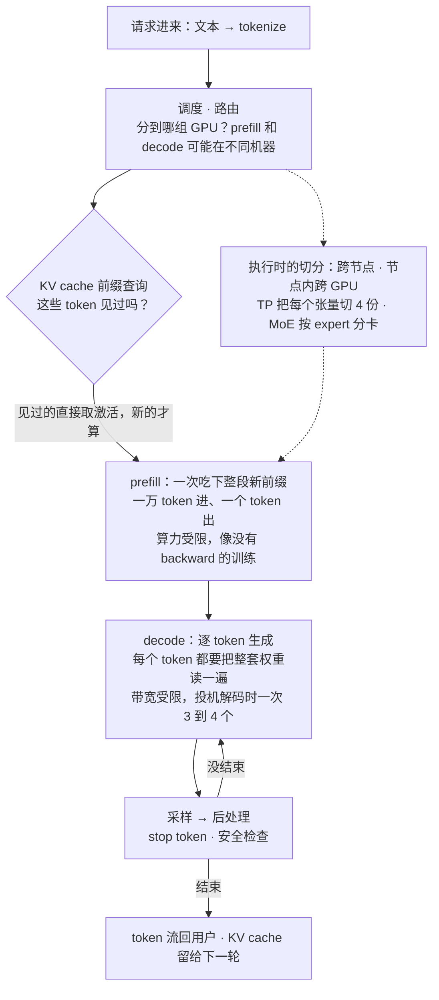
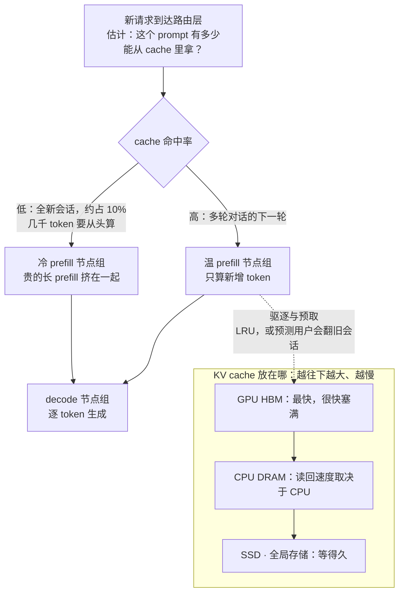
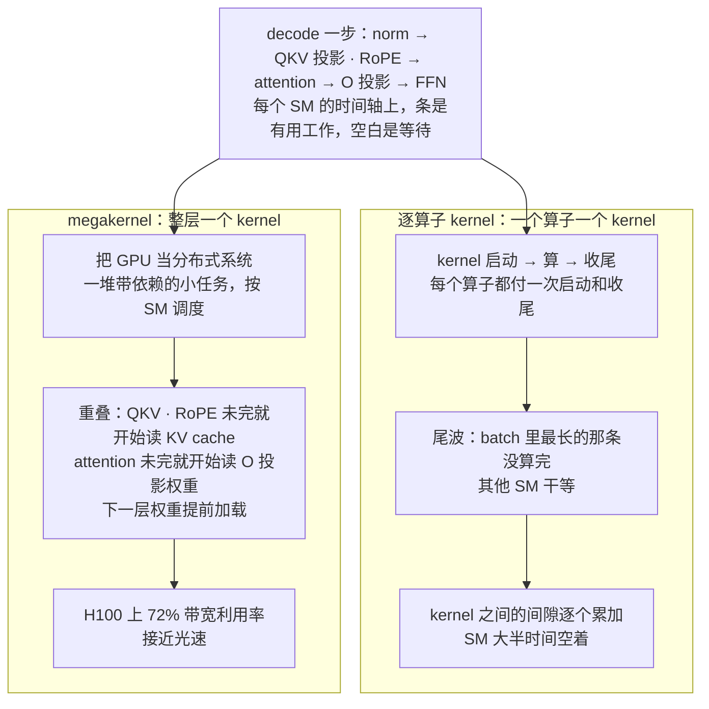
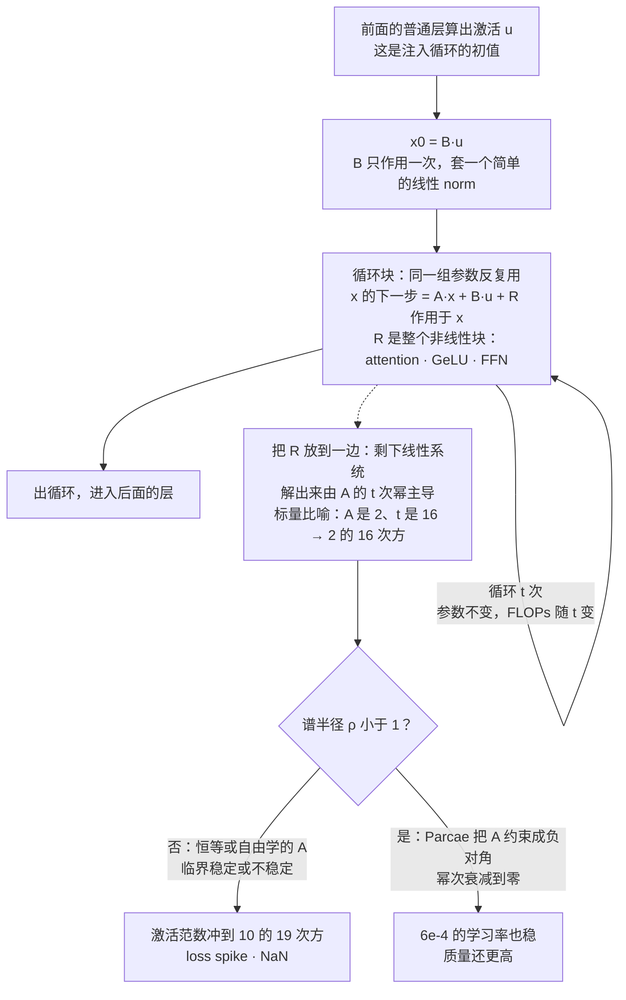
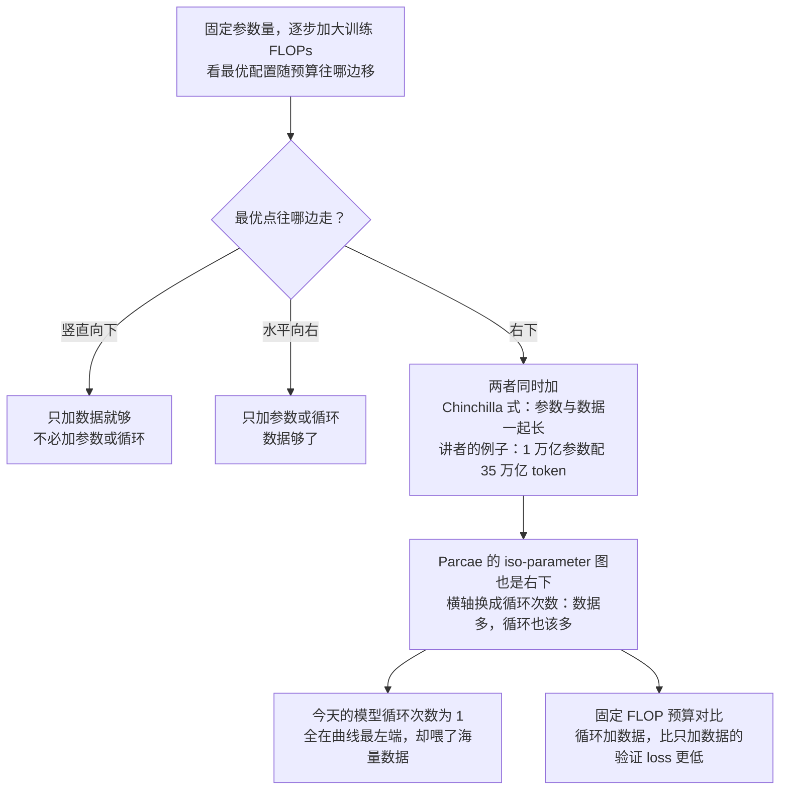

# CS336 第 18 讲｜客座讲座：Dan Fu（Guest Lecture）

> Stanford CS336: Language Modeling from Scratch（2026 春）· 第 18 讲，2026 年 6 月 3 日，全课最后一节。课程表和视频标题都只写 "Guest lecture: Dan Fu"，没有正式讲题；按内容可概括为"从推理这一边看语言模型：一个 token 的一生、megakernel、稳定的循环模型 Parcae"（推断）
> 视频：<https://www.youtube.com/watch?v=9EEm4iMAF5s>（1:11:40；英文字幕为自动生成，专名和缩写错得多，见文末勘误）
> 讲者：Dan Fu——UC San Diego 助理教授（他说自己"在 UCSD 有一个小实验室"，即 ML Systems Lab），同时代表 Together AI（他也在那里工作；Percy 也是 Together 的成员）；Percy Liang 邀请并主持，问答里提了两个问题
> 课程主页：<https://stanford-cs336.github.io/>；本讲围绕的东西：Together AI 的 [cache-aware prefill–decode disaggregation](https://www.together.ai/blog/cache-aware-disaggregated-inference)；Stanford Hazy Research 与 Together 合作的 [Llama-1B megakernel](https://hazyresearch.stanford.edu/blog/2025-05-27-no-bubbles)（Spector et al., 2025）和它依托的 [ThunderKittens](https://arxiv.org/abs/2410.20399)（Spector et al., 2024）；UCSD 的 [Parcae](https://arxiv.org/abs/2604.12946)（Prairie, Novack, Berg-Kirkpatrick, Fu, 2026）

**一句话**：前 17 讲讲怎么把模型训出来，这一讲请 Dan Fu 讲训好之后的"另一边"——推理是把电变成 token、变成智能的引擎：一个请求进来要经过调度、KV cache 前缀查询、算力受限的 prefill 和带宽受限的 decode，多请求靠 continuous batching 共享 GPU，KV cache 从 HBM 一路溢到 CPU 内存和 SSD，prefill 与 decode 分到不同机器甚至不同芯片，规模上去之后 0.001% 概率的 kernel bug 会变成"模型突然说中文"；站在这个位置做研究，路由层加两行"冷热分流"能让服务快最多 40%，把一整层算子融成一个 megakernel 能把 H100 上的 decode 推到 72% 的带宽利用率，而把 SSM 的稳定性分析搬到循环 Transformer 上（Parcae）能让"参数不变、多循环几次"这条新的 scaling 轴稳定地训起来——初步的 scaling law 说：数据越多，循环也该越多。

## 时间轴

| 时间 | 内容 |
|---|---|
| [0:05](https://www.youtube.com/watch?v=9EEm4iMAF5s&t=5s) | 开场：这门课讲怎么训，本讲讲另一边——serving 与推理，外加两个研究项目 |
| [1:05](https://www.youtube.com/watch?v=9EEm4iMAF5s&t=65s) | 动机：新工业革命；规模——2018 年 1 亿参数、2019 年 GPT-2、今天开源过万亿、前沿 5 到 10 万亿；马车到汽车的十年 |
| [4:41](https://www.youtube.com/watch?v=9EEm4iMAF5s&t=281s) | GPU 是新石油，推理是把电变成智能的引擎；全讲 takeaway：懂推理与 kernel 才能全栈创新；UCSD 与 Together 两个身份 |
| [7:46](https://www.youtube.com/watch?v=9EEm4iMAF5s&t=466s) | 一个 token 的一生：调度、KV cache 查询、执行与切分、采样；幻灯片全由 Nano Banana Pro 生成 |
| [9:49](https://www.youtube.com/watch?v=9EEm4iMAF5s&t=589s) | 生产流量的形状：输入 / 输出长度、多轮 agentic、轮间间隔、会话粘性、SLA |
| [13:52](https://www.youtube.com/watch?v=9EEm4iMAF5s&t=832s) | prefill 与 decode：一万 token 进一个出的算力受限操作，对逐 token 的带宽受限操作 |
| [16:24](https://www.youtube.com/watch?v=9EEm4iMAF5s&t=984s) | continuous batching；KV cache 与前缀共享；万亿模型在 280 GB 的 GPU 上怎么切：TP、EP |
| [19:58](https://www.youtube.com/watch?v=9EEm4iMAF5s&t=1198s) | prefill / decode 分到不同机器；Groq、Cerebras、SambaNova 押注 decode 专用芯片 |
| [22:00](https://www.youtube.com/watch?v=9EEm4iMAF5s&t=1320s) | 规模化后的三个诡异 bug：NaN 与复读、tool call 死循环、突然冒中文 |
| [25:38](https://www.youtube.com/watch?v=9EEm4iMAF5s&t=1538s) | KV cache 的层级：GPU → CPU DRAM → SSD；问答：像操作系统换页，LRU 与预取 |
| [29:46](https://www.youtube.com/watch?v=9EEm4iMAF5s&t=1786s) | NVL72：万亿模型切 72 卡、塑料连接器与容错、百万 token 上下文 |
| [31:16](https://www.youtube.com/watch?v=9EEm4iMAF5s&t=1876s) | 例子：cache-aware prefill–decode 分离——路由层两行代码，最多快 40% |
| [34:19](https://www.youtube.com/watch?v=9EEm4iMAF5s&t=2059s) | 研究一 megakernel：decode 把 GPU 变成"美化的内存加载器"；逐算子 kernel 的空隙从哪来 |
| [37:22](https://www.youtube.com/watch?v=9EEm4iMAF5s&t=2242s) | megakernel 的做法：把 GPU 当分布式系统调度；Llama 1B 一层一个 kernel；ThunderKittens；H100 72% 带宽利用率 |
| [41:32](https://www.youtube.com/watch?v=9EEm4iMAF5s&t=2492s) | 研究二 Parcae：循环 Transformer 的动机；训练一动就炸的老毛病 |
| [46:39](https://www.youtube.com/watch?v=9EEm4iMAF5s&t=2799s) | 用 SSM 的眼光看残差：A、B 矩阵、闭式解、谱半径；约束 A、B 后训练稳定、质量更高 |
| [54:20](https://www.youtube.com/watch?v=9EEm4iMAF5s&t=3260s) | 循环的 scaling law：iso-parameter 曲线往右下走 → 数据多，循环也该多 |
| [59:26](https://www.youtube.com/watch?v=9EEm4iMAF5s&t=3566s) | 总结与问答：预训练模型直接循环、推理收益、megakernel 的代价、为硬件设计模型、agentic 与批处理、多卡 megakernel |

## 核心内容

### 1. 这一讲的位置：从"电"到"智能"的那一段

- **这门课与这一讲**：CS336 一路讲的是训练；Dan Fu 讲的是模型训好之后"另一边"的事——怎么 serve、怎么做推理，把电变成 token、变成智能，以及站在这个位置上能做哪些研究。
- **规模，以及变化的速度**：2018 年他读博开始时最大的模型是 1 亿参数；2019 年 GPT-2 被认为"太危险不能发布"（这门课的作业足够训到 GPT-2 水平）；今天开源模型已过 1 万亿参数，前沿模型大约 5 到 10 万亿。他的类比：1902 年曼哈顿有 13 万匹工作马，1898 年纽约专门开会讨论马粪，结论是"没办法，捏着鼻子忍"；到 1912 年汽车数量已经超过马。语言模型的"1912 时刻"他认为是去年（2025）：他和团队里大多数人写代码已经以模型为主。
- **GPU 是新石油，推理是引擎**：GPU 投资以数千亿美元计；但油要经过引擎才变成动能——推理引擎和 GPU kernel 就是把 GPU（Percy 的说法：沙子）变成可用智能的引擎。这门课写的 FlashAttention 是训练侧，推理侧还有一整个世界的复杂度。
- **全讲的一个 takeaway**：懂推理引擎、懂底层 kernel，才做得了机器学习算法的"全栈创新"。三段内容都在证明这一句：一个 token 的一生（第 2–6 节）、megakernel（第 7 节）、Parcae（第 8–9 节）。
- **两个身份**：UCSD 的实验室（Parcae 出自这里）和 Together AI——一家 AI cloud（GPU、推理、微调），研究背景很重，Percy 也在其中。推理系统那部分幻灯片改编自他学生 Austin 在 Together 的经历，全部由 Nano Banana Pro 生成——"远看全对，凑近看字就错了"。

### 2. 一个 token 的一生：推理引擎里有什么



*图 18-1｜一个请求在推理引擎里走的路：调度、前缀查询、prefill、decode 循环、后处理（自绘示意）· [▶ 看原幻灯片 8:17](https://www.youtube.com/watch?v=9EEm4iMAF5s&t=497s)*

- **引擎的循环**（图 18-1）：tokenize 之后先调度（prefill 和 decode 可能已经拆在不同机器），再查 KV cache 看哪些 token 见过，然后才是可跨节点、跨 GPU 切分的模型计算，最后采样、后处理（stop token、安全检查）返回用户；引擎就在这个循环里等下一个请求。
- **生产流量长什么样**：既不像训练数据，也不像拍脑袋编的负载。要看四个维度：
    - 输入 / 输出长度：coding 负载（Cursor 那种把整个代码库交给 agent 的）输入是数万 token，输出看模型会不会先吐 thinking token；把整本书贴进去讨论的摘要负载、普通 chat 又各不相同。
    - 多轮与 agentic：你和 coding agent 来回改；agent 自己调工具（搜代码库、上网搜），把结果回灌再来一轮。
    - 轮间间隔：交互式聊天和手机语音要快；放手让 agent 自己跑是另一种节奏；agent 卡住喊"帮忙"而你没注意到，又是一个空档。
    - 会话粘性：反复来回的用户，还是问一句就走、第二天再来的用户。
- **目标，也就是 SLA**：交互式应用可能要求首 token 在 1 秒内返回（agent 先说"我在想"）；或者已知要生成 500 个 token，整条回复要在某个时限内到齐。后面所有优化都在这些约束下做。第 10 讲算过吞吐与延迟的账，这里补的是生产流量真实的形状。

### 3. prefill 与 decode：一个像训练，一个是"美化的内存加载器"

- **prefill**：比如 10,000 个没见过的 token 进来，要算出它们的激活和 logits——10,000 进、1 出。算力受限，和训练几乎一样：写好 FlashAttention kernel、跑一遍，只是没有 backward。
- **decode**：prompt 处理完后逐个 token 生成，有投机解码的话一次可能出 3 到 4 个。每生成一个 token 都要送回模型再跑一遍——FLOPs 其实很少，但每一步都得把整套权重从显存读一遍，所以是带宽受限。GPU 这台大规模并行机器在这一步退化成"美化的内存加载器"。
- **时间**：prefill 单次远长于一步 decode，但 prefill 每个 prompt 只跑一次，decode 每个 token 跑一次。

$$
\text{FLOPs}_{\text{prefill}} \approx 2\,N\,L_{\text{prompt}},\qquad
t_{\text{decode step}} \;\gtrsim\; \frac{\text{bytes}(\text{weights}) + \text{bytes}(\text{KV cache})}{\text{BW}_{\text{HBM}}}
$$

N 是参数量，L_prompt 是 prompt 长度，前一式是 prefill 的计算量（每个参数每个 token 约 2 次运算，和训练的 forward 一样）；后一式说 decode 一步至少要花"把权重和 KV cache 从 HBM 读一遍"的时间，BW_HBM 是显存带宽。讲者课上只做了定性判断，这两个式子是第 10 讲的记账方式。

- 对照第 5 讲的 roofline：prefill 落在算力封顶的那段，decode 落在带宽斜线上；同一个模型、同一张卡，两个阶段的瓶颈完全不同——这是后面所有"分离"的根据。

### 4. 多请求同时在跑：continuous batching、KV cache 的层级、模型怎么切



*图 18-2｜KV cache 的三层存放，以及第 6 节的冷热路由（自绘示意）· [▶ 看原幻灯片 25:38](https://www.youtube.com/watch?v=9EEm4iMAF5s&t=1538s) · 出处：[Together AI, 2026](https://www.together.ai/blog/cache-aware-disaggregated-inference)*

- **continuous batching**：他的图里时间向下流。一个长请求在生成；新请求进来，占算力，也占 KV cache 的显存；短请求结束、又进来一个；第 4 步再来一个很长的（橙色），显存不够，只能排队等长请求结束。多请求共存的复杂度从这里开始。
- **KV cache 与前缀共享**：很多用户开头都是"hi ChatGPT"，不必为每个人重算；用户贴进一本书，prefill 一次，下一轮只算新增的那段。实现上用一棵传统的树形结构（应为 radix tree）查哪些 token 见过。CME295 第 3 讲讲过 KV cache 的原理，这里它成了整个服务的核心资源。
- **模型怎么切**：万亿参数的模型放不进一张约 280 GB 的 GPU：可以把每个张量切 4 份放 4 张卡（tensor parallelism），也可以把 MoE 的各个 expert 分到不同卡（expert parallelism，前沿模型多是 MoE）。第 7–8 讲讲的是训练里怎么切；推理里目标换成了延迟和会话数。
  > 小注：讲者说的"280 GB 一张"应指 Blackwell Ultra（B300）级别的 288 GB HBM；B200 约 180 GB，H100 是 80 GB。
- **KV cache 的层级**（图 18-2 下半）：生产系统希望 KV cache 越大越好，跨用户、跨会话都能命中。先放 GPU，很快满；再放 CPU DRAM——Jensen 最近的 keynote 突然痴迷 CPU 性能，原因之一是上一代 CPU 太慢，"一台 5 亿美元的机器被顺手配上去的一颗上千美元的 CPU 卡住"，读 KV cache 回来就是这样的负载；再往下放 SSD——OpenAI 买光 SSD 和 DRAM 的传闻，部分原因就是它；最后是全局存储。
- **问答：卸载的是哪一类负载？** 这一页去掉右边的 GPU，就是 70、80 年代操作系统课本里的图：程序开太多、内存不够就换页到磁盘。LRU（least recently used）是不错的启发式，"有 OS 论文说它在最优的 2 倍以内"；更好的是预测未来——用户翻出一个月前的旧会话就是要提问的强信号，可以提前取到 GPU。归根到底是在 SLA 允许的范围内往 GPU 上塞尽量多的流量。
  > 小注：经典结果是 Sleator 与 Tarjan（1985）的竞争分析：同样大小的缓存下 LRU 的竞争比等于缓存大小 k；"2 倍以内"对应 LRU 用 k 的缓存对比最优算法用 k/2 的缓存。讲者说的是量级。
- **新硬件带来的新问题**：Blackwell 一代有 NVL72——72 块 GPU 高速互联成一体，于是要问万亿模型切到 72 卡上有没有意义；容错——连接器是塑料的，插太用力线就弯，NVLink 时好时坏，模型切到 64 卡、服务百万用户、每天万亿 token，一张卡挂了怎么办；上下文到了百万 token 以上，要不要把一段上下文切到多张卡上。
  > 小注：GB200 NVL72 是一个机柜里 36 颗 Grace CPU 加 72 颗 Blackwell GPU，处在同一个 NVLink 域内。

### 5. prefill 与 decode 分家，以及规模上去之后的三个诡异 bug

- **分到不同机器**：prefill 像训练、FLOPs 重、能把 GPU 用满；decode 带宽重、算得少却每步都要读全部权重。把 prefill 放一组 worker、decode 放另一组，各自专门优化，已经是通行做法。
- **分到不同芯片**：NVIDIA "买下" Groq——GPU 之王去买一家推理芯片公司，原因之一就是 decode 和 prefill 差得太远：下一代硬件里 NVIDIA 打算 GPU 做 prefill、Groq 的 LPU 做 decode。OpenAI 与 Cerebras 的算力合作是同一逻辑，SambaNova 等也在这个空间里下注。
  > 小注：据公开报道，2025 年 12 月 NVIDIA 与 Groq 达成的是约 200 亿美元的非独占技术授权并吸纳其核心团队，官方口径不是收购；讲者用的是口语说法。
- **规模化之后的 bug**：每天服务万亿 token 以上时，小规模下没事的东西一定出事——发生概率 0.001% 甚至更低的事件天天见。他举了去年底几个开源推理引擎上的三个例子：

| 症状 | 真因 | 值得记住的 |
|---|---|---|
| 模型开始复读同一个 token（"hi hi hi"或一串感叹号） | 某个 kernel 有个极罕见条件才触发的小错，logits 算到一半变成 NaN | NaN 不一定报错，它先表现为复读 |
| completion 长度暴涨，几万 token 的死循环 | 有人改了 tool call 的处理，模型说"去搜索"后没人真的去搜、也没把控制权交回，模型就一遍遍重复"去搜索" | 看长度分布能比看内容更早发现问题 |
| 英文提问，模型突然改说中文；多家推理服务商同时中招 | 被归咎于量化，实际是某 kernel 的 off-by-one：读到一段未初始化的显存，过了 attention 冒出一个随机汉字，模型以为用户在说中文，就一路说下去 | "突然说中文"有时是训练所致，有时只是别人代码里差了一 |

### 6. 例子：cache-aware 的 prefill–decode 分离，两行代码快 40%

- **观察**：绝大多数请求是已有会话的下一轮。假设平均一个会话 10 轮，那约 10% 的请求是全新的——几千 token、cache 命中率极低、算起来贵。你不想让"有人贴了一本书让你聊"和"chat，为什么 1 加 1 等于 2"这种会话中途的短问答挤在同一批 GPU 上。
- **做法**：路由层加两行代码——命中率低的新请求送到一组 prefill 节点，让它们彼此作伴；其余温请求送到另一组。这么简单的改动，服务最多快 40%。
- **他对现状的判断**：这类东西还很早期，十年二十年后回看会觉得"这不是显然的吗"——今天是第一次在生产规模上看到这些流量。

```python
def route(request, cold_pool, warm_pool):
    # 估计这个 prompt 有多少前缀已经在 KV cache 里
    hit = kv_cache.estimated_hit_rate(request.tokens)
    if hit < COLD_THRESHOLD:        # 全新会话：长而贵的 prefill
        return cold_pool.pick()     # 冷请求彼此作伴，别拖慢温请求
    return warm_pool.pick()         # 多轮对话的下一轮：只算新增
```

冷热分流的全部逻辑就是这一个判断：按估计的 cache 命中率，把请求送进不同的 prefill 池。

> 小注：Together 的博客把节点分成三类——处理冷请求的 pre-prefill 节点、处理温请求的 prefill 节点、隔离的 decode 节点；KV cache 三级（GPU、主机 DRAM、通过 RDMA 连接的集群级分布式缓存），冷请求算完把 KV 状态写入分布式缓存，后续请求整块取回。报告的数字是可持续吞吐最多提高 40%，10 万 token 以上的长 prompt 首 token 延迟显著下降。

### 7. 研究一：megakernel——把 GPU 当成一个分布式系统



*图 18-3｜逐算子 kernel 的空隙从哪来，megakernel 把它们填掉的办法（自绘示意）· [▶ 看原幻灯片 35:50](https://www.youtube.com/watch?v=9EEm4iMAF5s&t=2150s) · 出处：[Spector et al., 2025](https://hazyresearch.stanford.edu/blog/2025-05-27-no-bubbles)*

- **问题**：decode 要把整个模型跑一遍才出一个 token，GPU 退化成内存加载器。雪上加霜的是写 kernel 的方式——一个算子一个 kernel：norm 一个、matmul 一个、attention 一个。好写（写 FlashAttention 已经够痛苦了），但引入大量空转。
- **看时间轴**：x 轴是时间，y 轴是 GPU 上的各个 SM（streaming multiprocessor，H100 有 132 个，B200 大约 148 个），有条的地方是有用工作，空白是等待。空白有三个来源：kernel 的启动和收尾；尾波效应——batch 里一条短一条长，都得等最长的；多个 kernel 之间的间隙累加。第 6 讲算过 B200 上 148 个 SM 对 160 个 block 的尾波，第 5 讲讲过算子融合——megakernel 是这两件事的极端版本。
- **做法**：一个 kernel 覆盖多个算子——像 FlashAttention 的融合，但激进得多。思维方式随之改变：GPU 不再是"一次执行一个操作的设备"，而是一个巨大的分布式系统——一堆带依赖关系的工作，问题变成怎么调度、怎么分发到各个 SM，让利用率最高。
- **两个数字**：只对 attention 的推理 kernel 做，能有 30% 到 70% 的加速；对整个模型做——他展示的是 Llama 1B 的一层融成一个 kernel——H100 上达到 72% 的带宽利用率，接近这块 GPU 的"光速"（忽略一切复杂性，硬件物理上最快能多快）。柱状图里青色的 megakernel 远快于其他 SOTA 引擎，"现在的数字还要好得多"。
- **重叠的例子**：蓝色的 QKV 投影加 RoPE 还在跑，橙色带圈的 KV cache 加载已经开始，等 QKV 算完、拿到新的 query 再算剩下的 attention；attention 没结束，红色的 O 投影已经在加载权重；下一层的权重加载也提前。
- **实现**：一个相当复杂的 CUDA 框架——基于指令的抽象，每个子 kernel 单独一个文件，用虚拟化的 shared memory 系统编排；底层是他们的 kernel 库 ThunderKittens，"像 Triton，但更底层、控制更细"（第 6 讲问答里列过它）。

$$
t_{\text{speed of light}} = \frac{\text{bytes moved}}{\text{BW}_{\text{peak}}},\qquad
\text{bandwidth utilization} = \frac{t_{\text{speed of light}}}{t_{\text{measured}}}
$$

bytes moved 是一步 decode 必须搬的字节数（主要是权重），BW_peak 是显存的峰值带宽，两者相除就是"光速"——物理上最快的一步；实测时间与它的比值就是带宽利用率，讲者的 72% 是这个口径。

```python
def sm_interpreter(instructions, counters):     # 每个 SM 跑一份
    for ins in instructions:                    # 事先排好的指令序列
        for dep in ins.depends_on:              # 等上游任务把计数器加到位
            wait_until(counters[dep] >= ins.needed)
        pages = smem.alloc(ins.pages)           # 虚拟化的 shared memory 页
        ins.run(pages)                          # 子 kernel：读权重 / attention / norm
        smem.free(pages)
        counters[ins.id] += 1                   # 通知下游可以开始
```

megakernel 的骨架：每个 SM 跑一个解释器，按指令序列执行子 kernel，依赖靠全局计数器同步，shared memory 按页分配。

> 小注：Hazy Research 的博客（2025 年 5 月，Spector、Juravsky、Sul、Dugan、Lim、Fu、Arora、Ré）给的数字：Llama-1B（实际 1.24B）bf16 单序列生成，H100 上达到 78% 的显存带宽，比 vLLM 快近 2.5 倍、比 SGLang 快 1.5 倍以上；B200 上比 vLLM 快 3.5 倍以上。shared memory 切成 13 页、每页 16 KiB，同步用全局内存里的计数器。讲者课上说的是 72%，应是不同时点或设置下的数字。

- **代价**（问答）：血、汗、泪。一个能干的 kernel 工程师一年，大概能为一种硬件、两三个模型、batch size 1 到 16 写出 megakernel；batch 到 17，从头再来。Together 在做编译器把这个过程自动化。做得出来就是最快的，不可能更快，但太费力。
- **多卡**（问答）：NCCL 的通信调用也能融进 megakernel，他们有很早期的结果，但还没找到杀手级用例——有时就是被 NCCL 本身的延迟卡住。DeepSeek 4 发布时随附了一个 MoE 推理层的 megakernel，融合了部分通信。趋势是模型里某一部分有一个小 megakernel，而不是整个模型一个。

### 8. 研究二：Parcae——循环 Transformer 为什么会炸，怎么让它不炸



*图 18-4｜循环块的数据流，以及把它看成线性动力系统之后的稳定性判据（自绘示意）· [▶ 看原幻灯片 43:33](https://www.youtube.com/watch?v=9EEm4iMAF5s&t=2613s) · 出处：[Prairie et al., 2026](https://arxiv.org/abs/2604.12946)*

- **问题的来源**：开场说能力来自把参数和数据一起 scale；Parcae 问的是有没有另一条轴。它是对 looped transformer（循环 Transformer）这个老想法的认真对待：把模型里的一段 block 拿出来，让 token 在里面反复过几遍（图 18-4 上半）。工作出自他的 UCSD 实验室，由 Hayden 主导，与 Zachary 和 Taylor 合作。
    - 好处一：参数量不变，多了一个调 FLOPs 的旋钮——不加参数就提高质量。
    - 好处二：几年前的工作表明循环模型表达能力更强，有些函数同样多的参数不循环就表达不了。
    - 真正关心的问题：每个参数、每份数据能换来多少智能。
    - 已有的苗头：Maryland 的 Tom Goldstein 组的 recurrent-depth 模型在 ARC 一类任务上占优；发布前一周还有一场 Twitter 闹剧——一位 OpenAI 的人声称 Claude Mythos 是循环模型，后来写博客承认是编的（他们的工作早于这场热度）。
  > 小注："表达能力更强"应出自 Giannou et al., 2023（[Looped Transformers as Programmable Computers](https://arxiv.org/abs/2301.13196)）或 Saunshi et al., 2025（[Reasoning with Latent Thoughts](https://arxiv.org/abs/2502.17416)）一类工作（推断）；recurrent-depth 模型即 Geiping et al., 2025（[arXiv 2502.05171](https://arxiv.org/abs/2502.05171)），也是后面对比表里的基线。
- **老毛病：一动就炸**：已有的循环模型，学习率稍微动一动就炸：做一次 learning rate sweep，十次里九次不收敛，NaN、大 loss spike。前人的对策是 hack：每层都加 norm，或者"只用 2e-4，别的别碰"。他的判断：大 loss spike 说明训练过程里有更深的东西错了，值得深挖而不是绕过去。第 3 讲的 QK-norm、z-loss 针对的是普通 Transformer；这里的病根在循环本身。
- **SSM 的眼光**：直接分析这个循环块不可能——海量参数、softmax、RoPE、各种非线性。他们先看残差：激活从一次循环到下一次变了多少，经验上变得不多。于是把整个非线性部分（attention、GeLU、FFN）装进一个盒子叫 R，放到一边，剩下两个矩阵：B 作用在进入循环前的初始向量上，A 决定每一轮怎么变换残差。以前的循环 Transformer 里，A 要么是恒等（直接相加），要么是完全可学的矩阵。第 4 讲把 SSM 当 attention 的替代品来讲；这里 SSM 理论被拿来当分析工具。

$$
x_{t+1} = A\,x_t + B\,u + R(x_t)
$$

x_t 是第 t 次循环后的残差流，u 是进入循环前的激活（每一轮都重新注入），A 是每轮对残差的线性变换，B 是对注入的线性变换，R 是被放到一边的整个非线性块。

$$
x_{t} = A^{t}x_{0} + \sum_{k=0}^{t-1} A^{k} B\,u \qquad (R \equiv 0)
$$

丢掉 R 之后高中微积分就能解：第 t 步的激活由 A 的 t 次幂主导。经验上 A、B 这两项确实主导了方程的量级，所以近似有依据。

- **谱半径**：ρ(A) 是 A 的特征值绝对值的最大者，可以当"范数"来理解。把矩阵不断自乘，如果它学成了"2"、循环 16 次，激活就被放大 2 的 16 次方——loss spike 就是这么来的。以前论文里 A、B 的选择要么临界稳定（marginally stable），要么不稳定。
- **Parcae 的修法**：约束 A、B，让数学上算出来不会炸——A 有效地做成负对角矩阵，幂次上去项就衰减到零；B 只作用一次、不会炸，套一个简单的线性 norm 即可。谱半径小于 1，是稳定系统。

$$
\rho(\bar A) = \max_i |\lambda_i(\bar A)| < 1,\qquad
A = \mathrm{Diag}\big(-e^{a_1},\dots,-e^{a_d}\big),\quad \bar A = e^{\Delta t\,A}
$$

λ_i 是特征值，ρ 是谱半径；A 取负对角（a_i 可学），按 SSM 的习惯用步长 Δt 离散化后每个对角元都落在 0 到 1 之间，幂次自然衰减。离散化的细节来自论文，课上只说"负对角"。

```python
def parcae_block(u, n_loops, params):
    a_bar = exp(dt * -exp(params.log_a))   # 负对角 A 离散化：对角元落在 0 到 1 之间
    x = linear_norm(params.B @ u)          # B 只用一次，加个简单的线性 norm
    for _ in range(n_loops):               # 同一组参数反复用，FLOPs 随循环次数增加
        x = a_bar * x + (dt * params.B) @ u + R(x, params)   # R 是 attention 加 FFN 的非线性块
    return x
```

循环块的 forward 骨架：稳定性只靠 a_bar 的取值范围和 B 上的 norm 保证，R 原封不动。

- **结果**：6e-4 这个让其他模型必炸的学习率下，loss 曲线也平稳。看激活的 state norm：橙色的无约束基线冲到 10 的 19 次方；蓝色是加了 norm 的模型——模型想把激活撑大，norm 又把它压回 1，两股力较劲，范数看着很好，loss 照样抽风。Parcae 让两者都消失。不只更稳，质量也更高：对比表里 Parcae 超过之前的循环模型（recurrent-depth 模型），也超过强 Transformer 基线——基线是 nanochat 那种调到"学得最快"的架构，循环起来再稳定住，困惑度和端到端质量都更好。
  > 小注：论文（2026 年 4 月，arXiv 2604.12946）的数字：770M 的 Parcae 在同样训练数据上达到 1.3B Transformer 的质量；相对之前的循环模型验证困惑度最多低 6.3%；三个规模的验证 PPL 对比是 140M 19.06 对 21.48、370M 14.49 对 15.79、770M 12.49 对 13.08；学习率从 2e-4 到 1e-3 都稳定，无约束模型则发散；收敛的 run 谱半径小于 1，发散的 run 学到了大于等于 1 的谱半径。

### 9. 循环的 scaling law：数据多，循环也该多



*图 18-5｜怎么读 scaling 图：最优点的走向决定该 scale 什么，以及 Parcae 的图说了什么（自绘示意）· [▶ 看原幻灯片 56:21](https://www.youtube.com/watch?v=9EEm4iMAF5s&t=3381s) · 出处：[Prairie et al., 2026](https://arxiv.org/abs/2604.12946)*

- **先复习怎么读这种图**：几年前大家问"该把模型做大还是多喂数据"，得到一堆幂律曲线，看的只有一件事——最优点往哪边走：竖直向下就只加数据，水平向右就只加参数，往右下走就两个一起加。结论是右下，于是有"1 万亿参数配 35 万亿 token"这样的训练（第 9、11 讲拟合过这些曲线）。
- **循环放进去会怎样**：三种可能——永远别循环、疯狂循环、循环一点点。他们的初步 scaling law 是一组 iso-parameter 曲线：参数量固定，换颜色表示靠加数据加大训练 FLOPs，横轴是循环次数。两种模型上都是右下走向：加数据时最优循环次数也在增加，而且遵循相当经典的幂律，可以联合预测"循环次数与 token 数一起增加时的质量"。
- **同一件事换个画法**：固定模型大小和 FLOP 预算，橙色是固定深度的传统 Transformer（只靠加数据用掉预算），蓝色是循环模型。同样的 FLOPs，靠循环加数据达到时验证 loss 更低。
- **意味着什么**：据他所知今天所有模型都没有循环——全在曲线最左端，却喂了海量数据。也许大规模预训练都该循环起来。
- **问答：参数呢？** 他们画过循环、数据、参数三个轴的三维图，走向也是三者一起加，只是图太难看没放。至于"compute-optimal 时会不会选循环而不是加参数"：compute-optimal 本身有点做作——总是"给定 FLOP 预算"；真想要更好的模型就加预算，模型大小受限（要装进某块芯片、要在笔记本上跑）就多循环，数据用光了就把这个大小的模型训得尽量足。

### 10. 问答：为硬件设计模型、负载不同架构不同

- **预训练好的模型能不能直接循环？** 几个月前有篇"钓鱼"博客：作者一个参数没训，把一个 Qwen 模型的两三层循环了一下，就在某个榜上赢了——某些数学任务上质量真的变高。这件事让他不安："不知道为什么循环一下就变好"，相关工作快出来了。
- **循环对推理意味着什么？** 推理效率的大瓶颈其实是显存：参数少了，就能放更多 KV cache，或者少切几张卡、少通信。他还有个梦：把循环块做得足够小，就能给它写一个小 megakernel 在里面飞快地转，目前还没做到那么小。Groq LPU 一类芯片片上内存只有大约 250 MB；如果模型能装进去，权重常驻、激活尽情往里冲——跨过某些阈值会有非线性的收益。
- **为特定硬件设计模型（Percy 的问题）**：首先受限的一定是内存——要在 Cerebras 的 wafer 上跑，就先看它有多少内存，把模型尺寸定到"放下之后还有足够的 KV cache 余量"。最近的中国模型有些选择暗示在考虑华为的芯片。量化格式也是：要在 NVIDIA 上跑的模型（比如 NVIDIA 自己的 Nemotron）用 NVFP4 训练，那是 NVIDIA 芯片专有的 FP4 格式；要在 AMD 上跑就用 MXFP4。
  > 小注：NVFP4 与 MXFP4 都是 4-bit 浮点微缩放格式，差别在缩放块与缩放因子：NVFP4 每 16 个数配一个 FP8（E4M3）缩放因子，MXFP4 按 OCP Microscaling 规范每 32 个数配一个 2 的幂次（E8M0）缩放因子。CME295 第 4 讲讲过 FP16 / BF16，这是往下再走两级。
- **agentic 与批处理，最优架构差在哪？** agentic 工作流最在意 KV cache 保持"热"；批处理（每份文档只看一次）则不太在乎。所以对 agentic 负载敏感的人会看 DeepSeek 的 MLA——对 KV cache 的激进压缩——或者能把 KV cache 存成 FP8、FP4 的模型（第 4 讲讲过 MLA）。最大的分野是因果还是双向 attention：Google 的搜索长期用 BERT，不需要生成 token，双向 attention 跑一次拿到向量存进数据库就完了；chat 负载总有 decode；T5 那种先双向编码再生成是中间路线。模型开发者最终只能选一个架构，尽量在多种用例上都不离谱。

### 11. 放在一起看：三个研究项目各动了栈的哪一层

| 项目 | 动的是哪一层 | 关键数字 | 代价或前提 |
|---|---|---|---|
| cache-aware prefill–decode 分离 | 路由层：按 cache 命中率分冷热 | 会话平均 10 轮 → 10% 新请求；服务最多快 40% | 两行代码；前提是多轮对话为主的流量 |
| megakernel | kernel 层：整层一个 kernel，GPU 当分布式系统 | attention kernel 快 30% 到 70%；Llama 1B 在 H100 上 72% 带宽利用率 | 一人一年：一种硬件、两三个模型、batch 1 到 16；换 batch 重来 |
| Parcae | 架构层：循环块加 SSM 式稳定化 | 6e-4 学习率不炸；无约束基线激活 10 的 19 次方；固定 FLOPs 下循环加数据 loss 更低 | 需要重参数化 A、B；scaling law 仍是初步的 |

## 关键图表速查（点时间戳跳到原幻灯片）

| 图 | 看什么 | 跳转 | 出处 |
|---|---|---|---|
| 规模增长图 | 2018 年 1 亿参数到今天万亿以上；讲者自己说图已过时 | [1:36](https://www.youtube.com/watch?v=9EEm4iMAF5s&t=96s) | — |
| 马与汽车 | 1902 年 13 万匹马、1898 年马粪会议、1912 年汽车反超 | [3:08](https://www.youtube.com/watch?v=9EEm4iMAF5s&t=188s) | — |
| 推理引擎全景 | 调度 → KV cache → 执行 → 采样的环；细看会发现 AI 生成的错字 | [8:17](https://www.youtube.com/watch?v=9EEm4iMAF5s&t=497s) | — |
| 流量形状表 | 输入 / 输出长度、轮数、间隔、SLA 四个维度；讲者说有些 5 被画成了 S | [9:49](https://www.youtube.com/watch?v=9EEm4iMAF5s&t=589s) | — |
| continuous batching 时序图 | 时间向下流；第 4 步的橙色长请求因显存不够排队 | [16:24](https://www.youtube.com/watch?v=9EEm4iMAF5s&t=984s) | — |
| KV cache 层级 | GPU → CPU → 磁盘；左侧 AI 自动补上的 LRU 字样 | [25:38](https://www.youtube.com/watch?v=9EEm4iMAF5s&t=1538s) | — |
| 冷热路由 | 低命中率的新请求单独送一组 prefill 节点；最多快 40% | [31:48](https://www.youtube.com/watch?v=9EEm4iMAF5s&t=1908s) | [Together AI, 2026](https://www.together.ai/blog/cache-aware-disaggregated-inference) |
| SM 时间轴（逐算子 kernel） | 空白就是等待：启动收尾、尾波、kernel 之间的间隙 | [35:50](https://www.youtube.com/watch?v=9EEm4iMAF5s&t=2150s) | [Spector et al., 2025](https://hazyresearch.stanford.edu/blog/2025-05-27-no-bubbles) |
| Llama 1B 单层 megakernel 时间轴 | 蓝色 QKV 加 RoPE 未完，橙色带圈的 KV cache 加载已开始；红色 O 投影权重提前加载 | [38:57](https://www.youtube.com/watch?v=9EEm4iMAF5s&t=2337s) | 同上 |
| decode 速度柱状图 | 青色的 megakernel 柱；H100 上 72% 带宽利用率 | [41:01](https://www.youtube.com/watch?v=9EEm4iMAF5s&t=2461s) | 同上 |
| 循环块示意 | 紫色块反复处理同一个激活；参数不变、FLOPs 可调 | [43:33](https://www.youtube.com/watch?v=9EEm4iMAF5s&t=2613s) | [Prairie et al., 2026](https://arxiv.org/abs/2604.12946) |
| 稳定性曲线 | 6e-4 学习率下 Parcae 的 loss 平稳；无约束基线的激活范数冲到 10 的 19 次方，加 norm 的基线范数好看但 loss 抽风 | [51:46](https://www.youtube.com/watch?v=9EEm4iMAF5s&t=3106s) | 同上 |
| Parcae 对比表 | 对 recurrent-depth 模型与 nanochat 式 Transformer 基线的困惑度和下游任务 | [53:19](https://www.youtube.com/watch?v=9EEm4iMAF5s&t=3199s) | 同上 |
| iso-parameter scaling 曲线 | 同参数量、加数据换颜色；最优循环次数往右下走 | [56:21](https://www.youtube.com/watch?v=9EEm4iMAF5s&t=3381s) | 同上 |

## 提到的工作

| 名称 | 在本讲里的作用 |
|---|---|
| Cursor · Claude Code · GPT-5.5 | 代码生成的例子；coding 负载"数万 token 输入"的来源 |
| Nano Banana Pro | 全部幻灯片由它生成；"远看全对，细看全错" |
| [Together AI](https://www.together.ai/) | 讲者代表的 AI cloud；冷热路由、megakernel 编译器都在这里做 |
| [Cache-aware prefill–decode disaggregation](https://www.together.ai/blog/cache-aware-disaggregated-inference)（Together AI, 2026） | 路由层按 cache 命中率分冷热，最多快 40% |
| [FlashAttention](https://arxiv.org/abs/2205.14135)（Dao et al., 2022） | 这门课写过的训练侧 kernel；prefill 像训练；megakernel 是它的融合思想的激进版 |
| speculative decoding | decode 一步出 3 到 4 个 token 的原因，只点了名（第 10 讲） |
| continuous batching · prefix caching（radix tree） | 多请求共享 GPU；查哪些 token 见过（树形结构应为 radix tree） |
| tensor / expert parallelism | 万亿模型切到多卡的两种方式（第 7–8 讲） |
| Groq LPU · Cerebras · SambaNova | decode 专用芯片的押注；Groq 片上约 250 MB 内存 |
| NVIDIA GB200 NVL72 | 72 块 GPU 高速互联；容错与切分的新问题 |
| [Look Ma, No Bubbles](https://hazyresearch.stanford.edu/blog/2025-05-27-no-bubbles)（Spector et al., 2025） | Llama-1B 的 megakernel；Stanford 与 Together 合作 |
| [ThunderKittens](https://arxiv.org/abs/2410.20399)（Spector et al., 2024） | 写 megakernel 用的库；像 Triton 但更底层（第 6 讲问答提过） |
| NCCL | 多卡通信库；其调用也能融进 megakernel |
| DeepSeek 4 的 MoE megakernel | 局部 megakernel 的例子，融合了部分通信 |
| [Parcae](https://arxiv.org/abs/2604.12946)（Prairie, Novack, Berg-Kirkpatrick, Fu, 2026） | 稳定的循环 Transformer 与循环的 scaling law |
| [Recurrent-depth 模型](https://arxiv.org/abs/2502.05171)（Geiping et al., 2025，Goldstein 组） | 循环模型的早期证据；也是 Parcae 对比表里的基线 |
| [Giannou et al., 2023](https://arxiv.org/abs/2301.13196) · [Saunshi et al., 2025](https://arxiv.org/abs/2502.17416) | "循环模型表达能力更强"的出处（推断） |
| [nanochat](https://github.com/karpathy/nanochat)（Karpathy） | Parcae 对比用的 Transformer 基线架构 |
| Claude Mythos 循环模型传闻 | 发布前一周的 Twitter 闹剧，后被本人否认 |
| Qwen 循环两三层的博客 | 不训练就在榜上赢了；预训练模型直接循环的谜 |
| [Chinchilla](https://arxiv.org/abs/2203.15556)（Hoffmann et al., 2022） | "参数与数据一起 scale"的幂律，讲者以此引出循环的 scaling law（第 9、11 讲） |
| NVIDIA Nemotron（NVFP4）· MXFP4 · 华为芯片 | 为目标硬件选量化格式与模型尺寸的例子 |
| DeepSeek [MLA](https://arxiv.org/abs/2405.04434) · FP8 / FP4 KV cache | agentic 负载下压缩 KV cache 的架构选择（第 4 讲） |
| BERT（Google 搜索）· T5 | 双向 attention 与"先编码再生成"的负载专用架构 |

## 术语对照

| English | 中文 |
|---|---|
| inference / serving | 推理 / 在线服务：把训好的模型跑给用户用 |
| inference engine | 推理引擎：调度、缓存、执行、采样的整套系统 |
| lifetime of a token | 一个 token 的一生：请求进入到 token 返回的全过程 |
| workload | 负载：请求的长度、轮数、间隔的分布 |
| SLA (service level agreement) | 服务等级目标：首 token 延迟、整条回复时限等 |
| time to first token (TTFT) | 首 token 延迟 |
| prefill / decode | 预填充（整段 prompt 一次算完）/ 逐 token 生成 |
| compute-bound / memory-bandwidth-bound | 算力受限 / 带宽受限 |
| speculative decoding | 投机解码：小模型先猜、大模型一次验证多个 token |
| continuous batching | 连续批处理：请求随到随加入正在跑的 batch |
| KV cache | 键值缓存：已算过 token 的 K、V，供后续 token 复用 |
| prefix sharing / prefix caching | 前缀共享：相同前缀的激活只算一次 |
| radix tree | 基数树：按前缀组织 token 序列的树 |
| cache hit rate | 缓存命中率：prompt 中能从 KV cache 直接取的比例 |
| tensor parallelism (TP) | 张量并行：一个张量切到多张卡 |
| expert parallelism (EP) | 专家并行：MoE 的各 expert 放不同卡 |
| prefill–decode disaggregation | prefill 与 decode 分离到不同机器 |
| offloading / eviction / prefetch | 卸载 / 驱逐 / 预取：KV cache 在层级之间搬动 |
| LRU (least recently used) | 最近最少使用：经典的缓存驱逐策略 |
| NVLink / NVL72 | NVIDIA 的 GPU 互联 / 72 卡互联的机柜 |
| fault tolerance | 容错：一张卡挂了服务不停 |
| megakernel | 巨核：一个 kernel 覆盖整层甚至整个模型的算子 |
| kernel launch / teardown | kernel 启动 / 收尾：每个 kernel 都要付的固定开销 |
| tail effect | 尾波效应：batch 里最长的一条拖住所有 SM |
| SM (streaming multiprocessor) | 流式多处理器：GPU 里的计算单元，H100 有 132 个 |
| bandwidth utilization | 带宽利用率：实测搬运速度占峰值带宽的比例 |
| speed of light | 光速：硬件物理上最快的时间，作为上限 |
| instruction-based abstraction | 基于指令的抽象：每个 SM 按指令序列执行子 kernel |
| looped transformer | 循环 Transformer：一段 block 反复过多次 |
| recurrence | 循环次数 / 递归 |
| residual stream | 残差流：逐层累加的主干激活 |
| dynamical system | 动力系统：把逐轮更新写成状态方程 |
| state space model (SSM) | 状态空间模型：这里是分析工具而非架构 |
| spectral radius | 谱半径：特征值绝对值的最大者 |
| marginally stable / unstable | 临界稳定 / 不稳定 |
| loss spike | loss 尖峰：训练突然发散的征兆 |
| reparameterization | 重参数化：换一种参数化方式让约束自动满足 |
| iso-parameter / iso-FLOP | 等参数 / 等算力：固定一个量画曲线 |
| power law | 幂律 |
| compute-optimal | 算力最优：给定 FLOP 预算下的最佳配置 |
| co-design | 软硬协同设计：按目标硬件定模型 |
| NVFP4 / MXFP4 | 两种 4-bit 浮点微缩放格式 |
| LPU · wafer-scale | Groq 的语言处理单元 · Cerebras 的整片晶圆芯片 |
| causal / bidirectional attention | 因果 / 双向注意力 |
| NCCL | NVIDIA 的多卡通信库 |

## 字幕勘误

"KP cache" → KV cache；"PERS / parse / Parse a / parade models / per se" → Parcae；"Grock / Gro / rock" → Groq；"LPU Gro chips" → LPU（Groq 的芯片）；"Cerebra / cerebrus / cerebra strip" → Cerebras（wafer）；"Sabbonova" → SambaNova；"NVL sendme 2 grace Blackwell" → NVL72（Grace Blackwell）；"envy links" → NVLink；"flash tension" → FlashAttention；"GPD2" → GPT-2；"cloud code" → Claude Code；"Neotron" → Nemotron；"NV FP4 / MX FP4" → NVFP4 / MXFP4；"nickel calls" → NCCL calls；"aentic" → agentic；"loop transformers / loot" → looped transformers / loop；"micro kernels" → megakernels；"quen" → Qwen；"nano chat" → nanochat；"Deepseek foes" → DeepSeek folks；"at Ender" → at Together；"explicricity" → expressivity；"heristic" → heuristic；"gal" → GeLU；"prams" → params；"isopram" → iso-parameter；"lo spikes" → loss spikes；"fall tolerant" → fault tolerant；"infancy chip" → inference chip；"multipprocessors" → multiprocessors（SM）；"the speed matrix" → the B matrix；"Claude Mythos" 保留（传闻中的模型名）。

## 带走的问题

1. decode 每生成一个 token 都要把整套权重读一遍：按第 3 节的式子，一个 bf16 的 1B 模型在 H100（约 3.35 TB/s）上"光速"一步是多少毫秒？72% 利用率对应多少？batch 从 1 涨到 16 时权重读取摊到 16 条序列上，为什么 megakernel 的相对收益会缩小，而 Dan 说 batch 到 17 要"从头再来"？
2. 冷热分流的前提是"平均 10 轮、10% 新请求"。换成批量翻译（每份文档只见一次）和一个长驻的 coding agent（KV cache 常热），路由该怎么改？三级 KV cache 在这两种负载下的命中率会各自怎样？
3. Parcae 把非线性块 R 丢掉之后分析稳定性，实验里 R 装回去照样稳。什么情况下这个近似会失效——如果 R 的贡献占主导，谱半径小于 1 还够吗？第 3 讲的 QK-norm、z-loss 和这里的 A、B 重参数化，是同一类问题的两种答案，还是不同的病？
4. "数据越多，循环也该越多"是在固定参数量的曲线上得出的。把推理也算进去：循环 t 次，decode 一步的 FLOPs 是 t 倍，但权重字节不变——对带宽受限的 decode 是好是坏？对片上只有约 250 MB 的 Groq 那类芯片呢？
5. 三个 bug 都是"小概率 kernel 错误在万亿 token 规模下必然发生"。如果你负责一个推理服务，用什么指标能在用户抱怨之前抓到它们——completion 长度分布、非目标语言字符的比例、logits 里的 NaN 计数？哪些能自动化，哪些还得靠人看？
