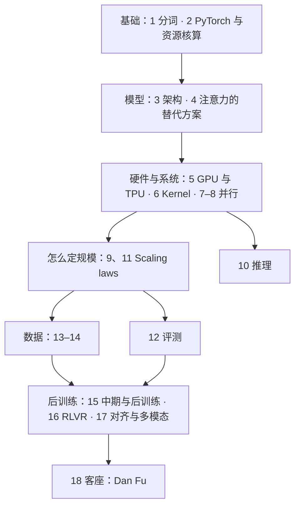

# CS336 学习笔记

> Stanford CS336: Language Modeling from Scratch（2026 春）· 讲者 Percy Liang、Tatsunori Hashimoto，最后一讲客座 Dan Fu
> 非官方个人笔记，根据 YouTube 公开课视频的字幕整理 · [播放列表](https://www.youtube.com/playlist?list=PLoROMvodv4rMqXOcazWaTUHhq-yembLCV) · [课程主页](https://cs336.stanford.edu/)

**一句话**：这门课把一个语言模型从零造出来，每一步都算清代价——分词 → 用 PyTorch 写模型并核算算力和显存 → 架构与注意力的替代方案 → GPU / TPU 与 kernel → 多卡并行 → scaling laws → 推理 → 评测 → 数据 → 中期与后训练（RLVR）→ 对齐与多模态。CME295 第 1–4 讲讲过的 Transformer、训练、并行、FlashAttention，这里会算到每一个 FLOP 和每一个字节；CS224R 第 9–10 讲和 CS329A 第 6 讲讲过的 RLHF / RLVR，这里讲怎么在自己训的模型上跑起来。

## 课程地图

*图 0-1｜前两讲把工具和账算清楚，第 3–4 讲定模型长什么样，第 5–8 讲让它在硬件上跑得快、跑得起多卡，第 9–12 讲回答"多大的模型、多少数据、怎么量好坏"，第 13–17 讲是数据和训练后半段（自绘示意）*

## 各讲索引

| 讲 | 主题 | 时长 | 视频 |
|---|---|---|---|
| [第 1 讲](#l1) | 概览与分词：为什么要从头造、效率是组织原则、五个单元的地图、BPE | 1:19:22 | [YouTube](https://www.youtube.com/watch?v=JuoVZkPBiKk) |
| [第 2 讲](#l2) | PyTorch 与资源核算：张量与精度、einops、FLOPs 与 MFU、roofline、6ND、显存账、checkpointing | 1:17:25 | [YouTube](https://www.youtube.com/watch?v=kuYAsz7zspQ) |
| [第 3 讲](#l3) | 架构：pre-norm 与 RMSNorm、SwiGLU、RoPE、超参经验值、稳定性三件套、MQA / GQA | 1:29:14 | [YouTube](https://www.youtube.com/watch?v=lVynu4bo1rY) |
| [第 4 讲](#l4) | 注意力的替代方案与 MoE：线性注意力、Mamba 2 / Gated DeltaNet、DSA、MoE 路由与训练、DeepSeek V3 与 MLA | 1:26:20 | [YouTube](https://www.youtube.com/watch?v=cKSwj_qZ8Jg) |
| [第 5 讲](#l5) | GPU 与 TPU：SM 与内存金字塔、SIMT、TPU、roofline、六个提速技巧、FlashAttention | 1:18:39 | [YouTube](https://www.youtube.com/watch?v=izZba4UA7iY) |
| [第 6 讲](#l6) | Kernel 与 Triton：benchmark 与 profiling、torch.compile、Triton、PTX、归约、分块 matmul（标题里的 XLA 未讲） | 1:26:41 | [YouTube](https://www.youtube.com/watch?v=xnDHaNUvHBg) |
| [第 7 讲](#l7) | 并行（上）：集合通信原语、NVLink 与 InfiniBand、torch.distributed、数据 / 张量 / 流水线三种切法 | 1:21:02 | [YouTube](https://www.youtube.com/watch?v=SzpOcwdIL0Y) |
| [第 8 讲](#l8) | 并行（下）：ZeRO 三级与 FSDP、pipeline bubble、TP 的前后向对偶、激活显存、EP 与 CP、组合决策 | 1:20:10 | [YouTube](https://www.youtube.com/watch?v=6-cXp-aOmdg) |
| [第 9 讲](#l9) | Scaling laws（上）：幂律、数据与模型的 scaling law、batch 与学习率、Chinchilla 对 Kaplan、IsoFLOP | 1:17:57 | [YouTube](https://www.youtube.com/watch?v=Q15rhEWZPQ4) |
| [第 10 讲](#l10) | 推理：KV cache、瘦矩阵乘的算术强度、GQA / MLA / CLA、量化、剪枝与蒸馏、speculative decoding、continuous batching | 1:25:30 | [YouTube](https://www.youtube.com/watch?v=EfM546A79aM) |
| [第 11 讲](#l11) | Scaling laws（下）：MiniCPM、DeepSeek、StepFun 的超参 scaling law、Muon、μP 推导与压力测试 | 1:17:03 | [YouTube](https://www.youtube.com/watch?v=vTfEyOyzV9E) |
| [第 12 讲](#l12) | 评测：困惑度、六个评测家族、成对比较与裁判、智能体评测、ARC-AGI、训练—测试重叠 | 1:18:34 | [YouTube](https://www.youtube.com/watch?v=JpAxdTWQJxM) |
| [第 13 讲](#l13) | 数据（上）：网络是什么、版权、Common Crawl、数据集谱系、FineWeb 与 Dolma、DCLM、The Stack、Common Pile | 1:22:01 | [YouTube](https://www.youtube.com/watch?v=-qm0ln33G24) |
| [第 14 讲](#l14) | 数据（下）：过滤骨架与 fastText 打分、阈值、去重（MinHash / LSH）、配比、后训练的合成数据 | 1:24:46 | [YouTube](https://www.youtube.com/watch?v=5sxHosTLPF8) |
| [第 15 讲](#l15) | 中期训练与后训练：SFT 数据谱系、安全 SFT、mid-training、RLHF 偏好数据、PPO 与 DPO 推导、RLHF 三个坑 | 1:19:54 | [YouTube](https://www.youtube.com/watch?v=2oH6PWPrYFo) |
| [第 16 讲](#l16) | 后训练 RLVR：系统组成、GRPO、DeepSeek R1、Kimi K1.5、数据与 reward、RL infra、Qwen 3、reward hacking | 1:15:50 | [YouTube](https://www.youtube.com/watch?v=dIFAi87Ws4E) |
| [第 17 讲](#l17) | 多模态（题目里的「对齐」未讲）：CLIP、SigLIP、LLaVA 与 LLaVA-OneVision、Qwen-VL 系列、Chameleon | 1:17:39 | [YouTube](https://www.youtube.com/watch?v=26FtD08ZpOU) |
| [第 18 讲](#l18) | 客座 Dan Fu：推理引擎、prefill 与 decode、continuous batching、PD 分离、megakernel、Parcae 循环 Transformer | 1:11:40 | [YouTube](https://www.youtube.com/watch?v=9EEm4iMAF5s) |

## 和前三门课怎么对照

| 这门课 | 前面课里对应的内容 | 关系 |
|---|---|---|
| 第 1–3 讲 分词、资源核算、架构 | CME295 第 1–2 讲 | 那边讲"是什么"，这边讲"怎么造、多少钱" |
| 第 5–8 讲 GPU、kernel、并行 | CME295 第 4 讲的显存与并行 | 那边一页带过，这边逐字节、逐 FLOP 算 |
| 第 9、11 讲 scaling laws | CME295 第 4 讲 Chinchilla | 这边讲怎么拟合、怎么用它定预算 |
| 第 10 讲 推理 | CME295 第 3 讲的 KV cache 与解码 | 这边讲吞吐与延迟的账 |
| 第 12 讲 评测 | CME295 第 8 讲、CS329A 第 8 讲 | 这边是造模型的人怎么用评测 |
| 第 15–16 讲 后训练与 RLVR | CME295 第 5–6 讲、CS224R 第 9–10 讲、CS329A 第 6 讲 | 那边讲公式和前沿，这边讲在自己模型上跑通 |

## 怎么用这份笔记

- **每讲的结构是固定的**：一句话 → 时间轴 → 核心内容（带图、公式和短伪代码）→ 关键图表速查 → 提到的工作 → 术语对照 → 字幕勘误 → 带走的问题。赶时间可以只读"一句话"、图和"带走的问题"。
- **这门课数字和代码多**：讲者的课件是可执行的 Python，笔记里用自己写的短伪代码概括算法，不照抄屏幕；算力、显存、带宽这些数字按课上的口径照实记，关键公式单独成块。
- **时间戳都能点**，直接跳到视频里对应的位置。图下面黄色的「▶ 看原幻灯片」会跳到老师讲那一页的时刻。
- **图是重新画的示意图**，用来解释机制，不是课件截图。
- **"小注"** 是补充的课外事实或对口误的更正；**"应为 / 应出自"** 表示这是根据内容推断的，老师没有明说。
- 想对照原文：在播放器「设置 → 字幕 → 自动翻译 → 中文（简体）」可以开中文字幕。
